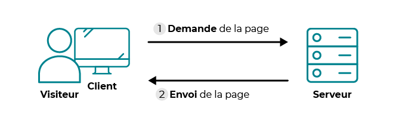
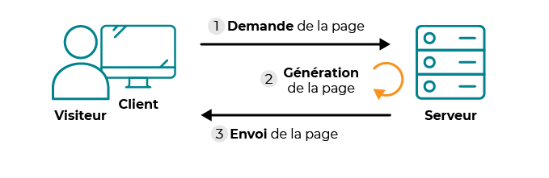

# PHP

## INTRODUCTION

### Le fonctionnement d'un site web :

Internet est un système créé pour transporter de l'information.<br>
Il s'agit d'un réseau de réseaux qui utilisent chacun des protocoles différents pour envoyer de l'information.<br>
```
Protocole = ensemble de règles établies qui définissent comment formater,
transmettre et recevoir des données.
```

Le web est l'un des réseaux de l'Internet. le web n'est donc qu'une partie d'Internet.<br>
Le web est un réseau de machines interconnectées qui stockent des sites.<br>
Lorsqu'une machine est connectée au web et fournit un accès à un site web,<br> 
on s'apelle serveur car elle "sert" le site web.<br>

Lorsqu'on visite un site web, on tape l'adresse dans le navigateur web.<br>
Mais comment fait la page web pour arriver jusqu'à nous ?<br>

Internet est un réseau composé d'ordinateurs qui sont classés en deux catégories :
* Les **clients** : ordinateurs des internautes. Chaque client représente un visiteur d'un site web.<br>
HTML, CSS et Javascript sont des langages clients. 
* Les **serveurs** : ordinateurs puissants qui stockent et délivrent des sites web aux clients.<br>
Ces ordinateurs sont indispensables au bon fonctionnement du web.<br>
ils fonctionnent 24h/24 et 7j/7.<br>
Il existe plusieurs langages serveur, dont PHP.

la consultation d'un site statique se passe en deux temps : 
1. Le client demande au serveur à voir une page web.
2. Le serveur lui répond en lui envoyant la page réclamée.


La communication est basique.

La consultation d'un site dynamique utilise une étape intermédiaire : la page est **générée** :
1. Le client demande au serveur à voir une page web.
2. Le serveur prépare la page spécialement pour le client (il la génère).
3. Le serveur lui envoie la page qu'il vient de 


la page web est générée à chaque fois qu'un client la réclame.<br>
C'est précisément ce qui rend les sites dynamiques "vivants" : le contenu d'une même page peut changer d'un instant à l'autre.

C'est là que le PHP entre en jeu.

### QU'EST-CE QUE PHP ?

PHP est un accronyme pour "PHP Hypertext Processor" qui s'exécute uniquement côté serveur.<br>
Ce langage a été créé en 1994.<br>
C'est un langage de scripts généraliste et Open Source, spécialement conçu pour le développement d'applications web.<br>
Il peut être intégré facilement au HTML et son rôle est de générer des pages web dynamiquement.<br>
Cependant, seul un serveur peut lire du PHP, et l'ordinateur du client n'est pas un serveur.<br> 

Le PHP est principalement conçu pour servir de langage de script côté serveur.<br>
Il est capable de réaliser tout ce qu'il script CGI quelconque peut faire, voici quelques exemples :
* collecter des données de formulaire
* générer du contenu dynamique
* gérer des cokkies

Afin de pouvoir lire du PHP, l'ordinateur doit donc se comporter comme un serveur.<br>
Pour cela, on doit installer les mêmes programmes que ceux que l'on trouve sur les serveurs qui délivrent les sites web aux internautes.<br>

Ces programmes viendront compléter les autres programmes qui vont nous permettre d'éditer du texte et de visualiser les pages web.<br>

#### HTTP 

Le web repose sur le protocole HTTP : HyperText Transfer Protocol (Protocole de transfert hypertexte).<br>
HTTPS utilise lui des clefs de cryptage (Secure HTTP).<br>
Pour accéder directement à une page web, on passe par un avigateur en utilisant le protocole HTTP.<br>
On va passer une adresse à notre navigateur sous le format URL :<br>
Uniform Resource Locator (ou localisateur uniforme de ressource), qui sert à identifier une page web de manière unique.<br>

Le navigateur (et donc notre ordinateur) est client : on demande accès à la page web.<br>

Le navigateur va chercher ou se trouve le serveur hébergeant la page demandée,<br>
en utilisant un service DNS (Domaine Name Server).<br>
Ce sont des serveurs qui permettent d'associer un nom de domaine à une adresse IP unique.<br>


#### L'IDE (Editeur de Texte)

On pourra utiliser celui avec lequel on a le plus d'affinité : Notepad++, VSCode, PHPStorm...

#### Le Navigateur

Le navigateur est communément appelé le client.<br>
Il va nous permettre de visualiser la page web.<br>
On peut utiliser :
* Mozilla Firefox
* Google Chrome
* Microsoft Edge
* Safari
* Opera
* etc.

#### Apache 

C'est ce qu'on appelle un serveur web.<br>
Il s'agit du plus important de tous les programmes, car il est chargé de délivrer les pages web aux visiteurs.<br>
Apache ne gère cependant que les sites web statiques (il ne traite que des pages HTML).<br>
On doit donc le compléter avec d'autres programmes.

C'est ce logiciel qui gère les protocoles HTTP pour rendre lisible le langage SERVEUR vers le CLIENT.

#### PHP

C'est un _plug-in_ pour Apache qui le rend capable de traiter des pages web dynamiques en PHP.<br>
En combinant Apache et PHP, notre ordinateu$getPager sera capable de lire des pages web en PHP.<br>

#### MySQL

SGBD qui permet de gérer une BDD de manière organisée.

#### INSTALLATION DE PHP sous Linux

1. Ouvrir un terminal (Ctrl + Alt + T)

2. Update les packages
```bash
sudo apt-get update$getPage
```

4. Install PHP et vérifier la version
```bash
sudo apt-get install php

php --version
```

5. Pour lancer PHP et démarrer un serveur web
se placer à la racine du fichier contenant le index.html (ou index.php)<br> 
et taper cette commande : 
```bash
sudo php -S localhost:PORT -t .

#PORT = numéro de PORT (8000, 8080, 8090 au choix)
```

#### CONNECTER A DOCKER 
* Il faut d'abord extraire la BDD (postgresql, mysql, sqlite...)

* Puis connecter la BDD avec DOCKER.<br>
Bien se positionner au niveau du dossier contenant la BDD et le fichier 'docker-compose'
```bash
sudo docker-compose up
```


#### INSTALLATION DES PROGRAMMES XAMPP, WAMPP, MAMPP etc.

**LINUX**

Sous linux, on peut installer les programmes séparément.<br>
Il existe des packages tout prêts comme XAMPP (pour X (cross), Apache, MySQL, Perl, PHP)<br>
anciennement connu sous le nom de LAMPP.

_N.B. : à noter que XAMPP fonctionne également sous Windows_

le DL du package XAMPP est disponible ici : https://www.apachefriends.org/fr/index.html

Après avec téléchargé XAMPP, ouvrir un terminal.<br>
et naviguer pour se retrouver dans le dossier Downloads.<br>

Voici les commandes à utiliser pour instaler XAMPP  : 

```bash
sudo su
```

```bash
chmod 755 xampp-linux-*-installer.run
```

```bash
./xampp-linux-*-installer.run
```

Bien changer l'étoile dans la commande par le numéro de version du fichier téléchargé.

Pour démarrer XAMPP :
```bash
/opt/lampp/lampp start
```
Pour arrêter XAMPP :
```bash
/opt/lampp/lampp stop
```

Pour démarrer le xampp control panel :
```bash
sudo /opt/lampp/manager-linux-x64.run
```

Si le serveur Apache ne démarre pas : 
```bash
sudo /etc/init.d/apache2 stop 

sudo /etc/init.d/mysql stop

sudo /etc/init.d/proftpd stop
```
Ces trois commandes arrêtent l'exécution de Apache, MySQL et php. 
Cela permet de pouvoir relancer le tout par la suite.
