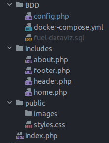

# ECRIRE DU PHP

## SYNTAXE PHP

_à compléter_

## Où s'écrit le PHP ?
Le PHP s'écrit dans un fichier ayant l'extension '.php'.<br>
On remplacera donc l'extension '.html' par '.php'.<br>

Le dossier s'organisera de cette manière :


Ici, à la racine on retrouve index.php.<br>
Ce fichier sera le seul qui sera lu par le navigateur.<br>
On est sur une logique de compartimentation du code.<br>
Chaque fichier du dossier 'includes' contient le contenu d'une page qui sera injectée de manière dynamique dans 'index.php'.
Pour injecter ces éléments, on utilisera **'include'** :
```php
<?php include('./includes/header.php'); ?>
```

Ainsi, le fichier index.php s'écrira de cette manière :
```php
<!doctype html>
<html lang="en">
<head>
    <meta charset="UTF-8">
    <meta name="viewport"
          content="width=device-width, user-scalable=no, initial-scale=1.0, maximum-scale=1.0, minimum-scale=1.0">
    <meta http-equiv="X-UA-Compatible" content="ie=edge">

    <link rel="stylesheet" href="./public/styles.css">

    <title>Document</title>
</head>
<body>
    <!-- Cette balise PHP indique que le header qu'on va inclure le fichier header en spécifiant le chemin complet vers le fichier -->
    <?php include('./includes/header.php'); ?>
    <main class='flex-column justify-around align-center'>
        <?php

        # le contenu du site et les liens vers les différentes pages se fera ici.

        ?>
    </main>
    <?php include('./includes/footer.php') ?>
</body>
</html>

```
Le header et footer sont présents en permanence.<br>
Les autres fichiers du dossier 'includes' seront injectés dynamiquement, selon les liens indiqués dans la navigation, pour naviguer entre les différentes pages.<br>
Le fichier header.php sera écrit de cette manière :
```php
<header class="flex-row justify-center">
    <nav id="menu">
        <div class="flex-row justify-between align-center w100">
            <a href="/?page=home" class="w30">
                <h3>Titre Menu</h3>
            </a>
            <ul class="flex-column justify-start align-end w70">
                <li><a href="/?page=home">Home</a></li>
                <li><a href="/?page=about">About</a></li>
            </ul>
        </div>
    </nav>
</header>

```
à noter que href dans le lien de la balise 'a' indique une extension de l'url. (Voir plus avec $_GET) et pointe vers la page home. 

#### Paramètres $_GET
Dans la balise 'main' de index.html, on va insérer du code de cette manière :<br>

```php
<main>
<?php

    $getPage = $_GET['page'];

    if (isset($getPage)) {
        if ($getPage == '' || $getPage == 'home') {
            include('./includes/home.php');
        }
        if ($getPage == 'about') {
            include('./includes/about.php');
        }
    } else {
        echo '404 page not found';
    }

?>
</main>
```
**explications :**<br>
* _**$getPage**_ : il s'agit d'une variable qui va recevoir la fonction $_GET.
* _**$_GET**_ : C'est une fonction qui va permettre de récupérer les paramètres de l'url.<br>
Dans notre cas, en local, l'url se compose ainsi :<br>
http://localhost:8080/?page=home<br>
**http://** = indique le protocope utilisé.<br>
**localhost:8080** = indique qu'on affiche la page avec un serveur local (généré par la machine), sur le PORT 8080.<br>
C'est ce qui sera remplacé par le nom de domaine.<br>
**/?page=home** = se décompose en deux parties : /?page= fait référence à la fonction $_GET['page'].<br> 
C'est à dire qu'on va récupérer le contenu de l'url qui fait référence à la clé 'page'.<br>
'home' est le nom de la page qui est affichée, ce nom est le même que le nom indiqué dans la balise 'a' du header.
* Nous passons aux conditions _**if**_ :<br>
la première condition isset($getPage) permet de vérifier que la page existe. sinon, on affichera '404 page note found'.<br>
Les deux conditions internes permettent de vérifier le contenu de la valeur référente à 'page' :<br> 
_pour la première_, si la valeur est '' (ne contient rien) ou 'home', on affiche la page d'accueil.<br>
_pour la seconde_, si la valeur est 'about', on affiche la page about.

## Connecter avec la BDD et DOCKER

Pour commencer, il faut ajouter les fichiers .sql et le fichier docker-compose.yml<br>
On va ensuite connecter la base de donnée au format du SGBD (postgre, mysql ou autre).<br>
Puis connecter DOCKER :<br>
```bash
sudo docker-compose up
```

Et enfin relancer le serveur :<br>
```bash
sudo php -S localhost:PORT -t .

#PORT = numéro de PORT (8000, 8080, 8090 au choix)
```

## PDO

Pour travailler avec la base de données en PHP, il faut d'abord s'y connecter.<br>
PHP va devoir s'authentifier : il établit une connexion avec le SGBD.<br>
Une fois la connexion établie, on pourra faire toutes les opérations qu'on souhaite sur la BDD.<br>

Pour se connecter à une BDD, on va devoir utiliser l'extension PDO de PHP.

### Qu'est ce que PDO ?

PDO est l'abréviation de **PHP Data Objects**. C'est founir avec PHP<br>
L'extension PDO définit une excellente interface pour accéder à une BDD depuis PHP.<br>
Chaque pilote de BDD implémenté dans l'interface PDO peut utiliser des fonctionnalités spécifiques<br> 
de chacune des BDD en utilisant des extensions de fonctions.<br>

_**N.B. : à noter qu'on ne peut utiliser aucune fonction de base en utilisant l'extension PDO par elle-même.<br>
On doit utiliser un driver PDO spécifique à la BDD pour accéder au serveur de BDD.**_<br>

PDO fournit une interface d'abstraction à l'accès de données, ce qui signifie qu'on utilise les mêmes fonctions pour exécuter des requêtes ou récupérer les données<br>
quel que soit la base de données utilisée.<br>
PDO ne fournit pas une abstraction de base de données : il ne réécrit pas le SQL, n'émule pas des fonctionnalités manquantes.<br>
Il faudra utiliser une interface d'abstraction complète si on en a besoin.<br>

### Connecter à PostgreSQL 

Ce tuto (en anglais indique la procédure) : https://www.phptutorial.net/php-pdo/pdo-connecting-to-postgresql/<br>

#### éléments requis :

* une serveur de base de données PostgreSQL.
* une base de données.
* un compte avec un nom d'utilisateur et mot de passe pouvant accéder à la BDD.

1. Avec les paramètres de BDD PostgreSQL suivant :
* PostgreSQL serveur sur **localhost**
* Base de Données appelrée **fuel-dataviz**
* Compte avec pour utilisateur **postgresql** et pour mot de passe **password**<br>
On va créer un fichier appelé _**config.php**_ qui va contenir la logique de connexion à la BDD.<br>
le contenu de ce fichier sera comme suit :<br>

```php

<?php

    try {
        $bdd = new PDO(
        'pgsql:host=localhost;port=5432;dbname=fuel-dataviz;', 
        'postgresql', 
        'password'
        );
    } catch (PDOException $error) {
        die('Erreur : ' . getMessage());
    }

?>

```

_**EXPLICATIONS :**_<br>

la variable $bdd contient la logique de connection à la BDD, avec _'new PDO'_.
Le premier paramètre s'appelle DSN : Data Source Name. C'est le seul paramètre qui change en fonction du type de BDD auquel on se connecte.<br>
le second paramètre contient l'identifiant, et le troisième le mot de passe.<br>

On va tester la présence d'erreurs : si on a renseigné les bonnes infos (nom d'hôte, de la BDD, le login et mdp), rien ne devrait s'afficher à l'écran.<br>
Si toutefois il y a une erreur (ex : erreur mdp), PDP risque d'afficher toute la ligne qui pose l'erreur (ce qui inclut le mot de passe).<br>
On va donc traiter l'erreur. PDO renvoie une **exception** qui permet de capturer l'erreur/ (bloc 'catch').<br>

Le bloc 'try' contient la logique de connection.<br> 
PHP va d'abord essayer d'exécuter le contenu de ce bloc,<br> 
et s'il y a une erreur, il va exécuter le contenu du bloc 'catch'.<br>


2. On va 'activer' le driver PostgreSQL<br>
PDO_PGSQL est un driver qui implémente l'interface PDO. Il nous permet d'accéder aux BDD PsogreSQL depuis PHP.<br>

Afin de vérifier si ce driver estactivé, il faut ouvrir le fichier 'php.ini'.<br>
Ce fichier est localisé en général sous le dossier php.<br>

_N.B. : sous windows, si on utilise XAMPP, ce fichier sera localisé sous C:\xampp\php.

Dans le fichier php.ini, on va chercher la ligne contenant :<br>
**;extension=php_pdo_pgsql.dll** (ligne 900 environ)<br>
En supprimant le point-virgule (' ; '), on activera le driver.

3. Connecter à PostgreSQL :
Dans le fichier config.php, on aura le code suivant (même code que celui écrit plus haut de manière un peu plus complexe mais plus adéquate) :<br>

```php

<?php
    $host = 'localhost';
    $db = 'fuel-dataviz';
    $user = 'postgres';
    $pwd = 'password';

    function connect(string $host, string $db, string $user, string $password): PDO {
        try {
            $dsn = "pgsql:host=$host;port=5432;dbname=$db;";
            // make a database connection
            return new PDO(
                $dsn,
                $user,
                $password,
                [PDO::ATTR_ERRMODE => PDO::ERRMODE_EXCEPTION]
            );
        } catch (PDOException $e) {
            die($e -> getMessage());
        }
    }
    return connect($host, $db, $user, $pwd);

?>
```

Et le fichier index.php contiendra le code suivant :

```php
require_once 'config.php';
```
