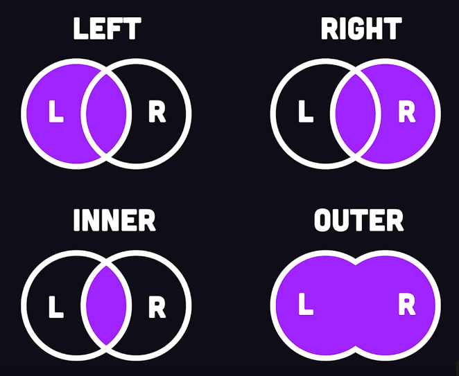

# SQL - Initiation

Source : https://www.youtube.com/watch?v=Cz3WcZLRaWc <br>
Source : https://openclassrooms.com/fr/courses/6971126-implementez-vos-bases-de-donnees-relationnelles-avec-sql/7139618-decouvrez-le-systeme-de-gestion-de-base-de-donnees-sgbd <br>

## Choisir son SGBD

### RAPPEL : SGBD = Système de Gestion de Base de Données

Il s'agit d'un outil qui permet de gérer une base de données.<br> 
C'est un programme que va permettre d'interprêter le langage SQL de la BDD, et qui va permettre de lire ou modifier la BDD.<br>

### Le SQL = Structure Query Language

En français : langage de requête structurée.<br>
Il s'agit d'un langage informatique qui permet d'interragir avec des BDD.<br>
Ce langage est le plus répendu et donc indispensable à connaître. C'est avec lui qu'on va gérer notre BDD.

En pratique :<br>
Une **application va traduire une recherche faite par un utilisateur en SQL**,<br> 
l'envoyer au **SGBD**, qui va **récupérer l'information** en question dans le stockage de la BDD,<br>
pour ensuite le **redonner à l'application**.<br>
L'utilisateur aura ainsi son information avec toutes ses caractéristiques.

**Chaque SGBD implémente sa propre syntaxe du SQL en plus des normes communes à tous.**<br>
L'intérêt de connaître les bases du SQL et sa logique réside dans la diversité des SGBD.<br>
Comme chacun a sa propre déclinaison de la syntaxe SQL, on pourra s'en sortir quel que soit le SGBD utilisé par notre employeur.

## Les différents SGBD

Les SGBD existant : 
* **MySQL** (le plus répendu), auparavant open-source, maintenant racheté par Oracle Corporation.<br> 
**MariaDB** est sa copie open-source actuelle qui suit les même règles de langage que MySQL.
* **PostGreSQL**, "l'autre" grand SGBD open-source dispo sur le marché.<br> 
Moins utilisé que MySQL car confiné à Linux, plus difficile à appréhender pour les débutants.<br> 
Il se démocratise car il suit les recommandations du SQL et il est le plus rapide de ces dernières années.<br> 
Utilisé par Instagram ou Spotify.
* **Oracle Database**, le SGBD édité par Oracle Corporation.<br> 
Très cher, mais utile pour traiter un très gros volume de données.<br>
Utilisé principalement par les grandes entreprises.<br> 
Il perd des parts de marché face çà MariaDB ou PostgreSQL.
* **SQLite**, stocke toute la base de données dans un seul et unique fichier.<br>
Peu propice à l'utilisation sur un grand nombre de données, c'est un SGBD très simple à configurer.<br>
On va le privilégier pour développer une BDD en local, alors qu'en prod on utilisera plutôt MySQL ou PostgreSQL.<br>
Utilisé par les applications Android pour stocker de la donnée.


Actuellement, il existe des ORM (Object Relational Mapping) = des outils qui permettent d'éviter d'utiliser du SQL brut, et permettent d'augmenter la productivité.<br>
Pour JS : Sequelize, Python : SQL Alchemy, Ruby on rails : Active Records.<br>
Il est tout de même nécessaire et préférable de bien comprendre comment fonctionne le SQL.

## Le RDBMS = Relational DataBase Management System

Composé de deux choses principales :
* La BDD en elle-même, qui est une collection de Tables qui contiennent chaque la donnée, organisée en colonnes et lignes (similaire à une feuille de calcul excel).<br> 
* La deuxième composante est le langage SQL, permettant de manipuler et lire la donnée dans la BDD. qui est souvent une variation du 'Structure Query Language' (selon le SGBD utilisé).<br>

## Tuto installation MySQL (Windows, Mac et Linux)

https://openclassrooms.com/fr/courses/6971126-implementez-vos-bases-de-donnees-relationnelles-avec-sql/7152681-installez-le-sgbd-mysql

## Créer sa base de données

Une table est une sorte de dictionnaire ou une clé représente une colonne dans la BD et la valeur représente un type de donnée qui peut être stocké à cet endroit.<br>

Il existe beaucoup de types de données, et ils peuvent varier selon les différents bases de données SQL.<br>
Pour la plupart, elles représentent différents types de nombres et chaînes de caractères.<br>

Dans MySQL, on retrouve des mots clés qui vont indiquer le type de données qu'on va avoir dans une colonne de notre base de données:<br> 
**INT** pour integer (des nombres entiers) ou **FLOAT** pour des nombres décimaux (à virgule).<br>
Pour de petites chaînes de caractères (string), on utilise **VARCHAR**,<br> 
et pour de plus longues chaînes de caractères on ut
## Le RDBMS = Relational DataBase Management System

Composé de deux choses principales :
* La BDD en elle-même, qui est une collection de être unique.

Tout cela résulte de la normalisation des bases de données relationnelles :<br>
chaque entité sera organisée dans sa plus petite forme normale.

On pourra utiliser l'extension _SQLTools sur VSCode_.<br>
Cela va permettre de stocker le détail de notre connection, visualiser la BDD et voir l'historique des queries qui ont été employées.

### Commandes pour créer sa base de données :

## Le RDBMS = Relational DataBase Management System

Composé de deux choses principales :
* La BDD en elle-même, qui est une collection de  du commentaire.

Un **"STATEMENT"** est du code qui réalise quelque chose. Un "statement" se termine toujours pas **";"**.

Les termes qui apparaissent en couleur sont des mots clé SQL que le langage va interprêter pour réaliser quelque chose.<br>
La convention veut qu'on les écrive en majuscule mais SQL n'est pas sensible à la casse.

Le terme qui suivra les mots clés est l'identificateur. il permet d'identifier le contenu de la BDD, table, etc.

#### Pour créer une BDD, on procédera ainsi :

```SQL
CREATE DATABASE name; 
--pour créer la base de données : name sera remplacé par le nom de la BDD

SHOW DATABASES; 
--permet de visualiser les BDD sur la machine
```
#### La création de tables se fera de cette manière

Au sein d'une table, on pourra créer des colonnes grâce aux parenthèses :<br> 
* chaque colonne de la table est identifiée grâce aux **identificateurs** (ou noms)<br> 
* le nom est obligatoirement suivi du **type de données**, primordial pour éviter de sauvegarder le mauvais type de données et donc de renvoyer une ERREUR<br> 
(SQL est très strict sur l'intégrité des données)<br>
* on pourra aussi ajouter des contraintes (**CONSTRAINTS**) : PRIMARY KEY par exemple.<br>
PRIMARY KEY indique à la BDD que cette colonne identifie une ligne unique :<br>
la donnée doit donc être unique, non nulle (!null).<br>
Les contraintes sont une sorte de couche supplémentaire de validation de données<br>
* la colonne est **fermée par une virgule**

(voir exemple ci-dessous) :<br>

```SQL
-- @block
CREATE TABLE Users(
    id INT PRIMARY KEY AUTO_INCREMENT,
    email VARCHAR(255) NOT NULL UNIQUE,
    bio TEXT,
    country VARCHAR(2)
); 
```

* @block permet d'exécuter une requête SQL pour contrôler si l'étape est bien réalisée.<br>
* La table Utilisateur est créée. Elle contient 4 colonnes, identifiées chacunes par un identificateur : id, email, bio, pays.<br>
Chaque colonne aura un type de données<br>
* la colonne **"ID"** comporte le mot clé **PRIMARY KEY** indique une donnée unique et non nulle<br>
**AUTO_INCREMENT** indique à la BDD qu'elle doit créer automatiquement une ID pour l'utilisateur.<br>
cette id va commencer à 1, et continuer avec 2, 3, etc.
* concernant l'email, le type **VARCHAR** indique un nombre de caractères spécifiques,<br>
ce type prend en argument un nombre qui représente la taille maximum qu'elle pourra prendre.<br>
l'email prend également la contrainte **NOT NULL** et **UNIQUE** :<br> 
cela signifie qu'il sera obligatoire d'ajouter une donnée dans cette colonne, unique à cet emplacement.<br>
* bio utilise le type **TEXT** : un plus grand nombre de caractères (inconnu) sera stocké à cet emplacement.<br>
* le pays aura le type **VARCHAR** limité à 2 caractères (code pays)

#### Insérer des données dans une table 

On utilisera les mots clés **INSERT INTO** et le nom de la table concernée.<br>
Cette commande prendra les paramètres qu'on souhaite modifier au sein de la table :<br> 
email, bio et country.<br>
```
N.B. : l'ID n'est pas modifié car on a spécifié **AUTO_INCREMENT** 
lors de la création de la table. La modification se fera toute seule.
```
Puis le mot clé **VALUES** permettra de spécifier les valeurs correspondantes aux colonnes (passées en paramètres).<br>
Attention à bien respecter la structure des tables.

```SQL
INSERT INTO Users (email, bio, country)
VALUES (
    'hello@world',
    'i love strangers !',
    'US' --USA ne peut pas être utilisé car on a spécifié une taille max à 2 caractères
);

```

N.B. : il est possible d'insérer de multiples lignes en même temps :

```SQL
INSERT INTO Users (email, bio, country)
VALUES
    ('hello@world', 'foo', 'US')
    ('hola@munda.com', 'bar', 'MX')
    ('bonjour@monde.fr', 'baz', 'FR');

```

#### Récupérer des données dans une table 

Pour récupérer des données, on utilisera le mot clé **SELECT**.<br>
Ce mot clé ous permet de retourner la donnée dans un tableau de résultat.<br>

Pour sélectionner toutes les données d'une table, on utilisera **SELET * FROM Users;**<br>
**' * '**  nous indique qu'on souhaite sélectionner toutes les données.<br>
On peut sélectionner des colonnes spécifiques en indiquant leur identificateur à la place de l'étoile.

```SQL
SELECT; 
--permet de lire de la donnée d'une BDD retournée dans une table de résultats.

SELECT * FROM Users;
--permet d'indiquer les données sélectionnées dans une table spécifique.

SELECT email, id FROM Users ORDER BY id ASC LIMIT 2;
--permet de sélectionner des colonnes spécifiques.
--ORDER BY permet de classer selon un certain champ (ici l'ID), avec un tri ascendant.

```

On aura souvent besoin de spécifier encore plus le tri de données :<br>
la clause **WHERE** permettra de trier spécifiquement les colonnes qui contiennent une donnée spécifique.<br>
Cela permet d'employer une logique conditionnelle sur une query.<br>

On pourra également ajouter des clauses grâce au mot clé **AND** ou **OR**,<br> 
toujours en spécifiant l'identificateur de la colonne et la valeur qu'on souhaite trier.

exemple :

```SQL
SELECT email, id, country FROM Users 
WHERE country = 'US' AND email LIKE 'h%' 
ORDER BY id DESC LIMIT 2;

```
* ici on cherche les informations emails, id et pays dans la table utilisateur
* où le pays est 'US' ET l'email commence par la lettre 'h'. 
* Le tri sera fait selon l'ID par un tri descendant.
* On limitera le résultat aux 2 premières lignes qui dorrespondent à cette recherche.

ATTENTION : ce genre de requêtes risquera de faire ralentir au fur et à mesure que la BDD grandira.

Afin de retrouver des données plus rapidement, on va employer une 'lookup table' = un INDEX.<br>
Une **'BDD index'** est comme un index à la fin d'un livre.<br>
Elle permet à la BDD de trouver des mots clés importants sans avoir à scanner la totalité des données.<br>
Cependant, cela vient avec un coût : des droits plus lents et plus de mémoire utilisée.

```SQL
CREATE INDEX email_index ON Users(email);
```

#### Créer une relation entre deux tables : la jointure

Afin de créer une relation entre les tables, on utilisera une jointure.<br>

Tout d'abord, on crée une table contenant une clé étrangère faisant référence à une autre table :

```SQL
CREATE TABLE Rooms(
    id INT AUTO_INCREMENT,
    street VARCHAR(255),
    owner_id INT NOT NULL,
    PRIMARY KEY (id),
    FOREIGN KEY (owner_id) REFERENCES Users(id)
);
```

* Ici, on crée la table 'Rooms'.<br>
* l'id sera un nombre entier qui s'implémente automatiquement.<br>
* la colonne 'owner_id' sera également un entier, non null.<br>
* On indique ensuite la clé primaire qui prend en paramètre le nom de la colonne 'id'.<br>
* la clé étrangère s'appelle 'onwer_id', elle fait référence à la colonne 'id' de la table 'Users'.<br> 
Cela signifie que cette colonne dans la nouvelle table fait référence à une autre table 'Users' grâce à une clé étrangère.<br>
Cela indique à la BDD de ne pas supprimer de données concernant un utilisateur qui a des données associées dans la table room au même moment.<br>
Ainsi, on va conserver l'intégrité des données. 

```SQL
INSERT INTO Rooms (Owner_id, street)
VALUES (
    id INT AUTO_INCREMENT,
    street VARCHAR(255),
    owner_id INT NOT NULL,
    PRIMARY KEY (id),
    FOREIGN KEY (owner_id) REFERENCES Users(id)
);
```

Pour insérer des données, on procédera ainsi :

```SQL
INSERT INTO Rooms (Owner_id, street)
VALUES
    (1, 'san diego sailboat'),
    (1, 'nantucket cottage'),
    (1, 'vail cabin'),
    (1, 'sf cardboard box');
```

#### Concernant les jointures :

La jointure permet d'expliquer au SGBD comment **joindre deux tables selon un identifiant qu'elles ont en commun.**<br>

par exemple, si on possède une table 'utilisateur' et une table 'langue', on peut spécifier grâce au mot clé **JOIN** que l'id de la langue doit être égale à l'id de l'utilisateur :

```SQL
SELECT * FROM utilisateurs --sélectionne tous les utilisateurs
JOIN langue --joindre les langues
ON utilisateur.langue_id = langue_id --relation entre tous les utilisateurs ayant configuré dans une langue spécifique.
```
* On demande au SGBD de sélectionner tous les utilisateurs grâce à **SELECT * FROM `utilisateurs`**
* Au résultat de cette commande, on a joint la table langue grâce à **JOIN `langue`
* Pour pouvoir faire cette jointure, on précise au SGBD la correspondance entre la table _langue_ et la table _utilisateur_.<br>
La correspondance est effectuée via la clé _langue_id_ pour la table langue et _id_ pour la table utilisateur.<br>
Cela se fait grâce à **ON `utilisateur`.`langue_id` = `langue`.`id`.


Il existe 4 types de jointures (joints en anglais) :



* **INNER JOIN** :<br> 
jointure interne pour retourner les enregistrements quand la condition est vraie dans les deux tables.<br>
C'est l'une des jointures les plus communes.<br>
* **LEFT JOIN (ou LEFT OUTER JOIN)** :<br> 
jointure externe pour retourner tous les enregistrements de la table de gauche (LEFT = gauche),<br>
même si la condition n'est pas vérifiée dans l'autre table.
* **RIGHT JOIN** (ou **RIGHT OUTER JOIN**) :<br>
jointure externe pour retourner tous les enregistrements de la table de gauche (RIGHT = droite),<br>
même si la condition n'est pas vérifiée dans l'autre table.
* **OUTER JOIN** (ou **FULL OUTER JOIN**) :<br>
jointure externe pour retourner les résultats quand la condition est vrai dans au moins une des 2 tables.

il existe encore d'autre JOINS :
* **CROSS JOIN** : jointure croisée permettant de faire le produit cartésien de 2 tables.<br>
Cela permet de joindre chaque lignes d'une table avec chaque lignes d'une seconde table.<br>
Attention, le nombre de résultats est en général très élevé.
* **SELF JOIN** : permet d'effectuer une jointure d'une table avec elle-même comme si c'était une autre table.<br>
* **NATURAL JOIN** : jointure naturelle entre 2 tables s'il y a au moins une coonne qui porte le même nom entre les 2 tables SQL.<br>
* **UNION JOIN** : jointure d'union.

