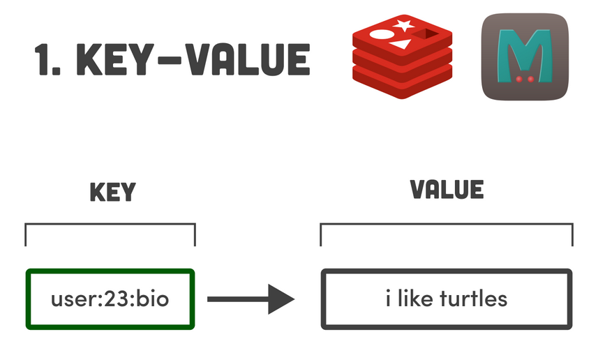
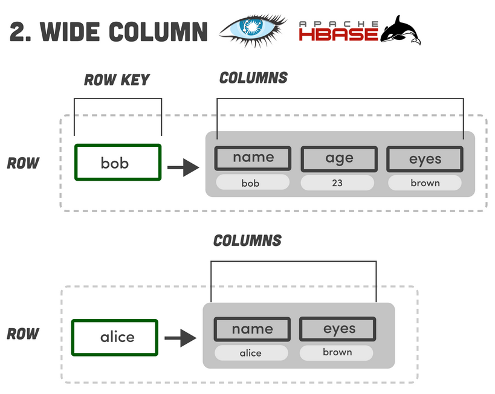
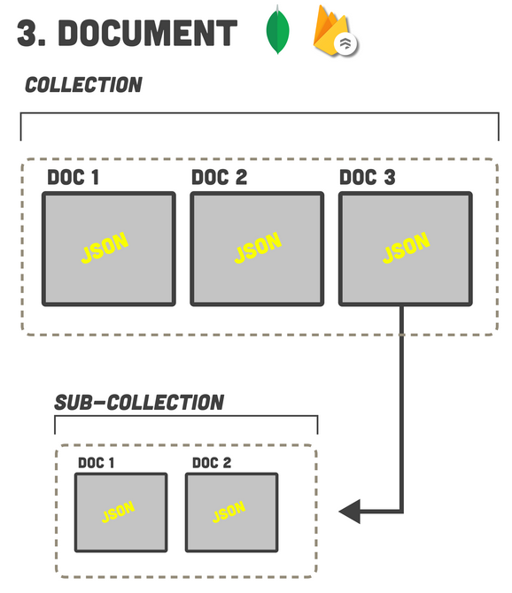
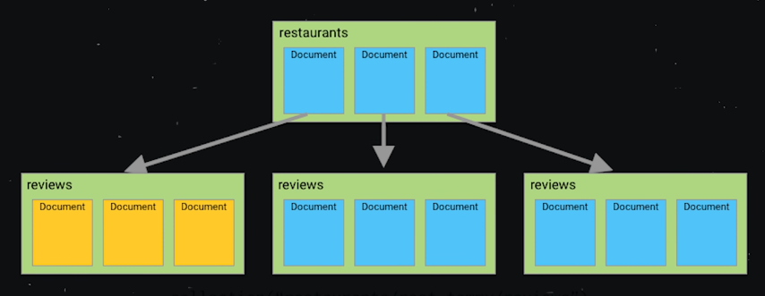
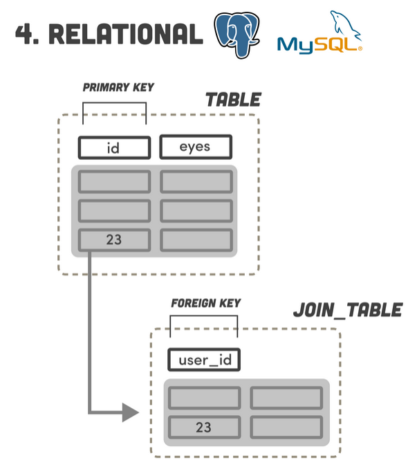
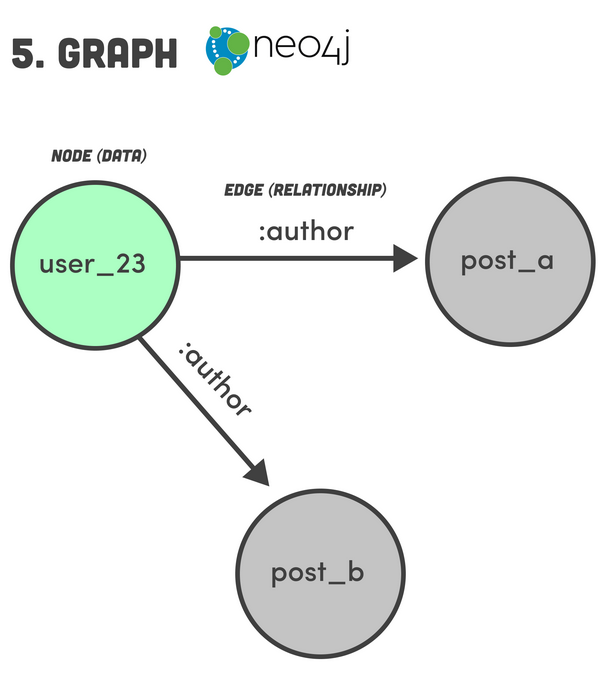
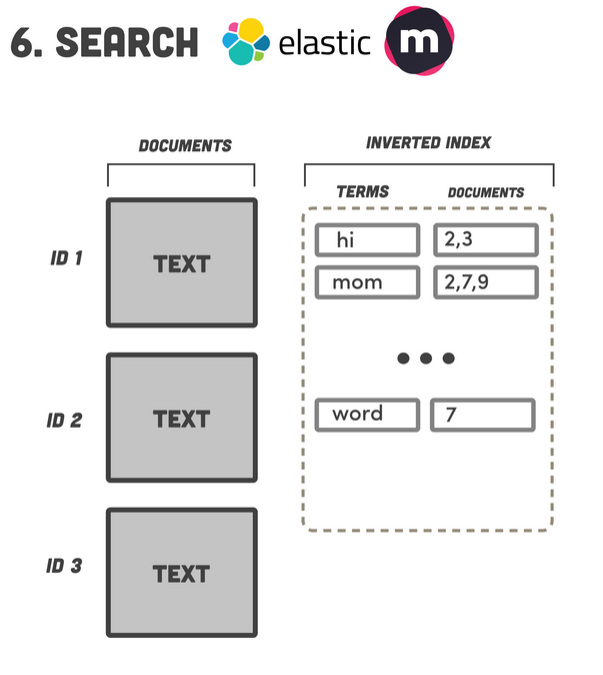
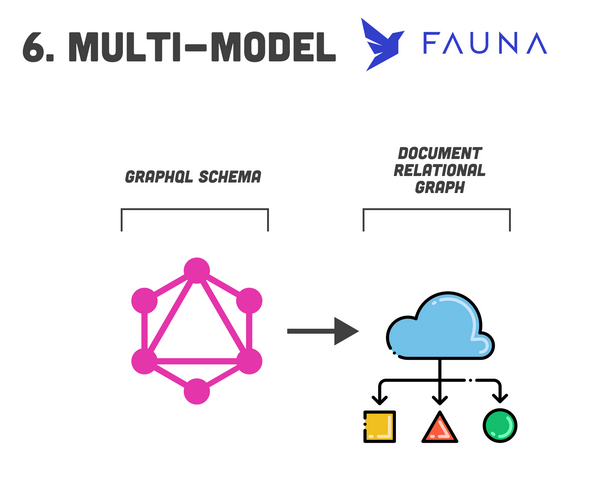

# PARADIGME DES BASES DE DONNEES

Source : https://www.youtube.com/watch?v=W2Z7fbCLSTw  
Source : https://fireship.io/lessons/top-seven-database-paradigms/  

Cette vidéo traite du paradigme des 7 types de bases de données.

## 1. Le type de BDD le plus simple : KEY-VALUE DATABASE

Ce type de BDD est structuré comme un objet JS ou un dictionnaire Python : 
Il s'agit d'une paire clé, valeur, ou chaque clé est unique et pointe vers une valeur. 

Par exemple, dans Redis, on peut lire et écrire de la donnée avec des commandes : SET (écriture), GET (récupérer). 
Dans le cas de Redis (https://redis.io/) et Memcached (https://memcached.org/), toute la donnée est stockée dans la mémoire vive de l'ordinateur. 

Contrairement à toutes les autres bases de données qui conservent leur donnée sur le disque dur. 
Cela limite la quantité de donnée qu'on peut stocker, mais cela rend la base de données extrêmement rapide 
car on ne requiert pas d'accès au disque pour toute les requêtes. 
De plus, on ne peut pas procéder à des QUERIES, JOINS ou autre, ce qui limite la modélisation de données.

Ce genre de BDD ne sera pas utilisé pour les données principales d'une application. 
C'est souvent utilisé en CACHE pour réduire la latence des données. 

Des apps telles que Twitter, GitHub & Snapchat utilisent Redis pour une livraison des données en temps réel. 

Ces types de BDD sont utilisées en complément de BDD qui sont plus persistantes. 

## 2. Les BDD : WIDE COLUMN DATABASE

Des DB populaires de ce type sont : Cassandra (https://cassandra.apache.org/_/index.html) et Apache Hbase (https://hbase.apache.org/). 
Ce type de BDD est comme une ket value db à laquelle on a ajouté une deuxième dimension. 
Concrètement, on un espace "clé", qui comportera des colonnes qui comportent un jeu de colonnes rangées, permettant de regrouper des données rangés ensemble. 
Mais, contrairement à une BDD relationnelle, elle ne possède pas de schéma. 
Cela permet de gérer des données non structurées. 
Pour cela, on utilise un 'query language' appelé CQL (Cassandra Query Language), similaire à SQL.

**Apache Cassandra :**

C'est un SGBD de type NoSQL conçu pour gérer des quantités massives de données sur un grand nombre de serveurs, 
assurant une haute disponibilité en éliminant les points de défaillance unique. 

Le CQL (Cassandra Query Language) est le langage spécifique à Cassandra. 
Il existe des implémentations spécifiques pour les langages Java, Python, Node.js, Go et C++. 
Ce langage est plus limité que SQL et on ne peut pas faire de JOINS. 

CQL est décentralisé et permet d'évoluer de la donnée au sein de multiples nodes. 
L'évolution peut se faire horizontalement. 

Ce langage est meilleurs pour des données chronologiques, des documents historiques. 
Par exemple, Netflix utilise ce système pour mettre en avant l'historique des différents programmes qu'on a regardé. 

Ce ne sera cependant pas utilisé en tant que BDD primaire pour un application.

## 3. DOCUMENT ORIENTED DATABASE

BDD populaires de ce type : MongoDB, FireStore, Dynamite. 

Dans ce paradygme, on a des documents. Où chaque document est un conteneur pour des paires clé - valeur (format JSON). 
Ces données sont non structurées et ne requierent pas de schéma. 

Les documents sont groupés ensembles en collections. Des champs de collections peuvent être indexés, 
et les collections peuvent être organisées en plus hautes archives logiques :

Cela permet de modéliser et récupérer à un degré assez important. 
Ce type de DB ne supporte pas les jointures, ce qui implique de stocker la donnée en un seul et unique document. 

Il est donc plus rapide d'accéder à la donnée, mais l'ajout et la modification est bien plus complexe. 
Très facile à utiliser, on en fera un usage plus général général :  
Applications, Jeux Mobiles, IOT, management de données etc.

En revenche, on évitera ce type de BDD pour les données déconnectées mais en relation que l'on va souvent updater (graphs) telle les réseaux sociaux (amis, commentaires, posts, etc.). 
Ce genre de données doivent êtres jointes et ce n'est pas facile à l'échelle des documented-db.

## 4. RELATIONAL DATABASE

BDD populaires : MySQL, PostGreSQL, SQLServer..

Ce type de BDD existe depuis une cinquantaine d'années et continue d'être un des plus populaire. 
Elles ont été conçues par un informaticien appelé Ted Codd (IBM) qui a passé beaucoup de temps à travailler sur la modélisation des données relationnelles. (MLD, MCD)  

Son travail a inspiré la création du SQL (Structured Query Language). 

Ce type de BDD fonctionne ainsi : 
La BDD va être structurée en tables, contennant des données spécifiques. 
On va ensuite mettre en relation ces tables (via leurs ID) afin de récupérer les données pertinente selon les besoins. 
On utilise des Clés primaires pour faire référence à une table,  
et une table utilise des clés étrangères pour faire référence à des données d'une autre table. 
Pour joindre ces données, on utilisera des JOINS. 

Ce type de BDD a besoin d'un schéma pour comprendre comment est strucurée la donnée. 
C'est là qu'entre en jeu les MLD et MCD. 

Les bases de données relationnelles (SQL) sont 'ACID' component : 
* Atomicity
* Consistency
* Isolation
* Durability

Cela signifique qu'à chaque fois qu'il y a une transaction dans la BDD,  
on pourra garantir la validité des données, même s'il y a une panne de réseau ou de h>ardware. 
C'est essentiel pour les banques ou les institutions financières,  
mais cela rend ce type de DB plus difficile à faire évoluer. 
Cependant, il existe des BDD modernes comme CockroachDB qui sont spécifiquement designées pour évoluer.

Ce type de BDD sera utilisé pour la plupart des Applications,  
mais n'est pas idéal pour des données non structurées.

## 5. GRAPHS DATABASE

La donnée est représentée en noeuds (nodes), et leurs relations sont appelées des arrêtes (edges). 

Les BDD populaires : Neo4j, Dgraph. 

Les BDD graph n'ont pas besoins de JOINS pour mettre en relation les données.  
Il suffit de trouver une arrête (edge) et de la connecter aux autres enregistrements (nodes). 

La querie CYPHER pour ce type de donnée est plus concise et plus facile à lire. 
On aura une meilleure performance sur des BDD plus larges. 
Les BDD graph sont une bonne alternative aux BDD SQL,  
spécialement si on utilise beaucoup de JOINS et que les performances sont impactées à cause de ça.

Elles sont souvent utilisées pour la détection des fraudes en finance,  
pour créer des graphes de connaissance interne aux entreprises,  
ou pour générer des moteurs de recommandation comme sur Airbnb.

## 6. SEARCH DATABASE

utilisé pour les moteurs de recherche par texte. 
La plupart des bases de données sont basées sur le "lucene project" (1999), comme Solr et Elastic Search. 
En plus, on aura des options basées sur le cloud comme algolia,  
ou meilisearch (un fulltech search engine basé sur RUST). 

Ce type de BDD fonctionne comme les document oriented db :  
On commence avec un index et on y ajoute des données. 
La différence est que le search db va analyser tout le texte dans le document et créer un index des termes qu'on peut rechercher. 
Cela fonctionne comme l'index qu'on trouvera à la fin d'un livre. 
A chaque fois qu'on va effectuer une recherche, la bdd aura simplement à regarder l'index pour retrouver la donnée en question. 
C'est très rapide, même sur de larges quantités de données. 
Ce type de DB pourra procéder à différents algorithmes de tri, pour classer ces données, etc.  

Ce type de BDD est donc utilisé pour les moteurs de recherche,  
ou une 'typeahead search box' (méthode pour rechercher progressivement et filtrer du texte).

## 7. MULTI-MODEL DATABASE

FaunaDB

Avec ce type de BDD, on va simplement se concentrer sur la description de la manière dont on veut accéder aux données en utilisant graphql. 
En injectant notre schéma graphql sur fauna, cela génère automatiquement des collections ou on peut stocker des données, 
et un index pour faire des requêtes de données.

Concrètement, cela met en oeuvre plusieurs méthodes de BDD (graphs, relationnelles, document-oriented db). 
Ce type de DB est ACID, très rapide et on a pas à se soucier de l'infrastructure des données. 
On se concentre sur la manière dont on veut utiliser les données, et on laisse le cloud se débrouiller avec ça. 

## Pour aller plus loin : les autres pradigmes des DB

Time-series DB 
Data Warehouse 