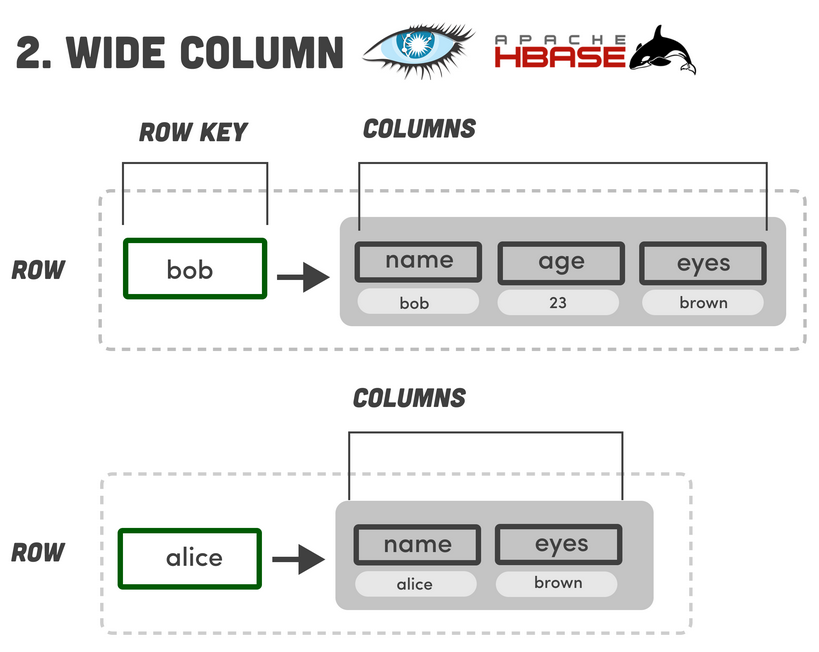
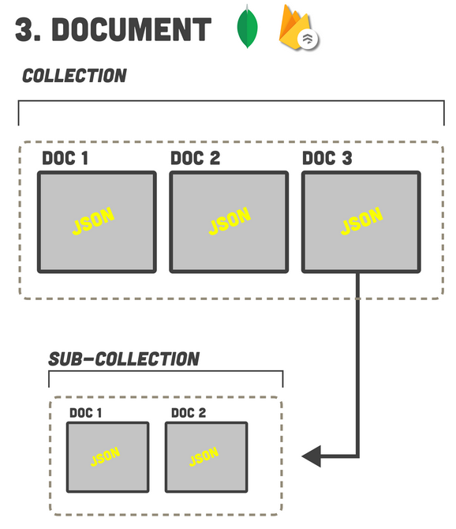
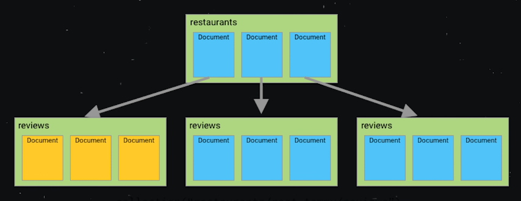
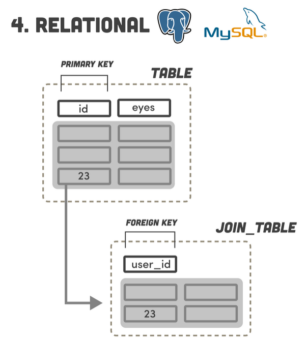

# PARADIGME DES BASES DE DONNEES

Source : https://www.youtube.com/watch?v=W2Z7fbCLSTw  

Cette vidéo traite du paradigme des 7 types de bases de données.

## 1. Le type de BDD le plus simple : KEY-VALUE DATABASE

Ce type de BDD est structuré comme un objet JS ou un dictionnaire Python : 
Il s'agit d'une paire clé, valeur, ou chaque clé est unique et pointe vers une valeur. 

Par exemple, dans Redis, on peut lire et écrire de la donnée avec des commandes : SET (écriture), GET (récupérer). 
Dans le cas de Redis (https://redis.io/) et Memcached (https://memcached.org/), toute la donnée est stockée dans la mémoire vive de l'ordinateur. 

Contrairement à toutes les autres bases de données qui conservent leur donnée sur le disque dur. 
Cela limite la quantité de donnée qu'on peut stocker, mais cela rend la base de données extrêmement rapide 
car on ne requiert pas d'accès au disque pour toute les requêtes. 
De plus, on ne peut pas procéder à des QUERIES, JOINS ou autre, ce qui limite la modélisation de données.

Ce genre de BDD ne sera pas utilisé pour les données principales d'une application. 
C'est souvent utilisé en CACHE pour réduire la latence des données. 

Des apps telles que Twitter, GitHub & Snapchat utilisent Redis pour une livraison des données en temps réel. 

Ces types de BDD sont utilisées en complément de BDD qui sont plus persistantes. 

## 2. Les BDD : WIDE COLUMN DATABASE

Des DB populaires de ce type sont : Cassandra (https://cassandra.apache.org/_/index.html) et Apache Hbase (https://hbase.apache.org/). 
Ce type de BDD est comme une ket value db à laquelle on a ajouté une deuxième dimension. 
Concrètement, on un espace "clé", qui comportera des colonnes qui comportent un jeu de colonnes rangées, permettant de regrouper des données rangés ensemble. 
Mais, contrairement à une BDD relationnelle, elle ne possède pas de schéma. 
Cela permet de gérer des données non structurées. 
Pour cela, on utilise un 'query language' appelé CQL (Cassandra Query Language), similaire à SQL.

**Apache Cassandra :**

C'est un SGBD de type NoSQL conçu pour gérer des quantités massives de données sur un grand nombre de serveurs, 
assurant une haute disponibilité en éliminant les points de défaillance unique. 

Le CQL (Cassandra Query Language) est le langage spécifique à Cassandra. 
Il existe des implémentations spécifiques pour les langages Java, Python, Node.js, Go et C++. 
Ce langage est plus limité que SQL et on ne peut pas faire de JOINS. 

CQL est décentralisé et permet d'évoluer de la donnée au sein de multiples nodes. 
L'évolution peut se faire horizontalement. 

Ce langage est meilleurs pour des données chronologiques, des documents historiques. 
Par exemple, Netflix utilise ce système pour mettre en avant l'historique des différents programmes qu'on a regardé. 

Ce ne sera cependant pas utilisé en tant que BDD primaire pour un application.

## 3. DOCUMENT ORIENTED DATABASE

BDD populaires de ce type : MongoDB, FireStore, Dynamite. 

Dans ce paradygme, on a des documents. Où chaque document est un conteneur pour des paires clé - valeur (format JSON). 
Ces données sont non structurées et ne requierent pas de schéma. 

Les documents sont groupés ensembles en collections. Des champs de collections peuvent être indexés, 
et les collections peuvent être organisées en plus hautes archives logiques :

Cela permet de modéliser et récupérer à un degré assez important. 
Ce type de DB ne supporte pas les jointures, ce qui implique de stocker la donnée en un seul et unique document. 

Il est donc plus rapide d'accéder à la donnée, mais l'ajout et la modification est bien plus complexe. 
Très facile à utiliser, on en fera un usage plus général général :  
Applications, Jeux Mobiles, IOT, management de données etc.

En revenche, on évitera ce type de BDD pour les données déconnectées mais en relation que l'on va souvent updater (graphs) telle les réseaux sociaux (amis, commentaires, posts, etc.). 
Ce genre de données doivent êtres jointes et ce n'est pas facile à l'échelle des documented-db.

## 4. RELATIONAL DATABASE

