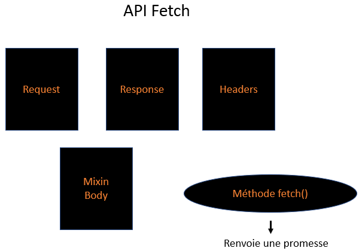

# API FETCH ET LA METHODE `fetch()`

`fetch()` est une fonction JS native qui permet de faire des requêtes Ajax.<br>
Les requêtes Ajax sont des requêtes HTTP que l'on fait depuis le JS du navigateur vers un serveur.<br>
Cela signifie que le navigateur va chercher des informations sur un serveur pour rafraîchir la page web qu'il est en train d'afficher, sans la recharger.<br>

Avant `fetch()`, on utilisait une interface qui s'appelait `XMLHttpRequest` pour faire des requêtes Ajax.<br>
L'utilité de `fetch()` : cette API **travaille avec des promesses**.<br> 
Cela signifie qu'un appel à `fetch()` retourne un objet JS de constructeur `Promise`.

Quelques précisions :
1. fetch n'est pas uniquement une fonction. On peut parler d'API (c'est-à-dire d'interface avec le réseau).<br>
Les différents objets qui composent l'Api fetch :<br>


2. Ajax ne se contente pas d'aller chercher des données, on peut aussi en envoyer (cf. CRUD avec les verbes HTTP) :<br>
   * `GET` permet d'aller chercher des données.
   * `POST` permet d'envoyer des données.
   * `PUT` ou `PATCH` permet de mettre à jour des données.
   * `DELETE` permet de supprimer des données.

3. Les promesses ne sont pas le seul et unique avantage de fetch.

## FONCTIONNEMENT 

L'API `fetch` fournit une définition pour trois interfaces : `Resquest`, `Response` et `Headers`.<br>
`fetch` implémente également le mixin `Body` qu'on va pouvoir utiliser avec nos requêtes.

Les interfaces `Request` et `Response` représentent respectivement une requête et la réponse à une requête.<br>
L'interface `Headers` représente les en-têtes de requête et de réponse.<br>
Le mixin `Body` fournit un ensemble de méthodes permettant de gérer le corps de la requête et de la réponse.<br>

L'API `Fetch` va également utiliser la méthode globale `fetch()` qui représente en quelque sortes le cœur de celle-ci.<br>
Cette méthode permet l'échange de données avec le serveur de manière **asynchrone**.<br>

La méthode `fetch()` prend en unique argument obligatoire le chemin de la ressource qu'on souhaite récupérer.<br>
On va également lui passer en argument facultatif une liste d'options sous forme d'objet littéral pour préciser la méthode d'envoi, les en-têtes, etc.<br>
`fetch()` renvoie une promesse (un objet de type _Promise_) qui va se résoudre avec un objet _Response_.
`A noter que la promesse va être résolue dès que le serveur renvoie les en-têtes HTTP, c-à-d avant même qu'on ait le corps de la réponse.`

La promesse sera rompue si la requête HTTP n'a pas pu être effectuée.<br>
En revanche, l'envoi d'erreurs HTTP par le serveur (ex : code 404, ou 500) vont être considérées comme normales et ne pas empêcher la promesse d'être tenue.<br>
Il faudra donc vérifier le statut HTTP de la réponse.<br>
On utilisera pour cela les **propriétés** `ok` et `status` de l'objet `Response` renvoyé.
* `ok` contient un booléen : **true** si le statut HTTP de la réponse est compris entre 200 et 299, sinon ce sera **false**.
* `status`va renvoyer le statut code HTTP de la réponse (valeur numérique liée à ce statut : 200, 301, 404 ou encore 500).

Pour récupérer le corps de la réponse, on va pouvoir utiliser les méthodes de l'interface `Response` en fonction du format qui nous intéressse :
* La méthode text() retourne la réponse sous forme de chaine de caractères ; 
* La méthode json() retourne la réponse en tant qu’objet JSON ; 
* La méthode formData() retourne la réponse en tant qu’objet FormData ; 
* La méthode arrayBuffer() retourne la réponse en tant qu’objet ArrayBuffer ; 
* La méthode blob() retourne la réponse en tant qu’objet Blob ;

exemple de code : 
```javascript
fetch("https://www.une-url.com")
.then(response => response.json())
.then(response => alert(JSON.stringify(response)))
.catch(error => alert("Erreur : " + error));
```
Dans le code ci-dessus :<br> 
* La méthode `fetch()` a besoin d'un argument obligatoire, qui correspond à l'URL des ressources à récupérer.<br>
On utilise ici _une url_.<br>
* `fetch()` retourne ensuite une promesse contenant la réponse.<br>
En l'état, on ne peut pas exploiter la réponse renvoyée : il faut indiquer le format de la réponse souhaitée.<br>
* Dans notre cas, on choisit du JSON avec `response.json()`.<br>
`response.json()` renvoie également une promesse contenant la réponse à la demande en JSON.<br>
* On utilise ensuite `JSON.stringify()` pour transformer l'objet JSON en une chaîne JSON et on affiche cette chaîne.<br>
* Finalement, on traite les erreurs avec le bloc `catch()` et on affiche l'erreur rencontrée si on en rencontre une.

## PASSER DES OPTIONS A `fetch()`

La méthode `fetch()` accepte un deuxième argument. Il s'agit d'un objet qui va permettre de définir les options de la requête.<br>
Voici une liste des options qu'on va pouvoir définir :
* **method** : méthode utilisée par la requête.<br> 
Les valeurs possibles sont _GET_ (défaut), _POST_, etc.) ; 
* **headers** : les en-têtes qu’on souhaite ajouter à notre requête ; 
* **body** : un corps qu’on souhaite ajouter à notre requête ; 
* **referrer** : un référant.<br> 
Les valeurs possibles sont _"about:client"_ (valeur par défaut), _""_ pour une absence de référant, ou une URL ; 
* **referrerPolicy** : spécifie la valeur de l’en-tête HTTP du référent.<br> 
Les valeurs possibles sont _no-referrer-when-downgrade_ (défaut), _no-referrer_, _origin_, _origin-when-cross-origin_ et _unsafe-url_ ; 
* **mode** : spécifie le mode qu’on souhaite utiliser pour la requête.<br> 
Les valeurs possibles sont _cors_ (défaut), _no-cors_ et _same-origin_ ; 
* **credentials** : les informations d’identification qu’on souhaite utiliser pour la demande.<br> 
Les valeurs possibles sont _same-origin_ (défaut), _omit_ et _include_ ; 
* **cache** : le mode de cache qu’on souhaite utiliser pour la requête.
Les valeurs possibles sont _default_ (défaut), _no-store_, _reload_, _no-cache_, _force-cache_ et _only-if-cached_ ; 
* **redirect** : le mode de redirection à utiliser.<br> 
Valeurs possibles : _follow_ (défaut), _manual_, _error_ ; 
* **integrity** : contient la valeur d’intégrité de la sous-ressource de la demande.<br>
Valeurs possibles : _""_ (défaut) ou un hash ; 
* **keepalive** : permet à une requête de survivre à la page.<br> 
Valeurs possibles : _false_ (défaut) et _true_ ; 
* **signal** : une instance d‘un objet _AbortSignal_ qui nous permet de communiquer avec une requête _fetch()_ et de l’abandonner.

```javascript
let promise = fetch(url, {
    method: "GET", //ou POST, PUT, DELETE, etc.
    headers: {
      "Content-Type": "text/plain;charset=UTF-8" //pour un corps de type chaine
    },
    body: undefined, //ou string, FormData, Blob, BufferSource, ou URLSearchParams
    referrer: "about:client", //ou "" (pas de réferanr) ou une url de l'origine
    referrerPolicy: "no-referrer-when-downgrade", //ou no-referrer, origin, same-origin...
    mode: "cors", //ou same-origin, no-cors
    credentials: "same-origin", //ou omit, include
    cache: "default", //ou no-store, reload, no-cache, force-cache, ou only-if-cached
    redirect: "follow", //ou manual ou error
    integrity: "", //ou un hash comme "sha256-abcdef1234567890"
    keepalive: false, //ou true pour que la requête survive à la page
    signal: undefined //ou AbortController pour annuler la requête
});
```
