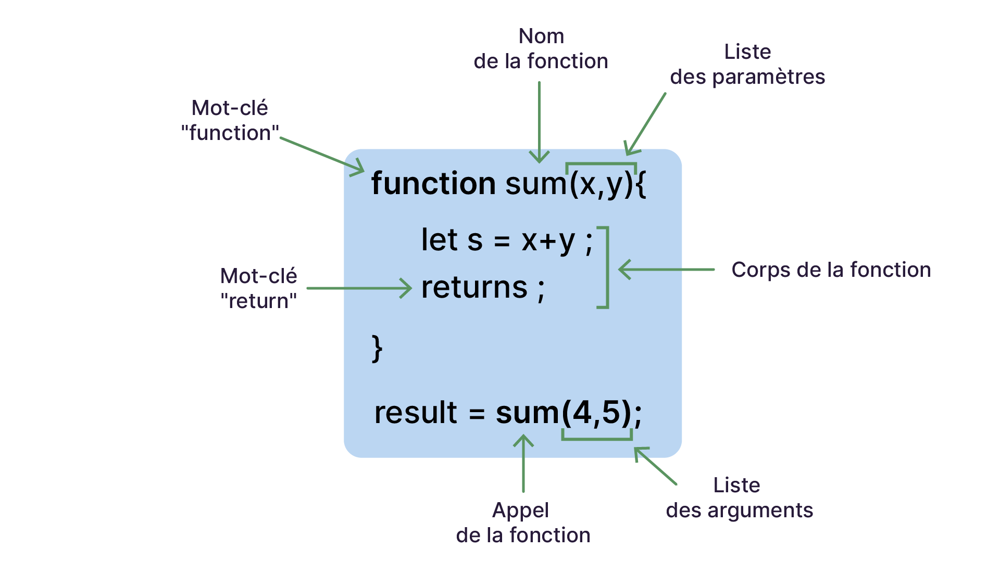

# LES FONCTIONS

## Définition

Une fonction est un bloc de code auquel on attribue un nom.<br>
Quand on appelle cette fonction, on exécute le code qu'elle contient.<br>

ex :
```JavaScript
function afficherDeuxValeurs(valeur1, valeur2) {
    console.log('Première valeur:' + valeur1);
    console.log('Deuxième valeur:' + valeur2);
}

afficherDeuxValeurs(12, 'Bonjour');

// la console affiche :
// > Première valeur:12 
// > Deuxième valeur:Bonjour 
```

Beaucoup de fonctions ont besoin de variables pour effectuer leur travail.<br>
Quand on **déclare** une fonction, on indique la liste des variables dont elle a besoin pour effectuer son travail : on définit les **paramètres** de la fonction.<br>
Quand on fait appel à la fonction, on spécifie les **valeurs** pour ses paramètres : les valeurs sont les **arguments** d'appel.
Enfin, une fonction peut donner un résultat : une **valeur de retour**.<br>

## Rédiger une fonction en JavaScript

```JavaScript
function retournerMessageScore(score, numbreQuestions) {
    let message = 'Votre score est de ' + score + ' sur ' + nombreQuestions;
    return message;
}
```
* Le mot clé : **function** est suivi du **nom de la fonction**. Ce mot clé est obligatoire pour définir la fonction.
* **entre parenthèses** sont indiqué les paramètres passés à la fonction.
* **entre accolades** est indiqué le bloc de code qui sera exécuté quand la fonction sera appelée.
  * Le mot clé **return** signifie que la fonction va retourner un résultat.



## Les fonctions flechées

Il s'agit d'une syntaxe différente mais équivalante à la fonction standard :
```JavaScript
const f = () => {
    "use scrict";
    return this;
};
f() === window
```