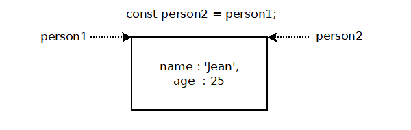
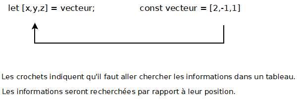
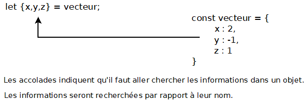

# LE DESTRUCTURING, LE SPREAD OPERATOR ET LE REST PARAMETER

* <a href="https://www.youtube.com/watch?v=cnjlBdGboYs&t=15s">JavaScript ES6 : Comprendre destructuring et spread operator</a>
* <a href="https://www.devenir-webmaster.com/V2/TUTO/CHAPITRE/JAVASCRIPT/56-destructuring-spread-operator/">Destructuring et Spread Operator</a>
* <a href="https://mindsers.blog/fr/post/rest-parameter-et-spread-operator-en-javascript/">rest parameter et spread operator en JS</a>
* <a href="https://mindsers.blog/fr/post/decomposition-et-destructuration-en-javascript/">décomposition et destructuration en JS</a>
* <a href="https://www.pierre-giraud.com/javascript-apprendre-coder-cours/parametre-reste-operateur-decomposition/">pierre-giraud</a>

## SPREAD OPERATOR ET REST PARAMETER SUR UN OBJET OU UN TABLEAU

Les spread operator est comme son nom l'indique un opérateur.<br>
Il faut mettre trois point devant une variable pour appliquer le spread operator `...n`.<br>
La variable peut être un objet ou un tableau.

Les trois petits points `...` sont en fait deux choses distinctes : le **rest parameter** et le **spread operator**.

Ne pas confondre le Rest operator et le Spread operator : l'utilisé tu spread operator est complètement opposée à celle du rest parameter.

### Le REST PARAMATER

Le rest parameter sert à stocker une liste indéfinie de valeur sous forme d'un tableau.<br>
Il s'agit du paramètre d'une fonction qui va principalement servir à "ramasser les restes" en paramètres.<br>
Par exemple, pour une fonction prenant une liste infinie de paramètres ou pour récupérer les valeurs finales d'un tableau.<br>

ex :
```javascript
function logArgs(...args) {
   console.log(args)
}

logArgs('coucou', 3, 'Bob') // args == ['coucou', 3, 'Bob']
```
L'intérêt de cet opérateur est d'assembler plusieurs valeurs dans un tableau.

exemple plus approfondi :
```javascript
function argsToObject(keys, ...values) {
   let object = {};
   object[keys] = value;

   return object;
}

let o = argsToObject('fruits', 'pomme', 'poire', 'abricot');
/* 
 {
   fruits: [
     'pomme',
     'poire',
     'abricot'
   ]
 }
 */ 
```
Ce qu'on indique ici à la fonction, c'est de récupérer un paramètre qui s'appelle `keys`, et de mettre le reste dans `values`.<br>

Cette méthode permet de rendre plus lisible la fonction, plutôt que de ne lui passer aucun paramètres.<br>

### Le SPREAD OPERATOR

Comme vu plus haut, le spread operator sest complètement opposée à celle du rest parameter.<br>
**Le spread operator sert à décomposer (ou éclater) un objet ou un tableau en une liste finie (suite) de valeurs individuelles.<br>

ex :
```javascript
let args = ['var 1', 'var 2', 'var 1']

console.log(...args)
// == console.log('var 1', 'var 2', 'var 1')
```

Le tableau `args` est éclaté en plusieurs paramètres pour la fonction `log` de `console`.

Le spread operator est utile si :
* On a besoin de passer exactement la même liste de paramètres à plusieurs fonctions.
* On veut automatiser la gestion des méthodes, fonctions, classes. Par exemple pour l'écriture d'un framework, d'un conteneur d'injection de dépendances.
* On veut concaténer un tableau

### Spread operator sur un tableau

Avant, deux solutions s’offrait à nous :
* boucler des millions de fois pour essayer de faire un algo de concaténation de tableau
* utiliser plusieurs fois la méthode `Array.prototype.push.apply()`.

On peut maintenant concaténer plus facilement grâce au spread operator, ce qui simplifie grandement la taĉhe.
```javascript
let fruits = ['pomme', 'poire', 'abricot']
let legumes = ['salade', 'asperge']

let mots = ['automne', 'hiver', ...fruits, 'voiture', ...legumes]
```

exemple :
```javascript
const tab1 = [1,2,3];

// Ici on duplique
const tab2 = [...tab1];

const tab3 = [...tab1,'sep',...tab2];

console.log(tab1); // (3) [1, 2, 3]
console.log(tab2); // (3) [1, 2, 3]
console.log(tab3); // (7) [1, 2, 3, "sep", 1, 2, 3]
```

Pour dupliquer `tab1`, on place d'abord le spread operator devant `tab1` de cette manière : `...tab1`, ce qui vaut `1,2,3`.<br>
Pour fabriquer `tab2`, on fait `const tab2 = []` et on place dedans le `...tab1` : `const tab2 = [...tab1]`.<br>
Il en résulte deux tableaux identiques.<br>
Pour `tab3`, on concatène `tab1` puis une chaîne de séparation puis `tab2`.

### Spread Operator sur un objet

Erreur à éviter :
```javascript
const person1 = {
	name : 'Jean',
	age  : 25
}

// Je veux créer un nouvel objet person2
// Je ne peux pas faire cela car ce sont des références
const person2 = person1;
person2.name = 'Paul';

console.log(person1);
console.log(person2);
```
Ici, après avoir créé l'objet `person1`, on crée `person2` avec l'égalité : `const person2 = person1;`.<br>
Attention ! on ne fait que dupliquer les références, pas les objets !<br>
On a dont deux références qui pointent sur le même objet. Or, l'objectif est de créer deux objets, ce procédé ne va pas.



En utilisant le spread operator pour récupérer l'objet `person1`, on pourrait se contenter de le dupliquer.<br>
Mais on peut faire mieux :
1. On peut changer la valeur d'une propriété de l'objet qu'on vient de dupliquer
2. On peut ajouter une nouvelle propriété

exemple :
```javascript
const person1 = {
	name : 'Jean',
	age  : 25
}

const person2 = {
	// Ici je récupère person1
	...person1,
	// Je peux changer le nom
	name : 'Paul',
	// Je peux ajouter une propriété
	sexe : 'M'
};

console.log(person1); // {name: "Jean", age: 25}
console.log(person2); // {name: "Paul", age: 25, sexe: "M"}
```

### En Conclusion

S’il faut expliquer simplement ce qu’est le rest parameter et spread operator en JavaScript :
* le rest parameter rassemble plusieurs valeurs en un tableau
* le spread operator découpe un tableau en plusieurs valeurs
* ils sont tous les deux utilisables grâce aux `...`

## Le Principe du Destructuring (ou destructuration) :

La décomposition et la déstructuration sont deux termes spécifiques pour exprimer la même chose.<br> 
La décomposition s’applique aux tableaux et la déstructuration aux objets.<br>
Le terme décomposition est le seul retenu dans les RFCs et autres spécifications d’Ecma International, ce sera donc le terme utilisé.

La décomposition consiste à "décomposer" les structures complexes (tableau, objet) pour en extraire les valeurs qui nous intéressent.<br> 
L’intérêt est de rendre ce genre de manipulation plus simple et le code plus lisible :

```javascript
let [ valeur1, valeur2 ] = tableau
let { valeur1, valeur2 } = objet
```
La syntaxe sera différente s'il s'agit d'un tableau ou d'un objet.

L'opération de destructuration est une syntaxe qui permet d'affecter des variables à partir d'informations que le moteur JavaScript va chercher dans un objet ou un tableau.
* Lorsqu'il s'agit d'un objet, le moteur se base par rapport au nom d'une propriété pour retrouver l'information dans l'objet (paire clé: valeur)
* Lorsqu'il s'agit d'un tableau, le moteur se base par rapport à une position pour retrouver l'information dans le tableau (paire index: valeur)

### Décomposer un tableau

Un cas concrêt de décomposition des tableaux est lorsqu'on souhaite récupérer les valeurs d'un tableau.<br>
Sans décomposition, voici comment on récupère des valeurs pour pouvoir les utiliser :
```javascript
let args = ['fruits', 'pomme', 'poire', 'abricot']
let type = args[0]
let firstEl = args[1]
let secondEl = args[2]
let thirdEl = args[3]
```
et avec la décomposition :
```javascript
let args = ['fruits', 'pomme', 'poire', 'abricot']
let [type, firstEl, secondEl, thirdEl] = args
```

Les deux codes sont similaires, le résultat est le même.<br> 
Dans les deux cas les variables `type`, `firstEl`, `secondEl` et `thirdEl` sont créées.

Pour déstructurer un tableau, la recherche d'information ne peut pas se faire sur la base d'un nom.<br>
On fera la recherche sur la base de la position de l'information dans le tableau.<br>



```javascript
const vecteur = [2,-1,1];

let [x,y,z] = vecteur;

console.log(`x=${x} y=${y} z=${z}`);
// retourne : x=2 y=-1 z=1
```

De manière traditionnelle, il fallait accéder aux éléments un par un, ce qui était répétitif :
```javascript
const vecteur = [2,-1,1];

let x = vecteur[0];
let y = vecteur[1];
let z = vecteur[2];

console.log(`x=${x} y=${y} z=${z}`);
```

Si on s'arrête là, la syntaxe n'a que pour intérêt d'économiqer des lignes de code.<br>
La décomposition offre d'autres intérêts qui font gagner du temps !

#### Récupérer une partie des informations

Afin de sauter un élément lors de la déstructuration, il faut mettre une virgule.<br>
```javascript
const vecteur = [2,-1,1];

// Ne récupérer que le z
let [,,z] = vecteur;

console.log(`Récupérer uniquement le z=${z}`);
```

Reprenons notre premier exemple :
```javascript
let args = ['fruits', 'pomme', 'poire', 'abricot']
let [type,, secondEl] = args
```
Si je veux récupérer uniquement le type et le second élément, j'ajoute simplement une virgule entre `args[0]` et `args[2]`,<br>
mais sans préciser le nom de la variable dans laquelle mettre `args[1]`.

Autre cas, si `args` est vide, mes variables `type` et `secondEl` seront créées, mais auront pour valeur `undefined`.<br>
Pour pouvoir continuer de travailler avec, il faudrait que je teste mes variables. Mais je peux aussi leur attribuer des valeurs par défaut :
```javascript
let args = []
let [type = 'legume', firstEl = 'salade'] = args
```
Comme `args` est vide, `type` vaudra "légume" et `firstEl` vaudra "salade".

Dans le cas ou je veux récupérer le type de mes éléments dans une variable,<br> 
mais qu'il est plus pratique pour moi que la liste des éléments soient dans un tableau pour pouvoir boucler dessus, on procédera ainsi :
```javascript
let args = ['fruits', 'pomme', 'poire', 'abricot']
let [type, ...elements] = args
```
Ici, `type` vaudra "fruits", et `elements` vaudra `['pomme', 'poire', 'abricot'].
La syntaxe est assez particulière, car elle utilise le rest parameter.

La décomposition est aussi utile pour des cas auxquels on ne pense pas forcément :
* intervertir les valeurs de deux variables :
```javascript
let valA = 'coucou'
let valB = 'byebye'
[valA, valB] = [valB, valA]
// logiquement, valA vaudra "byebye" et valB vaudra "coucou"
```
* travailler avec des fonctions qui retournent des tableaux :<br>
`firstIsTrue()` prend en paramètre un tableau. Seule la première valeur sera transmise à la fonction et si le tableau est vide, `first` vaudra `false`.
```javascript
let [max, min] = getMaxAndMin([3, 34, 2, 5, 6, 22, 33, 1])
```

#### Déstructurer un tableau à deux dimensions

```javascript
const matrice = [
    [2,1,1],
    [3,1,4],
    [5,0,1]
];

const [L1,L2,L3] = matrice;
console.log(`Ligne 2 => ${L2}`);

const [,[L2_x],] = matrice;
console.log(`Ligne 2 valeur de x => ${L2_x}`);
```

Dans cet exemple, on effectue deux déstructurations :
1. on décompose la matrice en 3 lignes : `const [L1,L2,L3] = matrice`.
2. on descend dans la ligne 2 en mettant à nouveau une paire de crochets, puis on récupère la première valeur qu'on appelle `L2_x`.


### Destructuring d'un objet :

La décomposition des objets est relativement similaire à celle des tableaux, avec quelques spécificités.

Pour décomposer un objet, on déclare une ou plusieurs variables en les mettant entre accolades de cette manière : `let {x, y, z}`.<br>
Ensuite, on affecte cette déclaration à un objet : `let {x, y, z} = vecteur;`.<br>
Le moteur JavaScript comprend qu'il doit aller chercher les valeurs des propriétés dans l'objet et les affecter aux variables de même nom.



* Dans le cas ou on souhaite récupérer une des clés :
```javascript
let objet = {
  slug: 'test',
  title: 'Ceci est un test',
  content: '...',
  visible: true
}

let { title } = objet
```
Dans cet exemple, on ne souhaite récupérer que le titre. On remarque la différence avec les tableaux ou on utilise les accolades au lieu des crochets.

* Cas d'une valeur par défaut :
```javascript
let objet = {
  slug: 'test',
  title: 'Ceci est un test',
  content: '...',
  visible: true
}

let { visible = false } = objet
```
Ici, on ne veut que la visibilité et que sa valeur par défaut soit `false`.


exemple :
```javascript
const vecteur = {
	x : 2,
	y : -1,
	z : 1
}
let {x,y,z} = vecteur;
console.log(`x=${x} y=${y} z=${z}`);
// retourne x=2 y=-1 z=1
```

Lorsque l'on procédait de manière traditionnelle, il fallait utiliser la notation pointée, ce qui était répétitif :
```javascript
const vecteur = {
	x : 2,
	y : -1,
	z : 1
}
// Si on veut récupérer les coordonnées de
// manière traditionnelle il faut faire
let x = vecteur.x;
let y = vecteur.y;
let z = vecteur.z;
console.log(`x=${x} y=${y} z=${z}`);
```

On peut aussi destructurer en créant des variables ou des constantes :
```javascript
// Ci-dessous on crée des variables
let {x,y,z} = vecteur;
// Ci-dessous on crée des constantes
const {x,y,z} = vecteur;
```
#### Déstructurer en changeant le nom de la variable 

Par défaut, la variable porte le meme nom que la propriété. Si ce comportement ne convient pas, on peut renommer la variable.

* Cas d'utilisation d'un autre nom pour une clé :
```javascript
let objet = {
  slug: 'test',
  title: 'Ceci est un test',
  content: '...',
  visible: true
}

let { content: article } = objet
```
Ici, on récupère uniquement la clé `content` qu'on stocke dans la variable `article`.<br>

La vraie syntaxe de lé décomposition est celle utilisée dans cet exemple.<br>
Dans les autres exemples, on utilise une astuce de ES2015 qui nous évite d'écrire deux fois la même chose quand c'est possible.<br>
La seule chose à retenir : `{visible: visible}` est égale à `{visible}`.

* Dans cet exemple, on cumule la valeur par défaut et le changement de nom.<br>
  On récupère la clé `visible` qu'on stocke dans la variable `isVisible`. Cette variable vaudra par défaut `false`.
```javascript
let objet = {
  slug: 'test'
  title: 'Ceci est un test'
  content: '...'
  visible: true
}

let { visible: isVisible = false } = objet
```

exemple :
```javascript
const vecteur = {
	x : 2,
	y : -1,
	z : 1
}

let {x:coordX ,y:coordY ,z:coordZ } = vecteur;

console.log(`coordX=${coordX} coordY=${coordY} coordZ=${coordZ}`);
```

#### Déstructurer au moment de l'appel d'une fonction

Il est possible de déstructurer au moment de l'appel à une fonction. C'est logique compte tenu que le passage d'arguments se fait par une affectation.<br>
C'est pratique dans le cas ou on a un gros objet avec beaucoup de propriétés et que dans la fonction on a besoin que de quelques-unes de ces propriétés.<br>
En plus ça va améliorer la lisibilité du code puisqu'on précise les propriétés qu'on va utiliser dès la déclaration.<br>

Il s’agit clairement du cas qui pousse le plus à utiliser la décomposition. C’est un gain de temps impressionnant !<br>
Vous avez surement déjà écrit des fonctions avec un paramètre options qui rassemble toutes vos options dans un objet.<br>
Pensez au temps que vous avez perdu et au nombre de lignes que vous avez écrit pour tester ce seul paramètre avant même de coder du métier.
```javascript
function test(id, { maxLength = 10, current = 0 } = {}) {};
// const test = (id, { maxLength = 10, current = 0} = {}) => {};
```
Comme pour la décomposition de tableaux, le fait d'utiliser la décomposition dans les paramètres d'une fonction est totalement transparent pour l'utilisateur.<br>
Mais cela change tout pour nous !<br>

`maxLength` et `current` ne seront jamais `undefined`, ils auront toujours une valeur que ce soit celle de l’utilisateur ou la valeur par défaut.<br>
Et ça allégera votre code vu que vous ne ferez plus `options.maxLength` mais juste `maxLength` comme s’il s’agissait d’un simple paramètre comme id.

Seul les attributs que vous avez déclarés dans la décomposition seront transmit à votre fonction.<br>
L’utilisateur peut bien ajouter 15 000 autres attributs à `options ils ne seront pas transmis.<br>
Ce qui ajoute un léger niveau de sécurité à votre fonction.

exemple :
```javascript
const vecteur = {
	x : 2,
	y : -1,
	z : 1
}

function print({x,y,z}) {
	console.log(`x=${x} y=${y} z=${z}`);
}

print(vecteur);

// retourne : x=2 y=-1 z=1
```

#### Déstructurer des propriétés imbriquées

Dans l'exemple ci-dessous, on va prendre un objet qui représente une droite qui a une épaisseur `width`, une couleur `color` et qui passe par deux points A et B qui ont tous les deux un triplet de coordonnées :
```javascript
const line = {
	width : 2,
	color : 'blue',
	A : {x:2, y:1, z:3},
	B : {x:4, y:3, z:2}
};

const {width , A : {x:startA} } = line;
console.log(`width => ${width} startA => ${startA}`);
// retourne : width => 2 startA => 2
```
On déstructure pour récupérer d'abord `width`, puis on veux descendre sur la coordonnée `x` du point A.<br>
On écrit `A: {x}`. Si on veut renommer `x` on va écrire ainsi : `A : {x: startA}`