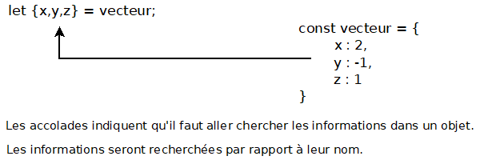
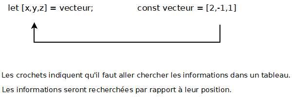

# LE DESTRUCTURING ET LE SPREAD OPERATOR

<a href="https://www.youtube.com/watch?v=cnjlBdGboYs&t=15s">JavaScript ES6 : Comprendre destructuring et spread operator</a>

## Le Principe du Destructuring (ou destructuration) :

L'opération de destructuration est une syntaxe qui permet d'affecter des variables<br> 
à partir d'informations que le moteur JavaScript va chercher dans un objet ou un tableau.

* Lorsqu'il s'agit d'un objet, le moteur se base par rapport au nom d'une propriété pour retoruver l'information dans l'objet (paire clé: valeur)
* Lorsqu'il s'agit d'un tableau, le moteur se base par rapport à une position pour retrouver l'information dans le tableau (paire index: valeur)

## Destructuring d'un objet :

Pour destructurer un objet, on déclare une ou plusieurs variables en les mettant entre accolades de cette manière : `let {x, y, z}`.<br>
Ensuite, on affecte cette déclaration à un objet : `let {x, y, z} = vecteur;`.<br>
Le moteur JavaScript comprend qu'il doit aller chercher les valeurs des propriétés dans l'objet et les affecter aux variables de même nom.



exemple :
```javascript
const vecteur = {
	x : 2,
	y : -1,
	z : 1
}
let {x,y,z} = vecteur;
console.log(`x=${x} y=${y} z=${z}`);
// retourne x=2 y=-1 z=1
```

Lorsque l'on procédait de manière traditionnelle, il fallait utiliser la notation pointée, ce qui était répétitif :
```javascript
const vecteur = {
	x : 2,
	y : -1,
	z : 1
}
// Si on veut récupérer les coordonnées de
// manière traditionnelle il faut faire
let x = vecteur.x;
let y = vecteur.y;
let z = vecteur.z;
console.log(`x=${x} y=${y} z=${z}`);
```

On peut aussi destructurer en créant des variables ou des constantes :
```javascript
// Ci-dessous on crée des variables
let {x,y,z} = vecteur;
// Ci-dessous on crée des constantes
const {x,y,z} = vecteur;
```
### Déstructurer en changeant le nom de la variable 

Par défaut, la variable porte le meme nom que la propriété. Si ce comportement ne convient pas, on peut renommer la variable :

```javascript
const vecteur = {
	x : 2,
	y : -1,
	z : 1
}

let {x:coordX ,y:coordY ,z:coordZ } = vecteur;

console.log(`coordX=${coordX} coordY=${coordY} coordZ=${coordZ}`);
```

### Déstructurer au moment de l'appel d'une fonction

Il est possible de déstructurer au moment de l'appel à une fonction. C'est logique compte tenu que le passage d'arguments se fait par une affectation.<br>
C'est pratique dans le cas ou on a un gros objet avec beaucoup de propriétés et que dans la fonction on a besoin que de quelques-unes de ces propriétés.<br>
En plus ça va améliorer la lisibilité du code puisqu'on précise les propriétés qu'on va utiliser dès la déclaration.<br>
exemple :
```javascript
const vecteur = {
	x : 2,
	y : -1,
	z : 1
}

function print({x,y,z}) {
	console.log(`x=${x} y=${y} z=${z}`);
}

print(vecteur);

// retourne : x=2 y=-1 z=1
```

### Déstructurer des propriétés imbriquées

Dans l'exemple ci-dessous, on va prendre un objet qui représente une droite qui a une épaisseur `width`, une couleur `color` et qui passe par deux points A et B qui ont tous les deux un triplet de coordonnées :
```javascript
const line = {
	width : 2,
	color : 'blue',
	A : {x:2, y:1, z:3},
	B : {x:4, y:3, z:2}
};

const {width , A : {x:startA} } = line;
console.log(`width => ${width} startA => ${startA}`);
// retourne : width => 2 startA => 2
```
On déstructure pour récupérer d'abord `width`, puis on veux descendre sur la coordonnée `x` du point A.<br>
On écrit `A: {x}`. Si on veut renommer `x` on va écrire ainsi : `A : {x: startA}`

## Déstructuration d'un tableau

Pour déstructurer un tableau, la recherche d'information ne peut pas se faire sur la base d'un nom.<br>
On fera la recherche sur la base de la position de l'information dans le tableau.<br>



```javascript
const vecteur = [2,-1,1];

let [x,y,z] = vecteur;

console.log(`x=${x} y=${y} z=${z}`);
// retourne : x=2 y=-1 z=1
```

De manière traditionnelle, il fallait accéder aux éléments un par un, ce qui était répétitif :
```javascript
const vecteur = [2,-1,1];

let x = vecteur[0];
let y = vecteur[1];
let z = vecteur[2];

console.log(`x=${x} y=${y} z=${z}`);
```

### Récupérer une partie des informations 

Afin de sauter un élément lors de la déstructuration, il faut mettre une virgule.<br>
```javascript
const vecteur = [2,-1,1];

// Ne récupérer que le z
let [,,z] = vecteur;

console.log(`Récupérer uniquement le z=${z}`);
```

### Déstructurer un tableau à deux dimensions

```javascript
const matrice = [
    [2,1,1],
    [3,1,4],
    [5,0,1]
];

const [L1,L2,L3] = matrice;
console.log(`Ligne 2 => ${L2}`);

const [,[L2_x],] = matrice;
console.log(`Ligne 2 valeur de x => ${L2_x}`);
```

Dans cet exemple, on effectue deux déstructurations : 
1. on décompose la matrice en 3 lignes : `const [L1,L2,L3] = matrice`.
2. on descend dans la ligne 2 en mettant à nouveau une paire de crochets, puis on récupère la première valeur qu'on appelle `L2_x`.

## SPREAD OPERATOR SUR UN OBJET OU UN TABLEAU

Les spread operator est comme son nom l'indique un opérateur.<br>
Il faut mettre trois point devant une variable pour appliquer le spread operator `...n`.<br>
La variable peut être un objet ou un tableau.

**Le spread operator décompose un objet ou un tableau en une suite de valeurs individuelles.<br>

### Spread Operator sur un objet

Erreur à éviter : 
```javascript
const person1 = {
	name : 'Jean',
	age  : 25
}

// Je veux créer un nouvel objet person2
// Je ne peux pas faire cela car ce sont des références
const person2 = person1;
person2.name = 'Paul';

console.log(person1);
console.log(person2);
```
Ici, après avoir créé l'objet `person1`, on crée `person2` avec l'égalité : `const person2 = person1;`.<br>
Attention ! on ne fait que dupliquer les références, pas les objets !<br>
On a dont deux références qui pointent sur le même objet. Or, l'objectif est de créer deux objets, ce procédé ne va pas.

En utilisant le spread operator pour récupérer l'objet `person1`, on pourrait se contenter de le dupliquer.<br>
Mais on peut faire mieux :
1. On peut changer la valeur d'une propriété de l'objet qu'on vient de dupliquer
2. On peut ajouter une nouvelle propriété

exemple :
```javascript
const person1 = {
	name : 'Jean',
	age  : 25
}

const person2 = {
	// Ici je récupère person1
	...person1,
	// Je peux changer le nom
	name : 'Paul',
	// Je peux ajouter une propriété
	sexe : 'M'
};

console.log(person1); // {name: "Jean", age: 25}
console.log(person2); // {name: "Paul", age: 25, sexe: "M"}
```

### Spread operator sur un tableau

```javascript
const tab1 = [1,2,3];

// Ici on duplique
const tab2 = [...tab1];

const tab3 = [...tab1,'sep',...tab2];

console.log(tab1); // (3) [1, 2, 3]
console.log(tab2); // (3) [1, 2, 3]
console.log(tab3); // (7) [1, 2, 3, "sep", 1, 2, 3]
```

Pour dupliquer `tab1`, on place d'abord le spread operator devant `tab1` de cette manière : `...tab1`, ce qui vaut `1,2,3`.<br>
Pour fabriquer `tab2`, on fait `const tab2 = []` et on place dedans le `...tab1` : `const tab2 = [...tab1]`.<br>
Il en résulte deux tableaux identiques.<br>
Pour `tab3`, on concatène `tab1` puis une chaîne de séparation puis `tab2`.

