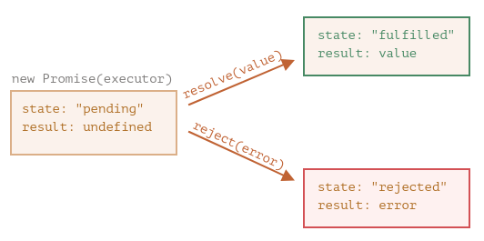

# PROMISE (PROMESSE)

## QU'EST CE QU'UNE PROMESSE EN JAVASCRIPT ?

Une promesse en JS est un objet qui représente l'état d'une opération asynchrone.<br>
Une opération asynchrone peut être dans l'un des états suivants :
* Opération en cours (non terminée)
* Opération terminée avec succès (promesse résolue)
* Opération terminée ou plus exactement stoppée après un échec (promesse rejetée)

En JS, on peut créer nos propres promesses ou manipuler des promesses déjà consommées créées par des API.

Pour faire une analogie, imaginons que nous sommes une vedette et que les fans nous demandent jour et nuit notre prochaine chanson.<br>
Afin d'avoir un peu de paix, on leur promet de le leur envoyer dès que celle-ci est publiée.<br>
On donne à nos fans une liste d'abonnements. Ils peuvent y ajouter une adresse mail, et ainsi, lorsque le single est sorti, tous les emails reçoivent la chanson.<br>
Et si quelque chose empêche le single de sortir (problème en studio par exemple), ils seront aussi notifiés.<br>

Ce sera la même chose en programmation :
1. Un "producteur de code" qui réalise quelque chose mais nécessite du temps (ex: un code qui charge des données à travers un réseau => le chanteur).
2. Un "consommateur de code" qui attend le résultat du "producteur de code" quand il est prêt. Beaucoup de fonctions peuvent avoir besoin de ce résultat (ce sont les fans).
3. Une promesse (promise) est un objet spécial en JS qui lie le producteur de code et le consommateur de code ensemble (il s'agit de la liste d'abonnements).<br>
Le producteur de code prend le temps nécessaire pour produire le résultat promis, et la promesse donne le résultat disponible pour le code abonné quand c'est prêt.

L'idée est donc la suivante : on va définir une fonction dont le rôle est d'effectuer une opération asynchrone, et cette fonction va créer et renvoyer un objet `Promesse` lors de son exécution.
L'analogie ci-dessus n'est pas la plus correcte car les promesses en JS sont plus complexes qu'une simple liste d'abonnement : elles ont d'autres possibilités mais aussi certaines limitations.

La syntaxe du constructeur pour une promesse est la suivante :
```javascript
const promise = new Promise((resolve, reject) => {
    // L'exécuteur (le code produit = le chanteur) = Tâche asynchrone à réaliser
    // Appel de resolve() si la promesse est résolue (tenue)
    // ou appel de reject() si la promesse est rejetée (rompue)
});
```
La fonction passée à `nex Promise` est appelée l'**exécuteur**.<br>
Quand `new Promise` est créée, elle est lancée automatiquement.<br>
Les arguments `resolve` (tenir) et `reject` (rompre) sont les fonctions de retour directement fournies par JS. Le code est inclus seulement dans l'exécuteur.<br>
Lorsque l'exécuteur obtient un résultat (rapide ou non), il appellera une des deux fonctions de retour :
* `resolve(value)` : si la promesse est résolue (tenue) = la tâche est terminée avec succès, avec le résultat `value`.
* `reject(error)`: si la promesse est rejetée (rompue) = une erreur est survenue, `error` est l'objet de l'erreur.

Pour résumer : 
1. l'exécuteur s'exécute automatiquement et tente d'effectuer un travail.
2. il appelle `resolve` s'il a réussi ou `reject` s'il y avait une erreur.

L'objet `promise` retourné par le constructeur `new Promise` a des propriétés internes :
* `state` (état) = initialement à `pending` (en attente),<br> 
se change soit en `fulfilled` (tenue) lorsque `resolve` est appelé ou `rejected` si `reject` est appelé.
* `result` = initialement à `undefined`,<br>
se change en `value` quand `resolve-value` est appelé ou en `error` quand `reject(error)` est appelé.

L'exécuteur changera la promesse à un de ces états :



