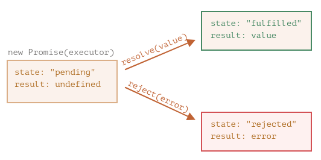
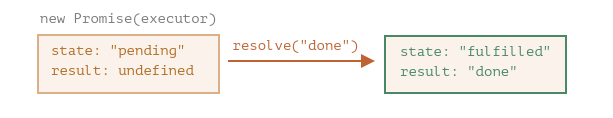
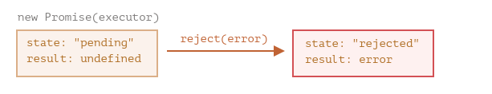

# PROMISE (PROMESSE)

## QU'EST CE QU'UNE PROMESSE EN JAVASCRIPT ?

Une promesse en JS est un objet qui représente l'état d'une opération asynchrone.<br>
Une opération asynchrone peut être dans l'un des états suivants :
* Opération en cours (non terminée)
* Opération terminée avec succès (promesse résolue)
* Opération terminée ou plus exactement stoppée après un échec (promesse rejetée)

En JS, on peut créer nos propres promesses ou manipuler des promesses déjà consommées créées par des API.

Pour faire une analogie, imaginons que nous sommes une vedette et que les fans nous demandent jour et nuit notre prochaine chanson.<br>
Afin d'avoir un peu de paix, on leur promet de le leur envoyer dès que celle-ci est publiée.<br>
On donne à nos fans une liste d'abonnements. Ils peuvent y ajouter une adresse mail, et ainsi, lorsque le single est sorti, tous les emails reçoivent la chanson.<br>
Et si quelque chose empêche le single de sortir (problème en studio par exemple), ils seront aussi notifiés.<br>

Ce sera la même chose en programmation :
1. Un "producteur de code" qui réalise quelque chose mais nécessite du temps (ex: un code qui charge des données à travers un réseau => le chanteur).
2. Un "consommateur de code" qui attend le résultat du "producteur de code" quand il est prêt. Beaucoup de fonctions peuvent avoir besoin de ce résultat (ce sont les fans).
3. Une promesse (promise) est un objet spécial en JS qui lie le producteur de code et le consommateur de code ensemble (il s'agit de la liste d'abonnements).<br>
Le producteur de code prend le temps nécessaire pour produire le résultat promis, et la promesse donne le résultat disponible pour le code abonné quand c'est prêt.

L'idée est donc la suivante : on va définir une fonction dont le rôle est d'effectuer une opération asynchrone, et cette fonction va créer et renvoyer un objet `Promesse` lors de son exécution.
L'analogie ci-dessus n'est pas la plus correcte car les promesses en JS sont plus complexes qu'une simple liste d'abonnement : elles ont d'autres possibilités mais aussi certaines limitations.

La syntaxe du constructeur pour une promesse est la suivante :
```javascript
const promise = new Promise((resolve, reject) => {
    // L'exécuteur (le code produit = le chanteur) = Tâche asynchrone à réaliser
    // Appel de resolve() si la promesse est résolue (tenue)
    // ou appel de reject() si la promesse est rejetée (rompue)
});
```
La fonction passée à `nex Promise` est appelée l'**exécuteur**.<br>
Quand `new Promise` est créée, elle est lancée automatiquement.<br>
Les arguments `resolve` (tenir) et `reject` (rompre) sont les fonctions de retour directement fournies par JS. Le code est inclus seulement dans l'exécuteur.<br>
Lorsque l'exécuteur obtient un résultat (rapide ou non), il appellera une des deux fonctions de retour :
* `resolve(value)` : si la promesse est résolue (tenue) = la tâche est terminée avec succès, avec le résultat `value`.
* `reject(error)`: si la promesse est rejetée (rompue) = une erreur est survenue, `error` est l'objet de l'erreur.

Pour résumer : 
1. l'exécuteur s'exécute automatiquement et tente d'effectuer un travail.
2. il appelle `resolve` s'il a réussi ou `reject` s'il y avait une erreur.

L'objet `promise` retourné par le constructeur `new Promise` possède deux propriétés internes :
* `state` (état) = initialement à `pending` (en attente),<br> 
évolue soit en `fulfilled` (tenue) lorsque `resolve` est appelé ou en `rejected` si `reject` est appelé.
* `result` = initialement à `undefined`,<br>
évolue en `value` quand `resolve(value)` est appelé ou en `error` quand `reject(error)` est appelé.

En résumé :<br>
Si la promesse est tenue, la fonction `resolve()` sera appelée<br>
tandis que si la promesse est rompue la fonction `reject()` va être appelée.<br>
Ces deux fonctions sont des fonctions prédéfinies en JavaScript et nous n’avons donc pas besoin de les déclarer.<br> 
Nous allons pouvoir passer un résultat (value ou error) en argument pour chacune d’entre elles.<br> 
Cette valeur servira de valeur pour la propriété `result` de notre promesse.

L'exécuteur changera la promesse à un de ces états :



En pratique, on va créer des fonctions asynchrones qui vont renvoyer des promesses :
```javascript
const loadScript = (src) => {
    return new Promise((resolve, reject) => {
        let script = document.createElement('script');
        script.src = src;
        document.head.append(script);
        script.onload = () => resolve('Fichier ' + src + ' bien chargé');
        script.onerror = () => reject(new Error('Echec de chargement de ' + src));
    });
}

const promesse1 = loadScript('boucle.js');
const promesse2 = loadScript('script2.js');
```
**A noter que l'état d'une promesse une fois résolue (ou rejetée) est final et ne peut pas être changé !**<br>
On aura donc jamais qu'une seule valeur ou une erreur dans le cas d'un échec pour une promesse.

exemple d'un constructeur d'une promesse et d'une fonction exécutrice simple avec un "code produit" qui prend du temps<br>
(utilisation de `setTimeout`) :
```javascript
const promise = new Promise((resolve, reject) => {
    // la fonction est exécutée automatiquement quand la promesse est construite
    // On signale au bout d'une seconde que la tâche est terminée avec le résultat "done"
    setTimeout( () => resolve("done"), 1000);
});
```
On peut voir deux choses en lançant le code ci-dessus :
1. L'exécuteur est appelé automatiquement et immédiatement (avec `new Promise`).
2. L'exécuteur reçoit deux arguments : `resolve` et `reject`.<br>
Ces deux fonctions sont pré-définies par le moteur JS, ainsi, nous n'avons pas besoin de les créer.<br>
On doit seulement appeler l'une ou l'autre quand le résultat est prêt.<br>
Après une seconde de traitement (setTimeout 1000), l'exécuteur appelle `resolve(done)` pour produire le résultat.<br>
Cela change l'état de l'objet en `promise` :<br>


Dans le cas ou un exécuteur romp la promesse avec une erreur :
```javascript
const promise = new Promise((resolve, reject) => {
    // On signale après 1 seconde que la tâche est terminée avec une erreur
    setTimeout(() => reject(new Error("Whoops !")), 1000);
});
```
L'appel a `reject(...)` change l'objet promesse à l'état `rejected` :<br>


Pour résumer, l'exécuteur devrait réaliser une tâche (normalement quelque chose qui prend du temps),<br>
puis appelle `resolve` (ou `reject`) pour changer l'état de l'objet promesse correspondant.<br>

**_Une promesse qui est soit tenue soit rejetée est appelée "settled" (acquittée)<br> 
par opposition à une promesse initialisée à "en attente"_**

**Quelques points clés :**<br>
* **Il ne peut y avoir qu'un seul résultat ou une erreur** :<br>
L'exécuteur devrait appeler seulement une fois `resolve` ou `reject`. N'importe quel changement d'état est définitif.<br>
Les appels supplémentaires à `resolve` et `reject` sont ignorés.<br>
L'idée est que la tâche exécutée par un exécuteur ne peut avoir qu'un seul résultat ou une erreur.<br>
De plus, `resolve/reject` n'attent qu'un seul argument (ou aucun) et ignorera les arguments suivants :
```javascript
const promise = new Promise((resolve, reject) => {
  resolve("done");

  reject(new Error("…")); // ignoré
  setTimeout(() => resolve("…")); // ignoré
});
```
* **Rompre avec l'objet `error`** :<br>
Dans le cas ou quelque chose se passe mal, l'exécuteur doit appeler `reject`.<br>
Cela est possible avec n'importe quel type d'argument (comme pour `resolve`).<br>
Mais il est plutôt recommandé d'utiliser l'objet `Error` (ou les objets en héritant).<br>
* **Appel de `resolve / reject` immédiat** :<br>
En pratique, un exécuteur réalise normalement une opération asynchrone et appelle `resolve / reject` après un certain temps,<br>
Mais il n'est pas obligatoire d'être asynchrone.<br>
On peut aussi appeler immédiatement `resolve` ou `reject`. Cela peut arriver quand on commence une tâche<br> 
mais qu'on constate que cette tâche est déjà réalisée et est en cache.<br>
Cela ne pose pas de problème, on acquitte directement la promesse.
```javascript
const promise = new Promise((resolve, reject) => {
    // La tâche ne prend pas de temps
    resolve(123); // rend immédiatement le résultat : 123
});
```
* **Le `state` et `result` est interne** :<br>
Les propriétés `state` et `result` de l'objet `Promise` sont internes. On peut directement accéder à celles-ci.<br>
On peut utiliser `.then` / `.catch` / `.finally` pour cela.<br>

## EXPLOITER LE RESULTAT D'UNE PROMESSE AVEC LES METHODES `then()` ET `catch()`

Pour obtenir et exploiter le résultat d'une promesse, on va généralement utiliser la méthode `then()` du constructeur `Promise`.<br>
Un objet promesse permet le lient entre l'exécuteur (le "code produit") et les fonctions consommatrices, qui recevront un résultat ou une erreur.<br>
Ces fonctions consommatrices peuvent s'abonner (subscribe) en utilisant les méthodes `.then()`, `.catch()`.

### then (alors)

`.then` est le plus important, le plus crucial.<br>
Cette méthode nous permet d'enregistrer deux fonctions d'appel qu'on va passer en arguments :<br>
* une première qui sera appelée si la promesse est résolue et qui va recevoir le résultat de cette promesse
* une seconde qui sera appelée si la promesse est rompue et qui va recevoir l'erreur

voici sa syntaxe :
```javascript
const loadScript = (src) => {
    return new Promise((resolve, reject) => {
        let script = document.createElement('script');
        script.src = src;
        document.head.append(script);
        script.onload = () => resolve('Fichier ' + src + ' bien chargé');
        script.onerror = () => reject(new Error('Echec de chargement de ' + src));
    });
}

const promesse1 = loadScript('boucle.js');
const promesse2 = loadScript('script2.js');

promesse1.then(
    function(result){ alert(result); /* gère un résultat correct */ },
    function(error){ alert(error); /* gère une erreur */}
);

//Code similaire au précédent avec des fonctions fléchées
promesse2.then(
    result => alert(result), 
    error => alert(error)
);
```
Le premier argument de `.then` est une fonction qui se lance si la promesse est tenue, et reçoit le résultat.<br>
Le deuxième argument de `.then` est une fonction qui se lance si la promesse est rompue, et reçoit l'erreur.<br>

On peut également utiliser `.then()` en ne lui passant qu'une seule fonction de rappel en argument qui sera alors appelée si la promesse est tenue.<br>
On utilisera uniquement cet argument dans le cas ou on est uniquement intéressé par les promesses tenues.
```javascript
const loadScript = (src) => {
    return new Promise(resolve => {
        let script = document.createElement('script');
        script.src = src;
        document.head.append(script);
        script.onload = () => resolve('Fichier ' + src + ' bien chargé');
    });
}

const promesse1 = loadScript('boucle.js');

promesse1.then(alert);
```
Au contraire, dans le cas ou on est intéressé uniquement par le cas ou une promesse est rompue, on va pouvoir utiliser la méthode `.catch()`

### catch

Si on est uniquement intéressé par les erreurs, on peut mettre `null` en premier argument :<br>
`.then(null, fonctionGerantLErreur`. <br>
Ou alors, on peut utiliser : `.catch(fonctionGerantLErreur)`, ce qui revient au même :
```javascript
const loadScript = (src) => {
    return new Promise((resolve, reject) => {
        let script = document.createElement('script');
        script.src = src;
        document.head.append(script);
        script.onload = () => resolve('Fichier ' + src + ' bien chargé');
        script.onerror = () => reject(new Error('Echec de chargement de ' + src));
    });
}

const promesse1 = loadScript('boucle.js');
const promesse2 = loadScript('script2.js');

promesse2.catch(alert);
```

Utiliser à la fois `then()` et `catch()` plutôt que simplement `then()` va souvent créer un code plus rapide dans son exécution<br>
et plus clair dans sa syntaxe et va également nous permettre de chaîner efficacement les méthodes.<br>

