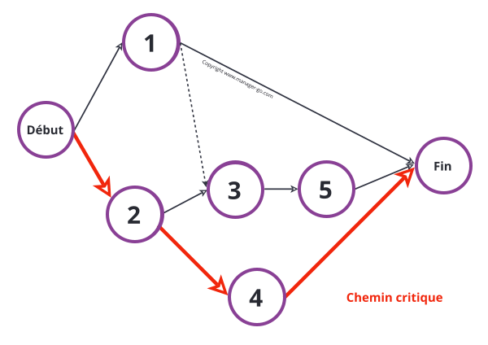

# GESTION DE PROJET

## Qu'est ce que la gestion de projet ?

Ensemble coordonné d'activités et d'actions entreprises dans le but de répondre à un besoin dans un délai déterminé en mobilisant des ressources qui lui sont allouées. - Wikipédia

La gestion de projet est l'acte de planifier, organiser et de gérer un projet afin d'atteindre un objectif ou un résultat prédéfini. 
Toutes les entreprises mettent en place des projets pour atteindre leurs objectifs à court et à long terme.

* Caractère unique

## Golden Circle 

Terme inventé par Simon Sinek. 
Il s'agit d'un outil qui permet de se poser les bonnes qustions et identifier les motivations profondes d'une entreprise, mettre le doigt sur ce qu'elle aspire vraiment à accomplir. 
Il s'agit de sa vision à long terme.

Ce concept permet de prendre du recul sur son business et regarde au-delà de la description pragmatique du produit ou du service qui est vendu. 

<a href="https://youtu.be/7dAaWweraQ4?si=ESTbn0prd80SJI0V">Conférence TED Simon Sinek - The golden Circle</a>

Il s'agit du message qu'on veut véhiculer :
* "What" : pourquoi = notre raison d'exister, quel est notre produit
* "How" : comment = la manière dont on réalise notre produit
* "Why" : pourquoi = pourquoi est-ce qu'on propose le produit "Les gens n'achètent pas ce que vous faites mais pourquoi vous le faites"

Il est important de connaître la génèse d'un projet, pourquoi le projet existe 

## Oeuvre et Ouvrage

_Ouvrage (MOA : maîtrise d'ouvrage) =_ objet du projet 
* Donneur d'ordres et commanditaire du projet
* Structure et cadre les besoins fonctionnels du proet, définit les objectifs et les contraintes

_Oeuvre (MOE : maîtrise d'oeuvre) =_ projet 
* Exécutant technique du projet
* Reponsable des choix techniques et technologiques, de la qualité des livrables

<a href="https://www.reussirsesprojets.com/moa-vs-moe/">moa vs moe</a>

## Acteurs

* Le demandeur = maître d'ouvrage (souvent le client) 
nécessite ue vision du projet détenue quelque part.
* Le maître d'oeuvre (chef de projet) 
responsable du projet qui va rendre des comptes au client

## Le triangle d'or

ce sont les trois pics fondamentaux dans la gesion de projet :
* Qualité = perf techniques, économiques, réponse aux attentes du maître d'ouvrage
* Coût = dépenses pendant la phase du projet
* Délai = dates de fin de projets et des principaux jalons

Triptyque QCD : qualité, coût, délai

=> Qualité Globale

<a href="https://www.manager-go.com/gestion-de-projet/glossaire/triangle-d-or">Triangle rapide</a>

## les 4 P de la gestion de projet

* Plan = Plannification
* Processus = Ensemble des tâches liées
* Personnes = Acteurs du projet
* Pouvoir = Hiérarchie, organigramme du projet

Ces éléments permettent d'avoir une vision sur la mise en oeuvre de la gestion d'un projet.

<a href="https://www.scribd.com/document/509735882/Les-4-P-de-la-gestion-de-projet">Pour aller plus loin</a>

## Les 5 étapes clés d'un projet

1. **Avant projet** 
    * Définition des besoins du demande
    * Formaliser les problématiques
    * Imaginer les solutions possibles
    * Questions pour comprendre la demande : 
        * Why, what, when, who, how ? 
        * Contexte

2. **Lancement**
    * Etude de faisabilité des slutions dans le contexte du projet
    * Choix de la solution
    * Gestion des risques :
        * identifier les risques :  
        brainstorming, interroger les experts, expériences collectives, rapports des bilans, analyser les problèmes, équipe dédiée ?
        * quantifier les risques (= impact du risque) :  
        gravité, probabilité, criticité (gravité x probabilité)
        * répondre aux risques (= trouver une solution) :  
        supprimer, réduire la probabilité ou la gravité, transférer (sous-traitance), partager (co-développement), accepter MAIS avec un plan de substitution
        * contrôler l'apparition 

3. **Conception**
    * Maquettage, échanges avec le client pour étudier en détails la solution choisie
    * Définir l'organisation de la réalisation (planification, tâches, etc.) 
    **Méthode SMART(E)** 
    * Spécifique et Simple : concret et facilement compréhensible
    * Mesurable : assorti d'un indicateur et d'une échéance (KPI)
    * Atteignable et Ambitieux : porteur de challenge, stimulant
    * Réaliste : réalisable, sous mon contrôle
    * Temporel : doté de plusieurs échéances
    * Economique et Ecologique : respectueux du système 

4. **Réalisation**
    * Réalisation/**Développement** du projet
    * Phase de suivi de projet : garder au mieux les idées de bases pour atteindre les objectifs définis
    * Dérouler l'ensemble des tâches
    * Conduire les réunions d'avancement 
    * Prise de décisions aux jalons (étapes clés) intermédiaires
    * Réaction en cas d'aléas
    * Gérer les modifications 
    
**PERT vs GANTT**

* _Diagramme de Gantt :_ 

L'un des outils les plus efficaces utilisé couramment en gestion de projet pour représenter visuellement l'état d'avancement des différentes activités. 

_Historique :_  
Le premier diagramme de Gant fut élaboé dans les années 1890 par l'ingénieur Polonais Karol Adamiecki dans le cadre de ses recherches en techniques de gestion et de planification. 

Ce diagramme permet de visualiser en un seul coup d'oeil :  
* les différentes tâches à envisager,  
* la date de début et fin de chaque tâche,  
* leur durée,  
* le chevauchement éventuel des tâches et la durée de chevauchement,  
* et enfin la date de début et de fin du projet dans son ensemble.

La colonne de gauche du diagramme énumère toutes les tâches à effectuer. 
La ligne d'en-tête représente les unités de temps les plus adaptées au projet (jous, semaine, mois, etc.). 
Chaque tâche est matérialisée par une barre horizontale : la poisition et la longueur représentent la date de début, la durée et la date de fin. 

<a href="https://www.gantt.com/fr/">source</a>

<a href="https://youtu.be/iJY4_gjMdQY?si=6nhj2dfOk1lWBm76">réaliser un diagramme de Gantt</a>

* _Diagramme de PERT :_ 

Il s'agit d'un outil visuel d'ordonnancement et de planification de projet. 
Son nom vient de l'accronyme : "Program Evaluation and Review Technic". 
Il a pour but d'organiser les tâches sous la forme d'un réseau afin de faciliter la gestion du projet. 
Cette représentation graphique permet d'identifier les connexions entre les différentes tâches, les temps d'exécution et les interdépendances.

Cet outil facilite la maîtrise du projet et permet de :
* donner une vue réelle de la livraison du projet
* anticiper l'affectation des ressources humaines et financières, et des moyens techniques
* identifier lestâches à traiter plus rapidement si l'on souhaite livrer le projet au plus tôt
* repérer les tâches à traiter simultanément (travail en parallèle) et les tâches antérieures
* identifier les tâches critiques et le non-critique pour tenir les délais (redéployer les ressources si nécessaire)
* préparer la construction d'un planning de Gantt
* affecter des responsabilités

Le diagramme s'organise sous forme de réseau. Il possède un début et une fin, des étapes et des tâches. 
Les tâches sont représentées par des flèches encadrées par 2 étapes (noeuds). 
Chaque étape possède une date au plus tôt et une date au plus tard.

Etapes pour créer un PERT :
* préparer les tâches
* construire le réseau en reliant les tâches entre elles, via des étapes
* indiquer les dâtes au plus tôt
* renseigner les dates au plus tard
* calculer les marges des tâches (degré de liberté pour les retards)
* définition du chemin critique

<a href="https://www.manager-go.com/gestion-de-projet/dossiers-methodes/construire-un-reseau-pert">source</a>

* _le Chemin Critique :_ 

Lors de la construction d'un diagramme de PERT, le chemin critique représente la séquence de tâches ne disposant d'aucune marge : 
Il n'existe aucune flexibilité entre la tâche précédente et la suivante. Il s'agit du délai incompressible pour réaliser le projet.

C'est un élément de gestion prévisionnel qui permet de maîtriser les étapes clés et les deadlines. 
Il s'agit d'un outil central pour la mise en oeuvre d'un PERT. L'étape fianle pour le chef est de disposer d'un outil de planification efficace et pertinent. 
Le repérage et le tracé du chemin critique permettent notamment de :
* identifier les leviers de réduction des délais (tâches prioritaires) pour prendre les mesures nécessaires pour agir.
* prévenir les dérapages et maîtriser les risques.
* évaluer les scénarios en testant les différentes combinaisons sur une échelle de temps pour analyser les impacts sur la durée du projet en identifiant les marges et chaque chemin critique.

<a href="https://www.manager-go.com/gestion-de-projet/glossaire/chemin-critique">source</a>

**_En résumé :_** 
Pour gérer un projet correctement, il est conseillé de procéder par 3 étapes :
* Réaliser un diagramme de PERT 
* Identifier le chemin critique
* Construire un planning Gantt

**_Matrice d'Eisenhower_**

C'est une méthode d'organisation qui permet de classer les tâches en fonction de leur degré d'importance et donc de hiérarchiser les priorités. 
Cette méthode a été conceptualisée par le président des USA Dwight D. Eisenhower lors d'un discourds en 1954. 

<a href="https://asana.com/fr/resources/eisenhower-matrix">source</a>

5. **Bilan**

Se fait à la livraison du produit ou a la réalisation des objectifs décidés en amont.<br<>>
Permet de voir si tout a été atteint, si certaines choses sont à revoir. 

_Objectifs :_
* Libérer les acteurs du projet (des tâches et émotionnellement)
* Engager de actions d'amélioration
* Déterminer les éléments à retenir pour de futurs projets pour l'amélioration de leur conduite

_Contenus :_
* Points positifs
* Difficultés rencontrées (méthode, contenu, charges de travail)
* Analyse du point de vue du maître d'ouvrage
* Analyse de rentabilité

_Participants :_
* Maître d'ouvrage, chef de projet, équipe de projet et tierce personne extérieure
* A faire en fin de projet : objectifs atteints vs abandon

## Quel est le plus important dans un projet ?

La communication et la perception :

## Les principales méthodes

### La méthode en Cascade

#### Historique

Formalisé en 1970 parn Dr. Winston W. Royce. 
Populaire dans les secteurs de la défense, l'aéronautorique et des parties de gouvernement. 
Permet au clients et aux investisseurs d'avoir plus de clarté sur l'avancement d'un projet et les coût à prévenir. 
Critiqué pour son manque de flexibilité et son incapacité à gérer efficacement les changements de spécifications en cours de route.

#### Dans quel cas l'utiliser ?

Projets avec une approche linéaire. 
Plusieurs étapes distinctes , successives, tributaires qui ne peuvent s'effectuer que si la précédente a été réalisée. 

<a href="https://www.gryzzly.io/fr/blog/methode-cascade/">méthode cascade</a>

1. définition des exigences
2. Analyse des besoins
3. Conception 
4. Codage
5. Tests 
7. Opérations : déploiement et maintenance

#### Les acteurs

* Chef de projet : définition des objectifs, assure la coordination, la planification et le suivi du projet
* Sponsors : Soutien au chef de projet, fournis les ressources
* Client : commanditaire, suit les étapes du projet
* Parties prenantes internes : membres de l'organisation ou de l'entreprise impliqués dans le projet
* Commité de pilotage : Définit les stratégies et s'assure 
* Consultants : experts externes qui donnent leur avis  et expertise sur le projet
* Fournisseurs

#### Avantages vs Inconvénients

**Avantages** :  
* structure simple
* bonne documentation du processus de développement
* coûts et charge de travail déterminés en avance

**Inconvénients** :  
* projets coomplexes ne peuvent pas être divisés en phases
* faible marge de manoeuvre pour ajuster
* Utilisateur final intégré au processus à la fin de la mise en oeuvre
* Erreurs souvent détectées à la fin du processus de développement

#### Toyota

Utilise cette méthode de travail dans la mise en oeuvre de leurs produits

### Cycle en V

#### Historique

Développé dans les années 1980, découle de la méthode en cascade (1970). 
Appliqué dans l'industrie puis en informatique 
Remis en cause au début des années 200 par les méthodes Agiles. 

#### Définition

Méthode qui enveloppe toutes les étapes du cycle de vie d'un projet : Conception, Réalisation et Validation. 

Deux phases principales : Descendante et Ascendante. 
Ces deux phases sont découpées en 9 phases. 
Chaque phase de développement logiciel doit se conclure par une phase de test unitaire : permet de récupérer plus facilement les défaut et de les corriger.

#### Acteurs

* La MOA (dont le Maître d’Ouvrage) : le client, directions informatique, commerciale, production, recherche.
* La MOE (dont le Maître d’Oeuvre) : direction Informatique, équipe architecturale, équipe de développement.
* le Commité de pilotage.

#### Avantages vs Inconvénients

Avantages : 
* Sa méthode linéaire: 
Chaque étape de conception est associée à une étape de tests unitaires. Plus besoin de constamment revenir en arrière pour modifier les spécifications fonctionnelles du produit final.
* Mise en œuvre est simple:  
Une fois les spécifications fonctionnelles et les étapes de développement définies, chaque membre de l’équipe peut identifier ses tâches et voir où en est le produit. 
* Pas de réunion quotidienne:  
Seules quelques réunions de pilotage sont nécessaires lors du passage d’une phase à une autre.

Inconvénients:  
* Ne s’adapte pas au changement:  
Une fois l’étape de définition précise du produit réalisée par l’équipe, le cycle s’enclenche.  
Cela peut poser problème si  lto reimburse me client change sa demande pour le produit final. 
* Temps de développement prolongé:  
Prends du temps pour achever un projet par rapport aux méthodes plus itératives et flexibles.

#### 9 étapes 

Phase descendante :

1. Analyse des besoins
    * Besoins précis : permet de définir les fonctionnalités
    * Nécessaire d’allouer du temps et de réunir toutes les exigences du client
    * Phase de conception = création de tests unitaires
2. Spécifications (= Conception du système)
    * Création d’un document contenant les spécifications fonctionnelles du produit
    * Ce document contient tous les composants techniques (= création du design pour l’ensemble du système)
    * Mise au point de tests unitaires du système
3. Conception architecturale (= Conception générale)
    * Rédaction des spécifications fonctionnelles sur l’intégration du programme
    * Spécification si on connecte via une intégration interne ou externe
    * Création de tests d’intégration
4. Conception détaillée
    * Concerne la façon dont sera mise en oeuvre la logique fonctionnelle codée du produit final
    * Spécifications des composants, modèles et interfaces 

Mi-projet :

5. Codage
    * Moitié du Cycle en V
    * Mise en oeuvre et codage
    * Transformation des documents de spécification et de conception en un système codé et fonctionnel = Processus de développement logiciel 
    Mise en oeuvre des composants et du logiciel comme défini lors de la phase de conception 
    Cette étape est la création et l’assemblage de tous les composants nécessaires pour arriver au produit final
    * Etape clôturée avant la phase de tests

Phase ascendante :

6. Tests unitaires (= tests des composants)
    * Exécution des tests unitaires créés pendant la phase de conception des modules = permet d’identifier et d’éliminer une partie des défauts
    * Etape la plus longue dans le Cycle en V 
    Ces tests ne permettent pas d’identifier tous les défauts qui pourraient survenir dans le système => phases suivantes 
7. Tests d’intégration
    * Servent à vérifier que le système fonctionne sur toutes les intégrations tierces (les composants)
    * Ces tests se basent sur les résultats prévus pendant la phase de conception architecturale
8. Tests de validation (= test du système) 
    * Mise en oeuvre des tests de validation créés pendant l’étape de conception du système
    * Il s’agit de tests de performance et de régression
9. Recette (= test d’acceptation)
    * Mise en oeuvre de tous les tests créés lors du stade initiale de définition des exigences
    * Réalisation des tests en environnement réel avec des données réelles
    * BUT : vérifier que le produit est prêt à être livré au client

### Cycle Itératif

#### Historique

* Mis au point dans les années 1950 : utilisé par la NASA. 
* 1968 : Centre de recherche IBM. 
* années 1970 : utilisé dans l'aérospatiale et la dégense.
* 

#### Définition

Créer, affiner et améliorer un projet de manière itérative. 
Cela passe par une création, test jusqu'à ce que les équipes soient satisfaites du résultat.

#### Mise en oeuvre

6 étapes dont 4 qui constituent le coeur :
1. Expression du besoin 
Le Client explique ce qu'il souhaite obtenir
2. Coeur du processus itératif
    * Spécification
    * Développement
    * Validation
    * Evaluation
6. Déploiement 

Les étapes 2 à 5 fonctionnent en boucle avant le déploiement

#### Avantages vs Inconvénients

Avantages : 
* Efficacité accrue
* Possibilité de travailler sur des tâches connexes en parallèle
* Risque limité à l'échelle du projet
* Retour utilisateurs plus fiables

Inconvénients : 
* Risque de dérives de projet = peut donner une portée plus grande que celle prévue initialement
* délais vagues

### Méthodes Agiles

#### Historique

EVO : première méthode AGILE en 1976. 
SCRUM : utilisé en 1996. 
2001 : Manifeste AGILE.

#### Utilisation

Utilisé principalement dans le domaine de l'informatique, puis dans les entreprises de communication/merkating. 
Facilite la plupart des projets. 

Client au centre de cette méthode, il est impliqué

#### Acteurs

* Product Owner
* Scrum master = s'assure du bon fonctionnement et est force de proposition pour franchir les obstacles
* Equipe de développement = responsable de la qualité

#### Avantages vs Inconvénients

Avantages :
* Gain de contrôle sur le produit final
* Augmente l'efficacité
* Assure des livraisons de hautes qualités
* Accroît la satisfaction des utilisateurs
* Retour sur investissement plus élevé

Inconvénients :
* Difficulté de compréhension de l'agilité
* Minimisation de la documentation dans un développement Agile
* Complexité de l'adoption de la culture Agile
* Manque de prévisibilité de l'approche Agile
* Difficulté d'implémentation pour des projets complexes et des entreprises à grande échelle

<a href="https://blog-gestion-de-projet.com/avantages-et-inconvenients-de-la-methode-agile/">source</a>

## Méthode SCRUM

Fait parti des méthodes Agile la plus utilisée. Se déroule comme suit :
* Production backlog
* Sprint backlog
* Iération (lancement du projet) :
    * Sprint de 2 à 4 semaines avec des réunions journalières (daily stand up)
* Livrable en production

