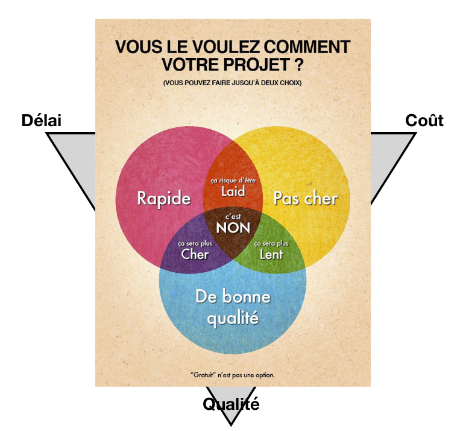
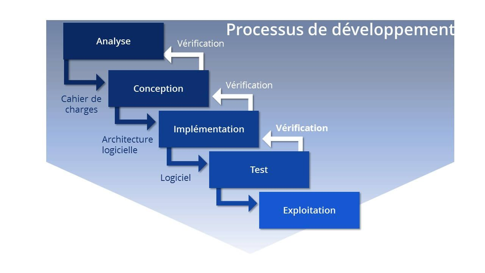
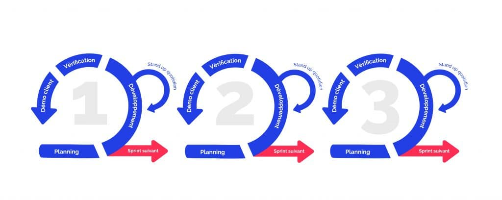
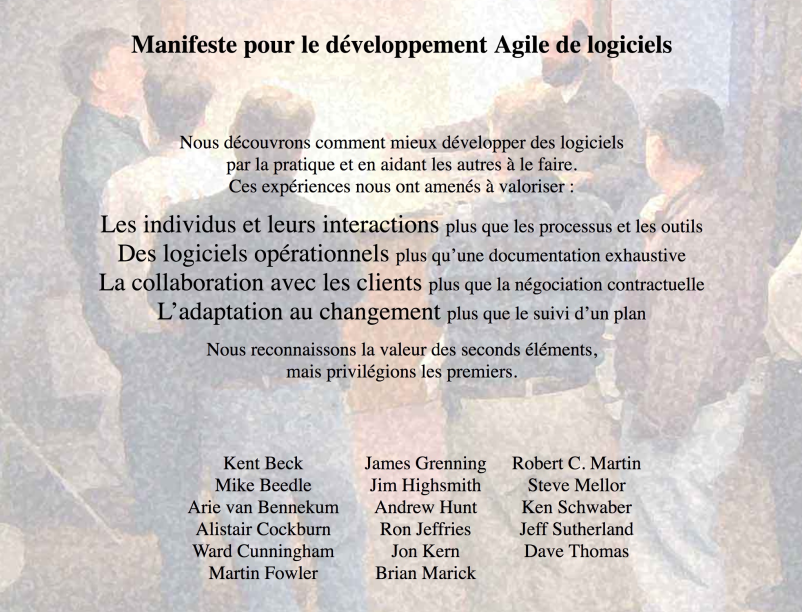
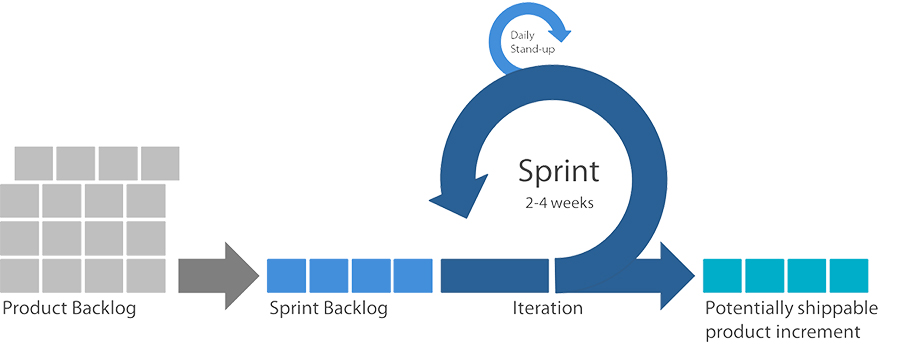
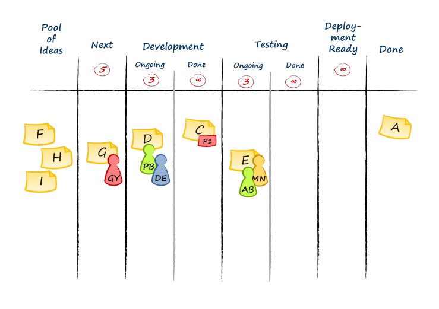
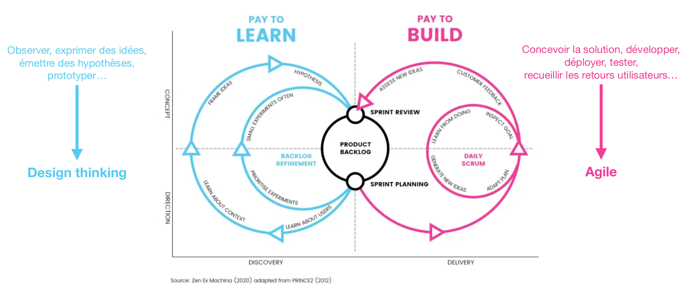
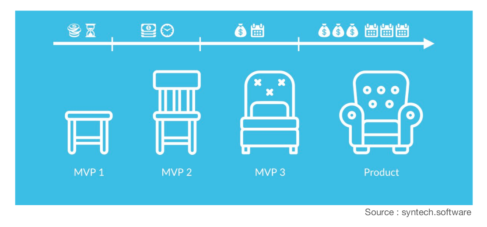

# LES METHODES AGILES

## PARTIE I

### A. LE PROJET/PRODUIT

**_Un projet_** est calé dans le temps, il a un début, une fin, et un planning. 
**_Un produit_**, quant à lui, n'a pas de limite de temps définie.

#### Comment définir un projet/produit ? 
1. on part d'un **besoin** (un cahier des charges, parfois une phrase...)
2. on a des **parties prenantes** (clients, collaborateurs, fournisseurs...)
3. on établit un **planning**
4. ...un **budget**
5. et des **livrables**

### B. Le triangle qualité / coût / délai

Dans ce triangle, on a deux choix possibles :
* Un produit de bonne qualité et rapide => il sera plus cher
* Un produit de bonne qualité et pas cher => prend plus de temps
* Un produit réalisé rapidement et pour peu de coûts => il sera de moins bonne qualité

* Rapide, pas cher et de bonne qualité => n'existe pas

### C. Conduit de projet digital

Le développement informatique prend sa source dans la deuxième partie du vingtième siècle : 
Conquête spatiale, avancée militaire, avancée technologique...

Il existe deux approches opposées qui coexistent dans la conduite d'un projet : 
1. Le mode "cascade" (ou "cycle en V")

   * définition du projet
   * création du projet
   * lancement du projet
   * retour 
=> risque grandissant au cours du temps de création du projet
2. Le mode "Agile" (ou "itératif")

   1. première phase
      * définition
      * création
      * lancement
      * retour
   2. deuxième phase
      * définition
      * création
      * lancement
      * retour
   3. troisième phase
      * etc. 
=> risque amoindris au cours du temps

La prise d'ampleur de la technologie et des logiciels dans la vie de tous les jours implique une augmentation de la complexité dans leur réalisation. 
La méthode en cascade utilisée à l'origine ne permet pas l'anticipation de besoins supplémentaires. 
L'approche itérative (agile) apporte une solution qui évolue au cours du temps : 
le design et le développement se font à chaque itération.

### D. COMMENT DEFINIR DANS QUELLE METHODE ?

=> se poser la question : Y a-t-il des livrables intermédiaires ?

### E. ORIGINES : 2001

AGILE MANIFESTO : Manifeste pour le dévelopemment Agile de logiciels

"Nous découvrons comment mieux développer des logiciels par la pratique et en aidant les autres à le faire. 
Ces expériences nous ont amenés à valoriser : 
Les individus et leurs interactions plus que les processus et les outils 
Des logiciels opérationnels lus qu'une documentation exhaustive 
La collaboration avec les clients plus que la négociation contractuelle 
L'adaptation au changement plus que le suivi d'un plan. 

Nous reconnaissons la valeur des seconds éléments, mais privilégions les premiers."

### F. SCRUM

* Méthode Agile = "entreprise friendly"
  1. Production backlog = alimente chaque itération : liste de tout ce qu'il y a à faire de manière ordonnée
  2. Sprint Backlog = liste de ce qu'il y a à faire durant le sprint
  3. Itération = lancement du sprint
  4. Sprint (2 - 4 weeks) + daily stand-up = 2 à 4 semaines de développement, avec des rapports journaliers (10-15 minutes) : 
ce qui a été fait hier, ce qui a posé de la difficulté, ce qui sera fait dans la journée.
  5. Potentially shippable product increment = livrable en production

* Souvent utilisé conjointement avec d'autres méthodologies de travail ou de développement

### G. LE LEAN

Apporté par Toyota dans leur chaîne de production

LEAN manufacturer = minimalisation des 3M :
* MUDA (gaspillage)
* MURA (irrégularité)
* MURI (excès)

Le but est de réduire le superflu dans la chaîne de production et d'optimiser.

### H. LE KANBAN (= Trello)

* Inspiré du Lean 
* Limite le Work in progress 
* Applicable à peu près partout.

### I. METHODES AGILES ET DESIGN THINKING

Ce sont deux approches incrémentales centrées sur l'utilisateur. 
Le design thinking est fait en amont de la méthode agile. 
Le but est d'observer, exprimer des idées, émettre des hypothèses et prototyper pour répondre à un besoin client.
Cette étape permet d'alimenter le product backlog.

### J. LE "MINIMUM VIABLE PRODUCT"

Le MVP est le livrable finalisé le plus petit qui est présentable et qui apporte de la valeur au client. 
Le MVP s'inscrit dans un projet global. Il donne "du grain à moudre" au client, pour obtenir un retour en vue d'une amélioration. 
Le but est d'avoir quelque chose de tangible, rapidement en production pour être utilisé.

### K. POUR BIEN DEMARRER EN AGILE

Définir ce que doit contenir le MVP.1

La vision produit = AKA "ze prodeuct vigionne"

* Une vision partagée et comprise par tous
* L'ADN du produit / de l'entreprise, ce qui ne change pas dans le temps
* Incarne les objectifs sur le long terme
* Englobe le "quoi", le "qui" ou encore le "pourquoi", mais pas le "comment"