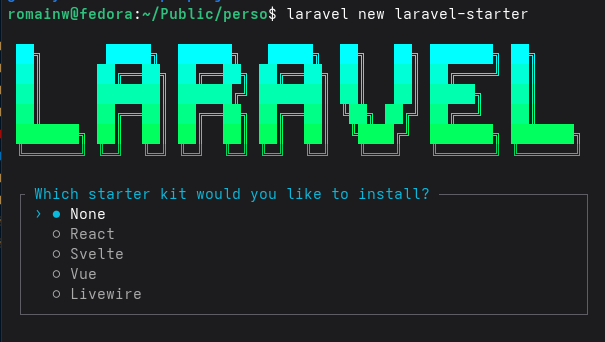
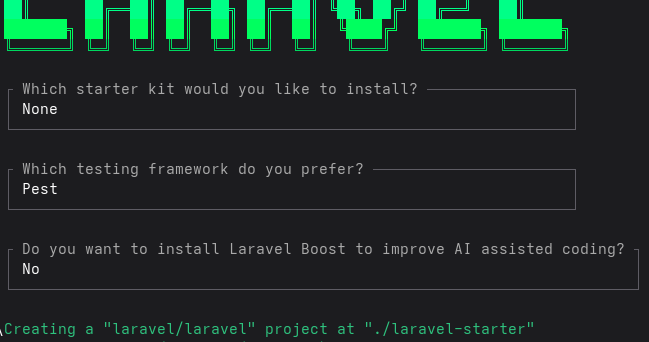
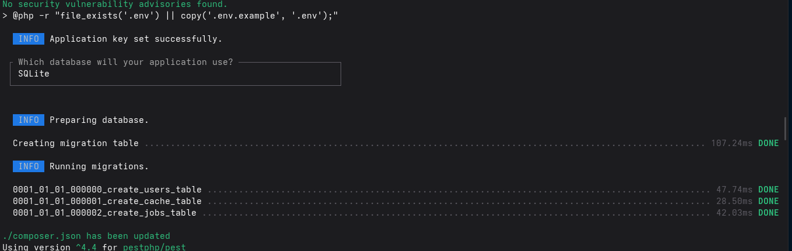
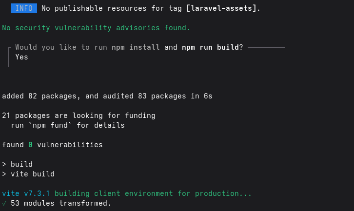
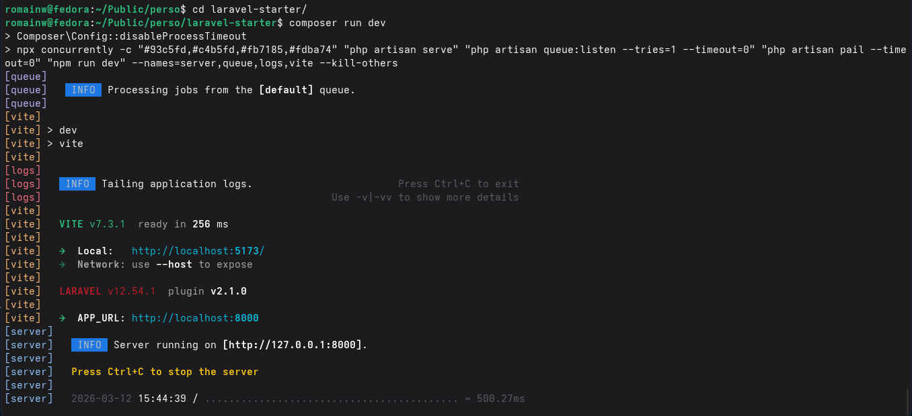

# INSTALLATION

On va suivre la [documentation officielle](https://laravel.com/docs/12.x)

## Prérequis

- `PHP` installé sur l'ordinateur
- `Composer`
- `Node` et `Npm`

Il faut également tout ce qui permet de faire tourner un serveur php :

- `Apache`
- `Nginx`
- etc.

On aura besoin aussi d'un SGBD (Système de Gestion de Bases de Données). ex : POSTGRESQL, MARIADB, etc.

## Solutions possibles

1. Installer soi-même PHP, Apache, Composer, etc.
2. Utiliser un outil comme :

- WAMP (W = Windows, A = Apache, M = MySQL/MariaDB, P = PHP),
- XAMP (X = cross, A = Apache, M = MariaDB, P = PHP)
- MAMP (M = Macintosh, A = Apache, M = MySQL/MariaDB, P = PHP)

3. Utiliser Docker (Notamment avec Laravel Sail)
4. Utliser Laravel Herd => on installe cet outil unique qui se charge d'installer tout le reste (uniquement valable sous windows ou macos)

Pour plus de simplicité, Laravel Herd reste la meilleure option

## Solution avec Composer

Laravel utilise **Composer** comme gestionnaire de dépendances PHP. C'est l'équivalent de `npm` pour Node.js : il permet d'installer, mettre à jour et gérer les bibliothèques dont le projet a besoin.

### Installer Composer

Se rendre sur [getcomposer.org](https://getcomposer.org/) et suivre le guide d'installation selon son OS.

Pour vérifier que Composer est bien installé :

```bash
composer --version
```

### Installer l'installateur Laravel

Une fois composer installé, on va faire la commande suivante pour installer Laravel :

```bash
composer global require laravel/installer
```

### Créer un nouveau projet

On pourra ensuite créer un projet laravel en utilisant cette commande
(attention au répertoire ou on crée le projet !):

```bash
laravel new <nom-du-projet>
```

L'installeur pose plusieurs questions interactives :

- Choix d'un **starter kit** (Breeze, Jetstream, etc.) => choisir `none` pour partir de zéro
- Activation de **Laravel Boost** (assistance IA) => optionnel
- Choix de la **base de données** (MySQL, PostgreSQL, SQLite, etc.)
- Installation automatique des **dépendances npm**

### Lancer le projet

Se placer dans le répertoire du projet :

```bash
cd nom-du-projet
```

Installer les dépendances front-end et compiler les assets :

```bash
npm install && npm run build
```

Lancer le serveur de développement (lance à la fois le serveur PHP et Vite pour le hot-reload) :

```bash
composer run dev
```

L'application est alors accessible sur `http://localhost:8000`

#### Alternative : lancer uniquement le serveur PHP

Si on ne travaille pas sur le front-end, on peut utiliser uniquement :

```bash
php artisan serve
```

### Captures d'écran de l'installation

Voici les étapes lors de la création d'un projet :

```bash
laravel new example-app
```

Choisir `none` pour le starter kit :


Laravel Boost (assistance IA) :


Choix de la base de données :


Installation des dépendances npm :


Lancement du serveur avec `composer run dev` :


## Solution Laravel Herd

Laravel Herd est un outil "tout-en-un" qui installe et configure automatiquement l'environnement de développement Laravel (PHP, serveur, etc.) en quelques clics.

**Disponibilité :** uniquement sur **macOS** et **Windows** (non disponible sur Linux)

### Ce que Herd installe automatiquement

- PHP (plusieurs versions disponibles)
- Nginx (serveur web)
- Composer (gestionnaire de dépendances PHP)
- Node.js / npm

### Avantages

- Installation simple et rapide, sans configuration manuelle
- Gestion de plusieurs versions de PHP en parallèle
- Les sites sont automatiquement accessibles via un domaine `.test` (ex: `mon-projet.test`)
- Pas besoin de lancer/arrêter des serveurs manuellement

### Utilisation

Une fois Herd installé, il suffit de placer le projet dans le répertoire `~/Herd/` pour qu'il soit automatiquement servi.

```bash
# Créer un nouveau projet dans le bon répertoire
cd ~/Herd
laravel new mon-projet
```

## Artisan

Laravel propose un CLI (Command Line Interface) nommé **Artisan**.

Cette interface permet de lancer des commandes spécifiques à Laravel :

- Vider le cache
- Créer des fichiers (Model, Controller, Migration, Middleware, etc.)
- Lancer des migrations
- Interagir avec l'application via un REPL (tinker)
- etc.

Il existe environ 150 commandes natives. Pour obtenir la liste complète :

```bash
php artisan list
```

Pour obtenir de l'aide sur une commande spécifique :

```bash
php artisan help <nom-de-la-commande>
# ex: php artisan help make:controller
```

### Les commandes les plus utilisées

| Commande                       | Description                                                 |
| ------------------------------ | ----------------------------------------------------------- |
| `php artisan serve`            | Lance le serveur de développement                           |
| `php artisan migrate`          | Exécute les migrations en attente                           |
| `php artisan migrate:rollback` | Annule la dernière migration                                |
| `php artisan migrate:fresh`    | Supprime toutes les tables et relance toutes les migrations |
| `php artisan db:seed`          | Exécute les seeders (données de test)                       |
| `php artisan cache:clear`      | Vide le cache de l'application                              |
| `php artisan config:clear`     | Vide le cache de la configuration                           |
| `php artisan route:list`       | Affiche la liste de toutes les routes                       |
| `php artisan tinker`           | Ouvre un REPL pour interagir avec l'application             |

### La commande `make`

La famille de commandes `make` permet de générer automatiquement des fichiers dans le bon répertoire, avec le bon nom et la bonne structure de base.

```bash
php artisan make:model Article
php artisan make:controller ArticleController
php artisan make:migration create_articles_table
php artisan make:middleware CheckAge
php artisan make:seeder ArticleSeeder
php artisan make:policy ArticlePolicy
```

> **Astuce :** pour un Model, on peut tout générer en une seule commande avec les flags :
>
> ```bash
> php artisan make:model Article -mcr
> # -m => migration, -c => controller, -r => resource (CRUD)
> ```

### Création d'une commande personnalisée

Il est également possible de créer ses propres commandes.
Par exemple :

- une commande qui lance un script de synchronisation
- une commande qui génère un export
- etc.

Ces commandes sont des classes stockées dans le dossier `app/Console/Commands`.
Pour en créer une :

```bash
php artisan make:command SendEmails
```

La classe générée contient deux propriétés à définir :

- `$signature` : le nom de la commande tel qu'on l'appellera (ex: `emails:send`)
- `$description` : description affichée dans `php artisan list`

Et une méthode :

- `handle()` : contient la logique exécutée lors de l'appel de la commande

```php
class SendEmails extends Command
{
    protected $signature = 'emails:send';
    protected $description = 'Envoie les emails en attente aux utilisateurs';

    public function handle(): void
    {
        // logique de la commande
    }
}
```

On pourra ensuite l'appeler avec :

```bash
php artisan emails:send
```

## Le fichier .env et la configuration

Toute application a besoin d'une configuration adaptée à son environnement.
Cette configuration sera différente selon les contextes : local, préprod, production, test...

Par exemple, le mot de passe de la base de données en local sera différent de celui utilisé en production.

### Les fichiers de configuration

Laravel centralise sa configuration dans le dossier `/config`, avec des fichiers comme :

- `database.php` - configuration des bases de données
- `mail.php` - configuration de l'envoi d'emails
- `session.php` - configuration des sessions
- `cache.php` - configuration du cache
- etc.

Ces fichiers contiennent des tableaux PHP servant à la configuration. Mais comme ils sont uniques, comment différencier les environnements ?

### Le fichier `.env`

On dispose d'un fichier `.env` **par environnement**. C'est lui qu'on modifie, et ses valeurs sont injectées dans les fichiers du dossier `/config` via la fonction `env()`.

Le fichier `.env` contient une liste de paires `KEY=value` :

```
APP_NAME=MonApplication
APP_ENV=local
APP_DEBUG=true
APP_URL=http://localhost

DB_CONNECTION=mysql
DB_HOST=127.0.0.1
DB_PORT=3306
DB_DATABASE=ma-db-laravel
DB_USERNAME=root
DB_PASSWORD=passwordRoot
```

> **Important :** ne jamais versionner le fichier `.env` dans le dépôt distant. Il contient des données sensibles (mots de passe, clés d'API, etc.). Il est listé dans le `.gitignore` par défaut dans Laravel.

### La fonction `env()`

Laravel fournit la fonction `env()` pour lire les valeurs du `.env`. Elle accepte un deuxième argument comme valeur par défaut si la clé est absente :

```php
env('DB_HOST', '127.0.0.1')  // retourne '127.0.0.1' si DB_HOST n'est pas défini
```

C'est ainsi que les données du `.env` alimentent les fichiers `/config` :

```php
// /config/database.php
return [
    'connections' => [
        'mysql' => [
            'driver'   => 'mysql',
            'host'     => env('DB_HOST', '127.0.0.1'),
            'port'     => env('DB_PORT', '3306'),
            'database' => env('DB_DATABASE', 'laravel'),
            'username' => env('DB_USERNAME', 'root'),
            'password' => env('DB_PASSWORD', ''),
        ],
    ],
];
```

> **Bonne pratique :** dans le code applicatif, préférer la fonction `config()` plutôt que `env()` directement. `env()` ne fonctionne plus après avoir mis la configuration en cache (`php artisan config:cache`).
>
> ```php
> config('database.connections.mysql.host') // ✅ recommandé
> env('DB_HOST')                             // ⚠️ à éviter dans le code métier
> ```

### Le fichier `.env.example`

Puisque le `.env` n'est pas versionné, Laravel fournit un fichier `.env.example` qui sert de modèle.
Ce fichier **est** versionné : il liste toutes les clés nécessaires au projet, sans les valeurs sensibles.

Lors de l'installation d'un projet existant :

```bash
cp .env.example .env
php artisan key:generate  # génère l'APP_KEY, indispensable au chiffrement
```

Il suffit ensuite de remplir les valeurs manquantes (BDD, etc.).

### Connaître l'environnement courant

La valeur `APP_ENV` dans le `.env` définit l'environnement courant (`local`, `production`, `staging`, etc.).

Pour y accéder dans le code :

```php
App::environment('production')         // true si APP_ENV=production
App::environment(['local', 'staging']) // true si l'un des deux correspond
```

Exemple concret - empêcher l'indexation hors production :

```php
<meta name="robots" content="{{ App::environment('production') ? 'index,follow' : 'noindex,nofollow' }}">
```

### Mettre la configuration en cache

En production, on peut mettre la configuration en cache pour de meilleures performances :

```bash
php artisan config:cache   # met en cache tous les fichiers /config
php artisan config:clear   # vide le cache de configuration
```

> **Attention :** après toute modification du `.env`, penser à vider le cache avec `php artisan config:clear`, sinon les nouvelles valeurs ne seront pas prises en compte.

# Résumé - Installation Laravel

## Prérequis

PHP, Composer, Node/npm + un serveur web (Apache/Nginx) + un SGBD (MySQL, PostgreSQL, etc.)

## Solutions d'installation

| Solution              | OS                 | Simplicité |
| --------------------- | ------------------ | ---------- |
| Installation manuelle | Tous               | ⭐         |
| WAMP / XAMPP / MAMP   | Win/Mac            | ⭐⭐       |
| Docker + Laravel Sail | Tous               | ⭐⭐⭐     |
| **Laravel Herd**      | Win/Mac uniquement | ⭐⭐⭐⭐   |
| **Composer**          | Tous               | ⭐⭐⭐     |

## Création d'un projet avec Composer

```bash
composer global require laravel/installer  # installer Laravel une seule fois
laravel new mon-projet                     # créer le projet
cd mon-projet
npm install && npm run build               # dépendances front-end
composer run dev                           # lancer le serveur (PHP + Vite)
```

## Artisan - CLI de Laravel

```bash
php artisan list                        # liste toutes les commandes
php artisan help <commande>             # aide sur une commande
php artisan serve                       # lancer le serveur PHP
php artisan migrate                     # exécuter les migrations
php artisan make:model Article -mcr     # générer Model + Migration + Controller
php artisan tinker                      # REPL interactif
```

## Fichier .env

- Un `.env` par environnement (local, staging, production)
- **Ne jamais le versionner** (données sensibles)
- Copier `.env.example` → `.env` lors de l'installation d'un projet existant
- Les valeurs sont lues via `env()` et injectées dans les fichiers `/config`
- Préférer `config('clé')` plutôt que `env()` dans le code applicatif

```bash
cp .env.example .env
php artisan key:generate   # générer l'APP_KEY
php artisan config:clear   # vider le cache après modification du .env
```
