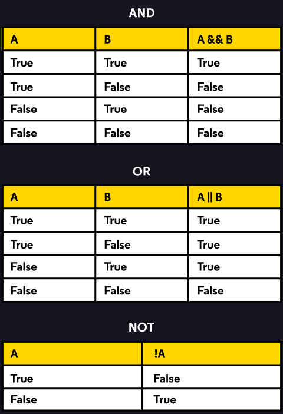

# Les opérateurs conditionnels

## INTRODUCTION

Java inclut des opérateurs qui n'utilisent que des valeurs booléennes.<br>
Ces opérateurs conditionnels permettent de simplifier les expressions contenant des relations booléennes complexes en réduisant plusieurs booléens à une seule valeur : `true`ou `false`.

Par exemple, si on souhaite exécuter un bloc de code seulement si des multiples conditions sont vraies ?<br>
Pour cela, on peut utiliser l'opérateur _AND_ : `&&`.<br>
Ou alors, si on souhaite exécuter un bloc de code seulement si une seule parmi de multiples conditions est vraie ?<br>
Pour cela, on peut utiliser l'opérateur _OR_ : `||`.<br>
Et pour finir, on peut produire la valeur opposée, où `true` devient `false` et inversement.<br>
Pour cela, on utilise l'opérateur _NOT_ : `!`.<br>



## L'opérateur conditionnel AND : &&

L'opérateur `&&` est utilisé entre deux valeurs booléennes et renvoie une seule valeur booléenne.<br>
Si les valeurs des deux conditions sont `true`, alors la valeur de résultat sera `true`.<br>
Sinon, le résultat est `false`.

## L'Opérateur conditionnel OR : ||

L'opérateur `||` est utilisé entre deux valeurs booléennes et renvoie une seule valeur booléenne.<br>
Si au moins une des deux valeurs est `true`, alors la valeur de résultat sera `true`.<br>
Sinon, le résultat est `false`.

Dans certaines occasions, le compiler détermine la valeur de vérité d'une expression logique uniquement en évaluant le premier opérateur booléen.<br>
Cette évaluation est connue sous le nom de _"short-circuited evaluation"_.<br>
Ce genre d'évaluation ne fonctionne qu'avec les expressions qui utilisent `&&` et `||`.

## L'Opérateur logique NOT : !

L'opérateur _unaire_ `!` fonctionne sur une seule valeur.<br>
Cet opérateur évalue le booléen opposé auquel il est appliqué.<br>
NOT est utile pour exprimer clairement notre intention dans un programme.<br>
Par exemple, nous avons parfois besoin du comportement opposé d'un `if-then` : exécuter un bloc de code seulement si la condition est `false`.

## Combiner les opérateurs conditionnels

Il est possible d'étendre les expressions booléennes en utilisant de multiples opérateurs conditionnels en une seule expression.<br>
exemple : 
```
boolean foo = true && !(false || !true)
```
Comment fonctionne l'évaluation de l'expression dans le compiler ?<br>
Il y a un ordre d'évaluation des opérateurs conditionnels :
1. Les conditions placées entre parenthèses : `()`
2. NOT : `!`
3. AND : `&&`
4. OR : `||`

exemple : 
```
true && !(false || !true)
```
D'abord, on évalue `(false || !true)`: 
* On évalue `!true` : le résultat de cette expression est `false`.<br>
* On peut ensuite évaluer la comparaison de `false` avec `!true` (`false`) : qui résulte à `false`.<br>

Cela résulte à la simplification de notre expression de base : `true && !false`.<br>
Comme `!false` revient à dire `true`, on évalue en réalité : `true && true`.<br>
La valeur de `foo` est donc `true`.

## En résumé

Les opérateurs conditionnels fonctionnent sur les valeurs booléennes pour simplifier le code.<br>
Ils sont souvent combinés avec des expressions conditionnelles pour consolider la logique de branche.<br>

* L'opérateur AND `&&` retourne `true` si les deux expressions sont `true`.
* L'opérateur OR `||` retourne `true` si au moins l'une des deux expressions est `true`.
* L'opérateur logique NOT `!` évalue la valeur opposée à laquelle il est appliqué.