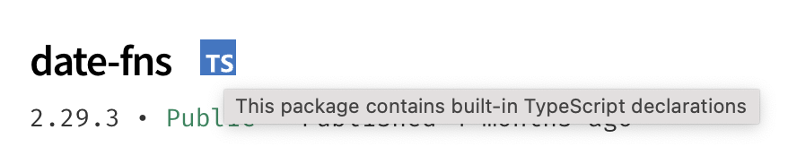
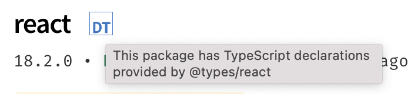
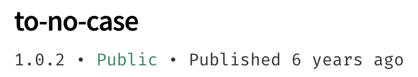

# TYPESCRIPT

## Typescript, c'est quoi ?

Tout d'abord, un point sur JavaScript : un langage qui ne se préoccupe que très peu du type des variables.<br>
C'est un ce qu'on appelle **un langage faiblement typé**.<br>
Ce qui en fait un langage très souple mais peu robuste.<br>
Par exemple, on peut additionner des nombres avec des chaînes de caractères.<br> 
Cela n'a que très peu de sens, mais c'est possible en JS.

TypeScript est quand à lui **un langage fortement typé**. C'est à dire qu'on devra déclarer le type de la variable au moment de sa déclaration.<br>
Cela permet de faire des vérification des types qu'on manipule. C'est une couche de sécurité qui permet de prévenir les erreurs éventuelles.<br>

Grâce à cette rigueur, les problèmes liés aux types ne sont plus possibles puisque TS indique en avance que le code risque de ne pas fonctionner comme prévu.<br>

TypeScript est tout simplement du javaScirpt dans un cadre plus sécurisé.<br>
il s'agit en fin de compte de JavaScript avec des fonctionnalités en plus.<br>
C'est un **superset** de JavaScript.


### Ecrire du TypeScript pour le web 

JavaScript est lu naturellement par le navigateur.<br>
Ce navigateur n'est pas capable de gérer du TypeScript.<br>

Il faudra donc transformer nos fichiers TS en JS. On utilise un outil qui fait cette transformation via une opération de **compilation**.

Le but de TypeScript est de pouvoir écrire du code plus solide en indiquant clairement les intentions à l'aide de types.

### Inconvénients 

1. **Une nouvelle technologie à apprendre**<br>
Même s'il s'agit de JavaScript, il s'agit d'une nouvelle technologie à apprendre.<br>

2. **Une complexité supplémentaire à appréhender**<br>
Il faut compiler les fichiers TS en JS pour qu'ils soient lus par le navigateur.<br>
Il y a un intermédiaire entre le code écrit et le code exécuté.<br>
Cela signifie aussi que les tests dans la console du navigateur ne pourra plus se faire comme avec du JS.<br>
Certains outils comme _ESLint_  js soit installé sur la machine.<br>

```bash
npm --version
```

sur Linux 

```bash
sudo apt update

sudo apt install nodejs

nodejs -v

sudo apt install npm
```

ATTENTION : Si la version de node n'est pas la LTS et qu'on arrive pas à l'installer sur Linux,<br> 
suivre les instructions sur ce repo git :<br>
https://github.com/nvm-sh/nvm#installing-and-updating<br>
On utilisera le gestionnaire de version de node : nvm afin d'installer, upgrade et utiliser une version de node souhaitée.<br>

Une fois Node.js installé, créer un nouveau dossier où on le souhaite dans l'ordinateur, y entrer et y lancer un terminal.<br>

```bash
npm init -y
```
Cette commande génère un projet TypeScript à la racine du dossier.<br>
Un fichier package.json sera généré, on pourra par la suite installer TypeScript :<br>

```bash
npm install --save-dev typescript
```

## Utiliser typescript

Nous allons ensuite créer un fichier _'mon-fichier.ts'_ dans lequel on écrira un peu de code en TS.<br>

Dans ce fichier on écrira du code en TS, puis on lancera la commande :

```bash
npx tsc mon-fichier.ts
```

Cette commande permet de compiler le code TS dans un fichier JS afin qu'il puisse être lu par le navigateur.<br>

N.B. : afin de compiler dans la dernière version de JS, on utilisera '--target es6' dans la commande :
```bash
npx tsc mon-fichier.ts --target es6
``` 

### Ajouter des types à JavaScript :

Pour déclarer une variable en TS, on utilisera la syntaxe suivante :<br>
mot clé + maVariable: type = valeur<br>

```javascript
let maVariable: number = 10;
```
Pour indiquer un type, la syntaxe principale est le caractère **' : '**, suivi du type souhaité.<br>

TypeScript propose trois types basiques _(primitifs)_ :
* **number** (pour les nombres)
* **string** (pour les chaînes de caractères)
* **boolean** (pour les valeur _true_ et _false_)

ATTENTION à la casse : number et Number sont deux types diférents.<br> 
Il faut utiliser les minuscules pour déclarer les variables.<br>

### TypeScript et les erreurs

L'avantage de TypeScript est qu'il nous donne des informations et nous fait remonter les erreurs.

Lorsqu'une erreur est remontée, TS nous indique <br> 
* le nom du fichier qui concerne l'erreur
* le numéro de la ligne impactée
* la colonne

ex : 
```bash
index.ts:4:25 - error TS2345:  Argument of type 'string' is not assignable to parameter of type 'number'.
```
4:32 = ligne et colonne concernée par l'erreur.<br>
error TS2345 = code de l'erreur qui permet de l'identifier.<br>
'Argument...' = description de l'erreur : TS nous indique exactement de quoi il retourne afin de pouvoir corriger l'erreur.<br>

ATTENTION, selon la complexité du code, les erreurs peuvent être plus ou moins 'cryptiques' à comprendre.<br>

l'outil : https://ts-error-translator.vercel.app/ permet de nous aider.<br>


### Typer des objets

ex : 
```TypeScript
function damage(charactereToDamage: {life: number}, amount: number): number {
    charactereToDamage.life -= amount;
    return charactereToDamage.life;
}

const result = damage({life: 100}, 12);
console.log(result);
```

Dans cet exemple : <br>
Nous avons une fonction 'damage' qui prend deux paramètres.<br>
1. charactereToDamage : une variable de type objet = la valeur est entre accolades. Cet objet contient la propriété 'life' qui est du type number.
2. amout : une variable de type number

Dans la fonction, on accède au paramètre life de l'objet charactereToDamage, auquel on soustrait un montant.<br>
On retourne le résultat : on a soustrait la valeur de amount à la valeur de charactereToDamage.life.<br>

Au moment d'appeler la fonction, on passe en paramètre les valeurs, en précisant le paramètre affecté pour l'objet.<br>

## Créer ses propres types de variables

### Définir ses types à partir d'autres types existants

TypeScript propose des types de base pour gérer les **nombres**, les **chaînes de caractères** et les **booléens**.<br>
Ce sont les types primitifs **number**, **string** et **boolean**.<br>

Afin d'avoir plus de clarté dans le code, il est possible de créer ses propres types de variables qui seront plus parlant.<br>
Par exemple, le type 'Age' sera plus parlant que numner pi Username sera pllus parlant que string.<br>

Pour créer un type, on va utiliser le mot-clé : _type_, suivi du nom qu'on va lui donner, puis on place un ' = ' suivi du type TypeScript qu'il doit avoir.<br>

```TypeScript
type Age = number;
type Firstname = string;
type Lastname = Firstname;
```
Par convention, le nom des nouveaux types sera écrit avec une majuscule en première lettre.

En réalité, ce ne sont pas de nouveaux types, mais des **alias** : des renommages de types existants.<br>
Si deux types sont l'alias d'un même autre type, alors ces deux alias seront identiques aux yeux de TypeScript.<br>

```TypeScript
// On définit deux alias Money et Age, pour qu’ils soient identiques à 'number'
type Money = number;
type Age = number;
// On définit une fonction qui s'attend à recevoir un Age (et donc un nombre)
function checkAge(ageToCheck: Age) {/*...*/}
// On appelle la fonction en lui donnant de l'argent (et donc aussi un nombre !)
const lotOfMoney: Money = 500000;
checkAge(lotOfMoney); // Money étant un nombre comme Age, TS ne voit pas d'erreur
```

#### Quel intérêt des alias ?

1. Les alias permettent de rendre le code plus clair en servant de documentation.<br>
2. Un alias peut aussi faire référence à plusieurs types :<br>
```TypeScript
type CodeSecret = string | number;
```
Ici, l'alias peut accepter deux types : string ou number.

Petite astuce : **une valeur JS peut servir de type TS valide**.<br>
c'est à dire que si on écrit 'type ten = 10', une variable de type 10 ne pourra valoir que la valeur 10.
```TypeScript
type Ten = 10;
const five: Ten = 5; // renvoie une erreur TS : Type '5' is not assignable to type '10'
const ten: Ten = 10; // OK !
```

3. Un alias permet de créer des objet complexes.

### Créer un objet complexe

ex : 
```TypeScript
type Hero = {
    life: number;
};
function damage(characterToDamage: Hero; amout: number): number
```

au lieu de passer en paramètres le contenu de l'objet : _characterToDamage: {life:number}_<br>
on va déclarer un type objet : _Hero_, qui sera passé en paramètres de la fonction.

Il est possible d'ajouter autant de propriétés que l'on veut à un objet, et chaque propriété peut avoir n'importe quel type.<br>
```TypeScript
type Pet = {
    name: string;
    life: number;
    attack: number;
    defense: number;
};
type Hero = {
    name: string;
    life: number;
    attack: number;
    defense: number;
    pet?: Pet;
};
```

à noter le '?' sur la dernière propriété de Hero. Ceci indique que "pet" est optionnel.<br>
Un objet Helo sera valide, qu'il ait un animal de compagnie ou non.<br>

Pour éviter de rendre le code répétitif, on va refactoriser ainsi :
```TypeScript
type Character = {
    name: string;
    life: number;
    attack: number;
    defense: number;
};
type Pet = Character;
type Hero = Character & {
    pet?: Pet;
};
```
Pet est un alias de Character. Le symbole & indique que le type Hero est une intersection entre le type Character et { pet?: Pet}.<br>

Une intersection indique à TS que l'on souhaite fusionner les types entre eux.<br>
Cela signifie qu'on indique à TS que Hero est un Character avec une propriété optionnelle pet, qui a pour type Pet.

#### Type ou Interface ?

le mot clé interface (très similaire à type), à la différence de type qui définit des objets et leurs propriété avec un alias,<br>
a pour but de définir une structure stricte pour un objet.<br>
Il semble donc plus correct d'utiliser interface pour définir des objets.

```TypeScript
interface Character {
    name: string;
    life: number;
    attack: number;
    defense: number;
};
type Pet = Character;
interface Hero extends Character {
    pet?: Pet;
};
```
Les syntaxes sont assez similaires et les résultats de ces deux codes sont équivalents.

N.B. : type ou interface, ces deux mots clés ne sont utilisés que dans la syntaxe TS et n'apparaîtront pas dans le code JS généré après compilation.<br>

### Manipuler des listes fortement typées 

En TypeScript, il est possible de dire à notre code qu'un tableau (Array) contiendra des données avec un type spécifique.<br>
Pour cela, on va ajouter des crochets [] à droite du type souhaité :<br>

```TypeScript
type MyArrayOfNumbers = number[]; // définition d'un tableau de nombres

const arrayOk: MyArrayOfNumbers = [1, 2, 3]; // ce tableau est OK

const arrayNotOk: MyArrayOfNumbers = [1, 'two', false]; // renvoie une erreur TS
```

Quand on manipule un tableau typé, il faut s'assurer qu'il ne contiendra que des variables du type qu'on a défini.<br>

Il existe une syntaxe alternative préférable à utiliser lorsqu'on ne connaît pas le contenu du tableau :<br>
```TypeScript
type MyArrayOfNumbers = Array<number>;
``` 

## Rendre ses types génériques 

### Donner des paramètres aux types

Les génériques sont un concept très puissant de TypeScript.<br>
Cela va permettre de rendre un type générique tel un modèle et de réutiliser ce modèle pour définir d'autres types :<br>

On va assigner au type une sorte de paramètre noté entre "< >".
Ainsi, lorsqu'on appelle ce type générique pour définir un autre type, on pourra lui passer en paramètre un type qu'on souhaite.<br>
ex 1 :
```TypeScript
type Shop<T> = { // le paramètre T est une convention. On peut utiliser ce qu'on veut : ItemType, ou unknown par exemple. Ce type est utilisable partout dans le générique
    name: string;
    items: Array<T>; // on passe le paramètre T qui est pour l'instant inconnu, mais sera défini plus tard lors de l'appel de type Shop. Il est important que le terme utilisé soit le même que celui du paramètre situé après 'Shop'.
};
type ShopOfNumbers = Shop<number>;
type ShopOfNumbers = Shop<string>;
type ShopOfNumbers = Shop<boolean>;

```
ex 2 :
```TypeScript
interface Character {
    name: string;
    life: number;
    attack: number;
    defense: number;
};
type Pet = Character;
interface Hero extends Character {
    pet?: Pet;
};
type Shop<ItemType> = { 
    name: string;
    owner: Character;
    items: Array<ItemType>; // on passe le paramètre T qui est pour l'instant inconnu, mais sera défini plus tard lors de l'appel de type Shop. Il est important que le terme utilisé soit le même que celui du paramètre situé après 'Shop'.
};
type Equipment = {
    price: number;
    attack?: number;
    defense?: numnber;
};
type Potion = {
    price: number;
    magic: number;
    attack?: number;
    defense?: numnber;
}
// Armurerie est un shop qui vend des équipements
type Armory = Shop<Equipment>;
// l'animalerie est un shop qui vend des animaux
type PetShop = Shop<Pet>;
// l'Apothicaire est un shop qui vend des potions
type Apothecary = Shop<Potion>;
```
Dans l'exemple 2, il faut bien comprendre que les trois types Armory, PetShop et Apothecary sont des alias pour les types respectifs :<br>
```TypeScript
Shop<Equipment>;
Shop<Pet>;
Shop<Potion>;
```
On préférera donc utiliser le mot clé 'interface' et refactoriser le code comme suit :
```TypeScript
interface Character {
    name: string;
    life: number;
    attack: number;
    defense: number;
};
type Pet = Character;
interface Hero extends Character {
    pet?: Pet;
};
interface Shop<ItemType> { 
    name: string;
    owner: Character;
    items: Array<ItemType>; // on passe le paramètre T qui est pour l'instant inconnu, mais sera défini plus tard lors de l'appel de type Shop. Il est important que le terme utilisé soit le même que celui du paramètre situé après 'Shop'.
};
// On va utiliser une fonction générique 
function createShop<ItemType>(name: string, owner: Character, items: Array<ItemType>;): Shop<ItemType> {
    return {name, owner, items};
}
// Appel de la fonction générique
const aromry = createShop<Equipment>('My Armory', {name: 'Bob', life: 100, attack: 1, defense: 2}, []);
```

#### Les fonctions génériques

Il n'est pas nécessaire de préciser le "paramètre type" si celui-ci est utilisé pour définir le type d'un des paramètres de la fonction.<br>
TypeScript peut le deviner lui-même.<br>

```TypeScript
// Une fonction qui retourne simplement ce qu'elle reçoit en paramètre
function returnParameter<T>(x: T): T {
    return x;
}
// Ceci fonctionne, c'est ce que nous avons vu jusque-là
const a = returnParameter<number>(1);
// Mais puisque le type "T" est utilisé pour typer le paramètre "x",
// il n'est pas nécessaire de le préciser en appelant la fonction.
// Avec la ligne ci-dessous, TypeScript devine tout seul que "T" est "number" !
const a2 = returnParameter(1);
```

Les génériques permettent aux types d'être plus facilement réutilisables.<br>
Mais cela rend le code plus complexe.<br>

### Utiliser les génériques proposés par TypeScript

Il existe toute une liste de génériques "natifs" proposés par TypeScript. `Array` en est un.<br>
En le définissant nous-meme, on pourrait l'écrire ainsi :
```JavaScript
type Array<T> = T[];
```
En plus de `Array<T>`, TypeScript propose d'autres génériques pour aider à faire des opérations courantes.<br>
Ces généraiques sont appelés **utility types** ("types utilitaires").<br>

**2 exemples :** `Partial<T>` et `Record<KeyType, ValueType>`.

Le type utilitaire `Partial<T>` prend en paramètre un type représentant un objet, et retourne un type représentant ce même objet,<br>
à la différence que toutes les propriétés de l'objet sont marquées comme optionnelles.
```JavaScript
type Character = {
    // Toutes les propriétés sont requises (elles n'ont pas le signe "?")
    name: string;
    life: number;
    attack: number;
    defense: number;
};
const myCharacter: Partial<Character> = {
    // On ne fournit que le nom, pas le reste des propriétés.
    // On n'a pas d'erreur car "Partial" rend
    // toutes les propriétés optionnelles.
    name: 'Mario';
}
```
Le type utilitaire `Record<KeyType, ValueType>` permet de définir des types d'objets.<br>
On utilisait jusqu'à présent la notation entre accolades `{}`, mais il peut être plus adapté d'utiliser le générique :
```JavaScript
// On définit un type représentant un objet dont les clés
// sont des chaînes de caractères (n'importe lesquelles)
// et les valeurs sont des nombres
type CollectionOfNumbers = Record<string, number>;
const stats: CollectionOfNumbers = {
    age: 45,
    life: 100,
    magic: 10,
    whateverTheNameItMustContainANumber: 20,
};

// On peut utiliser une union pour n'autoriser que des clés spécifiques
type StatisticNames = 'life' | 'attack' | 'defense';
const stats: Record<StatisticNames, number> = {
    life: 100,
    attack: 10,
    defense: 20,
};
```

Pour aller plus loin, voir la <a href="https://www.typescriptlang.org/docs/handbook/utility-types.html">documentation</a>.

## Utiliser un projet JavaScript dans un projet TypeScript

Une grande difficulté avec un projet codé en TypeScript concerne la gestion des librairies externes.<br>
Si le projet a pour dépendance une librairie codée en JS, TS ne peut pas reconnaître tout seul le typage de cette librairie et de ce qu'elle expose.<br>
Il faut donc le lui indiquer.

Il suffit de se poser une première question : est-ce que la librairie JS qu'on utilise définit et expose ses types TS ?

### Vérifier si des types TS sont définis pour une librairie JS donnée

Chaque dépendance qu'on installe via npm possède sa propre page sur le site de <a href="https://www.npmjs.com/">cet outil</a>.<br>
* Il suffit de chercher depuis la barre de recherche le nom de la librairie qu'on souhaite utiliser pour trouver sa page dédiée.<br>

* Une fois sur la page npm de la libraire, on va regarder l'en-tête des informations :<br>
à droite du nom de la librairie se trouve une icône bleue "TS" si des types TypeScript sont disponibles pour cette libraire :<br>

* Si à la place de ce symbole on trouve une icône blanche "DT", cela signifie que les déclarations de types peuvent être installées via NPM :<br>

* S'il n'y a aucun symbole à côté du nom de la libraire, cela signifie qu'aucun type TS n'est disponible et qu'il faudra l'écrire soi-même :<br>


En résumé, on a 3 cas possibles :
1. Soit la librairie propose déjà les types TypeScripts
2. Soit il faut les installer via NPM
3. Soit on doit les écrire nous-même

### Cas d'usage 

#### Cas n°1 : Le développeur de la librairie a déjà écrit les types de sa libairie JS

Il s'agit d'un cas idéal. S'il n'est pas possible de migrer un projet JS en TS (qu'elle que soit la raison),<br>
il reste la solution de créer un fichier `index.d.ts` à la racine du projet.<br>
```
NB. : Un fichier `.d.ts` est un fichier de définition de types.
Son but est de contenir uniquement des déclarations de types TypeScript.
On écrit dans ce fichier le typage du projet
```
Lorsque ce genre de fichier est installé à la racine du projet, TypeScript ira le lire automatiquement,<br>
et sera capable de connaître les types manipulés par la librairie.

#### Cas n°2 : Les types de la librairie JS sont disponibles dans une autre librairie

Il s'agit du cas le plus fréquent : il n'y a pas de fichier `.d.ts` directement dans le projet de librairie JS, mais il existe ailleurs.

Heureusement que la communauté JavaScript/TypeScript est très active.<br>
Le projet <a href="https://github.com/DefinitelyTyped/DefinitelyTyped">DefinedTyped</a> a pour ambition de fournir les fichiers de déclaration de types d'un maximum de librairies JS.<br>
Dans ce <a href="https://github.com/DefinitelyTyped/DefinitelyTyped/tree/master/types">dossier</a>, il y a plus de 8000 librairies déjà typées.<br>

Afin d'inclure ces définitions dans un projet, il est nécessaire de les installer via npm :<br>
```bash
npm install @types/NOM_DE_LA_LIBRAIRIE
```
par exemple, si on veut utiliser les types de la librairie React, la commande à entrer est :<br>
```bash
npm install @types/react
```
Une fois installées, TS peut prendre en compte ces nouvelles définitions, sans qu'on ait rien de plus à faire de notre côté.

#### Cas n°3 : les types de la librairie JS ne sont disponibles nulle part

Il s'agit du cas le plus rare : il va falloir créer le fichier de déclaration de types.

La bonne pratique veut qu'on mette ce genre de fichiers dans un dossier `/types`.<br>
Si on souhaite créer le typage de la librairie `to-no-case`, on va créer le fichier `/type/to-no-case.d.ts`.<br>
Dans ce fichier, on doit définit le module correspondant à notre librairie.

**Explications :**<br>
Dans un projet traditionel, les dépendances sont importées sous la forme de modules.<br>
Par exemple, la librairie `to-no-case` s'utilise ainsi :
```JavaScript
import toNoCase from 'to-no-case';
const str = toNoCase('my-string');
```
la première ligne indique qu'on importe un élément du module `'to-no-case'`.<br>

Ce module est défini dans le fichier `/types/to-no-case.d.ts`.<br>
On va donc y déclarer le module avec les mots-clés `declare module` :
```TypeScript
declare module "to-no-case" {
    // Déclaration des types ici
}
```
à l'usage, le module exporte une fonction.<br>
Il faut donc décrire la signature de cette fonction.<br>
Cela signifie qu'on ne va pas écrire le corps logique de la fonction.<br>
**Rappel : la signature d'une fonction est la combinaison "nom de la fonction + types des paramètres + type de retour".**

On va donc déclarer la signature en deux temps :<br>
1. Sans prendre en compte les types :<br>
ici, on utilise `default` pour indiquer que cet export n'est **pas** un export nommé. (voir cette <a href="https://developer.mozilla.org/fr/docs/Web/JavaScript/Reference/Statements/export">article</a> pour plus d'explications)
```TypeScript
declare module "to-no-case" {
    export default function toNoCase():unknown;
}
```
2. On va ensuite typer correctement la signature.<br>
selon la <a href="https://www.npmjs.com/package/to-no-case#api">documentation de la librairie</a>, la fonction s'attend à recevoir une `string` en paramètre, et retourne une `string` en réponse.<br>
```TypeScript
declare module "to-no-case" {
    export default function toNoCase(param: string): string;
}
```
Le typage de la librairie est maintenant terminé, il ne reste qu'à dire à TypeScript de s'en servir.<br>
Pour cela on va simplement importer le fichier qu'on vient d'écrire depuis le fichier se servant de la librairie :
```TypeScript
import './types/to-no-case.d.ts';
import toNoCase from 'to-no-case';
const str = toNoCase('my-string');
```

Il existe une solution plus robuste qui consiste à configurer TypeScript via le fichier tsconfig.json.<br>
Il faut regarder du côté de la clé de configuration <a href="https://www.typescriptlang.org/tsconfig#include">include</a> pour faire en sorte que les fichiers du dossier `./types` soient automatiquement lus par TypeScript.<br>

## POUR ALLER PLUS LOIN

* Pour créer des types plus complets, il est possible d'ajouter des <a href="https://www.typescriptlang.org/docs/handbook/2/conditional-types.html">conditions</a>.
* L'utilisation de mots-clés tels que <a href="https://www.typescriptlang.org/docs/handbook/2/conditional-types.html#inferring-within-conditional-types">infer</a> permet d'utiliser les gnériques comme de véritables fonctions intelligentes.
* On peut aussi rendre le code plus robuste grâce au <a href="https://www.typescriptlang.org/docs/handbook/2/narrowing.html">type narrowing</a> (vérification du type des variables en JS pour aider TS à analyser le code).

### Ressources utiles

* <a href="https://www.typescriptlang.org/play">Le bac à sable TypeScript</a><br>
Il permet d'écrire et tester du code TypeScript en ligne, directement depuis le navigateur. C'est un outil officiel.
* <a href="https://www.typescriptlang.org/fr/docs/handbook/typescript-from-scratch.html">La documentation officielle de TypeScript</a><br>
La documentation est la ressource numéro 1 qui permet de répondre aux questions qu'on se pose.
* <a href="https://ts-error-translator.vercel.app/">Le traduction de message d'erreurs</a> (de TypeScript à l'Anglais)<br>
Outil de traduction des erreurs remontées par TS en anglais en donnant quelques explications.
* <a href="https://marketplace.visualstudio.com/items?itemName=mattpocock.ts-error-translator">L'extension Total TypeScript</a><br>
Extension bien pratique sur VSCode. Elle donne des conseils de syntaxe et incorpore le traducteur des erreurs.
* <a href="https://grafikart.fr/formations/typescript">La formation TypeScript de Greafikart</a><br>
Une ressource très complète en français qui propose une autre façon de se former sur TypeScript.
* <a href="https://twitter.com/mattpocockuk">@mattpocockuk sur twitter</a><br>
Il s'agit DU compte twitter à suivre à propos de TypeScript. Il y a régulièrement un partage de trucs et astuces sur TS (pour débutants et avancés).