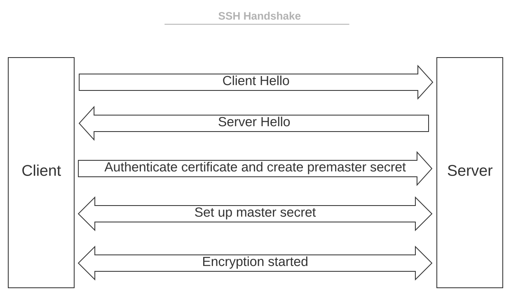

# MISE EN PRODUCTION D'UNE APPLICATION

## QU'EST CE QUE LE SSH ?

Le Secure Shell Protocol (SSH) est un protocole de réseau cryptographique permettant d'exploiter des services réseau en toute sécurité sur un réseau non sécurisé. 
Les applications les plus notables sont la connexion a distance (login) et l'exécution en ligne de commande. 

Les applications SSH sont basées sur une architecture client-serveur, connectant une instance de client SSH avec un serveur SSH. 
SSH opère en tant que suite de protocole en couches comprenant trois composants hiérarchiques :
* la couche de transport : assure l'authentification, la confidentialité et l'intégrité du serveur.
* le protocole d'authentification de l'utilisateur : valide l'utilisateur auprès du serveur.
* le protocole de connection : multiplexe le tunnel chiffré (envoie simultanément en plusieurs flux d'informations (ou signaux) sur une même liaison de communication sous forme d'un signal unique et complexe) en plusieurs canaux de communication logiques.

SSH a été designé sur des systèmes d'environnement Unix, en remplacement de **Telnet** (<a href="https://en.wikipedia.org/wiki/Telnet">Teletype Network</a>) 
et pour les protocoles shell Unix distants non sécurisés tels que le Berkeley **Remote Shell** (<a href="https://en.wikipedia.org/wiki/Remote_Shell">rsh</a>) 
et les protocoles <a href="https://en.wikipedia.org/wiki/Berkeley_r-commands">rlogin et rexec</a> associés qui utilisent des tokens d'authentification non sécurisés en texte clair (plaintext).

Le protole SSH existe en 2 versions majeures : version 1.0 et version 2.0. 

Principe de fonctionnement : 

## Les différents mode d'utilisation du SSH 

L'authentification peut se faire sans l'utilisation de mot de passe ou de phrase secrète en utilisant la <a href="https://fr.wikipedia.org/wiki/Cryptographie_asym%C3%A9trique">cryptographie asymétrique</a>. 
La cryptographie asymétrique (ou cryptographie à clé publique) permet d'assurer la confidentialité d'une communication ou d'authentifier les participants,  
sans que cela repose sur une donnée secrète partagée entre ceux-ci, au contraire d'une cryptographie symétrique qui nécessite ce secret partagé au préalable. 

La clé publique est distribuée sur les systèmes auxquels on souhaite se connecter.  
La clé privée, qu'on protège par un mot de passe, reste uniquement sur le poste à partir duquel on se connecte. 
L'utilisation d'un "agent ssh" permet de stocker le mot de passe de la clé privée pendant la durée de la session utilisateur. 

Cette configuration profite aussi à SCP et SFTP qui se connectent au même serveur SSH.

**Pincipe de fonctionnement des clés SSH :** 
