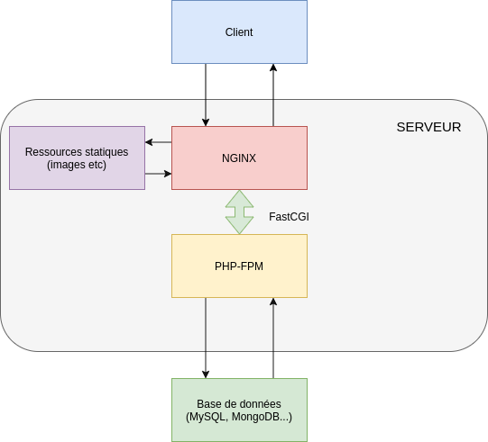

# MISE EN PRODUCTION D'UNE APPLICATION

## QU'EST CE QUE LE SSH ?

Le Secure Shell Protocol (SSH) est un protocole de réseau cryptographique permettant d'exploiter des services réseau en toute sécurité sur un réseau non sécurisé.<br>
Les applications les plus notables sont la connexion a distance (login) et l'exécution en ligne de commande.<br>

Les applications SSH sont basées sur une architecture client-serveur, connectant une instance de client SSH avec un serveur SSH.<br>
SSH opère en tant que suite de protocole en couches comprenant trois composants hiérarchiques :
* la couche de transport : assure l'authentification, la confidentialité et l'intégrité du serveur.
* le protocole d'authentification de l'utilisateur : valide l'utilisateur auprès du serveur.
* le protocole de connection : multiplexe le tunnel chiffré (envoie simultanément en plusieurs flux d'informations (ou signaux) sur une même liaison de communication sous forme d'un signal unique et complexe) en plusieurs canaux de communication logiques.

SSH a été designé sur des systèmes d'environnement Unix, en remplacement de **Telnet** (<a href="https://en.wikipedia.org/wiki/Telnet">Teletype Network</a>)<br>
et pour les protocoles shell Unix distants non sécurisés tels que le Berkeley **Remote Shell** (<a href="https://en.wikipedia.org/wiki/Remote_Shell">rsh</a>)<br>
et les protocoles <a href="https://en.wikipedia.org/wiki/Berkeley_r-commands">rlogin et rexec</a> associés qui utilisent des tokens d'authentification non sécurisés en texte clair (plaintext).

Le protole SSH existe en 2 versions majeures : version 1.0 et version 2.0.<br>


## Les différents mode d'utilisation du SSH 

L'authentification peut se faire sans l'utilisation de mot de passe ou de phrase secrète en utilisant la <a href="https://fr.wikipedia.org/wiki/Cryptographie_asym%C3%A9trique">cryptographie asymétrique</a>.<br>
La cryptographie asymétrique (ou cryptographie à clé publique) permet d'assurer la confidentialité d'une communication ou d'authentifier les participants,<br> 
sans que cela repose sur une donnée secrète partagée entre ceux-ci, au contraire d'une cryptographie symétrique qui nécessite ce secret partagé au préalable.<br>

La clé publique est distribuée sur les systèmes auxquels on souhaite se connecter.<br> 
La clé privée, qu'on protège par un mot de passe, reste uniquement sur le poste à partir duquel on se connecte.<br>
L'utilisation d'un "agent ssh" permet de stocker le mot de passe de la clé privée pendant la durée de la session utilisateur.<br>

Cette configuration profite aussi à SCP et SFTP qui se connectent au même serveur SSH.

**Pincipe de fonctionnement des clés SSH :**<br>


<a href="https://doc.ubuntu-fr.org/ssh">tuto ubuntu</a>

## Liste des commandes terminal

1. Navigation et Gestion de Fichiers :
    * ls = listing : liste le contenu du répertoire courant par ordre alphabétique.
    * cd = change directory : permet de naviguer d'un répertoire à un autre.
    * pwd = print working directory : permet d'afficher le chemin d'accès vers le répertoire ou se situe l'utilisateur qui a entré la commande.
2. Manipulation de fichiers et de répertoires :
    * cp = copie : permet de copier un fichier ou un groupe de fichiers ou de répertoires.
    * mkdir = make directory : permet de créer un nouveau répertoire (dossier).
    * touch = permet de créer un nouveau fichier. Il doit être suivi du nom du fichier et de son extension.
    * mv = move : permet de déplacer un fichier ou un dossier d'une source vers une autre destination.
3. Affichage et lecture de contenu de fichier :
    * cat = concatenate : permet de créer, fusionnet ou imprimer des fichiers dans l'écran de résultat standard ou vers un autre fichier.
    * less = permet de visualiser un fichier texte page par page (sans le modifier).
    * find = permet de chercher des fichiers dans un ou plusieurs répertoires selon des critères définis par l'utilisateur
    * grep = global regular expression print : permet de recherche une chaîne de caractères dans un fichier spécifié.
4. Transfert et Synchronisation de fichiers :
    * scp = secure copy : permet de copier en toute sécurité des fichiers depuis notre ordinateur local vers des serveurs distants, et inversement, à l'aide du protocole SSH.
    * rsync = permet de synchroniser des fichiers localement et à distance. On peut ainsi transférer des fichiers et des répertoires.
5. Editeur de Texte :
    * vim = c'est un éditeur de texte en ligne de commande
    * nano = autre éditeur de texte en ligne de commande
6. vérifier les ports :
    * lsof = commande basique native de Linux pour connaître les ports ouverts dans le system.<br>
    cette commande montre plusieurs informations : nom de l'application (ex: sshd), le douille du programme (adresse IP associée au port) et l'identifiant du processus (PID).<br>
    `sudo lsof -i -P -n` ou `sudo lsof -i -P -n | grep LISTEN`


## Mise en production d'applications sans conteneurisation

### PHP-FPM et NGINX

**PHP-FPM** :<br>
il s'agit de l'accronyme pour FastCGI Process Manager (= gestionnaire de processus FastCGI).<br>
C'est une interface SAPI permettant la communication entre un serveur web et PHP, basée sur le protocole FastCGI.<br>

```
FastCGI est une technique permettant la communication entre un serveur web et un logiciel indépendant, 
c'est une évolution de Common Gateway Interface (CGI) = Interface passerelle commune.

SAPI (Server Application Programming Interface = interface de programmation des applications serveurs)
est le terme générique utilisé en informatique pour désigner les modules d'interface d'applications serveur web comme Apache,
Internet Information Services ou iPlanet.
```

FPM est une alternative à l'implémentation PHP FastCGI avec des fonctionnalités supplémentaires utiles pour les sites fortement chargés.<br>
Fonctionnalités inclues :
* Gestion avancée des processus avec stop/start doux (graceful) ;
* Pools qui donnent la possibilité de démarrer des travailleurs avec différents uid/gid/chroot/environnement,<br> 
écoutant sur différents ports et utilisant différents php.ini (remplace le safe_mode) ;
* Configurable journalisation stdout et stderr ;
* Redémarrage d'urgence en cas de destruction accidentelle du cache opcode ;
* Support de l'upload acccéléré ;
* "slowlog" - journalisation des scripts (pas juste leurs noms, mais leur backtrace PHP également, utilisant ptrace ou équivalent pour lire le processus distant)<br> 
qui s'éxecutent de manière anormalement lente ;
* fastcgi_finish_request() - fonction spéciale pour terminer la requête et vider toutes les données tout en continuant d'exécuter une tâche consommatrice<br>
(conversion vidéo par exemple) ;
* Naissance de processus fils dynamic/ondemand/static ;
* Informations d'état de base et étendues (similaire à mod_status d'Apache) avec différents formats supportés comme json, xml et openmetrics ;
* Fichier de configuration basé sur php.ini ;

**NGINX** :<br>
Nginx est un logiciel de serveur distribué en 2004.<br>
L'objectif du programmeur derrière nginx (Sysoev) était de créer un serveur de haute performance qui peut gérer plusieurs clients web en même temps.<br>

il s'agit d'un système asynchrone qui utilise les changements d'état pour gérer plusieurs connexions en même temps.<br>
Le traitement de chaque requête est découpé en de nombreuses mini-tâches et permet ainsi de réaliser un multiplexage efficace entre connexions.<br>
Afin de tirer parti des ordinateurs multiprocesseurs, plusieurs processus peuvent être démarrés.<br>
Ce choix d'architecture entraîne des performances très élevées, ainsi qu'une charge et une consommation de mémoire très inférieures à celles des serveurs HTTP classiques comme Apache.<br>

Un serveur Nginx permet d'utiliser PHP-FPM pour traiter les scripts PHP.<br>
La combinaison NGINX/PHP-FPM permet de servir ses applications PHP en production.<br>



<a href="https://www.data-transitionnumerique.com/nginx-tutoriel-complet/">nginx tutoriel complet</a>

Nging n'offre aucune possibilité de traiter du contenu Web dynamique en natif ou d'intégrer les interprètes correspondants par module.<br>
nginx nécessite donc un serveur d'application séparé pour traiter du contenu web dynamique.<br> 
Le contenu statique est délivré par nginx quand demandé, mais si le client demande du contenu dynamique, l'équilibreur de charge va devoir transmettre la demande à un serveur d'application dédié.<br>
Ce serveur interprète le langage de programmation, assemble le contenu demandé dans une page web et le renvoie à l'équilibreur de charge qui le livre à son tour au client.<br>
Cela permet de gérer efficacement les volumes de trafic élevés.<br>

Cela signifie que sans serveur d'application dédié, il ne sera pas possible de traiter le contenu dynamique.<br>
Ce genre de traitement peut être lourd pour des sites webs de petite envergure.<br>

Concernant le développement, il est nécessaire d'installer chaque composant individuellement : problèmes de cohérence et de reproductivité.<br>

<a href="https://www.ionos.fr/digitalguide/serveur/know-how/nginx-vs-apache/">nginx vs apache</a>
<a href="https://fr.linux-console.net/?p=5736#gsc.tab=0">apache vs nginx : considérations pratiques</a>

## Mise en production d'applications avec conteneurisation

### Introduction de Docker et conteneurisation moderne

**Historique**

De manière générale, presque toutes les entreprises utilisent l'environnement cloud (privé ou public) avec des instances exécutant des Virtual Machines<br>
avec des capacité d'évolutivité et d'équilibrage de charge représentant leur couche de calcul.<br>
Avec l'évolution des défis, ce genre d'environnements sont devenus inefficaces :
* _Manque de cohérence des environnements :_ déploiement d'applications et de packages dans des environnements virtuels.
* _Dépendance du système d'exploitation :_ les applications déployées sont exécutées uniquement sur des systèmes d'exploitation compatibles.
* _Niveau d'isolement :_ incapacité à fournir un sandbox instantané au dessus du niveau du système d'exploitation.
* _Granularité de la consommation de calcul :_ impossibilité de déployer plusieurs applications répliquées, alors que l'équilibrage de la charge sur la couche applicative ne se produit qu'au sein d'une seule machine et non au niveau de la couche du système d'exploitation.
* _Correctifs des images dans les environnements de production :_ Les déploiements canari et bleu-vert ne sont pas flexibles au niveau du cluster et son difficiles à gérer dans plusieurs régions.

Pour répondre à ces problèmes, on a eu recours à la conteneurisation.<br>

**La conteneurisation**

Il s'agit d'une forme de virtualisation du système d'exploitation dans laquelle on exécute des applications dans des espaces utilisateurs isolés appelés conteneurs,<br>
qui utilisent le même système d'exploitation partagé.<br>
Un conteneur d'applications est un environnement informatique entièrement regroupé en package et portable :
* il dispose de tout ce dont une application a besoin pour s'exécuter (y compris ses fichiers binaires, bibliothèrques, dépendances et fichiers de configuration, le tout encapsulé et isolé dans un conteneur).
* la conteneurisation d'une application permet d'isoler le conteneur du système d'exploitation hôte, avec un accès limité aux ressources sous-jacentes, comme une VM légère.
* on peut exécuter l'application conteneurisée sur différents types d'infrastructure, tels qu'un serveur "bare metal", dans le cloud ou sur des VM, sans avoir à la remanier pour chaque environnement.

La conteneurisation permet de réduire les charges au démarrage et de supprimer la nécessité de configurer des systèmes d'exploitation invités distincts pour chaque application.<br>
=> Ils partagent tous un seul noyau de système d'exploitation.<br>

**Utilité**

Cela a permis aux développeurs de logiciels de créer et déployer des applications de façon plus rapide et sécurisée.<br>

Docker a permis de rendre la conteneurisation pratique, efficace et populaire.<br>
Les conteneurs offrent plusieurs avantages : voir cet <a href="https://www.veritas.com/fr/fr/information-center/containerization">article</a>
* _portabilité_ 
* _vitesse_ 
* _évolutivité_
* _agilité_
* _efficacité_
* _isolation_ 
* _sécurité_
* _facilité de gestion_
* _continuité_
* _facilité d'utilisation pour les développeurs_ 

Docker et la conteneurisation ont été la réponse à une série de défis persistants dans le monde de l'informatique.<br>
Ce procédé (combinaison de reproductibilité, protabilité et efficacité) à offert une solution aux problèmes que les méthodes traditionnelles résolvaient avec difficulté.<br>

**Concepts clés**

1. _Image_ :<br>
Une image est l'élément de base d'un conteneur. Il s'agit d'un ensemble de fichiers systèmes et de paramètres d'exécutions.<br>
Les fichiers peuvent être les suivants : code source, bibliothèques, dépendances, l'environnement d'exécution (ex JVM), les pilotes, outils, scripts + autres fichiers nécessaires à l'exécution de l'application.<br>
Une image n'a pas d'état et est exécutée par la runtime docker. On peut la voir comme une description d'un conteneur.<br>
On peut créer une image soit en modifiant un conteneur déjà en marche (sorte de snapshot d'un conteneur), soit en créant un Dockerfile basé sur une image qui existe déjà.
2. _Conteneur_ :<br>
Un conteneur est une instance en exécution d'une image. Il s'agit d'une encapsulation légère d'une application et de son environnement d'exécution.<br>
Le conteneur fonctionne de manière isolée sur le système hôte.

**Attention**, différence entre une image docker et un conteneur (ne sont pas la même chose) :<br>
* L'image docker contient tous les éléments nécessaires à l'exécution d'un logiciel : le code, un environnement d'exécution (ex JVM), les pilotes, les outils, scripts, bibliothèques, etc.<br>
Une image n'est pas modifiable. Si on souhaite la modifier, il faut en créer une nouvelle.<br>
On stockera les images dans le "registry" afin de pouvoir les télécharger.<br>
* Le conteneur est une sorte de mode d'emploi pour l'utilisation de l'image. Les conteneurs ne sont pas persistants et sont lacés à partir d'images.<br>

3. _Dockerfile_ :<br>
Il s'agit d'un fichier texte (ou fichier script) qui décrit une image.<br> 
Il est constitué d'instructions qui servent à décrire une image Docker et il contient les instructions pour construire une image Docker.<br>
Le dockerfile permet d'automatiser la "build" (création) d'images.
4. _Entrypoint_ :<br>
Le point d'entrée d'un conteneur. Il s'agit d'une commande qui se lance au démarrage du conteneur.<br>
La plupart des images officielles Docker sont configurées avec un entrypoint /bin/bin ou /bin/bash.
5. _Registry_ :<br>
Le registre est une zone de stockage pour les images Docker (public ou privé).<br>
Docker Hub est un service cloud public pour partager et stocker des images Docker.<br>
C'est l'équivalent d'un GitHub pour les images Docker.
6. _Volume_ :<br>
Le Volume est utilisé pour faire persister les données et partager des fichiers entre le conteneur et l'hôte.<br>
Les volumes sont essentiels pour éviter la pete de données lorsque les conteneurs sont arrêtés ou supprimés.<br>
C'est aussi une solution pratique pour l'échange de données entre l'hôte et le conteneur.<br>
Le volume est hébergé par l'ordinateur hôte, en dehors du véritable conteneur.<br>
Il faut voir le volume comme un dossier qui est partagé entre le conteneutr et l'ordinateur hôte.<br> 
Plusieurs conteneurs peuvent aussi se partager un même volume.

```
Statefull vs Stateless app :

Un processus ou une application stateless est indépendant. Il ne stocke pas de données et ne fait référence à aucune transaction passée.
Chaque transaction est effectuée à partir de rien, comme si c'était la première fois. Les applications stateless fournissent un service 
ou une fonction et utilisent un réseau de diffusion de contenu, le web ou des serveurs d'impression pour traiter ces requêtes à court terme.

Les applications et processus stateful, quant à eux, peuvent être réutilisés indéfiniment. 
Les plateformes bancaires en ligne et les messageries en sont deux exemples. 
Les transactions précédentes sont prises en compte et peuvent affecter la transaction actuelle. 
C'est pour cela que les applications stateful utilisent les mêmes serveurs chaque fois qu'elles traitent une requête d'un utilisateur.  
```
<a href="https://www.redhat.com/fr/topics/cloud-native-apps/stateful-vs-stateless">statefull et stateless : quelle différence ?</a>


7. _Réseau Docker_ :<br>
Docker possède sa propre gestion du réseau, permettant aux conteneurs de communiquer entre eux et avec des ressources extérieures.<br>
Il offre plusieurs modes de réseau comme "bridge", "host" et "overlay".
8. _Docker Compose_ :<br>
C'est un outil pour définir et gérer des applications multi-conteneurs. par exemple un conteneur pour l'application et un conteneur pour la bdd.<br>
Grâce à docker compose, on peut définir une application à l'aide de plusieurs conteneurs dans un seul fichier, puis démarrer ces conteneurs simultanément avec une seule commande.<br>

<a href="https://hub.docker.com/search?q=">lien vers le Docker Hub</a>

### Lancer une application multiconteneur

Voici quelques points clés concernant Docker Compose :
* Fichier docker-compose.yml : Le cœur de Docker Compose est le fichier YAML qui décrit la structure et les paramètres des services, des réseaux et des volumes.
* Services : Dans Docker Compose, chaque conteneur est décrit comme un "service".<br> 
Chaque service est une configuration pour un conteneur particulier et son image.
* Commande up : Avec la commande docker-compose up, vous pouvez démarrer tous les services définis dans le fichier docker-compose.yml.
* Intégration avec Docker : Docker Compose travaille avec Docker, ce qui signifie que toutes les commandes et fonctionnalités de Docker sont également accessibles.

Pour nous exercer, nous allons donc déployer une application wordpress. Cette application est composée :
- 1 service Wordpress qui utilise l’image latest
- 1 service MariaDB qui utilise l’image mariadb:10.6.4-focal
- Attention à bien paramétrer les variables d’environnement des deux services
- La base de données ne doit pas être accessible depuis l’extérieur. Autrement dit, il faudra regarder du côté des réseaux Docker.
- La base de données doit pouvoir persister les données

Pour ce faire, il faut créer un dossier qui contiendra notre application, et y créer un fichier `docker-compose.yml`.<br>

<a href="https://openclassrooms.com/fr/courses/2035766-optimisez-votre-deploiement-en-creant-des-conteneurs-avec-docker/6211677-creez-un-fichier-docker-compose-pour-orchestrer-vos-conteneurs">voir ce tuto</a>

Exemple d'un fichier Docker-compose.yml, la structure est sensiblement la même dans chaque fichier :
```
version: '3'

services:
  mariadb:
    image: mariadb:10.6.4-focal
    ports: 
      - "3306:3306"
    volumes:
      - db_data:/var/lib/mysql
    restart: always
    environment:
      MARIADB_ROOT_PASSWORD: password
      MARIADB_DATABASE: wordpress
      MARIADB_USER: wordpress
      MARIADB_PASSWORD: wordpress

  wordpress:
    depends_on:
      - mariadb
    image: wordpress:latest
    ports:
     - "80:80"
    restart: always
    environment:
      WORDPRESS_DB_HOST: mariadb:3306
      WORDPRESS_DB_USER: wordpress
      WORDPRESS_DB_PASSWORD: wordpress
      WORDPRESS_DB_NAME: wordpress

volumes:
  db_data: {}
```

## Cas pratique : Application fullstack

Dans le cas d'une application FullStack (Application Front-end couplée avec une application Back-end (API) et d'une base de données), on emploiera plusieurs conteneurs.<br>
On aura un dossier contenant le frontend, un dossier contenant le backend, et un dossier englobant le tout.<br>

### Structure 

Le fichier `docker-compose.yml` se situe à la racine de l'app (dossier contenant l'application Front-end, l'application Back-end (API) et la base de données).<br>

On aura plusieurs fichiers `Dockerfile` qui contiennent chacun une série d'éléments décrivant l'image Docker et d'instructions servant à construire l'image Docker.<br>
Ces fichiers seront utilisés pour automatiser le build des images Docker.

### I. Conteneurisation de la base de données

On va commencer par conteneuriser la base de données : ici une base de données Postgresql.<br>
On va donc créer le fichier `docker-compose.yml` pour paramétrer le conteneur.<br> 

**N.B. : Ce fichier va évoluer au fur et à mesure qu'on avancesera dans la conteneurisation entière de l'app.**

```yml
version: '3.9'

services:
    db:
        image: postgres:latest
        ports:
            - "5432:5432"
        restart: always
        # set shared memory limit when using docker-compose
        shm_size: 128mb
        environment:
            POSTGRES_DB: db_crafted_by
            POSTGRES_USER: romainw
            POSTGRES_PASSWORD: R0main89labs!
        volumes:
            - pg-data:/var/lib/postgresql/data

volumes:
    pg-data: {}
```
Le service DB permet de paramétrer le conteneur pour la base de données.<br>
On utilise une image officielle postgres. <a href="https://hub.docker.com/_/postgres">https://hub.docker.com/_/postgres</a><br>
volumes indique la manière dont on fera persister les données de la base de données.

Pour tester, on utilisera la commande `docker compose up`.

### II. Conteneurisation du backend

Au tour du backend : dans notre cas, il s'agit d'une API Laravel 10.<br>
Pour fonctionner correctement dans un environnement de production, l'application nécessite deux services essentiels : **nginx** et **php-fpm**.<br>
Pour intégrer ces services dans un seul conteneur, on utilisera également un troisième service : **supervisor**

```
N.B. :
Nginx est un serveur web de haute performance, reconnu pour sa stabilité, sa richesse fonctionnelle,
sa configuration simple et sa faible consommation de ressources.
Il est couramment utilisé pour servir des pages web statiques ainsi que comme reverse proxy pour des applications web.

PHP-FPM (FastCGI Process Manager) est une alternative efficace pour gérer les processus PHP,
permettant au serveur web de traiter les requêtes PHP de manière efficiente.
L’interaction entre Nginx et PHP-FPM se fait via le protocole FastCGI,
où Nginx redirige les requêtes nécessitant une interprétation PHP vers PHP-FPM.
Après l’exécution du script PHP, PHP-FPM renvoie le résultat à Nginx, qui le transmet au client.
Cette séparation des tâches optimise la gestion des ressources et les performances des applications web.

Supervisor est un système de contrôle et de supervision de processus pour Unix,
veillant à ce que les processus spécifiés fonctionnent sans interruption.
Il est particulièrement utile pour garantir que PHP-FPM reste actif, redémarrant le processus automatiquement en cas d’échec.
```

On commencera par créer le fichier `Dockerfile` à la racine du dossier du backend.<br>
Il aura cette structure : 
```
# Use Alpine Linux as the base image
FROM php:8.1-fpm-alpine

# Install necessary packages nginx & supervisor
RUN apk update && \
    apk add --no-cache nginx supervisor

# Create necessary directories for Laravel APP
# Create directory where nginx logs will be stored
# Create directory where php-fpm logs will be stored
RUN mkdir -p /var/www/html/public \
    && mkdir -p /var/log/nginx \
    && mkdir -p /var/log/php-fpm

# Copy the Laravel application files to the container
COPY . /var/www/html

# Set the working directory inside the container
WORKDIR /var/www/html

# Set up nginx
COPY default.conf /etc/nginx/conf.d/default.conf

# Set up Supervisor
COPY supervisor.conf /etc/supervisor/conf.d/supevisord.conf

# Export ports : default port for HTTP traffic
EXPOSE 80

# Start Supervisor
CMD ["/usr/bin/supervisord", "-c", "/etc/supervisor/conf.d/supervisord.conf"]
```
Ici, on part d'une image officielle Docker php-fpm. La version Alpine est plus légère qu'une image standard.<br>
On installe ensuite les pckages nginx et supervisor, puis on crée les dossier qui vont contenir : la totalité de l'application laravel, les dossier qui vont contenir les logs nginx et php-fpm.<br>
On copie ensuite les fichiers de l'application dans le conteneur, puis on initialise le répertoire de travail dans le conteneur.<br>
On initilise ensuite les fichiers de configuration de nginx et de supervisor.<br>
On indique ensuite le port par défaut pour le traffic HTTP, et enfin, on démarre Supervisor.

Pour compléter, il faudra créer les fichiers `default.conf` et `supervisord.conf` qui contiendront les configurations nécessaire au bon fonctionnement.<br>
Ces fichiers doivent être situés au même niveau que le `Dockerfile` pour être copiés dans les bons répertoires grâce aux commandes indiquées dans ce dernier.

le fichier `default.conf` :
```
server {
    listen       80;
    listen  [::]:80;
    server_name  localhost;

    #access_log  /var/log/nginx/host.access.log  main;

    location / {
        root   /usr/share/nginx/html;
        index  index.html index.htm;
    }

    #error_page  404              /404.html;

    # redirect server error pages to the static page /50x.html
    #
    error_page   500 502 503 504  /50x.html;
    location = /50x.html {
        root   /usr/share/nginx/html;
    }

    # proxy the PHP scripts to Apache listening on 127.0.0.1:80
    #
    #location ~ \.php$ {
    #    proxy_pass   http://127.0.0.1;
    #}

    # pass the PHP scripts to FastCGI server listening on 127.0.0.1:9000
    #
    location ~ \.php$ {
        root           html;
        fastcgi_pass   127.0.0.1:9000;
        fastcgi_index  index.php;
        fastcgi_param  SCRIPT_FILENAME  /scripts$fastcgi_script_name;
        include        fastcgi_params;
    }

    # deny access to .htaccess files, if Apache's document root
    # concurs with nginx's one
    #
    #location ~ /\.ht {
    #    deny  all;
    #}
}
```
et le fichier `supervisord.conf` :
```
# configurs Supervisor daemon
[supervisord]
nodaemon=true

# defines configuration for nginx process
[program:nginx]
# specify command to start nginx
command=/usr/sbin/nginx -g "daemon off;"
# Instruction to start and restart nginx if crash
autostart=true
autorestart=true
# Specify the log files for Nginx error and access logs
stderr_logfile=/var/log/nginx/error.log
stdout_logfile=/var/log/nginx/access.log

# Configuration for PHP-FPM process
[program:php-fpm]
# Specify command to start PHP-FPM process
command=/usr/local/sbin/php-fpm -F
# Inctruction to automatically start and restart PHP-FPM if crash
autostart=true
autorestart=true
# Specify the log files for PHP-FPM error and access logs
stderr_logfile=/var/log/php-fpm/error.log
stdout_logfile=/var/log/php-fpm/access.log

```
