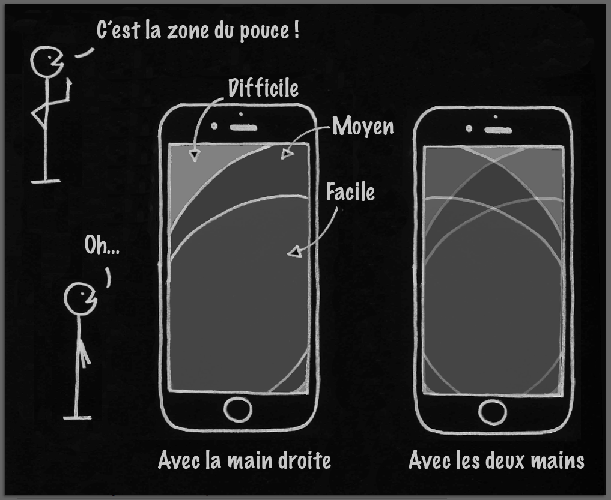

# UX DESIGN : LES FONDAMENTAUX

## CE QUI SE CACHE DERRIERE L'UX

### APPRENDRE A RECONAITRE ET DEFINIR L'UX

#### Qu'est-ce que l'UX ?

l'UX est un accronyme anglais pour **User Experience**. 
En Français, on parle d'Expérience Utilisateur. 

l'UX est un ensemble de normes et bonnes pratiques donc l'objectif est de :
* Concevoir un produit
* Concevoir son utilisation

En design, on va plutot avoir à concevoir l'expérience que va vire l'utilisateur lorsqu'il découvre et intéragit avec un produit. 
Le produit est souvent un site web ou une application mobile. 

#### Prendre en compte les besoins

L'ambition de l'UX designer est de concevoir un produit qui répond exactement aux besoins et attentes de l'utilisateur. 
Le but est de faire que l'expérience soit la meilleure possible. 

Il faut donc à la fois :
* travailler sur l'**ergonomie** du produit et de son usage : pratique, accessible, utile, fasile à utiliser et à comprendre, etc.
* anticiper l'**usage** : chercher ce dont l'utilisateur a besoin, ce qu'il attend, ce qu'il ne veut pas.

L'objectif global est de rendre l'utilisateur heureux.

Il y a donc une dimention psychologique qui est très importante : 
Pour que le produit plaise, il doit toucher au coeur du besoin de l'utilisateur, et cela requiert une bonne connaissance de l'utilisateur. 

#### L'UX est lié à l'émotion

Grâce aux neurosciences, on sait aujourd'hui qu'émotion et cognition sont indissociables dans une expérience de découverte et d'utilisation. 
Si le produit plaît, on va vouloir continuer à l'utiliser, souvent à tel point qu'on ne pourra plus s'en passer. 

Un exemple de design d'expérience utilisateur qui a tellement marqué ses premiers utilisateurs qu'il est désormais massivement utilisé : le plan de métro.

<a href="http://www.clarksbury.com/cdl/maps.html">évolution du plan de métro de Londres depuis 1921</a>

### FAIRE LA DIFFERENCE ENTRE UX ET UI

**UX** = **U**ser e**X**perience (expérience de l'utilisateur). 
**UI** = **U**ser **I**nterface (interface pour l'utilisateur). 

#### L'UI est la partie visible de l'UX

L'**UX** est un mix de parties visibles et invisibles qui contribuent ensemble à l'expérience globale de l'utilisateur sur l'application mobile. 
L'**UI** est la partie visible et perceptible d'un produit : ce que l'on voit, entend, touche lorsqu'on utilise une app mobile par exemple. 

#### L'UI fait partie de l'UX mais ne fait pas tout

Pour résumé, voyons un exemple de la vie courant :
* **Produit** : la voiture = Une Porsche.
* **Utilisateur** : le conducteur = utilisateur principal, et par extension, les passagers.
* **Interface** : l'intérieur de la voiture = là ou il y a ce dont on a besoin pour l'utiliser et conduire la voiture.
* **Expérience** : conduire la voiture.

### SE FAMILIARISER AVEC LA NOTION D'USABILITE

#### Qu'est-ce que l'usabilité ?

Utilisabilité, traduit de l'anglais Usability = Capacité d'un utilisateur à utiliser un produit, ce à quoi il sert et comment on s'en sert. 

décomposé, la définition est la suivante :
* en anglais : usability = **use** (usage) + **ability** (capacité)
* en français : utilisabilité = **utilisation** + **habilité** (ou capacité)

On utilise aussi le terme de Usabilité au lieu de Utilisabilité.

Norme ISO 9241-11 : 
L'usabilité, c'est « le degré selon lequel un produit peut être utilisé, par des utilisateurs identifiés,  
pour atteindre des buts définis avec efficacité, efficience et satisfaction, dans un contexte d’utilisation spécifié ».

Critères d'usabilité : 
* utile
* utilisable
* navigable
* accessible
* compréhensible
* simple

=> L'usabilité doit contribuer à aider et guider l'utilisateur dans l'utilisation du produit.

#### Ne pas confondre "usabilité" et "UX"

Bien qu'on confonde UX design et usabilité, l'utabilité n'est qu'une composabte de l'UX design :
* l'UX design est une discipline plus large dont l'objectif est de rendre l'utilisateur heureux,  
d'offrir une expérience agréable et significative. L'émotion entre en ligne de compte ;
* la dimension d'usabilité (englobée dans l'UX design) consiste à permettre aux utilisateurs d'accomplir un ensemble de tâches avec simplicité.

### RECHERCHE LE TAUX DE RETENTION

#### Mesurer le succès de l'UX

Il y a plusieur façons de mesurer le succès de l'UX : de façon qualitative et/ou quantitative. 

* De manière qualitative, on peut regarder la notation d'une application mobile dans l'APP Store/le Play Store (nombre d'étoiles), 
Ou bien lire et analyser les commentaires des utilisateurs. 

* De manière quantitative, on regardera le taux de rétention.  
Il s'agit de la part d'utilisateurs qui continuent d'aller régulièrement sur une app ou un site web plus de 3 mois après l'avoir découvert et utilisé pour la première fois.

#### Viser 30% de taux de rétention

Les applications qui ont le meilleurs taux de rétention sont les app de messagerie instantanées : Facebook (98%) ou WhatsApp (77%). 
Le côté instantané et les nouvelles façons de communiquer entraînent une fréquence d'usage très importante et génèrent de l'addiction. 

Le taux de rétention moyen des applications mobiles est de 11%. 
Au delà de 30% (ex : Snapchat = 33%), on considère que c'est un succès. 

Sur internet, la star incontestée est **Youtube**.

### ACCROCHER LES UTILISATEURS AVEC LE "HOOK CANVAS"

Le modèle économique d'applications comme Facebook, YouTube ou encore Instagram repose sur un comportement d'utilisateur : 
tuer l'ennui, regarder si on à rien loupé, se connecter de manière compulsive pour combler un moment de solitude. 
On parle de relation "haute fréquence" avec les utilisateurs. 

Le modèle Hook Canvas (modèle du crochet) a été développé par Nir Eyal, professeur à l'école de commerce de Stanford. 
Le but est d'accrocher les utilisateurs. Le flow de l'application doit s'articuler en 4 phases qui se complètent et se répètent, et forment ainsi une boucle.

#### Phase 1 : l'élément déclencheur

Il existe deux types d'éléments déclencheurs : **déclencheurs internes** et **déclencheurs externes**. 

* le déclencheur interne tire l'utilisateur vers l'application. Les plus puissants déclencheurs sont des états psychologiques ou des émotions :
    * la solitude
    * l'ennui
    * la peur de manquer quelque chose 

Ces sentiments sont souvent négatifs car ils sont la manifestation du problème que l'utilisateur cherche à résoudre avec le produit.

* les déclencheurs externes poussent l'utilisateur vers l'application :
    * la publicité
    * les notifications
    * les boutons d'appel à l'action

#### Phase 2 : l'action

Une fois l'expérience déclenchée, l'utilisateur doit pouvoir passer à l'action souhaitée le plus facilement possible. 
La mission du designer :
1. **Eliminer au maximum la friction** qui pourrait freiner ou démotiver l'utilisateur (clics superflus, remplissage de champ interminables, lecture sans fin, etc.)
2. **Réduire la charge cognitive** de façon à rendre la prochaine action clairement identifiable.

La gratification est instantanée et surtout imprévisible.

#### Phase 3 : la récompense variable

En se connectant aux réseaux sociaux (Facebook, Insta, YouTube, TikTok, etc.), l'utilisateur ne sait pas ce qu'il va y trouver. 
C'est ce qui pousse l'utilisateur à revenir ou a rester plus longtemps sur l'application. 

L'utilisateur va chercher à prolonger l'expérience dans l'espoir et l'anticipation d'une "meilleure récompense".

Exemple de récompenses variables :
* nombre de mentins "j'aime" ou d'autres réactions sur une photo
* commentaire sur un statut
* réponse à un message privé
* nouvel ami (facebook), follower (twitter), nouvelle relation (linkedin) ou affinité (tinder)

#### Phase 4 : l'investissement

Après les 3 premières phases, l'utilisateur devrait être naturellement tenté de rentrer dans la phase 4 : l'investissement. 

Plus on utilise une application, plus on y crée et on y stocke de la valeur : 
* En rentrant des données (compléter ou mettre à jour son profil)
* En s'abonnant à une page ou à une chaîne
* En publiant une photo ou vidéo
* En envoyant un message privé

=> L'utilisateur augmente ses futures chances d'être récompensé (par rétroaction) et par la même occasion, charge les prochains déclencheurs qui le ramèneront sur l'application. 

Et la boucle est bouclée.

## SE CONCENTRER SUR L'UTILISATEUR

### APPRENDRE A SE CENTRER SUR L'UTILISATEUR

L'approche UX est en permanence centrée autour de l'humain et de ses activités. Cela demande la rigueur. 

Cela signifie que tous nos choix doivent se faire à partir et en fonction de nos utilisateurs. 
Il faut donc connaître et comprendre nos utilisateurs. 

#### Ne pas créer pour nous mais pour les utilisateurs

Ce que l'on aime n'est pas forcément ce qu'aiment les utilisateurs : Nous ne sommes pas nos utilisateurs. 

Le but est d'observer le monde autour de nous, d'être attentif aux besoins des individus et aux problèmes qu'ils rencontrent dans la vie de tous les jours afin de chercher à y apporter une réponse. 

Il faut donc faire des études ou des tests avant de se lancer.

#### Ne pas chercher à plaire à tout le monde

Il n'est pas possible de faire un produit pour TOUT le monde, qui conviennent parfaitement à tout le monde. 
Tout simplement car tout le monde est différent. 

Plaire à tout le monde = ne plaire à personne. 

En s'orientant sur la conception d'un produit sur mesure pour tout le monde, on se retrouve à concevoir quelque chose où personne ne se retrouve. 

### CONCEVOIR UN PRODUIT SIMPLE

#### Soyez simple

Un produit simple est un produit qui ne requiert pas ou peu d'explications. 

Il faut être clair dans les informations qu'on donne à l'utilisateur : il doit comprendre tout seul quel est le nom du site ou de l'application mobile et ce à quoi elle sert. 

Souvent, en donnant un mode d'emploi signifie le compliquer. 

#### NE PAS FAIRE UN PRODUIT TOUT-EN-UN

Un produit qui possède toutes les fonctionnalités possibles n'a aucun intérêt. 
Le succès d'une UX repose sur **une caractéristique déterminante, une fonctionnalité** qui permet une utilisation du produit rapide et pour ce qu'il est. 

Un des fondements en UX est l'usabilité : le produit doit être simple, accessible et compréhensible. 

### CREER POUR L'UTILISATEUR MOBILE

Mobile first ! à savoir le smartphone ou la tablette passe en priorité dans le design, puisque c'est ce qu'utilise le plus l'utilisateur de nos jours. 

#### C'est surtout l'utilisateur qui est mobile

Avant de concevoir un produit, il faut comprendre que c'est avant tout l'utilisateur qui est mobile. 

Nous sommes dans l'ère de la mobilité ou l'utilisateur est connecté à internet partout :
* se déplace en utilisant son smartphone : il marche, prend les transports… ;
* cherche en permanence à avoir un bon réseau, et suffisamment de batterie 😪 ;
* communique et capture le réel en instantané : mail, messagerie, mais aussi via la photo, voire la réalité augmentée ;
* commence à préférer les images, émojis et autres, plutôt que le texte, parce que cela va plus vite et transmet mieux une émotion ou un message ;
* possède plein d’applications mobiles, pour plein de besoins différents ;
* son attention est donc divisée (c'est la course pour capter son attention et parvenir à la retenir).

#### Intégrer l'approche du mobile-first

Il y a tellement d'utilisateurs sur mobiles qu'il est impossible pour tout designer de n'envisager que la version desktop : il faut penser **responsive**. 

La notion de responsive désigne l'adaptabilité du produit selon la taille d'écran de l'utilisateur : desktop vs tablette vs smartphone, etc. 
Cela implique que la taille est en moyenne divisée par 10 : 
* police de caracètres, liens, boutons et autre type de contenu doivent s'adapter sans avoir besoin de zoomer.
* les visuels (images, sliders, photos...) sont redimensionnées correctement.
* la disposition du contenu reste claire.

Il est donc indispensable de prévoir une version mobile quand on développe un site web, le coder en intégrant le responsive et commencer par la version mobile. 
On appliquera aussi les bonnes pratiques de ce qu'on appelle "le design pour le pouce". 

Il faut donc prendre en considération en priorité les contraintes liées au mobile avant celle de la version desktop. 

#### Assimiler les contraintes de l'appareil mobile

1. La taille de l'écran est très petite et l'utilisateur y navigue avec un doigt (le pouce très souvent).
2. Un smartphone s'utilise très souvent en marchant.
3. Le réseau est aléatoire, parfois bon, parfois fluctuant, faible, voire inexistant...
4. La batterie des smartphones d'aujourd'hui dure maximum une journée.

Cela implique quelques grands principes de conception :
* Afficher l'essentiel du contenu à la bonne taille et au bon endroit.
* Charger rapidement, même quand le réseau n'est pas 4G.
* Ne pas consommer trop d'énergie et donc de batterie.

### DEFINIR UN PERSONA

Un persona est un profil utilisateur

#### Faire la différence entre un persona et un cas d'usage

Un **persona**, c'est un modèle d'utilisateur qui a des caractéristiques précises qui déterminent des cas d'usage. 

Un **cas d'usage** est l'ensemble des situations dans lesquelles le persona va avoir envie/besoin d'utiliser le produit, 
et comment il a besoin de l'utiliser, pourquoi et pour quoi faire ? 

#### Faire un persona

Il ne s'agit pas seulement de lister les caractéristiques pour un persona, telles que le sexe, l'âge ou le revenu. 
Le but est de déterminer une liste de critères qui vont indiquer, donner une idée des activités de l'utilisateur et donc ce dont il aura besoin. 
On créera ainsi un scénario d'utilisation pour un persona afin d'adapter l'application à son utilisation.

#### Intégrer la notion de mobilité dans un persona

La mobilité est un critère essentiel dans la définition du persona. 

Il est important que l'utilisateur puisse continuer à faire ce qu'il fait (marcher) sans danger,  
et que l'application ne lui demande pas de trop réfléchir, mais au contraire d'aller à l'essentiel, sans le distraire outre mesure. 

L'application doit empêcher au maximum tout élément de friction :  
réduire le nombre de "clics" jusqu'à l'information désirée, et limiter la difficulté des actions à réaliser.

A partir de ces éléments, on pourra élaborer une application parfaitement adaptée aux besoins de l'utilisateur et qui respecte les notions d'usabilité. 

### COMPRENDRE LE PRINCIPE D'AFFORDANCE

L'affordance est la capacité à comprendre un produit et à intéragir avec.

#### SAVOIR QUE L'UTILISATEUR DEVIENT DE PLUS EN PLUS EXIGEANT

L'utilisateur s'habitue au progèrs et à la qualité. On ne les aura pas avec un produit moyen.  
L'utilisateur aura vite fait de trouver une meilleure solution dès qu'elle se présente et par conséquent, déserter votre produit ou votre service. 

L'utilisateur s'attend à un progrès constant, des améliorations, des innovations, des mises à jour... 
Son attente lorsqu'il télécharge une application : qu'elle fonctionne, et qu'elle fonctionne bien (bien = efficace, digne de confiance, rapide). 

Il y a des acquis en design : pour naviguer sur son smartphone, on touche l'écran. 
Tout le monde y est maintenant habitué. Il s'agit de l'affordance. 

Traduit de l'anglais "affordability" : "afford" = se permettre + "ability" = capacité. 
Cela désigne l'accessibilité, le caractère abordable d'un produit. 
Elle est remise sur le devant de la scène dès qu'une innovation apparaît.

Si une innovation prend le pas et s'inspire sur la base d'une précédente innovation, ça passe et cela ne prendra qu'un léger temps d'adaptation. 

Par contre, si un produit est trop innovant, cela va générer un manque d'affordance :
* provoquer auprès des utilisateurs de la confusion, de l'incapacité à prendre en main le produit, de l'incompréhension, voire de la frustration, de la colère… ;
* empêcher les utilisateurs de comprendre l'intérêt du produit, les faire rester sur l'acquis (beaucoup plus pratique et simple à leurs yeux), et leur faire fuir la nouveauté.

Vous l'avez compris, le but de l'UX n'est pas de concevoir un produit fantastiquement génial et futuriste, mais de concevoir le meilleur produit… pour vos utilisateurs. 

## DOUCOUVRIR LE METIER D'UX DESIGNER

### Témoignages d'UX Designers

#### Les enjeux du métier d'UX designer

motivations : 
* nouveauté des projets.
* analyse des besoins des utilisateurs.
* réponse aux problèmes des utilisateurs.

=> Aider les gens en répondant à leurs besoins

La diversité des parcours des designers : ils viennent de beaucoup de métiers différents et ont chacuns une approche pour répondre à la demande. 

1. Un des enjeux principaux : se mettre à la place des utilisateurs pour lesquels on design le produit.
2. Convaincre les clients de faire des tests utilisateurs : important pour éviter l'effet tunnel et de s'éloigner du besoin de l'utilisateur.

l'UX designer est la garant de la voix de l'utilisateur, il doit faire en sorte qu'il soit mis au coeur du développement du produit. 
La création d'un produit passe par une amélioration continue. 

#### Les qualités d'un UX Designer

Les UX designers viennent pour beaucoup du monde du graphisme. 
D'autres viennent du domaine de la psychologie, qui aiment se centrer sur l'humain. 

La qualité principale est l'empathie : il faut être capable de se centrer sur l'utilisateur. 
La deuxième qualité est la curiosité : l'écoute de ce qui nous entoure. 
Il faut aussi avoir une bonne capacité à travailler en équipe. 

### INCARNER L'ETHIQUE DE L'UX DESIGNER

<a href="https://youtu.be/jT5rRh9AZf4">comment le design peut contribuer à rendre les technologies et les applications mobiles moins intrusives</a>

### RENCONTRE AVEC UN UX DESIGNER

Interview d'un UX designer

#### Pour faire une recherche utilisateur, quelles méthodes sont les plus efficaces ?

Pour être efficace et pertinent, il est impératif de varier les sources d'informations en couplant les informations quantitatives et qualitatives :
* Pour l'approche quantitative, Google est votre meilleur ami ! Une recherche rapide vous permettra d'identifier les principales caractéristiques de votre public cible.  
En croisant les articles de presse, les sites spécialisés et les analyses (sondages, mémoires, thèses, livres, revues, etc.),  
vous pourrez identifier les principales tendances d'un secteur, les problématiques rencontrées, les évolutions majeures et les populations concernées.  
Toutefois, soyez vigilant sur la fiabilité des sources et la "fraîcheur" des analyses que vous utilisez. Citez systématiquement vos sources, par honnêteté intellectuelle et pour améliorer la solidité de vos conclusions.  
Ces informations vous aideront à segmenter vos utilisateurs pour mieux comprendre leurs besoins (ex. : un sexagénaire dynamique recherchant un produit innovant, un demandeur d'emploi de 35 ans en reconversion professionnelle, etc.).

* Pour l'approche qualitative, le contact avec les utilisateurs est indispensable (vraiment !).  
Après avoir soigneusement sélectionné vos utilisateurs à l'aide de vos critères de segmentation, vous organiserez la rencontre dans un lieu "neutre".  
Le format peut être varié (entretien téléphonique ou physique, "focus group", analyse de l'activité, etc.).  
Dans tous les cas, soyez préparé, aimable et curieux. Le résultat est souvent à la mesure de l'effort et du temps passé.  
Vous obtiendrez alors une mine d'informations nouvelles : anecdotes, conseils, attentes, réclamations, idées, habitudes.  
Cette "matière humaine" est l'ingrédient magique qui vous permettra de créer des personas vivants, et de générer de l'empathie et de la créativité dans l'équipe de conception.

#### Quels conseils donnerais-tu pour bien aborder l'exercice de création de persona ?

Le persona est un des quatre piliers de l'approche centrée utilisateur, avec les objectifs, les scénarios et les motivations fondamentales.  
C'est un outil polyvalent visant à générer de l'empathie lors d'un processus de conception (produit, web, logiciel, service, organisation, etc.).

La recherche utilisateur, évoquée ci-dessus, permet de recueillir les informations sociodémographiques nécessaires, ainsi que les éléments biographiques pertinents.

Me concernant, je crée 10 personas maximum par produit. Au-delà de 10, ils deviennent difficilement mémorisables par l'équipe, et perdent leur unicité (moins segmentants, trop de points communs).

Il est important de les prioriser (primaire, secondaire), et d'opter pour un format simple et visuel (photo de qualité, iconographie, diagrammes...).

Enfin, donnez-leur une personnalité marquante : des qualités et des défauts, des passions et des angoisses, des rêves, des addictions, des goûts, des névroses, un style vestimentaire...  
Les traits spécifiques facilitent la mémorisation et l'animation lors des workshops (ateliers).

#### Que prends-tu en compte lorsque tu prototypes un site web ou une application mobile ?

Tout, mais toujours par ordre de priorité. Le résultat final doit refléter les priorités définies dans les étapes précédentes (les 4 piliers). 😉

Pour pousser l'équipe à faire des choix, j'utilise régulièrement le principe des 80/20 :  
très souvent, 80 % des actions observées sont réalisées grâce à 20 % des fonctionnalités du site.  
Selon moi, le rôle de l'UX designer est de faire en sorte que ces scénarios prioritaires soient réalisés le plus simplement possible.  
Si cet objectif est atteint, les utilisateurs auront alors l'envie de s'intéresser aux scénarios secondaires.

#### Quels outils utilises-tu au quotidien dans ton métier d'UX designer ?

* Le plus souvent : un calepin, des crayons de papier, des feutres noirs (0,1 ; 0,2 ; 0,5 mm) ;  
des feutres de couleur / stabilo 0,4 mm, et des crayons de couleur.

En UX, un dessin vaut mille mots…

* Régulièrement : Axure RP Pro. Ce logiciel est certainement trop complexe, mais son potentiel est énorme.  
Il m'a également permis de comprendre les joies et les contraintes du code.

* En cas de blocage : l'humour, les viennoiseries et les sucreries. L'UX designer est avant tout un animateur.  
Pour qu'une séance se déroule bien, il faut parfois mettre les participants dans de bonnes dispositions. 😉

#### Comment abordes-tu la question du test utilisateur ?

Toutes les étapes de la création centrée utilisateur visent à limiter les risques d'erreurs et d'oublis lors du processus de conception.  
Cependant, malgré l'investissement de l'équipe et la rigueur méthodologique, il reste toujours des questions, des désaccords et des incertitudes.  
J'appelle cela des hypothèses de tests.

Ainsi, le but est de tester et d'apporter des éléments de décision factuels et scientifiques, pour dépassionner les débats et éviter les "J'aime bien/J'aime pas".

Pour la réalisation des tests, je pense qu'il faut s'adapter aux enjeux et au budget disponible, être agile.  
Utiliser "l'artillerie lourde" pour lever chaque doute peut s'avérer contreproductif, ralentir le processus de conception,  
et dissuader les décideurs de faire appel à l'UX.

#### Que recommanderais-tu à quelqu'un qui début en UX ?

Par rapport à mon expérience, il y a trois points à avoir à l'esprit.

* Le parcours professionnel et le style de vie

La conception d'expérience utilisateur est un métier absolument passionnant qui implique souvent de travailler et de vivre à proximité de grandes villes (Paris, Berlin, Londres).  
Les déplacements peuvent également être fréquents si vous êtes consultant ou en agence.  
En début de carrière, cela a peu d'importance lorsqu'on est jeune, citadin, célibataire et mobile.  
Toutefois, cela implique un choix de vie à plus long terme, pour soi mais également pour son conjoint et ses enfants.  
Rien d'insurmontable, bien sûr ! Mais je pense que cela doit relever d'un choix assumé plutôt que d'une contrainte mal anticipée.

* S'intéresser à l'humain

Faire de l'UX, c'est avant tout comprendre le fonctionnement de l'être humain, la manière dont il pense, apprend, comprend, aime ou déteste.  
Il est donc important de puiser dans toutes les sciences qui nous aident à décrypter et à anticiper les comportements humains :  
psychologie, sciences cognitives, sociologie, anthropologie, etc. Le design n'est qu'un moyen au service de l'humain.

* La conception d'expérience utilisateur n'est pas altruiste

Les objectifs sont très souvent liés au business (efficacité, efficience, conversion, fidélisation, etc.) et selon moi, il n'y a aucune honte à cela.  
Il est donc important de comprendre la logique économique, les problématiques et la stratégie de l'entreprise pour laquelle vous travaillez.  
En mettant l'expérience utilisateur au service de la réussite de l'entreprise, vous placez l'intérêt des utilisateurs à un niveau stratégique. 
D'une pierre, deux coups !

### CREER UN PERSONA 

1. D'abord, se renseigner sur l'application.
2. Essayer l'application.
3. Lire des articles à propos de l'app.
4. Regarder des vidéos à propos de l'app pour voir à quoi ressemblent les utilisateurs, ce qu'ils aiment faire avec l'app et pourquoi.

PERSONA

Nom : ……………………………………
Caractéristiques (5 maximum) : 
* …
* …
* …
* …
* …

SCÉNARIO (Liste des situations qui décrivent le quotidien du persona) :

* …
* …
* …
* … 

CAS D'USAGE (Liste des cas dans lesquels le persona utilise le produit, comment et pourquoi) :

* …
* …
* …
* …

## S'ENTRAINER A LA PRATIQUE DE L'UX-DESIGN

### Intégrer l'approche du "Design Thinking"

Le travail d'un UX designer s'article autour de 3 moments fondamentaux et incompressibles :
* Faire de la recherche utilisateur
* Prototyper pour l'utilisateur mobile
* Mener des tests utilisateurs

Ces trois phases fonctionnent en trinôme et s'intègre dans la démarche du **design thinking**.

#### Adapter le Design Thinking à l'UX Design

Design Thinking = méthodologie par étapes qui permet de gérer le développement de façon innovante :
1. Empathie : se mettre à la place des autres pour comprendre un problème.
2. Définition : définir le problème à résoudre.
3. Idéation ou Brainstorming : trouver des solutions créatives.
4. Prototype : choisir la solution adaptée et concevoir une première version.
5. Test : tester le concept puis l'améliorer.

En UX Design, c'est la même démarche, elle est simplement plus poussée et plus rigoureuse :
* a phase d'empathie se transforme en véritable processus de recherche approfondie sur l'utilisateur ;
* la phase de prototype prend en compte les notions d'usabilité, d'affordance et de mobilité ;
* la phase de test devient une routine de mini-tests très réguliers tout au long du processus.

Livre d'anthologie de l'UX Design : **"Don't Make Me Think"** de **_Steve Krug_**.

#### Adopter une démarche itérative

Le premier prototype doit être un brouillon, un dessin ou un croquis. 
Il s'agit donc de fermer son ordinateur et commencer à utiliser un papier et un crayon ! 

On va ensuite tester cette première version auprès de différentes personnes pour la valider ou non et avancer dans la bonne direction. 
On travaille ensuite sur une maquette = version 2 du prototype. C'est une version plus aboutie grâce à un outil de création graphique. 

On continue ainsi en validant à chaque étape de test la direction à prendre dans le design du produit, jusqu'à arriver progressivement à une version **haute fidélité** (fidèle à la version finale du produit). 

Liste d'outils incontournables pour la démarche du design thinking :
* **Zoning** (croquis) : papier-crayon , allez voir <a href="https://fr.wikipedia.org/wiki/Maquettage_papier">ici</a>, c'est sympa !
* **Wireframe** (schéma de la répartition du contenu) : **Balsamiq, Axure, PowerPoint**…
* **Mock-up** (maquette intégrant la charte graphique) : **Sketch, Photoshop, Experience Design**…
* **Interaction** (simulation dynamique du chemin de navigation) : **InVison, Experience Design**…

### COMMENCER PAR LA RECHERCHE D'UTILISATEURS

#### Prendre conscience de l'importance de ce travail préliminaire

La **recherche utilisateur** est la première chose à faire avant de se lancer dans la conception d'un produit. 
Cette phase est essentielle pour bien connaître son **utilisateur** et cibler les bonnes personnes avec un produit adapté à leurs besoins. 

Le "qui" est le fameurx **persona**. C'est pourquoi on doit étudier :
* les **attentes** de votre utilisateur (on doit chercher ce qu'il attend).
* ses **freins cognitifs** (chercher ce qu'il redoute/craint).

Ce travail peut aller loin. Cela demande de s'intéresser à la culture, à la sociologie, à la psychologie humaine, aux comportements humains... 

#### Quand on a le temps

Se livrer à une recherche approfondie sur les utilisateurs : l'ethnographie. 
Il s'agit d'une méthode en sciences sociales dont l'objet est l'étude descriptive et analytique, sur le terrain, des moeurs et des coutumes de populations déterminées. 

#### Quand on n'a pas le temps

On utilisera la méthode des sondages grâce à l'outil numérique. 

On pourra aussi faire de la recherche sur la concurrence et s'en servir dans les sondages qu'on va faire. 

#### Viser l'activité de l'utilisateur... et non l'utilisateur tout seul !

Quand il s'agit de bien viser un utilisateur, on a tendance à viser un caractère ou un profil, mais tout le monde est différent !  
Dites-vous bien que Monsieur ou Madame Tout-le-Monde n'existe pas… 😮

Du coup, au lieu de viser un but impossible, préférez plutôt viser une activité qui va être commune à de très nombreuses personnes…  
et concevez un service autour de cette activité.

Par exemple, une activité comme "écouter de la musique". 
ce qui a séduit les utilisateurs quand iTunes est sorti : sa capacité à offrir un service qui améliore l'expérience des l'activité "écouter de la musique". 

Si vous aviez voulu viser "les gens qui aiment la musique" (en visant un trait de caractère, un profil)  
vous seriez peut-être tombé dans le défaut de viser les mélomanes, ou les amateurs de musique classique, ou encore des musiciens…  
et c'est un peu réducteur.  
En revanche, si vous visez "les gens qui écoutent de la musique" (en visant l'activité),  
vous allez englober un nombre beaucoup plus important d'utilisateurs, car quasiment tout le monde écoute de la musique.

### APPLIQUER LES BONNES PRATIQUES DE PROTOTYPAGE

#### Concevoir un produit "lisible"

Aujourd'hui, l'utilisateur est mobile. Il faut donc prototyper une application et/ou site web en conséquence. 
Préoccupations liées au mobile :
1. **Pas trop d'information sur l'écran** : "less is more" = "la clef, c'est la sobriété" ou encore "la simplicité est préférable à la complexité"
2. **De l'information claire et lisible**... : un bouton doit avoir l'air d'un bouton
3. ...**sur laquelle il est facile d'appuyer** avec un doigt (pouce de préférence)

#### Supprimer la friction

C'est l'objectif premier. 
Il faut contenter l'utilisateur et lui donner ce qu'il attend :
* **éliminez le "bruit" visuel** :  
une trop grosse quantité d'informations et de couleurs dans tous les sens va provoquer de la confusion.  
Cela concerne aussi le texte : lorsque vous concevez la version mobile, éliminez les mots qui ne sont pas importants, qui ne servent à rien ;
* **placez les éléments de contenu là où il s'attend à les trouver** :  
le logo est généralement en haut à gauche, le menu hamburger (déroulant) en haut à droite, etc.  
Faites le test vous-même : allez sur la page d'un site web en coréen :  
même si vous n'y comprenez rien, vous serez néanmoins capable de repérer où se situent le logo, le menu, les éléments de navigation… ; 
* présentez les éléments de contenu comme il s'attend à les voir :  
un bouton ressemble à un bouton (ne cherchez pas à réinventer la roue : si votre bouton ne ressemble pas à un bouton, l'utilisateur ne cliquera pas dessus ;  
si vous voulez qu'un bouton soit "cliqué", donnez-lui l'air "cliquable".  
Et de la même manière, lorsqu'il a été cliqué, faites-le savoir : le bouton a changé de couleur, par exemple, ou s'est grisé).

#### Faire du design pour le pouce

Il existe une nouvelle règle dans le prototypage : la "**Thumb Zone**". 
Il s'agit de la zone balayée par le pouce sur l'écran du smartphone. 
C'est la zone la plus confortable à toucher lorsqu'on utilise une seule main. 

Le contenu important et cliquable doit se situer dans cette zone pour faciliter la navigation de l'utilisateur mobile. 

#### Empêcher les utilisateurs de réfléchir (éviter de les laisser se prendre la tête)

En plus de faciliter la **navigation physique** (pour le pouce), on doit faciliter la **navigation mentale**. 

Le **chemin de navigation** (le parcours que l'utilisateur va avoir depuis la page d'accueil jusqu'à l'information désirée),  
vous devez le penser en amont (et surtout le tester régulièrement par vous et des bêta-testeurs/utilisateurs).
* **Hiérarchie de l’information claire** :  
les titres de niveau 1 sont plus gros que les titres de niveau 2 qui eux-mêmes sont plus gros que le corps de texte (les paragraphes de texte).  
Les paragraphes sont espacés, et les mots importants sont mis en valeur (gras, couleur différente…).  
Ne cachez pas l'information (prix, accès, mode de livraison, etc.) dont l'utilisateur a besoin.
* **Noms des pages, boutons et menus explicites** :  
n'inventez pas des noms farfelus ou mystérieux… ☹️  
Par exemple, si vous avez une page qui liste les offres d'emploi de votre entreprise, appelez cette page "On recrute", plutôt que "RH", "Joborama", etc.
* **Pushs et notifications non parasites** :  
vos notifications, qu'elles soient visuelles, sonores ou vibrantes, ne doivent pas parasiter l'attention de l'utilisateur ni lui demander trop de choses  
(par exemple, dans des formulaires d'inscription ou de connexion, ne demandez pas plus d'informations que nécessaire).  
Sinon, cela lui donnera l'impression que votre application mobile est très intrusive et très dérangeante, voire insupportable… ce qui est fâcheux.

Le but est de rendre l'expérience utilisateur très positive.

### TESTER REGULIEREMENT LES PROTOTYPES

#### Comprendre l'importance du test utilisateur

Le test utilisateur est d'une importance fondamentale. 

Il permet de comprendre si on correspond bien aux **besoins** et aux **attentes** de l'utilisateur. 
Il faut y assister et le faire regarder par toute l'équipe. Ce qu'on va observer va permettre de faire des progrès considérables sur le produit. 

Le but est d'observer comment les utilisateurs intéragissent avec le produit, détecter les problèmes qu'ils rencontrent et comprendre ce qu'ils apprécient. 

#### Tester le produit, pas l'utilisateur

C'est à dire que s'ils n'arrivent pas à utiliser le produit, c'est que le produit a des défauts. 
L'utilisateur va permettre de mettre à jour ces défauts afin de pouvoir les corriger, afin de proposer un produit appréciable, simple, clair et pratique. 

Les critiques sont une bonne chose afin de pouvoir s'améliorer !

#### Regarder ce qu'il ne faut pas faire

A regarder : Série Silicon Valley (saison 3 épisode 9) : cet épisode dévoile ce qui peut se passer de "pire" lors d'un test utilisateur. 
Surtout si on a pas fait de recherche utilisateur ni intégré l'usabilité dans le prototype. 

En résumé, le concepteur d'une application doit expliquer à un focus group l'utilisation de son produit car ils n'ont pas compris par eux-même comment l'utiliser. 

### MENER UNE SEANCE DE TEST UTILISATEUR

Pour mener une séance de test utilisateur, il faut :
* des **utilisateurs** (un petit nombre, de préférence) ;
* un **facilitateur** (c'est la personne qui va animer la séance, et ce peut être vous) **patient et à l'écoute** ;
* une **salle avec le confort minimum** (des tables et des chaises, de quoi écrire si besoin, et pensez à proposer à boire et à manger : un café et des viennoiseries, ça fait toujours plaisir).

#### Mener la séance de A à Z

* **Accueillir chaleureusement les participants (5 minutes)** 
Se présenter, les questionner, intéragir pour les mettre à l'aise.

* **Leur demander d'effectuer des tâches avec le produit (30 minutes)** 
Il s'agit du coeur du test : leur demander d'effectuer une tâche avec le produit. 
par exemple :
    * créer un compte
    * simuler un achat
    * compléter son profil
    * ou autre

* **Conclure et les remercier (5 minutes)**

#### Lever le voile sur les situations typiques d'une séance de test 

Si l'utilisateur arrête de parler ?
* Demandez-lui à quoi il pense.
* Posez-lui des questions sur ce qu'il est en train de faire, quelle tâche il essaie d'accomplir, etc.

Si l'utilisateur n'arrive pas à effectuer une tâche (et demande de l'aide) ?
* N'intervenez pas, ne lui montrez rien, ne lui expliquez rien. Ne l'aidez pas.
* À la place, demandez-lui ce qui le dérange, ce qu'il voudrait faire mais n'arrive pas : faites-le parler !
* Demandez-lui ce qu'il ferait si vous n'étiez pas là.

Si l'utilisateur s'énerve ou s'impatiente ?
* Soyez patient et n’y mettez pas d’ego.
* Écoutez-le et ne lui coupez pas la parole : vous avez vraiment besoin de savoir ce qui le dérange, pas d'avoir raison.
* Demandez-lui ce qui l'énerve précisément, et pourquoi.
* Prenez en compte ses remarques, notez-les.

#### Sélectionner les problèmes à résoudre

Le résultat d'une séance de test utilisateur permet de mettre à jour les problèmes rencontrés par les utilisateurs sur le produit. 

* Les problèmes à prendre en compte : noter les 3 problèmes les plus importants en matière d'usabilité.
* Les problèmes à ne pas prendre en compte : choses dont on a pas besoin de se préoccuper, du type la couleur d'un bouton.
* Faire un planning de résolution de problèmes : établir un planning en vue de la prochaine phase de test.
