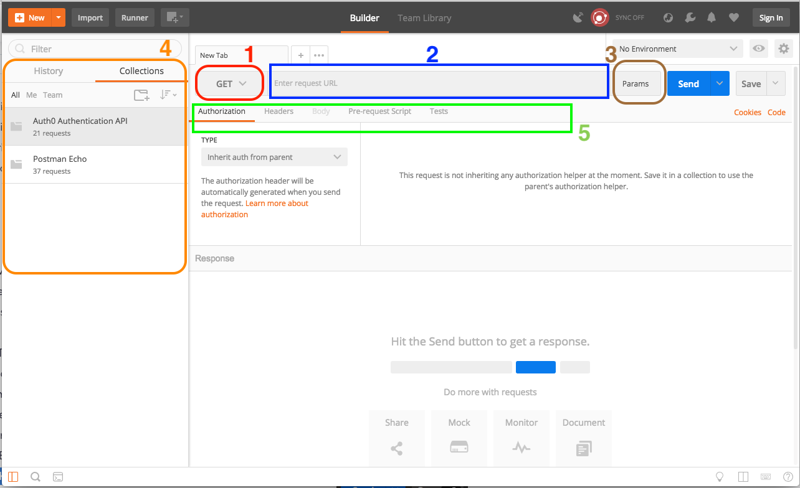

# Java et Springboot

## Historique

Java est un langage et un ensemble de classes prévues pour la programmation générale.<br>
Pour programmer plus rapidement dans certains domaines, il a fallu mettre en place des extensions.<br>
Cela a concerné les domaines professionnels qui avaient besoin :
* de créer des connexions avec des BDD.
* de faciliter les architectures MVP pour le web avec les Servlets (contrôleurs) et JSP (templates pour les vues).
* de divers aspects d'architecture et outils (inversion de dépendances, XML,, convention "Beans", connecteur mail, etc.)

Cela a donné lieu à J2EE (Java 2 Enterprise Edition), nommé ensuite Java Enterprise Edition puis Jakarta_EE.<br>
<a href="https://en.wikipedia.org/wiki/Jakarta_EE">source</a>

Les premières versions de J2EE/JEE étaient considérées à la fois très intéressantes et difficiles à appréhender pour la mise en œuvre.<br>
Des multiples efforts ont été menés et se sont inspirés de J2EE. C'est ainsi que Spring est né.<br>
<a href="https://fr.wikipedia.org/wiki/Spring_(framework)">Spring framework wiki</a>

Avant de voir ce qu'est Spring boot, voyons ce qu'est Spring.

## Qu'est-ce que Spring ?

Il s'agit d'un framework open source pour créer et définir l'infrastructure d'une application Java, dont il facilite le développement et les tests.<br>
Spring est un conteneur dit "léger" qui s'appuie sur 3 concepts clés :
1. Inversion de contrôler assurée de deux façons différentes : la recherche et dépendances et l'injection de dépendances ;
2. La programmation orientée aspect ;
3. Une couche d'abstraction ;

La couche d'abstraction permet d'intégrer d'autres frameworks et bibliothèques avec une plus grande facilité.<br>
Cela se fait par l'apport ou non de couches d'abstraction spécifiques à des frameworks particuliers. On peut ainsi intégrer un module d'envoi de mails plus facilement.<br>

L'inversion de contrôle :
* La recherche de dépendance consiste pour un objet à interroger le conteneur afin de trouver ses dépendances avec les autres objets. (cas de fonctionnement similaire aux EBJs)
* L'injection de dépendances peut être effectuée de 3 manières possibles :
  1. Via le constructeur
  2. via les modificateurs (setters)
  3. via une interface

Les deux premières sont les plus utilisées par Spring.

Grâce à sa couche d'abstraction, ce framework ne concurrence pas d'autres frameworks dans une couche spécifique d'un modèle architectural : modèle-vue-contrôleur.<br>
Il s'agit plutôt d'un framework multi-couches pouvant s'insérer au niveau de toutes les couches : modèle, vue et contrôleur.<br>

### Composition de Spring

Spring est composé d'un noyau basé sur :
* Une fabrique générique de composants informatiques, composants nommés "beans" (grains de café dans le contexte de Java).
* Un conteneur capable de stocker ces beans.

Le noyau de Spring permet de forcer le contrôle de ces composants de leur extérieur par la technique appelée : inversion de contrôle.<br>
Le principal avantage est de composer les beans de façon plus déclarative plutôt que de façon impérative dans le programme.<br>
Les beans peuvent être définis par le biais de fichiers de configuration en Java ou XML.

### En résumé

L'idée principale est d'avoir des composants (Beans) d'une application (en général web) qui peuvent être assemblés de façon dynamique pour réaliser cette application.<br>
Ces composants sont définis par l'interface qu'ils implémentent (contrat) et l'instance effective des composants découle de la configuration de l'application.<br>
Cela permet de facilement changer les composants de l'application (découplage) pour par exemple :<br>
* avoir une version avec stockage local, une version avec un stockage web dans une base MongoDB.<br>
* remplacer un composant qui sera disponible en production par un composant "mimant" son fonctionnement et permettre de tester le reste de l'application (principe des "mock/stub" ou "simulacre/bouchon").<br> 
cf. : <a href"https://www.test-recette.fr/tests-techniques/deployer-tests-unitaires/simulacres-bouchons/">simulacres et bouchons</a>

## Spring Boot

### Différence entre Spring et Spring boot

Spring boot simplifie l'utilisation de Spring.<br> 
Spring boot est construit sur le framework Spring conventionnel : il offre toutes les fonctionnalités de Spring et est encore plus facile à utiliser.<br>
Spring boot est un framework basé sur des microservices et crée une application prête pour la production en très peu de temps.<br>

Tout est configuré automatiquement. On a juste besoin d'utiliser une configuration appropriée pour utiliser une fonctionnalité particulière.<br>
Spring boot est très utile si on veut développer une API REST.<br>

<a href="https://stacklima.com/difference-entre-spring-et-spring-boot/">source</a>

Pour simplifier la configuration, Spring Boot propose deux fonctionnalités principales :
1. L'auto-configuration.
2. Les starters.

### L'auto-configuration 

Il s'agit de la fonctionnalité la plus importante de Spring Boot.<br>
Elle permet de configurer automatiquement une application à partir des JAR trouvé dans le classpath.<br>
Autrement dit : si on a importé des dépendances, Spring Boot ira consulter cette liste puis produira la configuration nécessaire pour que tout fonctionne correctement.<br>

```
N.B. : 
Un fichier JAR (Java archive) est un fichier ZIP utilisé pour distribuer un ensemble de classes Java. 
Ce format est utilisé pour stocker les définitions des classes, ainsi que des métadonnées, constituant l'ensemble d'un programme.
```

Il est possible de facilement personnaliser ces configurations en créant ses propres Beans ou ses propres fichiers de configuration.<br>
Spring boot utilisera alors en priorité ces paramètres créés.

### Les Starters

Les starters viennent compléter l'auto-configuration et font gagner du temps, particulièrement lorsqu'on commence le développement d'un microservice.<br>
Un starter va apporter à l'ensemble d'un projet un ensemble de dépendances, communément utilisées pour un type de projet donné.<br>
Cela va permettre de créer un "squelette" prêt à l'emploi, et cela très rapidement.<br>

L'autre énorme avantage est la gestion des versions.<br>
Plus besoin de chercher quelles sont les versions compatibles puis de les ajouter une à une dans le `pom.xml`.<br>
Il suffit d'ajouter une simple dépendance au starter choisi. Cette dépendance va alors ajouter les éléments dont elle dépend avec les bonnes versions.<br>

En temps normal, pour créer un microservice, il faut les dépendances suivantes : Spring, Spring MVC, Jackson (pour JSON), Tomcat...<br>
Avec Spring Boot, on va tout simplement avoir une seule dépendance dans le `pom.xml`.<br>

### En résumé 

* Spring Boot est un framework qui permet de démarrer rapidement le développement d'applications ou services, en fournissant les dépendances nécessaires et en autoconfigurant celles-ci.
* Pour activer l'auto-configuration, on utilise l'annotation `@EnableAutoConfiguration`. Si vous écrivez vos propres configurations, celles-ci priment sur celles de Spring Boot.
* Les starters permettent d'importer un ensemble de dépendances selon la nature de l'application à développer, afin de démarrer rapidement.

## Créer un microservice grâce à Spring Boot

### Spring Initializr

Spring Initializr permet de composer une application selon ses besoins.

Pour débuter : <a href="https://start.spring.io/">https://start.spring.io/ </a>

Sélectionner : 
* le gestionnaire de projet (Maven ou Gradle)
* le langage Java (Kotlin ou Groovy)
* la version de SpringBoot

On peut initialiser :
* Les métadonnées du projet
* le packaging et la version de Java
* et les dépendances grâce au bouton "Add dependencies"

### Créer et importer à partir de Spring Initializr

Renseigner les Metadata du projet :
* Groupe : `com.nom_du_projet` // ici ecommerce
* Artifact : `microservice` // à modifier selon le projet
* Name : `microservice` // à modifier selon le projet
* Packaging : `jar`
* Java Version : `11` (ou ultérieur)

Sélectionner ensuite le starter Web.<br>
Cliquer sur "Generate Project" et télécharger l'application générée.<br>
Penser à créer un dossier racine au projet et procéder à l'extraction de l'application téléchargée qui devrait s'appeler "microservice.zip" (selon le nom renseigné dans les metadata).<br>
Dans IntelliJ, cliquer sur "File", puis "Open" et sélectionner le dossier de l'application extrait précédemment.<br>

dans l'arborescence, on retrouve :

#### pom.xml

```
<parent>
  <groupId>org.springframework.boot</groupId>
  <artifactId>spring-boot-starter-parent</artifactId>
  <version>2.7.15</version>
  <relativePath/> <!-- lookup parent from repository -->
</parent>

<properties>
  <java.version>11</java.version>
</properties>

<dependencies>
  <dependency>
    <groupId>org.springframework.boot</groupId>
    <artifactId>spring-boot-starter-web</artifactId>
  </dependency>

  <dependency>
    <groupId>org.springframework.boot</groupId>
    <artifactId>spring-boot-starter-test</artifactId>
    <scope>test</scope>
  </dependency>
</dependencies> 
```

On peut retrouver la liste des dépendances importées dans "External Libraries".<br>
Dans cette liste on retrouve principalement :
* **Jackson** : permet de parser JSON et faire le lien entre les classes Java et le contenu JSON.
* **Tomcat** : intégré, il permet de lancer l'application en exécutant tout simplement le JAR sans avoir à le déployer dans un serveur d'application.
* **Hibernate** : facilite la gestion des données.
* **Logging** : remonte ce qui se passe dans l'application grâce à logback et autres.

#### MicroserviceApplication.java

Classe générée automatiquement par Spring Boot, elle est le point de démarrage de l'application :
```
package com.ecommerce.microservice;

import org.springframework.boot.SpringApplication;
import org.springframework.boot.autoconfigure.SpringBootApplication;

@SpringBootApplication

public class MicroserviceApplication {

	public static void main(String[] args) {
		SpringApplication.run(MicrommerceApplication.class, args);
	}

}
```
Cette classe lance la classe SpringApplication, responsable du démarrage de l'application Spring.<br>
Elle va créer le fameux _ApplicationContext_ dans lequel iront toutes les configurations générées automatiquement ou qu'on aura ajoutées.<br>

l'annotation **@SpringBootApplication** est l'information la plus importante : elle encapsule 3 annulations :
1. **@Configuration** : donne à la classe actuelle la possibilité de définir des configurations qui iront remplacer les traditionnels fichiers XML.<br> 
Ces configurations se font via des Beans.
2. **@EnableAutoConfiguration** : cette annotation permet, au démarrage de Spring, de générer automatiquement les configs nécessaires en fonction des dépendances situées dans le classpath.<br>
3. **@ComponentScan** : indique qu'il faut scanner les classes de ce package afin de trouver des Beans de configuration.<br>

Pour personnaliser finement le comportement de Spring Boot, on peut remplacer cette annotation : @SpringBootApplication par les 3 annotations vu ci-dessus :
``` 
...
...

@Configuration
@EnableAutoConfiguration
@ComponentScan

public class MicroserviceApplication {
...
...
}
```

<a href="https://zetcode.com/springboot/annotations/">Annotations basiques de Spring Boot</a>

#### application.properties

Ce fichier va permettre de modifier très simplement un nombre impressionnant de configurations liées à Spring Boot et à ses dépendances.<br>
par exemple : changer le port d'écoute de Tomcat, l'emplacement des fichiers de log, les paramètres d'envoi d'emails, etc.<br>
voir la <a href="https://docs.spring.io/spring-boot/docs/current/reference/html/application-properties.html">liste complète</a>

#### MicroserviceApplicationTests.java

Ce fichier permet d'écrire les tests.

### Exécuter l'application

Malgré le fait qu'on n'ait encore rien ajouté à l'application, on peut déjà l'exécuter.<br>

```
N.B. :
Dans IntelliJ, si le panneau "Maven" à droite n'apparaît pas, il faudra l'activer : en bas à gauche sur le double lozange.
```

Cliquer sur le panneau de droite "Maven", puis ouvrir l'arborescence.<br>
Double-cliquer ensuite sur "Install" sous "LifeCycle". 

L'application sera compilée, et on retrouve le JAR sous le nouveau dossier "Target" créé pour l'occasion par Maven.

On peut ensuite exécuter l'application depuis n'importe quel terminal avec la commande :
```
java -jar Chemin/vers/microservice/target/microservice-0.0.1-SNAPSHOT.jar
```
**Ou par le bouton "RUN" d'IntelliJ dans le fichier `MicroserviceApplication.java` à la ligne de la classe.**

On aura alors un retour du type : 
```
  .   ____          _            __ _ _
 /\\ / ___'_ __ _ _(_)_ __  __ _ \ \ \ \
( ( )\___ | '_ | '_| | '_ \/ _` | \ \ \ \
 \\/  ___)| |_)| | | | | || (_| |  ) ) ) )
  '  |____| .__|_| |_|_| |_\__, | / / / /
 =========|_|==============|___/=/_/_/_/
 :: Spring Boot ::               (v2.7.15)

2023-08-29 12:05:25.530  INFO 19440 --- [           main] c.e.micrommerce.MicrommerceApplication   : Starting MicrommerceApplication using Java 18.0.2 on user-HP-ProDesk-600-G3-SFF with PID 19440 (/home/user/Cours/Java_Springboot/projet_test/micrommerce/target/classes started by user in /home/user/Cours/Java_Springboot/projet_test/micrommerce)
2023-08-29 12:05:25.532  INFO 19440 --- [           main] c.e.micrommerce.MicrommerceApplication   : No active profile set, falling back to 1 default profile: "default"
2023-08-29 12:05:26.071  INFO 19440 --- [           main] o.s.b.w.embedded.tomcat.TomcatWebServer  : Tomcat initialized with port(s): 8080 (http)
2023-08-29 12:05:26.077  INFO 19440 --- [           main] o.apache.catalina.core.StandardService   : Starting service [Tomcat]
2023-08-29 12:05:26.077  INFO 19440 --- [           main] org.apache.catalina.core.StandardEngine  : Starting Servlet engine: [Apache Tomcat/9.0.79]
2023-08-29 12:05:26.131  INFO 19440 --- [           main] o.a.c.c.C.[Tomcat].[localhost].[/]       : Initializing Spring embedded WebApplicationContext
2023-08-29 12:05:26.131  INFO 19440 --- [           main] w.s.c.ServletWebServerApplicationContext : Root WebApplicationContext: initialization completed in 567 ms
2023-08-29 12:05:26.363  INFO 19440 --- [           main] o.s.b.w.embedded.tomcat.TomcatWebServer  : Tomcat started on port(s): 8080 (http) with context path ''
2023-08-29 12:05:26.370  INFO 19440 --- [           main] c.e.micrommerce.MicrommerceApplication   : Started MicrommerceApplication in 1.08 seconds (JVM running for 1.52)

```

On peut remarque cette phrase : "Tomcat started on port(s): 8080 (http)".<br>
Cela indique que l'application tourne et qu'elle est en écoute grâce à Tomcat sur le port 8080.<br>
Dans le navigateur, on peut aller à l'adresse : <a href="http://localhost:8080/">http://localhost:8080/ </a> <br>
Cela affiche une erreur actuellement car on a fourni aucun éléments à afficher.

On peut essayer de personnaliser la personnalisation de l'auto-configuration de Spring Boot avec **application.properties**.<br>
par exemple, on peut ajouter dans ce fichier : `server.port=9090` puis rerun l'application à partir du fichier **MicroserviceApplication.java**<br>
et aller à l'adresse <a href="http://localhost:9090/">http://localhost:9090/ </a> dans le navigateur pour obtenir le même affichage.<br>
On a simplement modifié le port d'écoute.<br>

### Créer une API REST

Le microservice qu'on souhaite développer va devoir être "RESTful" et donc communiquer de cette manière.<br>

#### Définition des besoins 

On va avoir besoin d'un **microservice** qui sera capable de gérer les produits.<br>
Il devra pouvoir exposer une API REST qui propose toutes les opérations CRUD (Create, Read, Update, Delete).<br>

On va donc devoir :
* créer une classe Produit qui représente les caractéristiques d'un produit (nom, prix, etc.).
* créer un contrôleur qui s'occupera de répondre aux requêtes CRUD et de faire des opérations nécessaires.

On voudra donc pouvoir appeler le microservice sur les URL suivantes :
* Requête **GET** à **/produits** : affiche la liste de tous les produits.
* Requête **GET** à **/produits/{id}** : affiche un produit par son Id.
* Requête **PUT** à **/produits/{id}** : met à jour un produit par son Id.
* Requête **POST** à **/produits** : ajoute un produit.
* Requête **DELETE** à **/produits/{id}** : supprime un produit par son Id.

#### Créer le contrôleur REST

On va créer un contrôleur et le placer dans un package "controller", lui même situé dans un package "web".<br>
Procéder ainsi :<br> 
* clic droit sur le package principal : **com.ecommerce.microservice**
* puis : New > Java Class
* écrire dans la boîte de dialogue : **web.controller.ProductController**

Quand on clique sur OK, IntelliJ crée un _package web_, puis crée à l'intérieur de celui-ci un package controller.<br>
La classe ProductController est alors créée à l'intérieur de ce dernier package.

Dans la fichier (la classe) ProductController, on va saisir le code suivant :
```
package com.ecommerce.microcommerce.web.controller;

import org.springframework.web.bind.annotation.RestController;

@RestController
public class ProductController {

}
```
l'annotation `@RestController` est la combinaison de deux annotations : `@Controller` et `@ResponseBody`.
* **@Controller** permet de désigner une classe comme controller, lui donnant la capacité de traiter les requêtes GET, POST, etc.
* **@ResponseBody** est ajouté aux méthodes qui devront directement répondre sans passer par une vue.

=> **@RestController** indique que la classe va pouvoir traiter les requêtes qu'on va définir et il indique que chaque méthode va renvoyer une réponse JSON à l'utilisateur.

```
N.B. : 
par convention, les conventions de nommage des API REST est ainsi :
* tout en camelCase et au pluriel !
* en anglais !
```

##### Méthode pour GET /products

Cette méthode retourne une "String".<br>
Etant donné qu'on a pas encore de produits, on va simplement retourner une phrase pour tester :

```
package com.ecommerce.micrommerce.web.controller;

import org.springframework.web.bind.annotation.GetMapping;
import org.springframework.web.bind.annotation.RestController;

@RestController
public class ProductController {

   @GetMapping("/products")
   public String productsList() {
       return "Product example";
   }

}
```

Dans les anciennes versions de Spring, on aurait utilisé : `@RequestMapping(value="/products", method=RequestMethod.GET)`.<br>
Cette méthode prend deux paramètres :
* **value** qui sert à définir l'URL sur laquelle on peut atteindre la méthode.
* **method** qui définit le verbe HTTP pour interroger l'URL.

Les nouvelles annotations sont les suivantes : **@GetMapping**, **@PostMapping**, **@PutMapping**, **DeleteMapping**.<br>
Ces méthodes permettent de ne spécifier que l'URL pour en utilisant le verbe HTTP lié (présent juste avant le mapping).<br>

Dans le code ci-dessus, on utilise l'annotation `@GetMapping` qui permet de faire le lien entre l'URL "/products", invoquée via GET et la méthode productsList.<br>
Cette annotation prend <a href="https://docs.spring.io/spring-framework/docs/current/javadoc-api/org/springframework/web/bind/annotation/GetMapping.html">plusieurs paramètres</a> dont voici les principaux :
* **value** = URL à laquelle cette méthode doit répondre.
* **produces** = dans certains cas d'utilisation avancées, on aura besoin de préciser si la méthode est capable de répondre en XML ou en JSON.<br>
Si la requête contient du XML et qu'on a deux méthodes identiques dont une capable de produire du XML, c'est cette dernière qui sera appelée.<br>
C'est la même chose pour **consumes** qui précise les formats acceptés. Dans la plupart des cas, on a pas besoin de renseigner ces paramètres.

##### Méthode pour GET /products/{id}

Cette méthode est à ajouter à la suite de la précédente et s'écrit comme ça :
```
    @GetMapping("/products/{id}")
    public String displayProduct(@PathVariable int id) {
        return "You asked for a proudct with the id : " + id;
    }
```
On remarque l'ajout de l'`id` à l'URL. Cette notation permet d'indiquer que cette méthode doit répondre uniquement aux requêtes avec une URI de type `/products/25` par exemple.<br>
`@Pathvariable int id` indique que l'id retournée doit être un integer. Ainsi on ne pourra pas passer de chaîne de caractères. Sinon on aura une erreur.<br>

##### Renvoyer une réponse JSON

Pour commencer, on va créer une classe qui représente un produit. Cette classe s'appelle "Model" (ou "Bean" plus anciennement, ou POJO pour Plain Old Java Object).<br>
**Un Model est une classe classique** qui doit être "sériablisable" et avoir au minimum :
* un constructeur public sans arguments.
* des getters et setters pour toutes les propriétés de la classe.

On va donc créer une nouvelle classe "Product" qu'on va place dans un package "model" sous le package "microservice".
On va ensuite créer les propriétés de base de la classe :
```
package com.ecommerce.micrommerce.model;

public class Product {
  private int id;
  private String nom;
  private int prix;
}
```

En va générer ensuite le constructeur, les getters et les setters.<br>
`Alt` + `insert` (ou clic droit puis Générer) pour afficher la fenêtre de génération de code :
* Constructor : dans lequel on précise "sans arguments".
* Getters et Setters pour toutes les propriétés.
* methode toString().
* On ajoutera enfin un constructeur pour obtenir des instances de produits préremplies avec des informations de tests.

Le code obtenu devra ressembler à cela :
```
package com.ecommerce.micrommerce.model;

public class Product {
    private int id;
    private String name;
    private int price;

    public Product() {
    }

    public Product(int id, String name, int price) {
        this.id = id;
        this.name = name;
        this.price = price;
    }

    public int getId() {
        return id;
    }

    public void setId(int id) {
        this.id = id;
    }

    public String getName() {
        return name;
    }

    public void setName(String name) {
        this.name = name;
    }

    public int getPrice() {
        return price;
    }

    public void setPrice(int price) {
        this.price = price;
    }

    @Override
    public String toString() {
        return "Product{" +
                "id=" + id +
                ", name='" + name + '\'' +
                ", price=" + price +
                '}';
    }
}
```
A chaque fois que quelqu'un appellera l'URL "/products/{od}", on renverra un produit au format JSON qui correspond à la classe Product.<br>

Dans la classe ProductController, on va modifier la méthode displayProduct, le code complet de la classe sera le suivant :
```
package com.ecommerce.micrommerce.web.controller;

import com.ecommerce.micrommerce.model.Product;
import org.springframework.web.bind.annotation.GetMapping;
import org.springframework.web.bind.annotation.PathVariable;
import org.springframework.web.bind.annotation.RestController;

@RestController
public class ProductController {
  @GetMapping("/products")
  public String productsList() {
    return "Product example";
  }

  @GetMapping("/products/{id}")
  public Product displayProduct(@PathVariable int id) {
    Product product = new Product(id, new String("Aspirateur"), 100);
    return product;
  }
}
```

```
N.B. :
La syntaxe exacte à la place de celle ci-dessus est celle ci :
return product = new Product(id, new String("Aspirateur"), 100);
```

On indique ici que la méthode va retourner un "Product" au lieu d'une String.<br>
La réponse dans le navigateur sera formatée au format JSON.<br> 
Cela est possible car on a indiqué au début de la classe qu'elle est un contrôleur REST grâce à l'annotation @RestController.<br>
Spring sait alors que les réponses aux requêtes qu'il passe devront être très probablement au format JSON.

L'auto-configurateur va alors chercher si on a une dépendance capable de transformer un objet Java en JSON dans notre classpath et inversement.<br>
Il y a Jackson qui a été importé avec le starter qu'on a utilisé. Le Bean Product qu'on renvoit est donc transformé en JSON, puis servi en réponse.

Voici donc le premier microservice REST sans avoir à manipuler JSON ni a parser les requêtes HTTP.

### Communiquer avec la Base De Données 
#### Création du DAO

**DAO = Data Access Object**<br>
Il s'agit d'une "responsabilité". Elle permet d'accéder au système d'information pour lire ou modifier des données.<br>
Les classes DAO (qui contiennent le suffixe ... Dao) sont des classes qui contiennent le code qui permet d'échanger des informations avec la base de données.<br>

Pour cela, on va procéder comme suit :
* création d'un package appelé "dao".
* dans ce package, on ajoute une interface qu'on appelle "ProductDao". On va y déclarer les opérations qu'on veut implémenter :
  * _findAll_ = renvoie la liste complète de tous les produits
  * _findById_ = renvoie un produit par son id
  * _save_ = ajoute un produit

```
package com.ecommerce.micrommerce.web.dao;

import com.ecommerce.micrommerce.web.model.Product;

import java.util.List;

public interface ProductDao {
  List<Product> findAll();
  Product findById(int id);
  Product save(Product product);
}
```

À partir de cette interface, on va ajouter une classe pour créer l'implémentation : "ProductDaoImplement".<br>
Etant donné qu'on ne dispose pas de base de données avec laquelle communiquer, on va simuler son comportement en créant des produits "en dur" :
```
package com.ecommerce.micrommerce.web.dao;

import com.ecommerce.micrommerce.web.model.Product;
import org.springframework.stereotype.Repository;

import java.util.ArrayList;
import java.util.List;

@Repository
public class ProductDaoImplement implements ProductDao{
   public static List<Product> products = new ArrayList<>();

   static {
       products.add(new Product(1, "Ordinateur portable", 350));
       products.add(new Product(2, "Aspirateur Robot", 500));
       products.add(new Product(3, "Table de Ping Pong", 750));
   }

   @Override
   public List<Product> findAll() {
       return products;
   }

   @Override
   public Product findById(int id) {
       for (Product product : products){
           if (product.getId() == id){
               return product;
           }
       }
       return null;
   }

   @Override
   public Product save(Product product) {
       products.add(product);
       return product;
   }
}
```
L'annotation `@Repository` est implémentée afin d'indiquer à Spring qu'il s'agit d'une classe qui gère des données.<br>
Cela permettra d'utiliser certaines fonctionnalités comme les translations des erreurs.

Un tableau faisant office de BDD est implémenté.<br>
Les méthodes définies dans l'interface sont ensuite redéfinies pour renvoyer les données du tableau :
* _findAll_ = renvoie la liste complète de tous les produits.
* _findById_ = vérifie s'il y a un produit avec l'id donnée dans la liste et renvoie le produit correspondant.
* _save_ = ajoute un produit reçu à la liste.

#### Intéraction avec les données

Il faut modifier le contrôleur pour qu'il utilise la **couche DAO** pour manipuler les produits :<br>
On crée d'abord une variable de type ProductDao, définie en **private final** (il s'agit d'une constante accessible uniquement ici).<br>
On injecte l'instance de ProductDao dans le constructeur afin d'avoir accès aux méthodes définies.<br>

La liste "productsList" contient maintenant une liste de produits définis en dur, et on peut accéder à un produit râce à la méthode displayProduct.

```
package com.ecommerce.micrommerce.web.controller;

import com.ecommerce.micrommerce.dao.ProductDao;
import com.ecommerce.micrommerce.model.Product;
import org.springframework.web.bind.annotation.GetMapping;
import org.springframework.web.bind.annotation.PathVariable;
import org.springframework.web.bind.annotation.RestController;

import java.util.List;

@RestController
public class ProductController {
    private final ProductDao productDao;

    public ProductController(ProductDao productDao) {
        this.productDao = productDao;
    }

    @GetMapping("/products")
    public List<Product> productsList() {
        return productDao.findAll();
    }

    @GetMapping("/products/{id}")
    public Product displayProduct(@PathVariable int id) {
        return productDao.findById(id);
    }
}
```

## Tester son API avec POSTMAN

Ce logiciel permet de tester l'API en envoyant toutes sortes de requêtes et permet de les personnaliser.<br>

### Implémentation de "POST"

On va ajouter la méthode POST au controller :

```
    @PostMapping("/products")
    public void addProduct(@RequestBody Product product) {
        productDao.save(product);
    }
```
* **@PostMapping** = L'URI indiqué est la même que pour la méthode productsList.<br> 
Les annotations @PostMapping et @GetMapping permettent à Spring de quel type de requête HTTP la méthode est associée : POST ou GET.<br>
Si on envoie une requête POST sur "/produits", la méthode annotée avec @PostMapping sera appelée.
* **@RequestBody** = Cette annotation demande a Spring de convertir le contenu de la party body de la requête HTTP (au format JSON) en objet Java.<br>
Spring étant autoconfiguré dès le départ, il va aller chercher la librairie capable de faire cette procédure, dans notre cas : Jackson.<br>
La requête JSON est ainsi convertie, on procède ensuite avec l'appel de la méthode "save" pour ajouter le produit.

### Principe de POSTMAN

Postman est un logiciel qui se focalise sur les tests des API et permet de tester les microservices.<br>

Principales fonctionnalités à connaître :
* **(1)** = choix du type de requête : GET, POST, PUT, etc.
* **(2)** = URL de l'API.
* **(3)** = paramètre à passer avec l'URL. utile quand on a beaucoup de paramètres à organiser.
* **(4)** = connexions qu'on a créé.
* **(5)** = tout ce qui constitue la requête HTTP (header, body, etc.), cela permet de créer une requête totalement personnalisée.



Pour tester l'application dans Postman : ajouter l'URL http://localhost:9090/products avec la méthode "GET".<br>
le résultat sera le suivant : 


L'onglet Header présente l'en-tête de la réponse HTTP :


On peut remarquer que Spring a réglé la valeur "Content-Type" sur `application/json;charset=UTF-8` .<br>
Le code de réponse (en haut à droite) est le code 200 (requête HTTP réussie). (voir la signification des codes <a href="https://openclassrooms.com/fr/courses/6573181-adoptez-les-api-rest-pour-vos-projets-web/7498761-utilisez-postman-pour-formuler-vos-requetes">REST</a><br>

#### Tester la méthode POST

La méthode POST sera associée à l'ajout d'un produit.<br>
Dans Postman :
* On sélectionne POST (au lieu de GET) et on ajoute l'URL http://localhost:9090/products
* On clique sur l'onglet "Body" (qui n'est plus grisé) et on sélectionne _raw_ pour définir manuellement le contenu de la requête HTTP
* On ajoute le code en exemple ci-dessous dans le corps de la requête :
```
{
"id": 4,
"name": "Poney en bois cracheur de feu",
"price": 145
}
```
* on sélectionne à droite **JSON** (à la place de Text) pour indiquer le type de données qu'on envoie<br>

* et on vérifie que le résultat a bien été ajouté en créant un nouvel onglet et en faisant appel à http://localhost:9090/products via GET :<br>


Et on constate que le nouvel article a été ajouté.

#### Les Collections dans Postman

Sur le panneau de gauche, on peut observer deux onglets qui contiennent "History" et "Collections".

1. **History** : il s'agit de l'historique de toutes les requêtes qu'on a exécutées. On peut ainsi y retourner et exécuter de nouveau une requête par exemple.
2. **collections** : c'est une façon permanente d'organiser et garder des requêtes pour faire des tests.<br>
Elles vont permettre de regrouper un ensemble de requêtes et de les lancer selon les paramètres et l'ordre de notre choix (pour réaliser un test de scénario par exemple).

Procédure pour créer une collection :
* On va commencer par créer une nouvelle collection en cliquant sur `+` et en nommant la collection.<br>
* Puis sur chaque onglet de requête, on va cliquer sur "SAVE" et spécifier la collection dans laquelle on souhaite sauvegarder la requête.<br>
(N.B. : on peut nommer la requête, mais pour plus de lisibilité, il est préférable de laisser tel quel)
* On obtient alors une collection avec 2 requêtes
* On redémarre le microservice, on réorganise les requêtes pour qu'elles s'exécutent dans l'ordre (POST avant GET) puis on clique sur "Run", et on voit les résultats.
* Pour plus de détail, on peut voir la console de Postman : "View" > "Show Postman Console".

### Implémenter la méthode PUT

```
    @ApiOperation("Méthode pour modifier les infos d'un produit")
    @PutMapping("/products/{id}")
    public Product updateProduct(@PathVariable int id, @RequestBody Product product) {
        Product updateProduct = productDao.findById(id);

        updateProduct.setFirstName(product.getName());
        updateProduct.setLastName(product.getPrice());
        
        return updateProduct;
    }
```

### Implémenter la méthode DELETE

``` 
  @ApiOperation("Méthode pour supprimer un produit")
    @DeleteMapping("/products/{id}")
    public Product deleteProduct(@PathVariable int id) {
        return productDao.delete(id);
    }
```

## Documenter son API avec SWAGGER

Contrairement à la SOA (Service Oriented Architecture), les contrats type WDSL (Web Services Description Language) sont rarement utilisés en archi Microservices.<br>
Il est donc primordial d'avoir une doc standardisée et de très bonne qualité.

à partir du code, **Swagger** est capable de générer une documentation détaillée au format **JSON** et répondant aux spécifications OpenAPI.<br>
On peut également visualiser cette doc dans un format HTML élégant.

Pour bénéficier de Swagger, on va procéder en plusieurs étapes : 
1. importer cette dépendance dans le `pom.xml` :
```
<dependency>
<groupId>io.springfox</groupId>
<artifactId>springfox-boot-starter</artifactId>
<version>3.0.0</version>
</dependency>
```
```
Attention ! il faudra importer swagger avec Maven. Dans IntelliJ, une petite icône "Maven" va apparaître en haut à droite,
il faudra alors cliquer dessus et importer le nécessaire.  
```

2. Pour générer la doc, on doit remplacer l'annotation `@EnableSwagger2` dans la classe contenant avec la méthode Main.<br>
Cela va importer automatiquement le package correspondant.<br>
Dans notre cas, il s'agit de **MicrocommerceApplication**.

```
package com.ecommerce.micrommerce;

import org.springframework.boot.SpringApplication;
import org.springframework.boot.autoconfigure.SpringBootApplication;
import springfox.documentation.swagger2.annotations.EnableSwagger2;

@SpringBootApplication
@EnableSwagger2
public class MicrommerceApplication {

  public static void main(String[] args) {
     SpringApplication.run(MicrommerceApplication.class, args);
  }

}
```
3. dans le fichier "application.properties" sous le dossier "resources", ajouter la ligne suivante :
`spring.mvc.pathmatch.matching-strategy=ant_path_matcher`
4. Redémarrer l'application et se rendre à l'adresse suivante : http://localhost:9090/swagger-ui/ (pour bénéficier de la version HTML de la doc)

Dans cette version HTML de la doc générée par swagger, on retrouve toutes les détails sur :
* le type de données qu'elle accepte en entrée et qu'elle produit en retour
* un exemple d'une réponse typique
* tous les codes d'erreur qu'elle peut générer

#### Configurer Swagger

Dans une application professionnelle, il peut être utile de personnaliser la documentation.<br>
Pour configurer, on va créer une classe de configuration pour Swagger appelée **SwaggerConfig**.
Cette classe sera intégrée dans un nouveau package **configuration**.
Cette classe contiendra le code suivant :
```
SwaggerConfig.java

package com.ecommerce.micrommerce.configuration;
import org.springframework.context.annotation.Bean;
import org.springframework.context.annotation.Configuration;
import springfox.documentation.builders.PathSelectors;
import springfox.documentation.builders.RequestHandlerSelectors;
import springfox.documentation.spi.DocumentationType;
import springfox.documentation.spring.web.plugins.Docket;
import springfox.documentation.swagger2.annotations.EnableSwagger2;

@Configuration
@EnableSwagger2
public class SwaggerConfig {
   @Bean
   public Docket api() {
       return new Docket(DocumentationType.SWAGGER_2)
               .select()
               .apis(RequestHandlerSelectors.any())
               .paths(PathSelectors.any())
               .build();
   }
}
```

**Explications :** <br>

**@Configuration** : cette annotation appliquée à la classe permet de remplacer un fichier de configuration classique en XML.<br>
Elle donne accès à plusieurs méthodes pour la configuration de Swagger, grâce à la **classe Docket** qui gère toutes les configurations.

* On commence alors par initialiser un objet Docket en précisant que nous souhaitons utiliser Swagger 2.
* **select** permet d'initialiser une classe du nom de ApiSelectorBuilder qui donne accès aux méthodes de personnalisation suivantes.<br> 
Ne pas s'attarder sur cette méthode, elle n'est d'aucune utilité pour la suite.
* **apis** est la première méthode importante. Elle permet de filtrer la documentation à exposer selon les contrôleurs.<br> 
Ainsi, on peut cacher la documentation d'une partie privée ou interne de votre API. Dans ce cas, nous avons utilisé RequestHandlerSelectors.any().
* **RequestHandlerSelectors** est un prédicat (introduit depuis Java 8) qui permet de retourner TRUE ou FALSE selon la condition utilisée.<br> 
Dans ce cas, nous avons utilisé any qui retournera toujours TRUE. En d'autres termes, nous indiquons vouloir documenter toutes les classes dans tous les packages.<br> 
**RequestHandlerSelectors** offre plusieurs autres méthodes, comme annotationPresent qui vous permet de définir une annotation en paramètre.<br> 
Swagger ne documente alors que les classes qu'il utilise. La plus utilisée est basePackage qui permet de trier selon le Package. 
* **paths** : cette méthode donne accès à une autre façon de filtrer : selon l'URI des requêtes.<br> 
Ainsi, on peut par exemple demander à Swagger de ne documenter que les méthodes qui répondent à des requêtes commençant par "/public".

Dans la doc, la première partie ne sert à rien. On va donc l'éliminer en appliquant des filtres :<br>
On utilisera la méthode "**basepackage("com.ecommerce.microcommerce.web")**" à la place de _any()_ après _RequestHandlerSelectors_.

#### Personnalisation de la doc grâce aux annotations

En utilisant l'annotation `@Api` directement dans les classes, on peut ajouter une description pour chaque API.<br>
L'annotation `@ApiOperation` permet de définir une description pour chaque opération/méthode.

La documentation complète est disponible <a href="https://springfox.github.io/springfox/docs/current/#docket-spring-java-configuration">ici</a>

## Consommer une API REST 

<a href="https://youtu.be/i6ipBFb-5YM?si=O5Oa4RYk9cFd0yAh">cours YouTube</a>

* 09 Configuring server port for microservices - Spring Boot Microservices Level 1
* 10 Coding the third service and discussing communication - Spring Boot Microservices Level 1
* 11 Using RestTemplate to call an external microservice API - Spring Boot Microservices Level 1
  * Si problèmes de compréhension, <a href="https://dzone.com/articles/how-to-use-map-filter-collect-of-stream-in-java-8">cliquer ici</a>

Une version très simple et synthétique de consommer un service RESTful (mais sans explication orale) :<br>
<a href="https://youtu.be/W_PJJVt23I8?si=T0HWlSXUgtKreklj">https://youtu.be/W_PJJVt23I8?si=T0HWlSXUgtKreklj </a>

## Connecter une base de données

voir doc : 
<a href="https://spring.io/guides/gs/accessing-data-mysql/">ici</a>
<a href="https://www.tutorialspoint.com/spring_boot_jpa/spring_boot_jpa_overview.htm">tutos</a>

### Introduction à JPA

JPA = Java Persistence API.<br> 
Il s'agit d'une collection de classes et méthodes pour stocker de manière persistante une large quantité de données dans une BDD.<br>
JPA Agit comme une couche intermédiaire entre la base de donnée et l'application Java Spring Boot.<br>

JPA est une spécification qui explique comment on accède, gère et fait persister l'information/data entre des objets Java et une BDD relationnelle.<br>
Cela apporte une approche standard pour l'ORM (Object Relational Mapping).<br>
Spring Boot offre une intégration transparente avec JPA.<br>

#### Histoire

Les premières versions d'EJB definissaient une couche persistante combinée avec la couche de logique business en utilisant l'interface javax.ejb.EntityBean  
* Pendant l'introduction EJB 3.0, la couche persistante a été séparée et spécifiée en tant que JPA 1.0 (Java Persistence API).<br>
Les spécifications de cette API ont été sorties en même temps que les spécifications de Java EE5 le 11 mai 2006 en utilisant JSR 220.
* JPA 2.0 a été sorti avec les spécifications de JAVA EE6 le 10 décembre 2009 comme une part du Java Community Process JSR 317.
* JPA 2.1 a été sorti avec les spé de JAVA EE le 22 avril 2013 en utilisant JSR 338.

JPA est une API Open source. Beaucoup d'entreprises telles qu'Oracle, Redhat, Eclipse, etc. créent de nouveaux produits en y ajoutant la persistance JPA.<br>
On peut retrouver des produits comme : Hibernate, Eclipselink, Toplink, Spring Data JPA, etc.

```
N.B. :
EJB (Enterprises JavaBeans) = architecture de composants logiciels côté serveur pour la plateforme de développement Java
```

### Ajouter une base de données intégrée et générer les tables 

#### Transformation de la classe Product en entité

Pour commencer, on va intégrer au pom.xml les dependencies :
```
<dependencies>
	<dependency>
		<groupId>org.springframework.boot</groupId>
		<artifactId>spring-boot-starter-web</artifactId>
	</dependency>

	<dependency>
		<groupId>org.springframework.boot</groupId>
		<artifactId>spring-boot-starter-data-jpa</artifactId>
	</dependency>

	<dependency>
		<groupId>org.springframework.boot</groupId>
		<artifactId>spring-boot-starter-test</artifactId>
		<scope>test</scope>
	</dependency>

	<dependency>
		<groupId>io.springfox</groupId>
		<artifactId>springfox-boot-starter</artifactId>
		<version>3.0.0</version>
	</dependency>

	<!-- https://mvnrepository.com/artifact/mysql/mysql-connector-java -->
	<dependency>
		<groupId>mysql</groupId>
		<artifactId>mysql-connector-java</artifactId>
		<version>8.0.33</version>
	</dependency>
</dependencies>
```
 
ATTENTION ! Bien penser à "reload" Maven (onglet de droite d'IntelliJ) pour mettre à jour et vérifier que les dépendances ont bien été importées.<br>

On pourra donc ajouter les annotations `@Entity` et `@Id`à notre classe Product :
```
package com.ecommerce.micrommerce.web.model;

import com.fasterxml.jackson.annotation.JsonFilter;

import javax.persistence.Entity;
import javax.persistence.GeneratedValue;
import javax.persistence.Id;

//@JsonFilter("monFiltreDynamique")
@Entity
public class Product {
  @Id
  private int id;
  private String name;
  private int price;

  //information que nous ne souhaitons pas exposer
  private int prixAchat;
...
}
```
_Explication des annotations :_ 
* **@Entity** = cette annotation permet à la classe d'être scannée et prise en compte.<br> 
On aura donc pas besoin de passer par le fichier "persistence.xml".
* **@Id** = cette annotation permet d'identifier l'attribut sur lequel il est placé en tant qu'entité unique autogénérée.
* **@GeneratedValue** = Permet d'identifier l'attribut en tant que clé primaire de façon automatique lors de l'insertion en BDD.<br>
<a href="https://www.axopen.com/blog/2014/02/utilisation-de-lannotation-generatedvalue/">@GeneratedValue</a>

Concrètement, ces annotations permettent à Spring Boot de générer automatiquement les tables de notre base de données SQL.<br>
Liste et explication des annotations JPA <a href="https://gayerie.dev/epsi-b3-orm/javaee_orm/jpa_entites.html">ici</a>

#### Ajout de la BDD

```
N.B. : la suite de cette étape n'est pas nécessaire si on crée directement une BDD MySQL
```
##### Utilisation d'une BDD H2

Pour les tests, on utilisera une BDD **H2** qui est intégrable dans le microservice.<br>
H2 est une BDD légère (1Mo). Elle va créer les tables et les données uniquement en mémoire vive.<br>
Une fois l'application fermée, les données sont perdues. Cette approche est utile dans la phase de développement de microservices.<br>
On peut ainsi faire et refaire des tests en partant à chaque fois d'une base de données propres.<br>
Un autre avantage est qu'elle est très simple à mettre en place et qu'elle est complètement autoconfigurée par Spring Boot.<br>

On va donc ajouter au fichier pom.xml les dépendances suivantes :
```
<dependencies>

  <dependency>
    <groupId>org.springframework.boot</groupId>
    <artifactId>spring-boot-starter-web</artifactId>
  </dependency>

  <dependency>
    <groupId>org.springframework.boot</groupId>
    <artifactId>spring-boot-starter-data-jpa</artifactId>
  </dependency>

  <dependency>
    <groupId>com.h2database</groupId>
    <artifactId>h2</artifactId>
    <scope>runtime</scope>
  </dependency>

  <dependency>
    <groupId>org.springframework.boot</groupId>
    <artifactId>spring-boot-starter-test</artifactId>
    <scope>test</scope>
  </dependency>

</dependencies>
```
Bien penser à actualiser Maven pour importer la dépendance.<br>

On peut maintenant modifier le fichier **application.properties** :<br>
on demande à Spring d'afficher les requêtes SQL et d'activer l'interface graphique H2 (ce qui permet de visualiser les tables).
```
server.port 9090

spring.jpa.show-sql=true
spring.h2.console.enabled=true

spring.datasource.url=jdbc:h2:mem:testdb
spring.datasource.driverClassName=org.h2.Driver
spring.datasource.username=sa
spring.datasource.password=
spring.jpa.database-platform=org.hibernate.dialect.H2Dialect
spring.jpa.hibernate.ddl-auto=none
```

Il faut enfin configurer la table Product qui va être créée pour qu'elle contienne des données par défaut.<br>
* Créer un dossier "resources" et y insérer un fichier **data.sql** (qui contiendra les mêmes données écrites en dur dans le DAO) :
```
INSERT INTO product VALUES(1, 'Ordinateur portable' , 350, 120);
INSERT INTO product VALUES(2, 'Aspirateur Robot' , 500, 200);
INSERT INTO product VALUES(3, 'Table de Ping Pong' , 750, 400);
```
* On va également créer un fichier **schema.sql** pour définir les tables de la BDD :
```
CREATE TABLE product (
   id INT PRIMARY KEY,
   nom VARCHAR(255) NOT NULL,
   prix INT NOT NULL,
   prix_achat INT NOT NULL
);
```
Le fichier sera récupéré automatiquement puis exécuté dans la BDD une fois que la table sera créée.<br>
Il suffit de redémarrer l'application et de se rendre sur la console de H2 à l'adresse : http://localhost:9090/h2-console/ <br>
Dans le champ JDBC URL, il faut saisir : `jdbc:h2:mem:testdb` pour configurer la connexion vers la BDD testdb située en mémoire vive.<br>
On clique ensuite sur Connect. La console nous propose alors une interface permettant de visualiser la table PRODUCT.<br>
C'est grâce à l'annotation @Entity que cette table a été créée.

##### Utilisation d'une BDD MySQL

cette partie est faite en suivant le tuto : <a href="https://spring.io/guides/gs/accessing-data-mysql/">Accessing data with MySQL</a>

Il y a plusieurs étapes à réaliser :
1. Créer la BDD en MySQL
2. Modifier le fichier `application.properties`
3. Créer le modèle `@Entity` (ou le modifier)
4. Créer le Repository 
5. Puis le Controller (ou le modifier)

## Les Microservices et l'architecture microservice

### Définition

Au sein d'une application, il s'agit d'un regroupement de différents microservices qui ont chacun leur propre fonctionnalité.<br>

C'est une approche d'architecture logicielle ou une appli est décomposée en plusieurs petits services qui sont chacun spécialisés dans une seule tâche.<br>
Chaque service est spécialisé dans une seule tâche. On parle de service métier : un groupe de services techniques qui fournissent une fonctionnalité avec un sens métier.<br>

Par exemple, dans un site de vente en ligne, on aura plusieurs microservices pour :
* la fonctionnalité panier
* la fonctionnalité page d'accueil
* la fonctionnalité d'historique 
* ou encore la fonctionnalité d'inventaire
* etc.

### But 

L'architecture microservice a été inventée pour répondre à la problématique des applications monolithes.

**Application monolithe :**<br>
Application qui a pour ambition de traiter toutes les demandes possibles et de répondre à un maximum de cas d'usage.<br>

_Problème_ :<br> 
avec le temps, les applications ont tendance à grossir de plus en plus, car elles intègrent toujours plus de fonctionnalités, sans supprimer les anciennes.<br>
Certaines de ces fonctionnalités deviennent inutiles ou obsolètes. Avec le temps, les différentes briques développent des interdépendances entre elles.<br>
Le code devient de plus en plus complexe et il devient alors impossible d'avoir en tête un modèle global du projet.<br>
L'application devient ainsi difficile à maîtriser et à faire évoluer.<br>
Plus un projet est gros, plus il est critique pour l'entreprise, et moins on va prendre de risque pour tester des nouveautés.

Pour une application monolithe, on va préférer la stabilité à l'innovation.<br>
La réponse de l'architecture microservice à ce problème est simple :<br>
On découpe l'application en différents modules fonctionnels (microservices), et chaque module exécute une partie spécifique et unique de l'application.<br>
Ces services peuvent être accessibles par le client via l'API du microservice correspondant.<br>

Le but de ce type d'architecture est de redonner un maximum d'agilité et d'évolutivité à une application.<br>

### Technique

Techniquement, l'architecture microservice est très souvent couplée à la technologie des conteneurs, notamment à Docker.<br>
voir <a href="https://course.valentinflgt.fr/#/c/2023/docker/1.-introduction#concept-101-%25F0%259F%2593%259A">cours sur Docker</a>

Le principe ici est d'avoir un conteneur par unité de microservice.<br>
Chaque microservice a son propre environnement d'exécution pour héberger son code.<br>
Avec les conteneurs, il est très facile d'adapter en fonction du besoin d'adapter le nombre de microservice à la hausse comme à la baisse :<br>
* Si un service est plus demandé lors du pic de charge, il suffit de créer plus de conteneurs hébergeant ce microservice.<br>
* Quand la demande de ce service diminue, il suffit de ne garder que le minimum de microservice pour couvrir la demande.

Ainsi, dans l'architecture microservice, il suffit d'adapter le nombre de ce microservice au besoin.<br>
Alors que dans une application monolithe, il aurait fallu modifier la totalité de l'application à cause des interdépendances.<br>

En étant couplé avec les conteneurs, chaque microservice devient autonome vis-à-vis des autres microservices.<br>
Cela signifie que dans une appli découpée en microservices, il est plus simple de cibler les différentes parties impactées lors d'une évolution,<br>
Cela facilite la modification des parties concernées sans prendre de risque pour le reste de l'application non impliqué.<br>

Ainsi, les mises à jour et les nouvelles fonctionnalités peuvent être déployées plus facilement et rapidement, rendant le déploiement continu possible.<br>

Cela permet aussi, pour des projets de grande taille, de limiter à une équipe de quelques personnes une tâche spécifique qui va gérer son organisation et sa base de code.<br>
Cette équipe est alors libre des choix techniques en fonction de ses propres besoins.

Tout cela permet à une entreprise d'avoir un avantage concurrentiel = un time to market rapide.

Time To Market = délai entre la naissance d'une idée et son lancement sur le marché.<br>

### En résumé :

Approche d'une application par une architecture en microservices vs application monolithe.<br>
Architecture en microservice :
* découpage en modules fonctionnels = microservices.
* chaque module exécute une partie spécifique et unique de l'application.
* chaque service est accessible par le client via l'API correspondante.

Contrairement à une app monolithe, une app en architecture microservices aura plus d'agilité et une plus grande possibilité d'évolution.<br>
On a ainsi une application qui se découpe en de plus petites applications (microservices) qui ont chacune une fonction unique, et qui communiquent entre elles via des appels API.<br>

Techniquement : on procède par une approche en conteneurs (comme docker).<br>
chaque unité de microservice aura son propre conteneur. On pourra augmenter ou baisser le nombre de conteneurs qui hébergent le microservice en question en fonction de la demande.<br>
Cela rend l'application adaptable selon les besoins.<br>

On gagne en agilité : 
* Chaque microservice est autonome vis-à-vis des autres.
* On peut plus facilement modifier, mettre à jour et déployer rapidement = déploiement continu.

Pour une explication complète, voir cette <a href="https://www.youtube.com/watch?v=j1gU2oGFayY">vidéo (en anglais)</a>