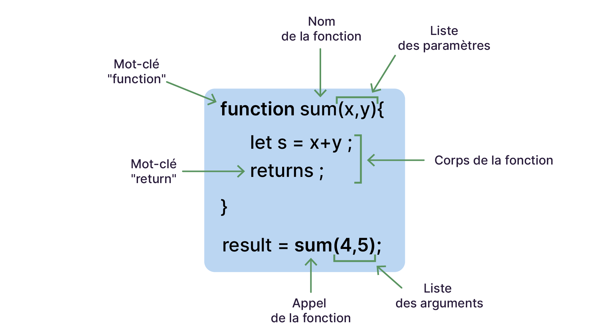

# Module 10 - Les fonctions

## Définition

Une fonction est un bloc de code auquel on attribue un nom. Quand on appelle cette fonction, on exécute le code qu'elle contient.

- Les **paramètres** sont les variables que la fonction déclare avoir besoin.
- Les **arguments** sont les valeurs passées lors de l'appel.
- La **valeur de retour** est le résultat produit par la fonction (`return`).

```javascript
function afficherDeuxValeurs(valeur1, valeur2) {
    console.log('Première valeur:' + valeur1);
    console.log('Deuxième valeur:' + valeur2);
}

afficherDeuxValeurs(12, 'Bonjour');
// > Première valeur:12
// > Deuxième valeur:Bonjour
```

## Portée locale

Les variables déclarées à l'intérieur d'une fonction sont **locales** : elles n'existent que le temps de l'exécution de la fonction et sont inaccessibles de l'extérieur.

```javascript
function calculer() {
    const resultat = 42; // variable locale
    return resultat;
}

const r = calculer(); // 42
console.log(resultat); // ReferenceError - resultat n'existe pas ici
```

En revanche, une fonction a accès aux variables du contexte englobant (portée parente) :

```javascript
const message = 'Bonjour';

function afficher() {
    console.log(message); // accès à la variable externe ✅
}
```

## Rédiger une fonction avec `return`

```javascript
function retournerMessageScore(score, nombreQuestions) {
    let message = 'Votre score est de ' + score + ' sur ' + nombreQuestions;
    return message;
}
```

Sans `return` explicite, une fonction retourne `undefined`.



## Paramètres par défaut

```javascript
function saluer(prenom = 'inconnu') {
    console.log(`Bonjour ${prenom}`);
}
saluer();          // "Bonjour inconnu"
saluer('Romain');  // "Bonjour Romain"
```

## Expression de fonction (fonction anonyme)

```javascript
const addition = function(a, b) {
    return a + b;
};
```

## Fonctions fléchées

Syntaxe alternative et concise :

```javascript
const addition = (a, b) => a + b;

const double = n => n * 2; // parenthèses optionnelles si un seul paramètre

const saluer = () => {
    console.log('Bonjour');
};
```

## Différences entre fonction déclarée et fonction fléchée

**1. Le hoisting**

Une fonction déclarée avec `function nom() {}` est hissée et peut être appelée avant sa définition dans le code. Une fonction fléchée assignée à une `const` ne le peut pas.

**2. La valeur de `this`**

Une fonction classique possède sa propre valeur de `this`, déterminée par la façon dont elle est appelée. Une fonction fléchée n'a pas de `this` propre : elle utilise celui du contexte englobant (voir **module 12**).

```javascript
const obj = {
    nom: 'Romain',
    direBonjour() {
        // Ici this = obj ✅
        const message = () => `Bonjour ${this.nom}`; // la fléchée hérite du this de direBonjour
        return message();
    }
};
console.log(obj.direBonjour()); // "Bonjour Romain"
```

## Fonctions d'ordre supérieur

Une fonction est dite **d'ordre supérieur** (*higher-order function*) quand elle prend une autre fonction en argument, ou en retourne une.

C'est ce que font `map`, `filter`, `forEach`, `sort`... (module 07) : elles reçoivent une **fonction callback** qui définit leur comportement :

```javascript
const doubles = [1, 2, 3].map(n => n * 2); // map reçoit une fonction

// Une fonction qui retourne une fonction
function multiplierPar(facteur) {
    return function(n) {
        return n * facteur;
    };
}

const parTrois = multiplierPar(3);
parTrois(5); // 15
parTrois(7); // 21
```

Ce pattern est très courant : il permet de créer des fonctions spécialisées à partir d'une fonction générique.

## Closures

Une **closure** est la capacité d'une fonction à "se souvenir" des variables de son contexte de création, même après que ce contexte ait fini de s'exécuter.

```javascript
function creerCompteur() {
    let count = 0; // variable locale à creerCompteur

    return function() {
        count++;
        return count;
    };
}

const compteur = creerCompteur();
compteur(); // 1
compteur(); // 2
compteur(); // 3
// count est inaccessible directement, mais la fonction interne y a accès
```

Chaque appel à `creerCompteur()` crée un nouveau `count` indépendant :

```javascript
const compteur1 = creerCompteur();
const compteur2 = creerCompteur();

compteur1(); // 1
compteur1(); // 2
compteur2(); // 1 - count indépendant
```

Les closures sont utilisées partout : dans les callbacks, les modules, la gestion d'état, etc.

## Récursivité

Une fonction est **récursive** quand elle s'appelle elle-même. Toujours définir une **condition de sortie** pour éviter une boucle infinie.

```javascript
function factorielle(n) {
    if (n <= 1) return 1;         // condition de sortie
    return n * factorielle(n - 1); // appel récursif
}

factorielle(5); // 5 * 4 * 3 * 2 * 1 = 120
```

La récursivité est particulièrement adaptée aux structures hiérarchiques (arbres, menus imbriqués, systèmes de fichiers).

---

## Résumé

| Notion | À retenir |
|---|---|
| Fonction déclarée | `function nom() {}` - hissée, `this` dynamique |
| Expression de fonction | `const f = function() {}` - non hissée |
| Fonction fléchée | `const f = () => {}` - non hissée, pas de `this` propre |
| `return` | Retourne une valeur ; sans `return`, la fonction retourne `undefined` |
| Paramètres par défaut | `function f(a = 10) {}` - valeur utilisée si l'argument est absent |
| Portée locale | Les variables d'une fonction sont inaccessibles de l'extérieur |
| Hoisting | `function` : appel possible avant la déclaration ; fléchée : non |
| `this` | Fonction classique : valeur dynamique ; fléchée : héritée du contexte |
| Callback | Fonction passée en argument d'une autre fonction |
| Higher-order function | Fonction qui prend ou retourne une fonction |
| Closure | Fonction qui "mémorise" les variables de son contexte de création |
| Récursivité | Fonction qui s'appelle elle-même - toujours prévoir une condition de sortie |

## Prochaine étape

**Module 11 - Valeur vs Référence** : comprendre pourquoi copier un objet ne fait pas ce qu'on croit, les pure functions, et les différentes stratégies de clonage.
