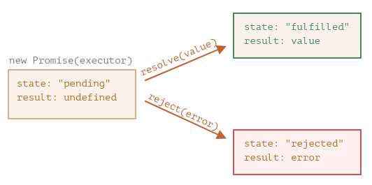
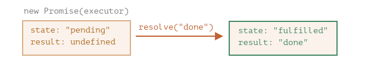
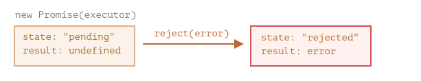

# Module 15 - Les Promesses

## Qu'est-ce qu'une promesse ?

Une **promesse** est un objet qui représente l'état d'une opération asynchrone. Elle peut être dans l'un des états suivants :
- `pending` : en attente (opération en cours)
- `fulfilled` : résolue (opération terminée avec succès)
- `rejected` : rejetée (opération terminée avec un échec)

## Créer une promesse

```javascript
const promise = new Promise((resolve, reject) => {
    // exécuteur : code asynchrone
    setTimeout(() => resolve("done"), 1000);
});
```

L'exécuteur est appelé automatiquement. Il appelle :
- `resolve(value)` en cas de succès → état `fulfilled`
- `reject(error)` en cas d'échec → état `rejected`



**Une promesse ne peut changer d'état qu'une seule fois.** Tout appel supplémentaire à `resolve`/`reject` est ignoré.

### Raccourcis : `Promise.resolve()` et `Promise.reject()`

Pour créer une promesse déjà résolue ou rejetée, sans passer par `new Promise` :

```javascript
const ok = Promise.resolve('valeur');          // promesse fulfilée immédiatement
const ko = Promise.reject(new Error('oups'));  // promesse rejetée immédiatement

// Utile pour les tests ou pour normaliser une valeur en promesse
async function getData(cache) {
    if (cache) return Promise.resolve(cache); // court-circuite la requête
    return fetch('/api/data').then(r => r.json());
}
```

## Exploiter le résultat avec `.then()` et `.catch()`

`.then()` reçoit deux callbacks : l'une pour le succès, l'autre pour l'échec :

```javascript
promise.then(
    result => alert(result),
    error  => alert(error)
);
```

`.catch()` est une syntaxe raccourcie pour gérer uniquement les rejets :

```javascript
promise.catch(error => alert(error));
```

Exemple complet :

```javascript
const loadScript = (src) => {
    return new Promise((resolve, reject) => {
        let script = document.createElement('script');
        script.src = src;
        document.head.append(script);
        script.onload  = () => resolve('Fichier ' + src + ' bien chargé');
        script.onerror = () => reject(new Error('Echec de chargement de ' + src));
    });
}

loadScript('boucle.js').then(
    result => alert(result),
    error  => alert(error)
);
```




## `finally`

`.finally(f)` s'exécute toujours, que la promesse soit résolue ou rejetée. Il sert au nettoyage :

```javascript
promise
    .finally(() => stopLoadingIndicator())
    .then(result => showResult(result), err => showError(err));
```

`finally` ne reçoit pas le résultat, mais le transmet au gestionnaire suivant.

## Chaîner les promesses

`.then()` retourne toujours une nouvelle promesse. On peut enchaîner les opérations asynchrones :

```javascript
loadScript('boucle.js')
    .then(result  => loadScript('script2.js', result))
    .then(result2 => loadScript('script3.js', result2))
    .catch(alert);
```

Un seul `.catch()` suffit pour toute la chaîne : elle s'arrête dès qu'une erreur est levée.

Exemple avec des délais :

```javascript
const sleep = (ms) => new Promise(resolve => setTimeout(resolve, ms));

const first  = () => sleep(300).then(() => console.log('message 1'));
const second = () => sleep(100).then(() => console.log('message 2'));
const third  = () => sleep(200).then(() => console.log('message 3'));

// Sans chaînage : affiche dans l'ordre de résolution (2, 3, 1)
first(); second(); third();

// Avec chaînage : affiche dans l'ordre (1, 2, 3)
first()
    .then(() => second())
    .then(() => third());
```

## `Promise.all()`

Lance plusieurs promesses en **parallèle** et attend que **toutes** soient résolues :

```javascript
Promise.all([
    loadScript('script1.js'),
    loadScript('script2.js'),
    loadScript('script3.js')
])
.then(resultats => console.log('Tous chargés :', resultats))
.catch(error   => console.log('Échec :', error));
```

Si **une** promesse échoue, `Promise.all()` rejette immédiatement avec cette erreur - les autres résultats sont abandonnés.

## `Promise.allSettled()`

Attend que **toutes** les promesses soient acquittées (résolues ou rejetées), sans s'arrêter au premier échec. Chaque résultat est un objet avec un champ `status` :

```javascript
const promesses = [
    Promise.resolve('script1 ok'),
    Promise.reject(new Error('script2 échoué')),
    Promise.resolve('script3 ok'),
];

Promise.allSettled(promesses).then(resultats => {
    resultats.forEach(r => {
        if (r.status === 'fulfilled') {
            console.log('Succès :', r.value);
        } else {
            console.log('Échec :', r.reason.message);
        }
    });
});
// Succès : script1 ok
// Échec : script2 échoué
// Succès : script3 ok
```

À privilégier sur `Promise.all()` quand on veut traiter tous les résultats indépendamment, sans qu'un échec n'annule les autres.

## `Promise.race()`

Se résout ou se rejette dès que la **première** promesse est acquittée :

```javascript
const timeout = new Promise((_, reject) =>
    setTimeout(() => reject(new Error('Timeout')), 3000)
);

Promise.race([
    fetch('/api/data'),
    timeout
])
.then(response => response.json())
.catch(err => console.log(err.message)); // "Timeout" si la requête dépasse 3 secondes
```

Cas d'usage typique : définir un timeout sur une opération asynchrone.

## Rejets non gérés - un piège courant

Oublier un `.catch()` produit un **rejet non géré** (*unhandled promise rejection*) : une erreur silencieuse qui peut faire planter l'application en production sans message d'alerte clair.

```javascript
// ⚠️ Dangereux : si fetch échoue, l'erreur est avalement
fetch('/api/data').then(r => r.json());

// ✅ Toujours ajouter un .catch()
fetch('/api/data')
    .then(r => r.json())
    .catch(err => console.error('Erreur réseau :', err));
```

> ℹ️ Avec `async`/`await` (module 16), on utilise `try...catch` (module 14) pour gérer ces erreurs, ce qui est souvent plus lisible.

---

## Résumé

| Notion | À retenir |
|---|---|
| `Promise` | Objet représentant une opération asynchrone en 3 états : `pending`, `fulfilled`, `rejected` |
| `new Promise((resolve, reject) => {})` | L'exécuteur s'exécute immédiatement |
| `resolve(value)` | Passe la promesse à l'état `fulfilled` avec `value` |
| `reject(error)` | Passe la promesse à l'état `rejected` avec `error` |
| `Promise.resolve(v)` | Promesse déjà résolue - raccourci utile |
| `Promise.reject(e)` | Promesse déjà rejetée - raccourci utile |
| `.then(onFulfilled)` | Callback appelée si la promesse réussit |
| `.catch(onRejected)` | Callback appelée si la promesse échoue |
| `.finally(fn)` | Callback appelée dans tous les cas, transmet le résultat |
| Chaînage | `.then()` retourne une nouvelle promesse - on peut chaîner |
| `Promise.all(arr)` | Parallèle : attend toutes les promesses, échoue au premier rejet |
| `Promise.allSettled(arr)` | Parallèle : attend toutes les promesses, ne s'arrête pas au premier échec |
| `Promise.race(arr)` | Se résout/rejette dès la première promesse acquittée |
| Rejet non géré | Toujours ajouter un `.catch()` pour éviter les échecs silencieux |

## Prochaine étape

**Module 16 - `async`/`await`** : sucre syntaxique sur les promesses - écrire du code asynchrone qui se lit comme du code synchrone, avec `try...catch` pour la gestion des erreurs.
