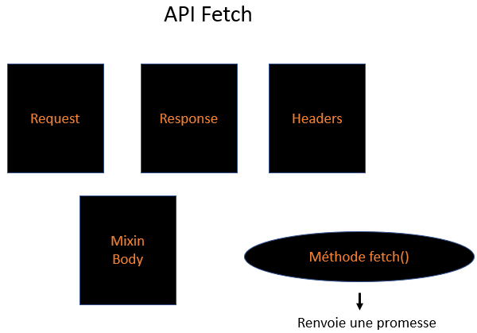
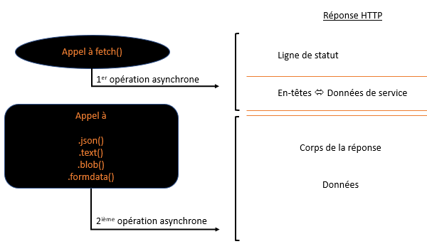
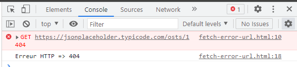
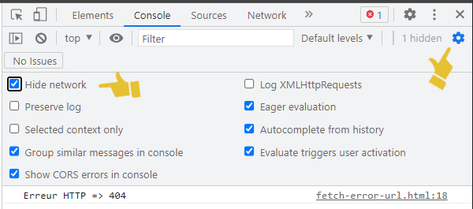
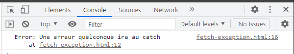
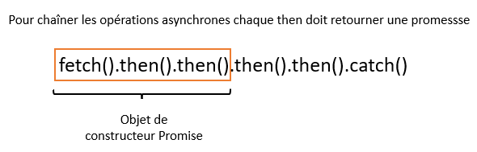
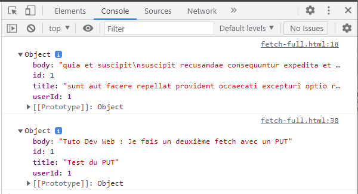

# Module 17 - L'API Fetch

## Qu'est-ce que `fetch` ?

`fetch()` est une fonction JS native qui permet de faire des **requêtes HTTP** depuis le navigateur vers un serveur, sans recharger la page (requêtes Ajax). Elle **travaille avec des promesses** : un appel `fetch()` retourne un objet `Promise`.

Les verbes HTTP disponibles : `GET` (récupérer), `POST` (envoyer), `PUT`/`PATCH` (mettre à jour), `DELETE` (supprimer).



## Fonctionnement

`fetch()` prend en argument obligatoire l'URL de la ressource. Elle retourne une promesse qui se résout avec un objet `Response` **dès que les en-têtes HTTP sont reçus** - avant même d'avoir le corps de la réponse.

**Attention** : les erreurs HTTP (404, 500...) ne rejettent PAS la promesse. Il faut vérifier `response.ok` manuellement.

Pour récupérer le corps de la réponse, on appelle une méthode asynchrone sur l'objet `Response` :

| Méthode | Retourne |
|---|---|
| `response.json()` | l'objet JS parsé depuis le JSON |
| `response.text()` | le corps sous forme de chaîne |
| `response.blob()` | un objet Blob (utile pour les images) |
| `response.formData()` | un objet FormData |

**Il faut donc toujours deux opérations asynchrones** pour récupérer des données avec `fetch` :

```javascript
fetch("https://jsonplaceholder.typicode.com/posts/1")
    .then(response => response.json())
    .then(data     => console.log(data))
    .catch(error   => console.log("Erreur :", error));
```



## Traiter les erreurs HTTP

```javascript
fetch('https://jsonplaceholder.typicode.com/posts/1')
    .then(rep => {
        if (rep.ok === true) return rep.json();
        else return Promise.reject(`Erreur HTTP => ${rep.status}`);
    })
    .then(data => console.log(data))
    .catch(err => console.log(err))
```

- `rep.ok` : booléen, `true` si le statut est entre 200 et 299.
- `rep.status` : code HTTP numérique (200, 404, 500...).

> ⚠️ **Distinction importante :**
> - Une **erreur réseau** (pas de connexion, DNS échoué) **rejette** la promesse → capturée par `.catch()`.
> - Une **erreur HTTP** (404, 500...) **ne rejette pas** la promesse → `fetch()` considère que la communication a réussi, même si le serveur renvoie une erreur. Il faut tester `response.ok` manuellement.

Exemple d'URL incorrecte → erreur HTTP capturée :




Toute exception levée dans un `.then()` est équivalente à un rejet de promesse et va au `.catch()` :

```javascript
fetch('...')
    .then(rep => { throw new Error('Erreur quelconque'); })
    .catch(err => console.log(err))
```



## Passer des options à `fetch()`

`fetch()` accepte un deuxième argument - un objet d'options :

```javascript
let promise = fetch(url, {
    method: "GET",    // GET, POST, PUT, DELETE...
    headers: {
        "Content-Type": "application/json; charset=UTF-8"
    },
    body: JSON.stringify(data), // pour POST/PUT
    mode: "cors",
    credentials: "same-origin",
    cache: "default"
});
```

> ℹ️ **CORS (Cross-Origin Resource Sharing)** : par défaut, le navigateur bloque les requêtes vers un domaine différent de la page courante. Le serveur doit explicitement autoriser l'origine dans ses en-têtes (`Access-Control-Allow-Origin`). C'est une restriction de sécurité du navigateur - pas de Node.js.

## Exemple : envoyer des données avec POST

Pattern à connaître par cœur pour créer une ressource :

```javascript
const createPost = async (postData) => {
    const response = await fetch('https://jsonplaceholder.typicode.com/posts', {
        method: 'POST',
        body: JSON.stringify(postData),
        headers: { 'Content-Type': 'application/json; charset=UTF-8' }
    });
    if (!response.ok) throw new Error(`Erreur HTTP ${response.status}`);
    return response.json();
};

try {
    const newPost = await createPost({
        title: 'Mon titre',
        body: 'Mon contenu',
        userId: 1
    });
    console.log(newPost); // { id: 101, title: 'Mon titre', ... }
} catch (err) {
    console.error(err.message);
}
```

Les trois éléments indispensables d'une requête POST :
1. `method: 'POST'`
2. `body: JSON.stringify(data)` - le corps en JSON
3. L'en-tête `Content-Type` pour indiquer au serveur le format envoyé

## Annuler une requête avec `AbortController`

`AbortController` permet d'annuler une requête `fetch` en cours - utile pour les timeouts ou quand l'utilisateur quitte une page avant la fin de la requête :

```javascript
const controller = new AbortController();

// Annuler automatiquement après 3 secondes
setTimeout(() => controller.abort(), 3000);

try {
    const response = await fetch('/api/data', { signal: controller.signal });
    const data = await response.json();
    console.log(data);
} catch (err) {
    if (err.name === 'AbortError') {
        console.log('Requête annulée (timeout)');
    } else {
        console.error('Erreur réseau :', err);
    }
}
```

On retrouve `controller.signal` dans les options du fetch. Appeler `controller.abort()` interrompt la requête et lève une `AbortError`.

## Exemple complet - GET puis PUT enchaînés

```javascript
fetch('https://jsonplaceholder.typicode.com/posts/1')
    .then(rep => {
        if (rep.ok) return rep.json();
        return Promise.reject(`Erreur HTTP fetch 1 => ${rep.status}`);
    })
    .then(data => {
        console.log(data);
        const newData = { ...data, title: 'Test du PUT', body: 'Nouveau contenu' };
        return fetch('https://jsonplaceholder.typicode.com/posts/1', {
            method: 'PUT',
            body: JSON.stringify(newData),
            headers: { 'Content-type': 'application/json; charset=UTF-8' }
        });
    })
    .then(rep => {
        if (rep.ok) return rep.json();
        return Promise.reject(`Erreur HTTP fetch 2 => ${rep.status}`);
    })
    .then(data => console.log(data))
    .catch(err => console.log(err))
```




## Réécriture avec `async`/`await`

La version `async`/`await` est strictement équivalente, mais se lit de haut en bas comme du code synchrone :

```javascript
const getAndUpdatePost = async () => {
    try {
        const rep1 = await fetch('https://jsonplaceholder.typicode.com/posts/1');
        if (!rep1.ok) throw new Error(`Erreur HTTP fetch 1 => ${rep1.status}`);
        const data = await rep1.json();

        const newData = { ...data, title: 'Test du PUT', body: 'Nouveau contenu' };

        const rep2 = await fetch('https://jsonplaceholder.typicode.com/posts/1', {
            method: 'PUT',
            body: JSON.stringify(newData),
            headers: { 'Content-type': 'application/json; charset=UTF-8' }
        });
        if (!rep2.ok) throw new Error(`Erreur HTTP fetch 2 => ${rep2.status}`);
        const updated = await rep2.json();

        console.log(updated);
    } catch (err) {
        console.log(err);
    }
};

getAndUpdatePost();
```

Un seul bloc `try...catch` gère l'ensemble des erreurs HTTP et réseau.

---

## Résumé

| Notion | À retenir |
|---|---|
| `fetch(url)` | Retourne une promesse résolue dès la réception des **en-têtes** |
| Deux opérations async | `fetch()` puis `.json()` / `.text()` / `.blob()`... pour lire le **corps** |
| `response.ok` | `true` si statut 200-299 - les erreurs HTTP ne rejettent **pas** la promesse |
| `response.status` | Code HTTP numérique (200, 201, 400, 404, 500...) |
| Erreur réseau | Rejette la promesse - capturable dans `.catch()` ou `try...catch` |
| Erreur HTTP | Ne rejette pas - vérifier `response.ok` manuellement |
| `method: 'POST'` | Verbe HTTP dans les options |
| `body: JSON.stringify(data)` | Corps de la requête pour POST/PUT |
| `Content-Type` | En-tête obligatoire pour indiquer le format du corps au serveur |
| `AbortController` | Annuler une requête en cours (`controller.signal` + `controller.abort()`) |
| CORS | Restriction navigateur : le serveur doit autoriser l'origine |

## Conclusion

Ce module est le dernier du cours. `fetch` est le point de convergence de tout ce qui précède : promesses, `async`/`await`, `try...catch`, `JSON.stringify`/`JSON.parse`, destructuring des réponses.

Les compétences acquises dans ce cours forment la base suffisante pour :
- Consommer des API REST depuis un navigateur
- Comprendre et écrire du code JavaScript asynchrone
- Aborder des frameworks comme React, Vue ou des outils comme Astro avec les bons fondamentaux
