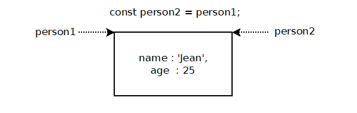
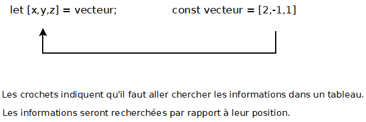
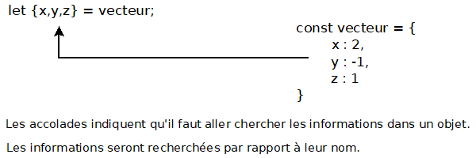
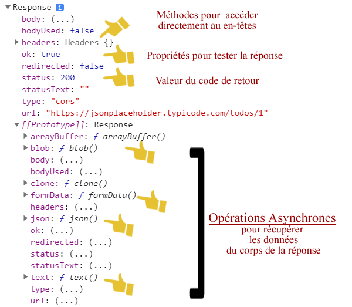

# COURS JAVASCRIPT - DES BASES À L'ASYNCHRONE

> Ce document compile l'ensemble des notes fournies (`JS-intro.md`, `JS-functions.md`, `let-vs-const.md`, `this.md`, `value_vs_reference.md`, `destructuration.md`, `promises.md`, `async-await.md`, `API_fetch.md`), corrigées, réorganisées dans un ordre pédagogique cohérent, et complétées sur les points qui manquaient pour que le cours soit autonome (boucles/conditions, opérateurs de comparaison, méthodes de tableaux, gestion des erreurs, JSON, etc.).
> Les compléments ajoutés sont signalés par un bandeau **🆕 Complément**. Tout le reste provient directement de tes notes, corrigé et remis en forme.
> Les références aux images (`./assets/...`) sont conservées à l'identique.

## SOMMAIRE

1. [Introduction au JavaScript](#1-introduction-au-javascript)
2. [Les variables : déclaration et types primitifs](#2-les-variables--déclaration-et-types-primitifs)
3. [`let`, `const` et `var`](#3-let-const-et-var)
4. [Les opérateurs](#4-les-opérateurs)
5. [Les conditions et les boucles](#5-les-conditions-et-les-boucles)
6. [Les chaînes de caractères (String)](#6-les-chaînes-de-caractères-string)
7. [Les tableaux (Array)](#7-les-tableaux-array)
8. [Les objets JavaScript](#8-les-objets-javascript)
9. [Les classes](#9-les-classes)
10. [Les fonctions](#10-les-fonctions)
11. [Valeur vs Référence](#11-valeur-vs-référence)
12. [Le mot-clé `this`](#12-le-mot-clé-this)
13. [Destructuring, Spread et Rest](#13-destructuring-spread-et-rest)
14. [La gestion des erreurs](#14-la-gestion-des-erreurs)
15. [JSON](#15-json)
16. [Les Promesses](#16-les-promesses)
17. [`async` / `await`](#17-async--await)
18. [L'API Fetch](#18-lapi-fetch)

---

## 1. INTRODUCTION AU JAVASCRIPT

### Où utilise-t-on le JavaScript ?

Le JavaScript s'utilise dans un document HTML via la balise :

```html
<script></script>
```

Elle est placée dans le `<head>` ou à la fin du `<body>` (préférable, pour ne pas bloquer l'affichage de la page pendant le chargement du script).

Cette balise peut faire référence à un fichier externe (`index.js` ou `script.js`) pour décentraliser le code et gagner en lisibilité :

```html
<script src="index.js"></script>
```

> 🆕 **Complément - `defer` et `async` sur la balise `<script>`**
> Quand on place `<script>` dans le `<head>`, deux attributs évitent de bloquer le rendu de la page :
> - `<script defer src="index.js"></script>` : le script est téléchargé en parallèle du HTML et exécuté seulement une fois le HTML entièrement parsé, dans l'ordre d'apparition des balises.
> - `<script async src="index.js"></script>` : le script est téléchargé en parallèle et exécuté dès qu'il est prêt, sans garantie d'ordre.
> En pratique, `defer` est le choix par défaut le plus sûr pour un script qui manipule le DOM.

### Rappel algo

L'objectif d'un programme est de réaliser un ensemble d'instructions exécutables par un ordinateur pour répondre à un problème qu'on se pose.

Pour fonctionner, un programme a besoin de **variables** pour enregistrer et manipuler des données.

---

## 2. LES VARIABLES : DÉCLARATION ET TYPES PRIMITIFS

### Définition

Une variable est un contenant utilisé pour enregistrer une donnée spécifique utile au programme pour fonctionner. Une donnée placée dans une variable s'appelle une **valeur**. Pour savoir ce à quoi correspond la variable, il faut lui donner un nom. Le nom doit indiquer ce qui se trouve à l'intérieur de la variable.

### Règles générales pour nommer une variable

* Utiliser des noms descriptifs dans l'ensemble du code : être précis et descriptif rend la vie plus facile pour lire et maintenir le code dans le temps.
* Mettre les points sur les i : éviter les abréviations ou les raccourcis de mots même lorsque c'est possible.
* Suivre une convention de nommage constante : la convention la plus courante est le **camelCase** (`numberOfCats`, `firstName`).

### Création d'une variable - la déclaration

En JavaScript, une variable se déclare ainsi :

```javascript
let numberOfCats = 2;
```

> ℹ️ Auparavant, une variable se déclarait avec le mot-clé `var`. Il a progressivement été remplacé par `let` et `const` (voir le chapitre 3 sur la portée des variables).

### Modification de la valeur d'une variable

La manière la plus simple de modifier la valeur d'une variable est de la réaffecter :

```javascript
let numberOfCats = 2;
numberOfCats = 4;
```

On n'utilise pas de mot-clé avant la variable puisqu'elle a déjà été déclarée. Pour modifier une variable, on emploie surtout les **opérateurs arithmétiques** (voir chapitre 4).

### Mutabilité des variables

Une variable déclarée avec `let` est mutable par défaut : elle peut changer dans le temps. On lui affecte une valeur de départ, puis on peut la réaffecter autant de fois qu'on le souhaite (exemple typique : un compteur).

À l'inverse, une **constante** est une donnée qui ne sera jamais réaffectée durant l'exécution du programme (voir chapitre 3, `const`).

### Les types primitifs

JavaScript possède les types primitifs suivants :

* **number** (nombre)
* **string** (chaîne de caractères)
* **boolean** (valeur logique vraie ou fausse)
* **undefined** (variable déclarée mais sans valeur assignée)
* **null** (absence de valeur volontaire)
* **bigint** et **symbol** *(🆕 types plus rares, utiles respectivement pour les très grands entiers et les identifiants uniques - peu utilisés en pratique débutant)*

Les types primitifs sont les briques de base de chaque structure de données en JavaScript, peu importe la complexité finale de l'application.

En JavaScript, il n'est pas nécessaire de déclarer le type d'une variable : c'est un langage à **typage dynamique**.

### Comprendre les types en JavaScript

JavaScript est un langage à **types dynamiques** et à **typage faible**. Cela signifie qu'on peut initialiser une variable en tant que nombre et la réaffecter comme une chaîne ou tout autre type :

```javascript
let value = 42;      // number
value = 'quarante-deux'; // string, tout à fait valide
```

> 🆕 **Complément - `typeof`**
> Pour connaître le type d'une variable à un instant donné, on utilise l'opérateur `typeof` :
> ```javascript
> typeof 42;          // "number"
> typeof 'bonjour';   // "string"
> typeof true;        // "boolean"
> typeof undefined;   // "undefined"
> typeof null;        // "object" (particularité historique de JS, à connaître)
> typeof [1,2,3];      // "object" (un tableau est un objet)
> typeof function(){}; // "function"
> ```

### Les nombres : le type `number`

Les variables de type `number` peuvent être positives ou négatives, entières ou décimales (JS ne distingue pas int/float, il n'y a qu'un seul type `number`).

```javascript
let age = 32;
let price = 19.99;
let negative = -7;
```

### Les booléens

Les booléens sont le plus simple des types primitifs : il n'y a que deux valeurs, `true` ou `false` (vrai ou faux). On les utilise pour indiquer si un utilisateur est connecté ou non, si une case est cochée ou non, si un ensemble de conditions particulières est réuni, etc.

### Les chaînes de caractères : le type `string`

Les chaînes de caractères permettent d'enregistrer du texte dans des variables JavaScript, d'une seule lettre à une chaîne très longue.

On encadre la valeur d'une variable de type string par des guillemets simples ou doubles : `''` ou `""`.

On peut concaténer (ajouter à la fin l'une de l'autre) des chaînes grâce à l'opérateur `+`.

Pour simplifier la concaténation, on utilise **la string interpolation** (ou *template literals*) : on encadre le texte avec des backticks `` ` `` et on injecte une variable avec `${maVariable}`.

```javascript
const myName = 'Romain';
const salutation = `Bienvenue sur mon site ${myName}!`;
console.log(salutation); // "Bienvenue sur mon site Romain!"
```

Voir le chapitre 6 pour les méthodes utiles sur les chaînes de caractères.

### `undefined` et `null`

> 🆕 **Complément - la différence entre `undefined` et `null`**
> - `undefined` : une variable a été déclarée mais aucune valeur ne lui a été assignée, ou une fonction ne retourne rien explicitement.
> ```javascript
> let x;
> console.log(x); // undefined
> ```
> - `null` : absence de valeur **volontaire**, assignée explicitement par le développeur pour signifier "rien ici, intentionnellement".
> ```javascript
> let user = null; // on sait qu'il n'y a pas d'utilisateur
> ```
> Pour tester l'un ou l'autre en une seule fois, on utilise souvent l'égalité faible :
> ```javascript
> if (x == null) { /* vrai si x est null OU undefined */ }
> ```

---

## 3. `let`, `const` ET `var`

### `let`

L'instruction `let` permet de déclarer une variable dont la portée est celle du **bloc courant**, éventuellement en initialisant sa valeur.

```javascript
let x = 1;

if (x === 1) {
  let x = 2;
  console.log(x);
  // Résultat attendu : 2
}

console.log(x);
// Résultat attendu : 1
```

### Syntaxe

```javascript
let var1 [= valeur1] [, var2 [= valeur2]] [, …, varN [= valeurN]];
```

`var1`, `var2`, etc. sont les noms des variables. `valeur1`, `valeur2`, etc. sont les valeurs initiales de chaque variable déclarée.

### Description

`let` permet de déclarer des variables dont la portée est limitée à celle du bloc dans lequel elles sont déclarées. Le mot-clé `var` permet de définir une variable globale ou locale à une fonction (sans distinction des blocs utilisés dans la fonction).

Avec `let`, la variable est initialisée à l'endroit où le parseur évalue son contenu. Tout comme `const`, `let` ne crée pas de propriété sur l'objet `window` quand les variables sont déclarées au niveau global.

**L'origine du terme `let` :** c'est une déclaration mathématique adoptée par les premiers langages de programmation comme Scheme ou Basic. `var` fait partie de l'environnement JS depuis le début ; il était nécessaire d'avoir un autre mot-clé pour introduire la portée de bloc. `let` fonctionne comme `var`, mais avec une portée différente (bloc plutôt que fonction).

### Les portées de bloc avec `let`

`let` permet de définir des variables au sein d'un bloc et des blocs qu'il contient. `var` définit une variable dont la portée est celle de la fonction englobante.

```javascript
function varTest() {
  var x = 1;
  if (true) {
    var x = 2; // c'est la même variable !
    console.log(x); // 2
  }
  console.log(x); // 2
}

function letTest() {
  let x = 1;
  if (true) {
    let x = 2; // c'est une variable différente
    console.log(x); // 2
  }
  console.log(x); // 1
}
```

Au niveau le plus haut (portée globale), `let` crée une variable globale alors que `var` ajoute une propriété à l'objet global :

```javascript
var x = "global";
let y = "global2";
console.log(this.x); // "global"
console.log(this.y); // undefined
console.log(y);      // "global2"
```

> 🆕 **Complément - le hoisting et la "zone morte temporelle"**
> `var` est "hissée" (hoisted) en haut de sa fonction et initialisée à `undefined` avant l'exécution du code - on peut donc l'utiliser (avec la valeur `undefined`) avant sa ligne de déclaration sans erreur.
> `let` et `const` sont elles aussi hissées, mais restent dans une **zone morte temporelle** (temporal dead zone) : y accéder avant la ligne de déclaration lève une erreur `ReferenceError`. C'est une des raisons pour lesquelles `let`/`const` sont recommandées : elles évitent des bugs silencieux liés au hoisting de `var`.
> ```javascript
> console.log(a); // undefined (pas d'erreur, mais piégeux)
> var a = 1;
>
> console.log(b); // ReferenceError
> let b = 1;
> ```

### `const`

La déclaration `const` permet de créer une constante nommée accessible uniquement en lecture. Cela ne signifie pas que la valeur contenue est immuable, uniquement que **l'identifiant** ne peut pas être réaffecté. Une constante ne peut pas être déclarée à nouveau.

```javascript
const number = 42;

try {
  number = 99;
} catch (err) {
  console.log(err);
  // TypeError: Assignment to constant variable.
}

console.log(number);
// 42
```

### Syntaxe

```javascript
const nom1 = valeur1 [, nom2 = valeur2 [, … [, nomN = valeurN]]];
```

`nomN` = le nom de la constante (n'importe quel identifiant valide). `valeurN` = la valeur associée (n'importe quelle expression valide, y compris une expression de fonction).

### Description

Cette déclaration crée une constante qui peut être globale ou locale à la fonction dans laquelle elle a été déclarée. Les constantes font partie de la portée du bloc, comme les variables définies avec `let`. À la différence des variables définies avec `var`, les constantes déclarées au niveau global ne sont pas des propriétés de l'objet global (`window` dans le navigateur). Il est nécessaire d'initialiser une constante lors de sa déclaration. Au sein d'une même portée, il est impossible d'avoir une constante qui partage le même nom qu'une variable ou une fonction.

**Attention**, la déclaration `const` crée une référence en lecture seule vers une valeur. Cela ne signifie pas que la valeur référencée ne peut pas être modifiée ! Ainsi, si le contenu de la constante est un objet ou un tableau, l'objet lui-même pourra toujours être modifié (voir chapitre 11, Valeur vs Référence) :

```javascript
const person = { name: 'Jean' };
person.name = 'Paul'; // ✅ autorisé : on modifie l'objet, pas la référence
person = {};           // ❌ TypeError : on tente de réaffecter la constante
```

> 🆕 **Convention de code recommandée** : utiliser `const` par défaut pour toute variable qui n'a pas besoin d'être réaffectée, et réserver `let` aux cas où la valeur doit changer (compteurs, accumulateurs...). Éviter `var` dans du code moderne.

---

## 4. LES OPÉRATEURS

### Opérateurs arithmétiques - travail sur les nombres

Ces opérateurs permettent d'effectuer des opérations mathématiques de base : addition, soustraction, multiplication et division.

**Addition et soustraction** : on utilise `+` et `-`.
Pour ajouter ou soustraire un nombre à une variable, on utilise les opérateurs raccourcis `+=` et `-=`.
Pour ajouter ou soustraire 1 à une variable, on utilise `++` ou `--`.

**Multiplication et division** : on utilise `*` et `/`. De la même manière, on utilise `*=` et `/=` pour multiplier ou diviser une variable par un nombre.

```javascript
let total = 10;
total += 5;   // 15
total -= 3;   // 12
total *= 2;   // 24
total /= 4;   // 6
total++;      // 7
total--;      // 6
```

> 🆕 **Complément - le modulo `%` et l'exponentiation `**`**
> ```javascript
> 10 % 3;   // 1  → reste de la division entière (utile pour tester la parité : n % 2 === 0)
> 2 ** 8;   // 256 → équivalent de Math.pow(2, 8)
> ```

### Opérateurs de comparaison

> 🆕 **Complément - indispensable et absent des notes initiales**
> JavaScript propose deux familles de comparaison :
>
> | Opérateur | Nom | Compare | Exemple |
> |---|---|---|---|
> | `==` | égalité faible | la **valeur**, avec conversion de type | `'5' == 5` → `true` |
> | `===` | égalité stricte | la **valeur ET le type**, sans conversion | `'5' === 5` → `false` |
> | `!=` | inégalité faible | avec conversion de type | `'5' != 5` → `false` |
> | `!==` | inégalité stricte | sans conversion | `'5' !== 5` → `true` |
> | `<`, `>`, `<=`, `>=` | comparaisons numériques/lexicographiques | | `3 < 5` → `true` |
>
> **Règle de bonne pratique** : toujours préférer `===` et `!==` à `==` et `!=`. L'égalité faible entraîne des conversions de type parfois contre-intuitives (`'' == 0` vaut `true`, `null == undefined` vaut `true` mais `null === undefined` vaut `false`), source classique de bugs.

### Opérateurs logiques

> 🆕 **Complément**
> | Opérateur | Nom | Effet |
> |---|---|---|
> | `&&` | ET logique | vrai si les deux opérandes sont vrais |
> | `\|\|` | OU logique | vrai si au moins un des opérandes est vrai |
> | `!` | NON logique | inverse un booléen |
> | `??` | opérateur de coalescence des nuls | renvoie l'opérande de droite seulement si celui de gauche est `null` ou `undefined` |
>
> ```javascript
> let isLoggedIn = true;
> let isAdmin = false;
> isLoggedIn && isAdmin;   // false
> isLoggedIn || isAdmin;   // true
> !isLoggedIn;             // false
>
> let username = null;
> let displayName = username ?? 'Invité'; // 'Invité' (car username est null)
> ```
> `&&` et `||` sont aussi très utilisés pour des raccourcis conditionnels (*short-circuit evaluation*) :
> ```javascript
> user && user.sayHello(); // n'appelle sayHello() que si user existe (n'est pas null/undefined/false)
> ```

### Opérateur ternaire

> 🆕 **Complément**
> Le ternaire est une écriture condensée d'un `if...else` qui renvoie une valeur :
> ```javascript
> const age = 20;
> const statut = age >= 18 ? 'majeur' : 'mineur';
> ```

---

## 5. LES CONDITIONS ET LES BOUCLES

> 🆕 **Chapitre entièrement ajouté - notion fondamentale absente des notes initiales, indispensable pour comprendre la suite du cours (boucles utilisées implicitement dans les exemples de tableaux, de promesses, etc.)**

### La condition `if / else if / else`

```javascript
const note = 14;

if (note >= 16) {
  console.log('Très bien');
} else if (note >= 10) {
  console.log('Admis');
} else {
  console.log('Recalé');
}
```

### Le `switch`

Utile quand on compare une même variable à plusieurs valeurs possibles :

```javascript
const jour = 'lundi';

switch (jour) {
  case 'samedi':
  case 'dimanche':
    console.log('Week-end');
    break;
  default:
    console.log('Jour de semaine');
}
```

Le mot-clé `break` est indispensable pour éviter que l'exécution ne "tombe" dans le `case` suivant.

### La boucle `for`

```javascript
for (let i = 0; i < 5; i++) {
  console.log(i); // affiche 0, 1, 2, 3, 4
}
```

Trois parties séparées par des `;` : l'initialisation, la condition de poursuite, l'incrémentation.

### La boucle `while` et `do...while`

```javascript
let i = 0;
while (i < 5) {
  console.log(i);
  i++;
}

// do...while exécute le bloc au moins une fois, même si la condition est fausse dès le départ
let j = 0;
do {
  console.log(j);
  j++;
} while (j < 5);
```

### `for...of` - parcourir les valeurs d'un itérable (tableau, string...)

```javascript
const fruits = ['pomme', 'poire', 'abricot'];
for (const fruit of fruits) {
  console.log(fruit);
}
```

### `for...in` - parcourir les clés d'un objet

```javascript
const personne = { nom: 'Jean', age: 25 };
for (const cle in personne) {
  console.log(cle, personne[cle]);
}
```

> ⚠️ `for...in` parcourt les **clés** (utile pour un objet). `for...of` parcourt les **valeurs** (utile pour un tableau ou une string). Confondre les deux est une erreur fréquente chez les débutants.

### `break` et `continue`

```javascript
for (let i = 0; i < 10; i++) {
  if (i === 3) continue; // passe à l'itération suivante sans exécuter la suite du bloc
  if (i === 6) break;    // sort complètement de la boucle
  console.log(i);
}
```

---

## 6. LES CHAÎNES DE CARACTÈRES (String)

La déclaration et l'interpolation ont été vues au chapitre 2. Voici les méthodes les plus utilisées au quotidien.

> 🆕 **Complément - méthodes de string, absentes des notes initiales**

```javascript
const phrase = '  Bonjour Romain  ';

phrase.length;                 // 19 → nombre de caractères
phrase.trim();                 // 'Bonjour Romain' → retire les espaces en début/fin
phrase.toUpperCase();          // '  BONJOUR ROMAIN  '
phrase.toLowerCase();          // '  bonjour romain  '
phrase.includes('Romain');     // true → teste la présence d'une sous-chaîne
phrase.indexOf('Romain');      // position du premier caractère trouvé (-1 si absent)
phrase.replace('Romain', 'Sonia'); // remplace la première occurrence
phrase.trim().split(' ');      // ['Bonjour', 'Romain'] → découpe en tableau selon un séparateur
phrase.trim().slice(0, 7);     // 'Bonjour' → extrait une sous-chaîne (début, fin exclue)
```

`split()` est la méthode inverse de `Array.join()` (vu au chapitre 7) : elle transforme une chaîne en tableau.

---

## 7. LES TABLEAUX (Array)

### Créer un tableau

Pour créer un tableau vide et l'enregistrer dans une variable, on utilise une paire de crochets :

```javascript
let array = [];
```

On peut remplir directement le tableau lors de sa déclaration :

```javascript
let array = ["valeur1", "valeur2", "valeur3", "valeur4"];
```

On accède aux éléments grâce à la notation *bracket* :

```javascript
let firstValue = array[0];  // "valeur1"
let secondValue = array[1]; // "valeur2"
let thirdValue = array[2];  // "valeur3"
```

> ℹ️ L'indice (index) d'un tableau commence toujours à 0.

### Le comptage d'éléments

La propriété `length` d'un tableau indique le nombre d'éléments qu'il contient :

```javascript
let array = ["valeur1", "valeur2", "valeur3"];
let arraySize = array.length; // 3
```

### L'ajout et la suppression d'éléments

Pour **ajouter** un élément à la fin du tableau, on utilise la méthode `push` :

```javascript
let array = ["valeur1", "valeur2", "valeur3"];
array.push("valeur4"); // le tableau a un élément supplémentaire à la fin
```

Pour ajouter un élément **au début** du tableau, on utilise `unshift` à la place de `push`.

Pour **supprimer** le dernier élément d'un tableau, on appelle `pop`, sans passer aucun argument :

```javascript
let array = ["valeur1", "valeur2", "valeur3"];
array.pop(); // supprime "valeur3"
```

Pour supprimer le premier élément, on utilise `shift()` (symétrique de `unshift`).

> 🆕 **Complément - les méthodes de tableaux indispensables (absentes des notes initiales, pourtant utilisées ailleurs dans le cours, par ex. dans la destructuration ou les pure functions)**

#### `indexOf` / `includes` - rechercher un élément

```javascript
const fruits = ['pomme', 'poire', 'abricot'];
fruits.indexOf('poire');   // 1 (position, -1 si absent)
fruits.includes('kiwi');   // false
```

#### `slice` / `splice` - extraire ou modifier une portion

```javascript
const nombres = [1, 2, 3, 4, 5];
nombres.slice(1, 3);   // [2, 3] → ne modifie PAS le tableau original, retourne une copie
nombres.splice(1, 2);  // supprime 2 éléments à partir de l'index 1 → modifie le tableau original
```

#### `forEach` - exécuter une action pour chaque élément

```javascript
const fruits = ['pomme', 'poire', 'abricot'];
fruits.forEach((fruit, index) => {
  console.log(index, fruit);
});
```

#### `map` - transformer chaque élément (retourne un **nouveau** tableau)

```javascript
const nombres = [1, 2, 3];
const doubles = nombres.map(n => n * 2); // [2, 4, 6]
console.log(nombres); // [1, 2, 3] → inchangé
```

#### `filter` - ne garder que certains éléments

```javascript
const nombres = [1, 2, 3, 4, 5, 6];
const pairs = nombres.filter(n => n % 2 === 0); // [2, 4, 6]
```

#### `reduce` - réduire un tableau à une seule valeur

```javascript
const nombres = [1, 2, 3, 4];
const somme = nombres.reduce((accumulateur, valeurCourante) => accumulateur + valeurCourante, 0);
// somme = 10
```

`map`, `filter` et `reduce` sont, comme évoqué dans le mémo *Valeur vs Référence*, des exemples classiques de **pure functions** : elles ne modifient jamais le tableau d'origine, elles en retournent un nouveau.

#### `join` - transformer un tableau en chaîne

```javascript
const fruits = ['pomme', 'poire', 'abricot'];
fruits.join(', '); // "pomme, poire, abricot"
```

---

## 8. LES OBJETS JAVASCRIPT

### Définition

Les objets JS s'écrivent selon la notation **JSON (JavaScript Object Notation)**. Il s'agit de séries de **paires clés-valeurs**, séparées par des virgules, entre accolades. On peut les enregistrer dans une variable :

```javascript
let myObject = {
    propriete1: 'valeur1',
    propriete2: 2,
    propriete3: true,
    propriete4: [{
        proprieteA: 'valeurA',
        proprieteB: 'valeurB',
        proprieteC: 5,
        proprieteD: false
    }]
}
```

Les valeurs peuvent avoir tout type de données : string, number, boolean, tableau d'objets, etc. Cela permet de regrouper les attributs d'une chose unique en un même emplacement (profil d'utilisateur, configuration d'une application, etc.).

### Accéder aux données d'un objet

Pour accéder aux données d'un objet, on utilise **la notation pointée** (nom de la variable, suivi d'un point `.`, puis le nom de la clé/propriété) :

```javascript
let myObject = {
    propriete1: 'valeur1',
    propriete2: 'valeur2',
    propriete3: 'valeur3',
};
let objectProp1 = myObject.propriete1; // 'valeur1'
let objectProp2 = myObject.propriete2; // 'valeur2'
```

Une autre manière d'accéder aux données : **la notation bracket** (*bracket notation*).

```javascript
let objectProp1 = myObject["propriete1"]; // 'valeur1'
let objectProp2 = myObject["propriete2"]; // 'valeur2'
```

L'intérêt de cette notation est qu'on peut mettre entre crochets une variable qui contient (sous forme de string) le nom de la propriété que l'on souhaite atteindre :

```javascript
let propertyToAccess = "propriete1";
let objectProp1 = myObject[propertyToAccess]; // 'valeur1'
```

> 🆕 **Complément - ajouter, modifier, supprimer une propriété**
> ```javascript
> let user = { name: 'Romain' };
> user.age = 34;          // ajout d'une propriété
> user.name = 'Sonia';    // modification
> delete user.age;        // suppression
> 'name' in user;         // true → teste l'existence d'une clé
> Object.keys(user);      // ['name'] → tableau des clés
> Object.values(user);    // ['Sonia'] → tableau des valeurs
> Object.entries(user);   // [['name', 'Sonia']] → tableau de paires [clé, valeur]
> ```

---

## 9. LES CLASSES

### Qu'est-ce qu'une classe ?

Une **classe** est un modèle pour un objet dans le code. Elle permet de construire plusieurs objets de même type (appelés **instances** de la même classe) plus facilement, rapidement et en toute fiabilité.

Pour créer une classe en JavaScript, on utilise le mot-clé `class`, suivi d'un nom. On encadre ensuite le code de la classe entre accolades `{ }` :

```javascript
class Name {
    ...
}
```

Pour cette classe, on souhaite que chaque *Name* ait une propriété 1, propriété 2, propriété 3. Pour cela, on utilise un **constructor**.

Le `constructor` d'une classe est la fonction appelée quand on crée une nouvelle instance de cette classe avec le mot-clé `new`.

```javascript
class Name {
    constructor(propriete1, propriete2, propriete3) {
        ...
    }
}
```

Pour attribuer les propriétés reçues à l'instance, on utilise le mot-clé `this` et la notation dot :

```javascript
class Name {
    constructor(propriete1, propriete2, propriete3) {
        this.propriete1 = propriete1;
        this.propriete2 = propriete2;
        this.propriete3 = propriete3;
    }
}
```

Ici, `this` fait référence à la nouvelle instance : on utilise la notation dot pour attribuer les valeurs reçues aux clés correspondantes (voir le chapitre 12 sur `this` pour aller plus loin).

Une fois la classe terminée, on crée des instances avec le mot-clé `new` :

```javascript
let myName = new Name("Toto", "Pimpin", 9);

// Cette ligne crée l'objet suivant :
// {
//     propriete1: "Toto",
//     propriete2: "Pimpin",
//     propriete3: 9
// }
```

Avec une classe *Name*, on peut créer facilement et rapidement de nouveaux objets *Name*.

> 🆕 **Complément - méthodes, héritage et propriétés statiques (absents des notes initiales)**

### Ajouter des méthodes à une classe

```javascript
class Name {
    constructor(prenom, nom) {
        this.prenom = prenom;
        this.nom = nom;
    }

    // méthode d'instance : accessible sur chaque objet créé par la classe
    getFullName() {
        return `${this.prenom} ${this.nom}`;
    }
}

const toto = new Name('Toto', 'Pimpin');
console.log(toto.getFullName()); // "Toto Pimpin"
```

### L'héritage avec `extends` et `super`

Une classe peut hériter des propriétés et méthodes d'une autre classe grâce à `extends`. Le mot-clé `super(...)` permet d'appeler le constructeur de la classe parente.

```javascript
class Animal {
    constructor(nom) {
        this.nom = nom;
    }
    seDeplacer() {
        console.log(`${this.nom} se déplace`);
    }
}

class Chien extends Animal {
    constructor(nom, race) {
        super(nom); // appelle le constructor d'Animal
        this.race = race;
    }
    aboyer() {
        console.log(`${this.nom} aboie !`);
    }
}

const rex = new Chien('Rex', 'Labrador');
rex.seDeplacer(); // "Rex se déplace" (méthode héritée d'Animal)
rex.aboyer();     // "Rex aboie !" (méthode propre à Chien)
```

### Propriétés et méthodes statiques

Une méthode ou propriété `static` appartient à la classe elle-même, pas à ses instances :

```javascript
class Utils {
    static double(n) {
        return n * 2;
    }
}

Utils.double(5); // 10 - pas besoin d'instancier Utils avec "new"
```

---

## 10. LES FONCTIONS

### Définition

Une fonction est un bloc de code auquel on attribue un nom. Quand on appelle cette fonction, on exécute le code qu'elle contient.

```javascript
function afficherDeuxValeurs(valeur1, valeur2) {
    console.log('Première valeur:' + valeur1);
    console.log('Deuxième valeur:' + valeur2);
}

afficherDeuxValeurs(12, 'Bonjour');

// la console affiche :
// > Première valeur:12
// > Deuxième valeur:Bonjour
```

Beaucoup de fonctions ont besoin de variables pour effectuer leur travail. Quand on **déclare** une fonction, on indique la liste des variables dont elle a besoin : on définit les **paramètres** de la fonction. Quand on appelle la fonction, on spécifie les **valeurs** pour ses paramètres : ce sont les **arguments** d'appel. Enfin, une fonction peut donner un résultat : une **valeur de retour**.

### Rédiger une fonction en JavaScript

```javascript
function retournerMessageScore(score, nombreQuestions) {
    let message = 'Votre score est de ' + score + ' sur ' + nombreQuestions;
    return message;
}
```

* Le mot-clé **function** est suivi du **nom de la fonction**. Ce mot-clé est obligatoire pour définir une fonction déclarée de cette manière.
* **Entre parenthèses** sont indiqués les paramètres passés à la fonction.
* **Entre accolades** est indiqué le bloc de code exécuté quand la fonction est appelée.
  * Le mot-clé **return** signifie que la fonction retourne un résultat. Sans `return` explicite, une fonction retourne `undefined`.


### Les fonctions fléchées

Il s'agit d'une syntaxe différente mais équivalente à la fonction standard :

```javascript
const f = () => {
    "use strict";
    return this;
};
f() === window;
```

> 🆕 **Complément - paramètres par défaut, fonctions anonymes et différence fonction déclarée / fonction fléchée**

### Paramètres par défaut

```javascript
function saluer(prenom = 'inconnu') {
    console.log(`Bonjour ${prenom}`);
}
saluer();          // "Bonjour inconnu"
saluer('Romain');  // "Bonjour Romain"
```

### Expression de fonction (fonction anonyme assignée à une variable)

```javascript
const addition = function(a, b) {
    return a + b;
};
```

### Différence fonction déclarée vs fonction fléchée

Deux différences importantes à connaître :

1. **Le hoisting** : une fonction déclarée avec `function nom() {}` est hissée et peut être appelée avant sa définition dans le code. Une fonction fléchée assignée à une constante ne le peut pas (à cause de la zone morte temporelle de `const`, voir chapitre 3).
2. **La valeur de `this`** : une fonction classique possède sa propre valeur de `this`, déterminée par la façon dont elle est appelée. Une fonction fléchée n'a pas de `this` propre : elle utilise celui du contexte englobant (voir chapitre 12, exemple détaillé).

---

## 11. VALEUR VS RÉFÉRENCE

*(adapté de l'article "Explaining Value vs. Reference in Javascript")*

Un simple regard sur la mémoire de l'ordinateur explique ce qu'il se passe.

RAPPEL : JavaScript a 5 types de données passées par **valeur** :
* Boolean
* null
* undefined
* String
* Number

JavaScript a 3 types de données qui sont passées par **référence** :
* Array
* Function
* Object

Ce sont techniquement des objets ; on y fera référence par le terme **Objets**.

### Primitives

Si un type primitif est assigné à une variable, on peut considérer que la variable contient la valeur primitive elle-même.

```javascript
let x = 10;
let y = 'abc';
let z = null;
```

| Variables | Values |
|-|-|
|x|10|
|y|'abc'|
|z|null|

Quand on assigne ces variables à d'autres variables avec `=`, on copie la valeur dans la nouvelle variable : elles sont copiées **par valeur**.

```javascript
let x = 10;
let y = 'abc';

let a = x;
let b = y;

console.log(x, y, a, b); // -> 10, 'abc', 10, 'abc'
```

Autant `a` que `x` contiennent `10`. Autant `b` que `y` contiennent `'abc'`. Elles sont séparées, car les valeurs elles-mêmes ont été copiées. Si on change l'une, l'autre reste inchangée : les variables n'ont aucun lien entre elles.

```javascript
let x = 10;
let y = 'abc';

let a = x;
let b = y;

a = 5;
b = 'def';

console.log(x, y, a, b); // -> 10, 'abc', 5, 'def'
```

### Objets

Les variables auxquelles une valeur non primitive est affectée reçoivent une **référence** à cette valeur, c'est-à-dire une adresse pointant vers l'emplacement de l'objet en mémoire. La variable ne contient pas réellement la valeur.

Quand on écrit `array = []`, on crée un tableau dans la mémoire de l'ordinateur. La variable `array` reçoit l'adresse de ce tableau.

Imaginons qu'*address* est un nouveau type de données passé par valeur, comme *number* ou *string*. Une *address* pointe vers l'endroit, en mémoire, d'une valeur passée par référence. De la même manière qu'une chaîne de caractères est notée entre guillemets, une *address* sera notée par des chevrons : `<>`.

```javascript
let array = [];
array.push(1);
```

Première ligne :

| Variables | Values | Addresses | Objects |
|-|-|-|-|
| array | <#001> | #001 | [] |

Deuxième ligne :

| Variables | Values | Addresses | Objects |
|-|-|-|-|
| array | <#001> | #001 | [1] |

La valeur (l'adresse) contenue par la variable `array` est statique. C'est le tableau qui change dans la mémoire. Quand on utilise `array` pour ajouter une valeur (`push`), le moteur JavaScript se rend à l'endroit où se situe `array` en mémoire et travaille avec le tableau qui s'y trouve.

**Les objets sont copiés par référence**, pas par leur valeur.

```javascript
let reference = [1];
let referenceCopy = reference;
```

| Variables | Values | Addresses | Objects |
|-|-|-|-|
| reference | <#001> | #001 | [1] |
| referenceCopy | <#001> |  |  |

Chaque variable contient maintenant une référence au **même tableau**. Si on modifie `reference`, `referenceCopy` sera modifié en conséquence :

```javascript
reference.push(2);
console.log(reference, referenceCopy); // -> [1, 2], [1, 2]
```

| Variables | Values | Addresses | Objects |
|-|-|-|-|
| reference | <#001> | #001 | [1, 2] |
| referenceCopy | <#001> |  |  |

### Réassigner une référence

Réassigner une référence remplace l'ancienne référence.

```javascript
let object = { first: 'reference' };
```

S'écrit dans la mémoire :

| Variables | Values | Addresses | Objects |
|-|-|-|-|
| object | <#234> | #234 | {first: 'reference'} |

Avec une deuxième ligne :

```javascript
let object = { first: 'reference' };
object = { second: 'reference2' };
```

L'adresse stockée dans `object` change. Le premier objet est toujours présent dans la mémoire, tout comme le second :

| Variables | Values | Addresses | Objects |
|-|-|-|-|
| object | <#678> | #234 | {first: 'reference'} |
| | | #678 | {second: 'reference2'} |

Quand il ne reste plus aucune référence à un objet (comme pour l'adresse `#234` ci-dessus), le moteur JavaScript peut effectuer une **garbage collection** (récupération de mémoire). Le programmeur a perdu toutes les références à l'objet et ne peut plus l'utiliser, donc le moteur peut le supprimer de la mémoire de manière sûre.

### Les opérateurs `==` et `===`

Quand les opérateurs d'égalité `==` et `===` sont utilisés sur des variables de type référence, ils vérifient la référence, pas le contenu. Si les variables contiennent une référence au même élément, le résultat de la comparaison sera `true`.

```javascript
let arrayReference = ['Hi !'];
let arrayReference2 = arrayReference;

console.log(arrayReference === arrayReference2); // -> true
```

Si ce sont des objets distincts, même avec des propriétés identiques, le résultat de la comparaison sera `false`.

```javascript
let arrayReference = ['Hi !'];
let arrayReference2 = ['Hi !'];

console.log(arrayReference === arrayReference2); // -> false
```

Si on a deux objets distincts et qu'on veut voir si leurs propriétés sont les mêmes, le moyen le plus simple est de les transformer en string et de comparer les strings (`JSON.stringify`, voir chapitre 15).

### Passer des références au travers de fonctions

Quand on passe des valeurs primitives dans une fonction, la fonction copie les valeurs dans ses paramètres. C'est effectivement la même chose que d'utiliser `=`.

```javascript
let hundred = 100;
let two = 2;

function multiply(x, y) {
    // PAUSE
    return x * y;
}

let twoHundred = multiply(hundred, two);

console.log(twoHundred); // -> 200
```

Dans l'exemple ci-dessus, on assigne la valeur `100` à la variable `hundred`. Quand on passe cette variable dans la fonction `multiply`, la variable `x` récupère la valeur `100` - la valeur est copiée, comme avec `=`. La valeur de `hundred` n'est pas affectée. Voici la mémoire au niveau du commentaire `// PAUSE` dans `multiply` :

| Variables | Values | Addresses | Objects |
|-|-|-|-|
| hundred | 100 | #333 | function(x, y)... |
| two | 2 | | |
| multiply | <#333> | | |
| x | 100 | | |
| y | 2 | | |

### Pure functions

On appelle **pure functions** les fonctions qui n'ont aucun effet en dehors de leur portée. Tant qu'une fonction prend uniquement des valeurs primitives en paramètres et n'utilise aucune variable en dehors de sa portée, elle est automatiquement pure, car elle ne peut avoir d'effet que dans sa portée. Toutes les variables créées à l'intérieur sont récupérées (garbage collected) dès que la fonction effectue un `return`.

Une fonction qui prend un objet, en revanche, peut muter l'état de sa portée. Si une fonction prend un tableau en référence et modifie ce tableau (par exemple grâce à un `push`), les variables dans la portée externe qui font référence à ce tableau voient ce changement. Après le `return` de la fonction, les changements effectués persistent dans la portée externe. Cela peut avoir des effets indésirables et être difficile à traquer.

Beaucoup de méthodes natives de tableaux, dont `Array.map` et `Array.filter` (vues au chapitre 7), s'écrivent comme des *pure functions* : elles prennent un tableau en référence, mais copient le tableau en interne et travaillent avec la copie au lieu de l'original. L'original n'est pas touché, la portée externe n'est pas affectée, et on obtient une référence à un tout nouveau tableau.

Exemple d'une **fonction impure** :

```javascript
function changeAgeImpure(person) {
    person.age = 25;
    return person;
}

let alex = {
    name: 'Alex',
    age: 30
};

let changedAlex = changeAgeImpure(alex);

console.log(alex);        // -> {name: 'Alex', age: 25}
console.log(changedAlex); // -> {name: 'Alex', age: 25}
```

Cette fonction change la propriété `age` de l'objet reçu. Comme elle agit sur la référence qui lui a été donnée, cela modifie l'objet `alex` original. `alex` et `changedAlex` contiennent la même référence. Il est redondant de retourner `person` et de stocker la référence dans une nouvelle variable.

Regardons une **fonction pure** équivalente :

```javascript
function changeAgePure(person) {
    let newPersonObject = JSON.parse(JSON.stringify(person));
    newPersonObject.age = 25;
    return newPersonObject;
}

let alex = {
    name: 'Alex',
    age: 30
};

let changedAlex = changeAgePure(alex);

console.log(alex);        // -> {name: 'Alex', age: 30}
console.log(changedAlex); // -> {name: 'Alex', age: 25}
```

On utilise ici `JSON.stringify` pour transformer l'objet en string, puis `JSON.parse` pour reparser cette string en un nouvel objet (voir chapitre 15). En stockant le résultat dans une nouvelle variable, on a créé un nouvel objet, séparé en mémoire de l'original. Quand on change la propriété `age` de ce nouvel objet, l'original n'est pas modifié.

> 🆕 **Complément - alternative moderne au clonage via `JSON.stringify`/`JSON.parse`**
> Cette technique fonctionne mais a des limites (elle perd les fonctions, les `undefined`, les dates deviennent des strings...). Deux alternatives plus modernes :
> ```javascript
> const copie1 = { ...alex };              // spread operator (clone superficiel, voir chapitre 13)
> const copie2 = structuredClone(alex);    // clone profond natif, disponible dans les navigateurs récents
> ```

---

## 12. LE MOT-CLÉ `this`

`this` est un opérateur et, comme tout opérateur, il retourne une valeur.

1. **D'où vient cette valeur ?** Elle provient d'un contexte d'exécution. Au lancement du script, et à chaque appel d'une fonction, un contexte d'exécution est placé sur la pile d'exécution.
2. **Qu'y a-t-il dans un contexte d'exécution ?** Il y a la valeur de `this`, et aussi des informations permettant à la fonction de s'exécuter (par exemple les arguments qui lui sont passés). À chaque appel d'une fonction, comme on change les arguments, on crée un nouveau contexte. Il y a en réalité beaucoup plus d'informations que cela dans un contexte d'exécution, mais retenons cette idée générale.
3. **Qui gère cette valeur de `this` ? Qui l'affecte ?** C'est le moteur JavaScript qui le fait, pour nous.
4. **À quoi ça sert ?** Par exemple, quand on instancie une classe pour créer un nouvel objet, `this` désigne ce nouvel objet dans le constructeur. Autre exemple : quand on passe un callback à un gestionnaire d'événement, `this` désigne dans ce callback l'élément du document sur lequel est posé ce gestionnaire.
5. **Et si la valeur de `this` ne convient pas ?** On peut la changer en utilisant les méthodes `call`, `apply` ou `bind` du constructeur `Function`.
6. **Que vaut `this` ?** Pour utiliser `this`, il faut être capable de prévoir ce que va faire le moteur JavaScript. Sa valeur peut dépendre, dans un petit nombre de cas, de l'utilisation ou non du mode strict et de l'environnement d'exécution de JavaScript (navigateur ou serveur).

En JS, `this` se comporte légèrement différemment des autres langages de programmation, et son comportement varie selon qu'on utilise le mode strict ou non.

Dans la plupart des cas, la valeur de `this` est déterminée par la façon dont une fonction est appelée. Il n'est pas possible de lui affecter une valeur lors de l'exécution, et sa valeur peut être différente à chaque appel de la fonction. La méthode `bind()` a été introduite avec ECMAScript 5 pour définir la valeur de `this` pour une fonction, indépendamment de la façon dont elle est appelée. ECMAScript 2015 (ES6) a ajouté les fonctions fléchées, dans lesquelles `this` correspond à la valeur du contexte englobant.

La valeur de `this` est l'objet JS représentant le contexte dans lequel le code courant est exécuté. Le mot-clé `this` est utilisé avec des méthodes d'un objet pour accéder à des informations stockées dans l'objet. `this` va dans ce cas être substitué par l'objet utilisant la méthode lors de l'appel.

### `this` avec une fonction classique invoquée dans la portée globale

Dans le contexte global d'exécution (en dehors de toute fonction), `this` fait référence à l'objet global (qu'on utilise ou non le mode strict).

```javascript
// Si l'environnement de script est un navigateur,
// l'objet window sera l'objet global
console.log(this === window); // true

this.a = 37;
console.log(window.a); // 37

this.b = "MDN";
console.log(window.b); // "MDN"
console.log(b);        // "MDN"
```

### Dans le contexte d'une fonction

Si `this` est utilisé dans une fonction, sa valeur dépend de la façon dont la fonction a été appelée.

Avec un appel simple :

```javascript
function f1() {
  return this;
}

// Dans un navigateur
f1() === window; // true (objet global)

// Côté serveur (ex. Node)
f1() === global; // true
```

La valeur de `this` n'est pas définie lors de l'appel. Le code n'étant pas en mode strict, `this` doit toujours être un objet, donc ce sera l'objet global (`window` dans un navigateur).

```javascript
function f2() {
  "use strict"; // mode strict
  return this;
}

f2() === undefined; // true
```

`this` vaut `undefined` car `f2` a été appelée sans "base" (ex : `window.f2()`). S'il n'est pas défini, il reste `undefined`. Cette fonctionnalité ne fut pas correctement implémentée dans certains anciens navigateurs, qui renvoyaient alors l'objet `window`.

En mode strict, la valeur de `this` est conservée entre le moment de sa définition et l'entrée dans le contexte d'exécution. S'il n'est pas défini, il reste `undefined` - il pourrait aussi être défini avec n'importe quelle autre valeur (`null`, `42`, `"je ne suis pas this"`...).

### Les fonctions fléchées et le mot-clé `this`

Le mot-clé `this` est utilisé avec des méthodes d'un objet pour accéder à des informations stockées dans l'objet. `this` est substitué par l'objet utilisant la méthode lors de l'appel.

```javascript
let feuille = {
    nom: 'Ciseaux',
    prenom: 'Pierre',
    hobbies: ['ams', 'tram', 'gram'],

    getFullName(){
        console.log(this.prenom + ' ' + this.nom);
    }
};

feuille.getFullName();
// retourne : Pierre Ciseaux
```

En JavaScript, à la différence de la plupart des langages, `this` n'est pas lié à un objet en particulier. Sa valeur est évaluée **au moment de l'appel** de la méthode dans laquelle il est présent. Elle ne dépend donc pas de l'endroit où la méthode a été déclarée, mais de l'objet qui l'appelle. Cela permet à une méthode d'être réutilisée par différents objets.

```javascript
let pierre = { name: 'Pierre' };
let mathilde = { name: 'Mathilde' };

function disBonjour() {
  alert('Bonjour ' + this.name);
}

pierre.bonjour = disBonjour;
mathilde.bonjour = disBonjour;

pierre.bonjour();   // Bonjour Pierre
mathilde.bonjour(); // Bonjour Mathilde
```

Les **fonctions fléchées** sont différentes : elles ne possèdent pas de valeur propre pour `this`. Si on utilise `this` dans une fonction fléchée, la valeur utilisée sera celle du contexte de la fonction englobante.

```javascript
let feuille = {
    nom: 'Ciseaux',
    prenom: 'Pierre',
    hobbies: ['ams', 'tram', 'gram'],

    disBonjour(){
        const bonjour = () => console.log('Bonjour ' + this.prenom);
        bonjour();
    }
};

feuille.disBonjour();
// retourne Bonjour Pierre
```

C'est précisément pour cette raison que les fonctions fléchées sont très utilisées comme callbacks à l'intérieur des méthodes d'objet ou de classe : elles conservent le `this` de la méthode englobante, ce qu'une fonction classique ne ferait pas dans le même contexte.

---

## 13. DESTRUCTURING, SPREAD ET REST

### Le rest parameter et le spread operator

Les trois petits points `...` désignent en fait **deux choses distinctes** : le **rest parameter** et le **spread operator**. Ne pas les confondre : leur usage est complètement opposé.

### Le rest parameter

Le rest parameter sert à stocker une liste indéfinie de valeurs sous forme d'un tableau. Il s'agit d'un paramètre de fonction qui va principalement servir à "ramasser les restes" en paramètres. Par exemple, pour une fonction prenant une liste infinie de paramètres, ou pour récupérer les valeurs finales d'un tableau.

```javascript
function logArgs(...args) {
   console.log(args);
}

logArgs('coucou', 3, 'Bob'); // args == ['coucou', 3, 'Bob']
```

L'intérêt de cet opérateur est d'assembler plusieurs valeurs dans un tableau.

Exemple plus approfondi :

```javascript
function argsToObject(key, ...values) {
   let object = {};
   object[key] = values;

   return object;
}

let o = argsToObject('fruits', 'pomme', 'poire', 'abricot');
/*
 {
   fruits: [
     'pomme',
     'poire',
     'abricot'
   ]
 }
 */
```

> ℹ️ *(Correction par rapport à la note d'origine : la fonction se nomme `values` - au pluriel, cohérent avec le rest parameter - et on affecte `object[key] = values`, `value` seule n'existant pas dans ce contexte.)*

Ce qu'on indique ici à la fonction, c'est de récupérer un paramètre qui s'appelle `key`, et de mettre le reste dans `values`. Cette méthode permet de rendre la fonction plus lisible, plutôt que de ne lui passer aucun nom de paramètre.

### Le spread operator

Le spread operator est **complètement opposé** au rest parameter : il sert à décomposer (ou "éclater") un objet ou un tableau en une liste finie de valeurs individuelles.

```javascript
let args = ['var 1', 'var 2', 'var 3'];

console.log(...args);
// équivalent à : console.log('var 1', 'var 2', 'var 3')
```

Le tableau `args` est éclaté en plusieurs paramètres pour la fonction `log` de `console`.

Le spread operator est utile si :
* on a besoin de passer exactement la même liste de paramètres à plusieurs fonctions ;
* on veut automatiser la gestion des méthodes, fonctions, classes (par exemple pour l'écriture d'un framework, d'un conteneur d'injection de dépendances) ;
* on veut concaténer un tableau.

### Spread operator sur un tableau

Avant, deux solutions s'offraient à nous : boucler pour faire un algo de concaténation de tableau, ou utiliser plusieurs fois `Array.prototype.push.apply()`. On peut maintenant concaténer plus facilement grâce au spread operator.

```javascript
let fruits = ['pomme', 'poire', 'abricot'];
let legumes = ['salade', 'asperge'];

let mots = ['automne', 'hiver', ...fruits, 'voiture', ...legumes];
```

```javascript
const tab1 = [1, 2, 3];

// Ici on duplique
const tab2 = [...tab1];

const tab3 = [...tab1, 'sep', ...tab2];

console.log(tab1); // (3) [1, 2, 3]
console.log(tab2); // (3) [1, 2, 3]
console.log(tab3); // (7) [1, 2, 3, "sep", 1, 2, 3]
```

Pour dupliquer `tab1`, on place d'abord le spread operator devant : `...tab1`, ce qui vaut `1, 2, 3`. Pour fabriquer `tab2`, on fait `[...tab1]`. Il en résulte deux tableaux identiques mais distincts en mémoire (voir chapitre 11). Pour `tab3`, on concatène `tab1`, puis une chaîne de séparation, puis `tab2`.

### Spread operator sur un objet

Erreur à éviter :

```javascript
const person1 = {
    name: 'Jean',
    age: 25
};

// Je veux créer un nouvel objet person2
// Je ne peux pas faire cela car ce sont des références
const person2 = person1;
person2.name = 'Paul';

console.log(person1);
console.log(person2);
```

Après avoir créé l'objet `person1`, on crée `person2` avec `const person2 = person1;`. **Attention !** on ne fait que dupliquer les références, pas les objets. On a donc deux références qui pointent sur le même objet - or l'objectif est de créer deux objets distincts, ce procédé ne convient pas.



En utilisant le spread operator pour récupérer l'objet `person1`, on peut se contenter de le dupliquer. Mais on peut faire mieux :
1. changer la valeur d'une propriété de l'objet qu'on vient de dupliquer ;
2. ajouter une nouvelle propriété.

```javascript
const person1 = {
    name: 'Jean',
    age: 25
};

const person2 = {
    // Ici je récupère person1
    ...person1,
    // Je peux changer le nom
    name: 'Paul',
    // Je peux ajouter une propriété
    sexe: 'M'
};

console.log(person1); // {name: "Jean", age: 25}
console.log(person2); // {name: "Paul", age: 25, sexe: "M"}
```

### En conclusion sur `...`

* le rest parameter rassemble plusieurs valeurs en un tableau ;
* le spread operator décompose un tableau (ou objet) en plusieurs valeurs ;
* ils sont tous les deux utilisables grâce aux `...`, la distinction se fait par le contexte (paramètre de fonction ou appel/littéral).

### Le principe du destructuring (ou décomposition)

La décomposition et la déstructuration sont deux termes spécifiques pour exprimer la même chose. La décomposition s'applique techniquement aux tableaux et la déstructuration aux objets, mais le terme "décomposition" est le seul retenu dans les RFCs et spécifications ECMA International - c'est donc le terme qu'on utilisera de manière générale.

La décomposition consiste à "décomposer" les structures complexes (tableau, objet) pour en extraire les valeurs qui nous intéressent. L'intérêt est de rendre ce genre de manipulation plus simple et le code plus lisible :

```javascript
let [ valeur1, valeur2 ] = tableau;
let { valeur1, valeur2 } = objet;
```

La syntaxe est différente selon qu'il s'agit d'un tableau ou d'un objet.

L'opération de destructuration permet d'affecter des variables à partir d'informations que le moteur JavaScript va chercher dans un objet ou un tableau :
* pour un objet, le moteur se base sur le nom d'une propriété pour retrouver l'information (paire clé:valeur) ;
* pour un tableau, le moteur se base sur une position pour retrouver l'information (paire index:valeur).

### Décomposer un tableau

Un cas concret est lorsqu'on souhaite récupérer les valeurs d'un tableau. Sans décomposition :

```javascript
let args = ['fruits', 'pomme', 'poire', 'abricot'];
let type = args[0];
let firstEl = args[1];
let secondEl = args[2];
let thirdEl = args[3];
```

Avec la décomposition :

```javascript
let args = ['fruits', 'pomme', 'poire', 'abricot'];
let [type, firstEl, secondEl, thirdEl] = args;
```

Les deux codes sont similaires, le résultat est le même : dans les deux cas, les variables `type`, `firstEl`, `secondEl` et `thirdEl` sont créées.

Pour déstructurer un tableau, la recherche d'information ne se fait pas sur la base d'un nom : elle se fait sur la base de la **position** de l'information dans le tableau.



```javascript
const vecteur = [2, -1, 1];

let [x, y, z] = vecteur;

console.log(`x=${x} y=${y} z=${z}`);
// retourne : x=2 y=-1 z=1
```

De manière traditionnelle, il fallait accéder aux éléments un par un, ce qui était répétitif :

```javascript
const vecteur = [2, -1, 1];

let x = vecteur[0];
let y = vecteur[1];
let z = vecteur[2];

console.log(`x=${x} y=${y} z=${z}`);
```

Si on s'arrête là, la syntaxe n'a pour intérêt que d'économiser des lignes de code. La décomposition offre d'autres intérêts qui font gagner du temps !

#### Récupérer une partie des informations

Afin de sauter un élément lors de la déstructuration, il faut mettre une virgule.

```javascript
const vecteur = [2, -1, 1];

// Ne récupérer que le z
let [,,z] = vecteur;

console.log(`Récupérer uniquement le z=${z}`);
```

Reprenons le premier exemple :

```javascript
let args = ['fruits', 'pomme', 'poire', 'abricot'];
let [type,, secondEl] = args;
```

Si je veux récupérer uniquement le type et le second élément, j'ajoute simplement une virgule entre `args[0]` et `args[2]`, sans préciser le nom de la variable dans laquelle mettre `args[1]`.

Autre cas : si `args` est vide, mes variables `type` et `secondEl` seront créées, mais auront pour valeur `undefined`. Pour continuer de travailler avec elles, il faudrait les tester. Mais on peut aussi leur attribuer des **valeurs par défaut** :

```javascript
let args = [];
let [type = 'legume', firstEl = 'salade'] = args;
```

Comme `args` est vide, `type` vaudra "legume" et `firstEl` vaudra "salade".

Dans le cas où je veux récupérer le type de mes éléments dans une variable, mais où il est plus pratique d'avoir la liste des éléments dans un tableau pour pouvoir boucler dessus, on procédera ainsi :

```javascript
let args = ['fruits', 'pomme', 'poire', 'abricot'];
let [type, ...elements] = args;
```

Ici, `type` vaudra "fruits", et `elements` vaudra `['pomme', 'poire', 'abricot']`. La syntaxe est particulière, car elle utilise le rest parameter.

La décomposition est aussi utile pour des cas auxquels on ne pense pas forcément :

* intervertir les valeurs de deux variables :

```javascript
let valA = 'coucou';
let valB = 'byebye';
[valA, valB] = [valB, valA];
// logiquement, valA vaudra "byebye" et valB vaudra "coucou"
```

* travailler avec des fonctions qui retournent des tableaux :

```javascript
let [max, min] = getMaxAndMin([3, 34, 2, 5, 6, 22, 33, 1]);
```

#### Déstructurer un tableau à deux dimensions

```javascript
const matrice = [
    [2, 1, 1],
    [3, 1, 4],
    [5, 0, 1]
];

const [L1, L2, L3] = matrice;
console.log(`Ligne 2 => ${L2}`);

const [, [L2_x]] = matrice;
console.log(`Ligne 2 valeur de x => ${L2_x}`);
```

Dans cet exemple, on effectue deux déstructurations :
1. on décompose la matrice en 3 lignes : `const [L1, L2, L3] = matrice`.
2. on descend dans la ligne 2 en mettant à nouveau une paire de crochets, puis on récupère la première valeur qu'on appelle `L2_x`.

### Destructuring d'un objet

La décomposition des objets est relativement similaire à celle des tableaux, avec quelques spécificités.

Pour décomposer un objet, on déclare une ou plusieurs variables entre accolades : `let {x, y, z}`. Ensuite, on affecte cette déclaration à un objet : `let {x, y, z} = vecteur;`. Le moteur JavaScript comprend qu'il doit aller chercher les valeurs des propriétés dans l'objet et les affecter aux variables de même nom.



* Cas où on souhaite ne récupérer qu'une des clés :

```javascript
let objet = {
  slug: 'test',
  title: 'Ceci est un test',
  content: '...',
  visible: true
};

let { title } = objet;
```

On ne récupère que le titre. On remarque la différence avec les tableaux, où on utilise les crochets au lieu des accolades.

* Cas d'une valeur par défaut :

```javascript
let objet = {
  slug: 'test',
  title: 'Ceci est un test',
  content: '...',
  visible: true
};

let { visible = false } = objet;
```

Ici, on ne veut que la visibilité, avec `false` comme valeur par défaut si la propriété n'existait pas.

```javascript
const vecteur = {
    x: 2,
    y: -1,
    z: 1
};
let { x, y, z } = vecteur;
console.log(`x=${x} y=${y} z=${z}`);
// retourne x=2 y=-1 z=1
```

De manière traditionnelle, il fallait utiliser la notation pointée, ce qui était répétitif :

```javascript
const vecteur = {
    x: 2,
    y: -1,
    z: 1
};
let x = vecteur.x;
let y = vecteur.y;
let z = vecteur.z;
console.log(`x=${x} y=${y} z=${z}`);
```

On peut aussi déstructurer en créant des variables ou des constantes :

```javascript
// Ci-dessous on crée des variables
let { x, y, z } = vecteur;
// Ci-dessous on crée des constantes
const { x, y, z } = vecteur;
```

#### Déstructurer en changeant le nom de la variable

Par défaut, la variable porte le même nom que la propriété. Si ce comportement ne convient pas, on peut renommer la variable.

* Cas d'utilisation d'un autre nom pour une clé :

```javascript
let objet = {
  slug: 'test',
  title: 'Ceci est un test',
  content: '...',
  visible: true
};

let { content: article } = objet;
```

On récupère uniquement la clé `content`, qu'on stocke dans la variable `article`.

C'est la véritable syntaxe de la décomposition. Dans les autres exemples, on utilise une astuce d'ES2015 qui évite d'écrire deux fois la même chose quand c'est possible. À retenir : `{visible: visible}` est équivalent à `{visible}`.

* Dans cet exemple, on cumule la valeur par défaut et le changement de nom. On récupère la clé `visible`, qu'on stocke dans la variable `isVisible`, qui vaudra par défaut `false` :

```javascript
let objet = {
  slug: 'test',
  title: 'Ceci est un test',
  content: '...',
  visible: true
};

let { visible: isVisible = false } = objet;
```

```javascript
const vecteur = {
    x: 2,
    y: -1,
    z: 1
};

let { x: coordX, y: coordY, z: coordZ } = vecteur;

console.log(`coordX=${coordX} coordY=${coordY} coordZ=${coordZ}`);
```

#### Déstructurer au moment de l'appel d'une fonction

Il est possible de déstructurer au moment de l'appel à une fonction - logique, puisque le passage d'arguments se fait par une affectation. C'est pratique dans le cas où on a un gros objet avec beaucoup de propriétés et où on n'a besoin, dans la fonction, que de quelques-unes de ces propriétés. Cela améliore aussi la lisibilité du code, puisqu'on précise les propriétés utilisées dès la déclaration.

C'est clairement le cas qui pousse le plus à utiliser la décomposition - un gain de temps impressionnant ! On a sûrement déjà écrit des fonctions avec un paramètre `options` qui rassemble toutes les options dans un objet. Pensons au temps perdu et au nombre de lignes écrites pour tester ce seul paramètre avant même de coder la logique métier.

```javascript
function test(id, { maxLength = 10, current = 0 } = {}) {};
// const test = (id, { maxLength = 10, current = 0 } = {}) => {};
```

Comme pour la décomposition de tableaux, utiliser la décomposition dans les paramètres d'une fonction est totalement transparent pour l'utilisateur de la fonction. Mais cela change tout pour nous !

`maxLength` et `current` ne seront jamais `undefined` : ils auront toujours une valeur, celle de l'utilisateur ou la valeur par défaut. Cela allège le code, puisqu'on ne fait plus `options.maxLength` mais juste `maxLength`, comme s'il s'agissait d'un simple paramètre.

Seuls les attributs déclarés dans la décomposition seront transmis à la fonction. L'utilisateur peut ajouter 15 000 autres attributs à `options`, ils ne seront pas transmis - ce qui ajoute un léger niveau de sécurité à la fonction.

```javascript
const vecteur = {
    x: 2,
    y: -1,
    z: 1
};

function print({ x, y, z }) {
    console.log(`x=${x} y=${y} z=${z}`);
}

print(vecteur);
// retourne : x=2 y=-1 z=1
```

#### Déstructurer des propriétés imbriquées

Prenons un objet représentant une droite avec une épaisseur `width`, une couleur `color`, et qui passe par deux points A et B, chacun ayant un triplet de coordonnées :

```javascript
const line = {
    width: 2,
    color: 'blue',
    A: { x: 2, y: 1, z: 3 },
    B: { x: 4, y: 3, z: 2 }
};

const { width, A: { x: startA } } = line;
console.log(`width => ${width} startA => ${startA}`);
// retourne : width => 2 startA => 2
```

On déstructure pour récupérer d'abord `width`, puis on veut descendre sur la coordonnée `x` du point A. On écrit `A: {x}`. Si on veut renommer `x`, on écrit `A: {x: startA}`.

---

## 14. LA GESTION DES ERREURS

> 🆕 **Chapitre entièrement ajouté** - le `try...catch` est utilisé dans les exemples d'`async`/`await` sans jamais avoir été introduit en tant que tel. Le voici en détail.

### `try...catch`

```javascript
try {
    // code potentiellement à risque
    JSON.parse('{ceci n\'est pas du JSON valide}');
} catch (err) {
    // exécuté seulement si une erreur a été levée dans le bloc try
    console.log('Une erreur est survenue :', err.message);
} finally {
    // exécuté dans tous les cas, erreur ou non
    console.log('Nettoyage effectué');
}
```

Le bloc `try` contient le code susceptible de générer une erreur. Si une erreur (une **exception**) est levée, l'exécution du bloc `try` s'arrête immédiatement et saute au bloc `catch`, qui reçoit l'objet erreur en argument. Le bloc `finally`, optionnel, s'exécute systématiquement, que le `try` ait réussi ou échoué - typiquement pour du nettoyage (fermer une connexion, arrêter un indicateur de chargement...).

### `throw`

On peut déclencher volontairement une erreur avec `throw`, généralement accompagné de l'objet natif `Error` (ou d'une classe qui en hérite) :

```javascript
function diviser(a, b) {
    if (b === 0) {
        throw new Error('Division par zéro impossible');
    }
    return a / b;
}

try {
    diviser(10, 0);
} catch (err) {
    console.log(err.message); // "Division par zéro impossible"
}
```

C'est ce mécanisme qui est utilisé en interne quand une promesse est rejetée (voir chapitre 16) : `await promesseRejetée` déclenche une erreur, capturable avec un `try...catch` classique (voir chapitre 17).

---

## 15. JSON

> 🆕 **Complément - `JSON.stringify` et `JSON.parse` sont utilisés dans les notes (pure functions, fetch) sans jamais avoir été expliqués directement.**

**JSON** (JavaScript Object Notation) est un format texte, indépendant du langage, permettant de représenter des données structurées (objets, tableaux, valeurs primitives). C'est le format d'échange de données le plus utilisé entre un client web et une API.

### `JSON.stringify()` - transformer un objet JS en texte JSON

```javascript
const user = { name: 'Romain', age: 34, dev: true };
const jsonText = JSON.stringify(user);
console.log(jsonText); // '{"name":"Romain","age":34,"dev":true}'
console.log(typeof jsonText); // "string"
```

Utile pour envoyer des données dans le corps (`body`) d'une requête HTTP (voir chapitre 18), ou pour cloner un objet en profondeur (voir chapitre 11).

### `JSON.parse()` - transformer un texte JSON en objet JS

```javascript
const jsonText = '{"name":"Romain","age":34,"dev":true}';
const user = JSON.parse(jsonText);
console.log(user.name); // "Romain"
console.log(typeof user); // "object"
```

C'est l'opération inverse de `stringify()`. C'est ce que fait en interne la méthode `response.json()` de l'API Fetch (chapitre 18) : elle lit le corps texte de la réponse HTTP et le transforme en objet JavaScript exploitable.

---

## 16. LES PROMESSES

### Qu'est-ce qu'une promesse en JavaScript ?

Une promesse en JS est un objet qui représente l'état d'une opération asynchrone. Une opération asynchrone peut être dans l'un des états suivants :
* opération en cours (non terminée) ;
* opération terminée avec succès (promesse résolue) ;
* opération terminée, ou plus exactement stoppée après un échec (promesse rejetée).

En JS, on peut créer nos propres promesses ou manipuler des promesses déjà créées par des API.

Pour faire une analogie, imaginons que nous sommes une vedette et que des fans nous demandent jour et nuit notre prochaine chanson. Afin d'avoir un peu de paix, on leur promet de la leur envoyer dès qu'elle est publiée. On donne à nos fans une liste d'abonnement : ils peuvent y ajouter une adresse mail, et ainsi, lorsque le single sort, tous les emails reçoivent la chanson. Et si quelque chose empêche le single de sortir (problème en studio par exemple), ils seront aussi notifiés.

Ce sera la même chose en programmation :
1. un "producteur de code" réalise quelque chose qui nécessite du temps (ex : un code qui charge des données à travers un réseau - le chanteur) ;
2. un "consommateur de code" attend le résultat du producteur de code quand il est prêt. Plusieurs fonctions peuvent avoir besoin de ce résultat - ce sont les fans ;
3. une **promesse** (promise) est un objet spécial en JS qui lie le producteur de code et le consommateur de code ensemble (la liste d'abonnement). Le producteur prend le temps nécessaire pour produire le résultat promis, et la promesse rend ce résultat disponible pour le code abonné quand il est prêt.

L'idée est donc la suivante : on définit une fonction dont le rôle est d'effectuer une opération asynchrone, et cette fonction crée et renvoie un objet `Promise` lors de son exécution. (L'analogie ci-dessus n'est pas parfaite, car les promesses en JS sont plus complexes qu'une simple liste d'abonnement : elles ont d'autres possibilités, mais aussi certaines limitations.)

### Créer une promesse

```javascript
const promise = new Promise((resolve, reject) => {
    // L'exécuteur (le code produit = le chanteur) = Tâche asynchrone à réaliser
    // Appel de resolve() si la promesse est résolue (tenue)
    // ou appel de reject() si la promesse est rejetée (rompue)
});
```

La fonction passée à `new Promise` est appelée l'**exécuteur**. Quand `new Promise` est créée, elle est lancée automatiquement. Les arguments `resolve` (tenir) et `reject` (rompre) sont des fonctions de retour directement fournies par JS ; on n'a que le code de l'exécuteur à écrire. Lorsque l'exécuteur obtient un résultat (rapidement ou non), il appelle l'une des deux fonctions :
* `resolve(value)` : la promesse est résolue (tenue) - la tâche est terminée avec succès, avec le résultat `value`.
* `reject(error)` : la promesse est rejetée (rompue) - une erreur est survenue, `error` est l'objet de l'erreur.

Pour résumer :
1. l'exécuteur s'exécute automatiquement et tente d'effectuer un travail ;
2. il appelle `resolve` s'il a réussi, ou `reject` s'il y avait une erreur.

L'objet `promise` retourné par le constructeur `new Promise` possède deux propriétés internes :
* `state` (état) - initialement `pending` (en attente), évolue en `fulfilled` (tenue) si `resolve` est appelé, ou en `rejected` si `reject` est appelé.
* `result` - initialement `undefined`, évolue en `value` quand `resolve(value)` est appelé, ou en `error` quand `reject(error)` est appelé.

Ces deux fonctions (`resolve`/`reject`) sont prédéfinies en JavaScript, pas besoin de les déclarer. On leur passe un résultat (`value` ou `error`) en argument, qui devient la valeur de la propriété `result` de la promesse.


En pratique, on crée des fonctions asynchrones qui renvoient des promesses :

```javascript
const loadScript = (src) => {
    return new Promise((resolve, reject) => {
        let script = document.createElement('script');
        script.src = src;
        document.head.append(script);
        script.onload = () => resolve('Fichier ' + src + ' bien chargé');
        script.onerror = () => reject(new Error('Echec de chargement de ' + src));
    });
}

const promesse1 = loadScript('boucle.js');
const promesse2 = loadScript('script2.js');
```

**L'état d'une promesse, une fois résolue (ou rejetée), est final et ne peut pas être changé !** On n'aura jamais qu'une seule valeur, ou une seule erreur en cas d'échec, pour une promesse donnée.

Exemple avec un exécuteur simple utilisant `setTimeout` (opération qui prend du temps) :

```javascript
const promise = new Promise((resolve, reject) => {
    // la fonction est exécutée automatiquement quand la promesse est construite
    // On signale au bout d'une seconde que la tâche est terminée avec le résultat "done"
    setTimeout(() => resolve("done"), 1000);
});
```

On observe deux choses en lançant ce code :
1. l'exécuteur est appelé automatiquement et immédiatement (avec `new Promise`) ;
2. l'exécuteur reçoit deux arguments : `resolve` et `reject`, prédéfinis par le moteur JS. Après une seconde de traitement, l'exécuteur appelle `resolve("done")` pour produire le résultat, ce qui change l'état de l'objet `promise` :


Dans le cas où un exécuteur rompt la promesse avec une erreur :

```javascript
const promise = new Promise((resolve, reject) => {
    // On signale après 1 seconde que la tâche est terminée avec une erreur
    setTimeout(() => reject(new Error("Whoops !")), 1000);
});
```

L'appel à `reject(...)` change l'objet promesse à l'état `rejected` :


Pour résumer, l'exécuteur devrait réaliser une tâche (normalement quelque chose qui prend du temps), puis appeler `resolve` (ou `reject`) pour changer l'état de l'objet promesse correspondant.

Une promesse tenue ou rejetée est dite **"settled"** (acquittée), par opposition à une promesse initialisée à "en attente" (`pending`).

**Quelques points clés :**

* **Il ne peut y avoir qu'un seul résultat ou une seule erreur.** L'exécuteur ne devrait appeler `resolve` ou `reject` qu'une seule fois. Tout changement d'état ultérieur est ignoré : les appels supplémentaires à `resolve`/`reject` sont ignorés. `resolve`/`reject` n'attendent qu'un seul argument (ou aucun) et ignorent les arguments suivants :

```javascript
const promise = new Promise((resolve, reject) => {
  resolve("done");

  reject(new Error("…"));         // ignoré
  setTimeout(() => resolve("…")); // ignoré
});
```

* **Rompre avec l'objet `error`.** En cas d'échec, l'exécuteur doit appeler `reject`, avec n'importe quel type d'argument (comme pour `resolve`), mais il est recommandé d'utiliser l'objet `Error` (ou une classe qui en hérite).
* **Appel de `resolve`/`reject` immédiat.** En pratique, un exécuteur réalise normalement une opération asynchrone et appelle `resolve`/`reject` après un certain temps, mais ce n'est pas obligatoire. On peut aussi appeler `resolve`/`reject` immédiatement, par exemple quand une tâche est déjà réalisée et mise en cache :

```javascript
const promise = new Promise((resolve, reject) => {
    // La tâche ne prend pas de temps
    resolve(123); // rend immédiatement le résultat : 123
});
```

* **`state` et `result` sont internes.** On ne peut pas y accéder directement : on utilise `.then` / `.catch` / `.finally` pour cela.

### Exploiter le résultat d'une promesse avec `.then()` et `.catch()`

Pour obtenir et exploiter le résultat d'une promesse, on utilise généralement la méthode `.then()`. Un objet promesse fait le lien entre l'exécuteur (le "code produit") et les fonctions consommatrices, qui recevront un résultat ou une erreur. Ces fonctions consommatrices peuvent s'abonner (*subscribe*) via `.then()` et `.catch()`.

### `then`

`.then` est la méthode la plus importante, la plus cruciale. Elle permet d'enregistrer deux fonctions de rappel passées en arguments :
* une première, appelée si la promesse est résolue, qui reçoit le résultat ;
* une seconde, appelée si la promesse est rejetée, qui reçoit l'erreur.

```javascript
const loadScript = (src) => {
    return new Promise((resolve, reject) => {
        let script = document.createElement('script');
        script.src = src;
        document.head.append(script);
        script.onload = () => resolve('Fichier ' + src + ' bien chargé');
        script.onerror = () => reject(new Error('Echec de chargement de ' + src));
    });
}

const promesse1 = loadScript('boucle.js');
const promesse2 = loadScript('script2.js');

promesse1.then(
    function(result){ alert(result); /* gère un résultat correct */ },
    function(error){ alert(error); /* gère une erreur */ }
);

// Code similaire au précédent avec des fonctions fléchées
promesse2.then(
    result => alert(result),
    error => alert(error)
);
```

On peut aussi utiliser `.then()` en ne lui passant qu'une seule fonction de rappel, appelée uniquement si la promesse est tenue - utile quand on n'est intéressé que par les cas de succès :

```javascript
const loadScript = (src) => {
    return new Promise(resolve => {
        let script = document.createElement('script');
        script.src = src;
        document.head.append(script);
        script.onload = () => resolve('Fichier ' + src + ' bien chargé');
    });
}

const promesse1 = loadScript('boucle.js');

promesse1.then(alert);
```

À l'inverse, si on n'est intéressé que par le cas où une promesse est rejetée, on utilise `.catch()`.

### `catch`

Si on n'est intéressé que par les erreurs, on peut mettre `null` en premier argument de `.then()` : `.then(null, fonctionGerantLErreur)`. Ou, ce qui revient au même, on utilise `.catch(fonctionGerantLErreur)` :

```javascript
const loadScript = (src) => {
    return new Promise((resolve, reject) => {
        let script = document.createElement('script');
        script.src = src;
        document.head.append(script);
        script.onload = () => resolve('Fichier ' + src + ' bien chargé');
        script.onerror = () => reject(new Error('Echec de chargement de ' + src));
    });
}

const promesse1 = loadScript('boucle.js');
const promesse2 = loadScript('script2.js');

promesse2.catch(alert);
```

Utiliser à la fois `then()` et `catch()` plutôt que simplement `then()` crée souvent un code plus rapide à l'exécution, plus clair dans sa syntaxe, et permet également de chaîner efficacement les méthodes.

### Cleanup : `finally`

Comme il y a un `finally` dans un `try {...} catch {...}` (voir chapitre 14), il existe aussi un `finally` dans les promesses. L'appel `.finally(f)` est similaire à `.then(f, f)`, dans le sens où `f` se lance toujours quand la promesse est acquittée, qu'elle soit tenue ou rompue. L'idée de `finally` est de configurer un gestionnaire pour effectuer le nettoyage/la finalisation une fois les opérations précédentes terminées.

On peut considérer `finally` comme le nettoyeur de fête : peu importe que la fête soit bonne ou mauvaise, ou combien d'amis y participent, il faut toujours faire le ménage après.

```javascript
new Promise((resolve, reject) => {
  /* faire quelque chose qui prend du temps, puis appeler resolve ou peut-être reject */
})
  // se lance quand la promesse est acquittée, peu importe si tenue ou rompue
  .finally(() => stopLoadingIndicator())
  // donc l'indicateur de chargement est toujours arrêté avant de continuer
  .then(result => showResult(result), err => showError(err));
```

**Attention !** `finally(f)` n'est pas exactement un alias de `then(f, f)`. Il existe des différences importantes :

1. Un gestionnaire `finally` n'a pas d'arguments : dans `finally`, on ne sait pas si la promesse est réussie ou non. Ce n'est pas grave, car sa tâche consiste généralement à effectuer des procédures de finalisation "générales".
2. Un gestionnaire `finally` transmet le résultat ou l'erreur au prochain gestionnaire approprié. Dans l'exemple ci-dessous, le résultat est passé de `finally` à `then` :

```javascript
new Promise((resolve, reject) => {
    setTimeout(() => resolve("value"), 2000);
})
    .finally(() => alert("promise ready")) // se déclenche en premier
    .then(result => alert(result)); // <-- .then affiche "value"
```

La `value` renvoyée par la première promesse est transmise par `finally` au prochain `then`. C'est très pratique, car `finally` n'est pas destiné à traiter un résultat de promesse : c'est juste un endroit pour faire un nettoyage générique, quel que soit le résultat.

Voici comment une erreur est passée de `finally` à `catch` :

```javascript
new Promise((resolve, reject) => {
    throw new Error("error");
})
    .finally(() => alert("Promise ready")) // se déclenche en premier
    .catch(err => alert(err)); // <-- .catch affiche l'erreur
```

3. Un gestionnaire `finally` ne devrait pas non plus renvoyer quoi que ce soit. Si c'est le cas, la valeur renvoyée est silencieusement ignorée. La seule exception à cette règle est lorsqu'un gestionnaire `finally` génère une erreur : cette erreur passe alors au gestionnaire suivant, à la place de tout résultat précédent.

**Pour résumer :**
* un gestionnaire `finally` n'obtient pas le résultat du gestionnaire précédent (il n'a pas d'arguments) ; ce résultat est transmis au prochain gestionnaire approprié ;
* si un gestionnaire `finally` renvoie quelque chose, c'est ignoré ;
* lorsque `finally` génère une erreur, l'exécution passe au gestionnaire d'erreur le plus proche.

Ces fonctionnalités permettent aux choses de fonctionner correctement si on utilise `finally` comme prévu : pour des procédures de nettoyage génériques.

### Le chaînage des promesses

"Chaîner" des méthodes signifie les exécuter les unes à la suite des autres. On utilise cette technique pour exécuter plusieurs opérations asynchrones à la suite, dans un ordre précis.

Cela est possible pour une raison : la méthode `.then()` retourne automatiquement une nouvelle promesse. On peut donc utiliser une autre méthode `.then()` sur le résultat renvoyé par la première, et ainsi de suite.

```javascript
const loadScript = (src) => {
    return new Promise((resolve, reject) => {
        let script = document.createElement('script');
        script.src = src;
        document.head.append(script);
        script.onload = () => resolve('Fichier ' + src + ' bien chargé');
        script.onerror = () => reject(new Error('Echec de chargement de ' + src));
    });
}

const promesse1 = loadScript('boucle.js');
const promesse2 = promesse1.then(result => alert(result), error => alert(error));
```

La deuxième promesse représente l'état de complétion de la première, et des fonctions de rappel passées, qui peuvent elles-mêmes être d'autres fonctions asynchrones renvoyant des promesses.

On peut ainsi effectuer autant d'opérations asynchrones qu'on le souhaite, dans un ordre précis, en contrôlant très simplement les résultats de chaque opération :

```javascript
const loadScript = (src) => {
    return new Promise((resolve, reject) => {
        let script = document.createElement('script');
        script.src = src;
        document.head.append(script);
        script.onload = () => resolve('Fichier ' + src + ' bien chargé');
        script.onerror = () => reject(new Error('Echec de chargement de ' + src));
    });
}

loadScript('boucle.js')
    .then(result => loadScript('script2.js', result))
    .then(result2 => loadScript('script3.js', result2))
    .catch(alert);

/* Équivalent à :
loadScript('boucle.js').then(function(result){
    return loadScript('script2.js', result);
})
.then(function(result2){
    return loadScript('script3.js', result2);
})
.catch(alert);
*/
```

Pour que ce code fonctionne, il faut que chaque fonction asynchrone renvoie une promesse. On n'a besoin ici que d'un seul `.catch()`, car une chaîne de promesses s'arrête dès qu'une erreur est levée, et va chercher le premier `.catch()` disponible pour savoir comment gérer l'erreur.

Il est possible de chaîner **après** un rejet (c'est-à-dire après une méthode `.catch()`). Cela peut s'avérer très utile pour accomplir de nouvelles actions après qu'une action ait échoué dans la chaîne :

```javascript
const loadScript = (src) => {
    return new Promise((resolve, reject) => {
        let script = document.createElement('script');
        script.src = src;
        document.head.append(script);
        script.onload = () => resolve('Fichier ' + src + ' bien chargé');
        script.onerror = () => reject(new Error('Echec de chargement de ' + src));
    });
}

loadScript('boucle.js')
    .then(result => loadScript('script2.js', result))
    .then(result2 => loadScript('script3.js', result2))
    .catch(alert)
    .then(() => alert('Blabla')); // on peut imaginer d'autres opérations ici
```

Cela est possible car `.catch()` renvoie également une nouvelle promesse, dont la valeur de résolution sera celle de la promesse de base en cas de résolution (succès), ou égale au résultat du gestionnaire de `.catch()` dans le cas contraire. Si un gestionnaire `.catch()` génère une erreur, la nouvelle promesse est également rejetée.

Exemple complet avec des délais :

```javascript
// Fonction utilisée par les fonctions de l'exercice - Ne pas modifier ou appeler directement
const sleep = (ms) => { return new Promise(resolve => setTimeout(resolve, ms)); }

// Note : les fonctions ci-dessous sont prêtes à l'emploi.
// Elles retournent toutes des promesses et peuvent donc être chaînées via "then".
const first = () => { return sleep(300).then(() => { console.log('message 1'); }); }
const second = () => { return sleep(100).then(() => { console.log('message 2'); }); }
const third = () => { return sleep(200).then(() => { console.log('message 3'); }); }
const secondWithError = () => { return sleep(100).then(() => { throw new Error("catch me if you can"); }) }

first();
second();
third();

// renvoie dans la console (car les délais sont différents et les appels sont lancés en parallèle) :
// message 2
// message 3
// message 1

// Pour que les messages s'affichent dans l'ordre, il faut chaîner de cette manière :
first()
    .then((result) => second(result))
    .then((newResult) => third(newResult));

// Dans le cas où la deuxième fonction génère une erreur, pour permettre de continuer l'exécution du code :
first()
    .then((result) => secondWithError(result))
    .catch((error) => console.log(error))
    .then((newResult) => third(newResult));
```

### `Promise.all()`

`Promise.all()` prend un tableau de promesses et retourne une nouvelle promesse qui se résout lorsque **toutes** les promesses du tableau sont résolues, avec un tableau contenant tous leurs résultats, dans le même ordre. Si l'une des promesses est rejetée, `Promise.all()` rejette immédiatement avec cette erreur (les autres résultats, même réussis, sont ignorés).

> 🆕 **Complément - la section originale s'arrêtait à "..." ; contenu ajouté pour la rendre exploitable**

```javascript
const promesse1 = loadScript('script1.js');
const promesse2 = loadScript('script2.js');
const promesse3 = loadScript('script3.js');

Promise.all([promesse1, promesse2, promesse3])
    .then((resultats) => {
        // resultats est un tableau : [resultat1, resultat2, resultat3]
        console.log('Tous les scripts sont chargés :', resultats);
    })
    .catch((error) => {
        // dès qu'UNE promesse échoue, on tombe ici
        console.log('Au moins un chargement a échoué :', error);
    });
```

`Promise.all()` est particulièrement utile quand on doit lancer **plusieurs requêtes en parallèle** (par exemple plusieurs appels `fetch`, voir chapitre 18) et attendre qu'elles soient toutes terminées avant de continuer - plus rapide que de les enchaîner une par une avec `await` séquentiel.

> ℹ️ Pour information, il existe aussi `Promise.allSettled()` (attend que toutes les promesses soient acquittées, sans s'arrêter au premier échec) et `Promise.race()` (se résout/rejette dès que la première promesse du tableau est acquittée) - utiles à connaître mais non couverts en détail ici.

---

## 17. `async` / `await`

La déclaration `async function` et le mot-clé `await` sont des "sucres syntaxiques". Cela signifie qu'ils n'ajoutent pas de nouvelles fonctionnalités en soi au langage, mais qu'ils permettent de créer et d'utiliser des promesses avec du code intuitif, qui ressemble davantage à la syntaxe classique du JS à laquelle on est habitué.

Ces mots-clés sont apparus avec la version 2017 du JS et sont très utilisés par les API modernes.

### Le mot-clé `async`

Le mot-clé `async` se place devant la déclaration d'une fonction, d'une expression de fonction ou d'une fonction fléchée, pour la transformer en fonction asynchrone.

L'utilisation d'`async` devant une fonction implique que la fonction retournera toujours une promesse. Si la fonction retourne explicitement une valeur qui n'est pas une promesse, cette valeur sera automatiquement enveloppée dans une promesse.

Les fonctions définies avec `async` retournent donc toujours une promesse, résolue avec la valeur renvoyée par la fonction, ou rompue s'il y a une exception non interceptée émise depuis la fonction.

```javascript
async function bonjour(){
  return 'Bonjour';
}

/*
const bonjour = async () => {
    return 'Bonjour';
}
//*/

// La valeur retournée par bonjour() est enveloppée dans une promesse
bonjour().then(alert); // Bonjour
```

### Le mot-clé `await`

Le mot-clé `await` est uniquement valide au sein de fonctions asynchrones définies avec `async`.

Il permet d'interrompre l'exécution d'une fonction asynchrone tant qu'une promesse n'est pas résolue ou rejetée. La fonction asynchrone reprend ensuite, puis renvoie la valeur de résolution.

```javascript
const test = async () => {
    const promise = new Promise((resolve, reject) => {
        setTimeout(() => resolve('Ok !'), 2000)
    });

    let result = await promise; // Attend que la promesse soit résolue ou rejetée
    alert(result);
}

test();
```

`await` permet de mettre en pause l'exécution du code tant qu'une promesse n'est pas consommée, puis retourne le résultat de la promesse. Cela ne consomme aucune ressource supplémentaire, puisque le moteur peut effectuer d'autres tâches en attendant : exécuter d'autres scripts, gérer des événements, etc.

`await` est une syntaxe alternative à `.then()`, plus facile à lire, comprendre et écrire.

### Utiliser `async`/`await` pour réécrire nos promesses

Exemple sans `async`/`await` :

```javascript
const loadScript = (src) => {
    return new Promise((resolve, reject) => {
        let script = document.createElement('script');
        script.src = src;
        document.head.append(script);
        script.onload = () => resolve('Fichier ' + src + ' bien chargé');
        script.onerror = () => reject(new Error('Echec de chargement de ' + src));
    });
}

loadScript('boucle.js')
    .then((result) => {
        alert(result);
        return loadScript('script2.js');
    })
    .then((result2) => {
        alert(result2);
        return loadScript('script3.js');
    })
    .catch((error) => alert(error.message));
```

Avec `async`/`await`, ce même code s'écrit ainsi :

```javascript
const loadScript = (src) => {
    return new Promise((resolve, reject) => {
        let script = document.createElement('script');
        script.src = src;
        document.head.append(script);
        script.onload = () => resolve('Fichier ' + src + ' bien chargé');
        script.onerror = () => reject(new Error('Echec de chargement de ' + src));
    });
}

const test = async () => {
    const test1 = await loadScript('boucle.js');
    alert(test1);
    const test2 = await loadScript('script2.js');
    alert(test2);
    const test3 = await loadScript('script3.js');
    alert(test3);
}
test();
```

Le script fonctionne et charge les fichiers les uns à la suite des autres. Le problème ici est qu'on n'a aucune prise en charge des erreurs - on va y remédier tout de suite.

### Gestion des erreurs avec `async`/`await`

Si une promesse est résolue (opération réussie), alors `await promise` retourne le résultat. En cas de rejet, une erreur est lancée, de la même manière que si on utilisait `throw` (voir chapitre 14).

Pour capturer une erreur lancée avec `await`, on peut simplement utiliser une structure `try...catch` classique.

```javascript
const loadScript = (src) => {
    return new Promise((resolve, reject) => {
        let script = document.createElement('script');
        script.src = src;
        document.head.append(script);
        script.onload = () => resolve('Fichier ' + src + ' bien chargé');
        script.onerror = () => reject(new Error('Echec de chargement de ' + src));
    });
}

const test = async () => {
    try {
        const test1 = await loadScript('boucle.js');
        alert(test1);
        const test2 = await loadScript('script2.js');
        alert(test2);
        const test3 = await loadScript('script3.js');
        alert(test3);
    } catch (err) {
        alert(err);
        let script = document.head.lastChild;
        script.remove(); // Supprime le script ajouté qui n'a pas pu être lu
    }
}
test();
```

### `async`/`await` et `Promise.all()`

`Promise.all()` s'utilise très bien avec la syntaxe `async`/`await`, pour obtenir la liste des résultats liés à un ensemble de promesses avec un code plus lisible :

```javascript
const chargerTout = async () => {
    try {
        const resultats = await Promise.all([
            loadScript('script1.js'),
            loadScript('script2.js'),
            loadScript('script3.js')
        ]);
        console.log('Tous les scripts sont chargés :', resultats);
    } catch (err) {
        console.log('Au moins un chargement a échoué :', err);
    }
}
```

### En conclusion : la syntaxe `async`/`await`

Les mots-clés `async` et `await` sont un sucre syntaxique ajouté au JS pour écrire du code asynchrone. Ils n'ajoutent aucune fonctionnalité en soi, mais fournissent une syntaxe plus intuitive et plus claire pour définir des fonctions asynchrones et utiliser des promesses.

Utiliser `async` devant une fonction force la fonction à retourner une promesse et permet d'utiliser `await` dans celle-ci.

En utilisant `await` devant une promesse, on oblige le JS à attendre que la promesse soit consommée. Si la promesse est résolue, le résultat est retourné. Si elle est rompue, une erreur (exception) est générée.

`async`/`await` permet ainsi d'écrire du code asynchrone qui ressemble, dans sa structure, à du code synchrone auquel on est habitué, et permet notamment de se passer de `.then()` et `.catch()` (qu'on peut tout de même utiliser au besoin).

---

## 18. L'API FETCH

`fetch()` est une fonction JS native qui permet de faire des requêtes Ajax. Les requêtes Ajax sont des requêtes HTTP faites depuis le JS du navigateur vers un serveur : le navigateur va chercher des informations sur un serveur pour rafraîchir la page web en cours d'affichage, sans la recharger.

Avant `fetch()`, on utilisait une interface appelée `XMLHttpRequest` pour faire des requêtes Ajax. L'utilité de `fetch()` : cette API **travaille avec des promesses**. Un appel à `fetch()` retourne donc un objet JS de constructeur `Promise`.

Quelques précisions :
1. `fetch` n'est pas uniquement une fonction : on peut parler d'API (interface avec le réseau). Les différents objets qui la composent :


2. Ajax ne se contente pas d'aller chercher des données, on peut aussi en envoyer (CRUD avec les verbes HTTP) :
   * `GET` : aller chercher des données.
   * `POST` : envoyer des données.
   * `PUT` ou `PATCH` : mettre à jour des données.
   * `DELETE` : supprimer des données.
3. Les promesses ne sont pas le seul avantage de `fetch`.

### Fonctionnement

L'API `fetch` fournit une définition pour trois interfaces : `Request`, `Response` et `Headers`. `fetch` implémente également le mixin `Body`, utilisable avec les requêtes.

Les interfaces `Request` et `Response` représentent respectivement une requête et la réponse à une requête. L'interface `Headers` représente les en-têtes de requête et de réponse. Le mixin `Body` fournit un ensemble de méthodes pour gérer le corps de la requête et de la réponse.

L'API `Fetch` utilise également la méthode globale `fetch()`, qui représente en quelque sorte le cœur de l'API. Cette méthode permet l'échange de données avec le serveur de manière **asynchrone**.

`fetch()` prend en unique argument obligatoire le chemin de la ressource à récupérer. On peut également lui passer, en argument facultatif, une liste d'options sous forme d'objet littéral pour préciser la méthode d'envoi, les en-têtes, etc.

`fetch()` renvoie une promesse (un objet `Promise`) qui se résout avec un objet `Response`. **À noter : la promesse se résout dès que le serveur renvoie les en-têtes HTTP, c'est-à-dire avant même qu'on ait le corps de la réponse.**

La promesse sera rompue si la requête HTTP n'a pas pu être effectuée. En revanche, l'envoi d'erreurs HTTP par le serveur (ex : code 404 ou 500) est considéré comme normal et n'empêche pas la promesse d'être tenue. Il faudra donc vérifier le statut HTTP de la réponse, à l'aide des propriétés `ok` et `status` de l'objet `Response` :
* `ok` : booléen, `true` si le statut HTTP de la réponse est compris entre 200 et 299, sinon `false`.
* `status` : le code de statut HTTP de la réponse (valeur numérique : 200, 301, 404, 500...).

Pour récupérer le corps de la réponse, on utilise les méthodes de l'interface `Response` en fonction du format souhaité :
* `text()` : retourne la réponse sous forme de chaîne de caractères ;
* `json()` : retourne la réponse en tant qu'objet JSON ;
* `formData()` : retourne la réponse en tant qu'objet `FormData` ;
* `arrayBuffer()` : retourne la réponse en tant qu'objet `ArrayBuffer` ;
* `blob()` : retourne la réponse en tant qu'objet `Blob` (utile par exemple pour récupérer une image).

```javascript
fetch("https://www.une-url.com")
.then(response => response.json())
.then(response => alert(JSON.stringify(response)))
.catch(error => alert("Erreur : " + error));
```

Dans le code ci-dessus :
* `fetch()` a besoin d'un argument obligatoire, l'URL de la ressource à récupérer.
* `fetch()` retourne une promesse contenant la réponse. En l'état, on ne peut pas exploiter la réponse renvoyée : il faut indiquer le format souhaité.
* Dans notre cas, on choisit du JSON avec `response.json()`. `response.json()` renvoie elle-même une promesse contenant la réponse en JSON.
* On utilise ensuite `JSON.stringify()` (voir chapitre 15) pour transformer l'objet JSON en chaîne et l'afficher.
* Finalement, on traite les erreurs avec le bloc `.catch()`.

### Passer des options à `fetch()`

`fetch()` accepte un deuxième argument : un objet qui permet de définir les options de la requête.

* **method** : méthode utilisée par la requête. Valeurs possibles : `GET` (défaut), `POST`, etc.
* **headers** : les en-têtes qu'on souhaite ajouter à la requête.
* **body** : le corps qu'on souhaite ajouter à la requête.
* **referrer** : un référent. Valeurs possibles : `"about:client"` (défaut), `""` (absence de référent), ou une URL.
* **referrerPolicy** : spécifie la valeur de l'en-tête HTTP du référent. Valeurs possibles : `no-referrer-when-downgrade` (défaut), `no-referrer`, `origin`, `origin-when-cross-origin`, `unsafe-url`.
* **mode** : le mode de la requête. Valeurs possibles : `cors` (défaut), `no-cors`, `same-origin`.
* **credentials** : les informations d'identification. Valeurs possibles : `same-origin` (défaut), `omit`, `include`.
* **cache** : le mode de cache. Valeurs possibles : `default` (défaut), `no-store`, `reload`, `no-cache`, `force-cache`, `only-if-cached`.
* **redirect** : le mode de redirection. Valeurs possibles : `follow` (défaut), `manual`, `error`.
* **integrity** : valeur d'intégrité de la sous-ressource de la demande. Valeurs possibles : `""` (défaut) ou un hash.
* **keepalive** : permet à une requête de survivre à la page. Valeurs possibles : `false` (défaut), `true`.
* **signal** : une instance d'`AbortSignal`, pour communiquer avec une requête `fetch()` et l'abandonner.

```javascript
let promise = fetch(url, {
    method: "GET", // ou POST, PUT, DELETE, etc.
    headers: {
      "Content-Type": "text/plain;charset=UTF-8" // pour un corps de type chaîne
    },
    body: undefined, // ou string, FormData, Blob, BufferSource, ou URLSearchParams
    referrer: "about:client", // ou "" (pas de référent) ou une url de l'origine
    referrerPolicy: "no-referrer-when-downgrade", // ou no-referrer, origin, same-origin...
    mode: "cors", // ou same-origin, no-cors
    credentials: "same-origin", // ou omit, include
    cache: "default", // ou no-store, reload, no-cache, force-cache, ou only-if-cached
    redirect: "follow", // ou manual ou error
    integrity: "", // ou un hash comme "sha256-abcdef1234567890"
    keepalive: false, // ou true pour que la requête survive à la page
    signal: undefined // ou AbortController pour annuler la requête
});
```

### Premier `fetch()` : l'application

Exemple avec des données au format JSON sur le site <a href="https://jsonplaceholder.typicode.com/">jsonplaceholder.typicode.com</a>. Le <a href="https://jsonplaceholder.typicode.com/guide/">guide</a> du site indique qu'on peut avoir des données à cette URL : <a href="https://jsonplaceholder.typicode.com/posts/1">https://jsonplaceholder.typicode.com/posts/1</a>.

Voici le code avec `fetch()` pour récupérer ces données :

```html
<!DOCTYPE html>
<html lang="fr">
<head>
	<meta charset="UTF-8">
	<meta name="viewport" content="width=device-width, initial-scale=1.0">
</head>
<body>
	<script>
		console.log('Début');
		fetch('https://jsonplaceholder.typicode.com/posts/1')
		    .then( rep => console.log(rep))
		console.log('Fin');	
	</script>
</body>
</html>
```

On passe l'URL en argument de `fetch()` sous forme de chaîne de caractères. `fetch()` renvoie un objet `Promise`, sur lequel on applique `.then()` en y déclarant une callback. Cette callback reçoit en premier argument la réponse fournie par `fetch()` - cela correspond au cas de l'appel de `resolve` (voir chapitre 16).

Voici l'objet `response` fourni par `fetch` :



Dans la réponse fournie par `fetch()`, on trouve :

1. Un booléen **ok** qui indique si la réponse est correcte ou non. `ok` vaut `true` pour des valeurs de retour de 200 à 299 inclus.
2. Une valeur de **status** : le code de retour d'une requête réussie, qui vaut ici **200**.
3. Un objet **headers**. On a accès aux en-têtes avec de simples méthodes : par exemple `get()` permet de lire la valeur d'une en-tête, `has()` permet de savoir si une en-tête est présente dans la réponse HTTP. Tout ceci est synchrone : à ce stade, au niveau HTTP, la ligne de statut et les en-têtes sont là.
4. En revanche, si on cherche les données, on ne les trouve pas directement. On trouve un prototype, qui contient de quoi accéder aux données - des données qui se trouvent a priori dans le corps de la réponse HTTP. Pour y accéder, on utilise la méthode `json()`. C'est une opération asynchrone qui renvoie une promesse : on ne peut donc pas être certain que les données soient déjà là.
5. D'ailleurs, dans la documentation, il n'y a que des opérations asynchrones pour aller chercher les données. Par exemple, `blob()` permet notamment de récupérer une image, `text()` des données textuelles, et `formData()` retourne une promesse résolue par un objet `FormData`.

**Afin d'aller chercher des ressources avec `fetch`, il faut faire deux opérations asynchrones. C'est ce qui explique qu'on voit toujours deux `.then()` accompagnant chaque `fetch()`.**

Dans la réalité :
* la première opération asynchrone est faite par l'appel `fetch()` : elle donne accès à la ligne de statut et aux en-têtes de la réponse ;
* la deuxième opération asynchrone doit être faite par nous : c'est celle qui permet d'accéder aux données.


En transformant le code pour coder soi-même la deuxième opération asynchrone, on peut non seulement aller chercher les données, mais aussi les parser. L'appel à `.json()` fait en plus l'équivalent d'un `JSON.parse()` (voir chapitre 15) : on récupère un objet JavaScript.

```html
<!DOCTYPE html>
<html lang="fr">
<head>
	<meta charset="UTF-8">
</head>
<body>
	<script>
		fetch('https://jsonplaceholder.typicode.com/posts/1')
		.then( rep => {
				if (rep.ok === true) rep.json().then(data => console.log(data));
			}
		);
	</script>
</body>
</html>
```

### Traiter les erreurs

```html
<!DOCTYPE html>
<html lang="fr">
<head>
	<meta charset="UTF-8">
	<meta name="viewport" content="width=device-width, initial-scale=1.0">
</head>
<body>
	<script>
		fetch('https://jsonplaceholder.typicode.com/posts/1')
			.then(rep => 
				{
					if (rep.ok === true) return rep.json();
					// Ici je traite les erreurs HTTP
					else return Promise.reject(`Erreur HTTP => ${rep.status}`);
				}
			)
			.then(data => console.log(data))
			.catch(err => console.log(err))
	</script>
</body>
</html>
```

Dans cet exemple, on se sert du booléen `ok` pour mettre en place un filtrage HTTP. Les erreurs HTTP ('404 Not Found' ou '500 Internal Server Error') sont à différencier des erreurs réseau.

**Les erreurs HTTP peuvent se produire sans qu'il n'y ait le moindre problème réseau ni la moindre instruction JS qui plante.**

Si une erreur HTTP se produit, on se sert d'un appel à `Promise.reject()` pour obtenir une promesse rompue, qu'on retourne dans le `.then()` - ce qui permet d'aller se brancher sur le `.catch()`.

Exemple d'une erreur provoquée au niveau de l'URL :

```html
<!DOCTYPE html>
<html lang="fr">
<head>
	<meta charset="UTF-8">
	<meta name="viewport" content="width=device-width, initial-scale=1.0">
</head>
<body>
	<script>
		// Ici je fais volontairement une erreur dans l'URL
		fetch('https://jsonplaceholder.typicode.com/osts/1')
			.then(rep => 
				{
					if (rep.ok === true) return rep.json();
					else return Promise.reject(`Erreur HTTP => ${rep.status}`);
				}
			)
			.then(data => console.log(data))
			.catch(err => console.log(err))
	</script>
</body>
</html>
```

Le retour du `catch` va montrer ceci dans la console :


En cliquant dans le navigateur sur "hide network", on constate qu'il s'agit bien d'une erreur et non pas d'une exception qui n'a pas été traitée :


Lorsqu'une erreur se déclenche pour une raison quelconque dans une des méthodes `.then()`, JS considère que **le déclenchement d'une exception est équivalent à l'échec d'une promesse**, et le script ira au `catch` :

```html
<!DOCTYPE html>
<html lang="fr">
<head>
	<meta charset="UTF-8">
	<meta name="viewport" content="width=device-width, initial-scale=1.0">
</head>
<body>
	<script>
		fetch('https://jsonplaceholder.typicode.com/posts/1')
			.then(rep => 
				{
					throw new Error('Une erreur quelconque ira au catch');
				}
			)
			.then(data => console.log(data))
			.catch(err => console.log(err))
	</script>
</body>
</html>
```

Ce qui donne une exception récupérée par le `catch` :


### Deux `fetch` en cascade : un GET suivi d'un PUT

Dans cet exemple, on met deux `fetch` en cascade :
1. le premier avec un accès `GET` (accès par défaut) ;
2. le deuxième en `PUT`, qui permet de modifier les données reçues.

Pour chaîner les opérations asynchrones, il faut bien comprendre que chaque `.then()` doit retourner une promesse. Si la promesse est tenue, c'est le `.then()` suivant qui s'exécute. Si elle est rompue, c'est le `.catch()` (commun à tous les `.then()`) qui s'exécute.


1. Dans le deuxième `.then()`, on doit copier la donnée renvoyée par le premier `.fetch()` pour la modifier - c'est réalisé dans `newData`, en utilisant le spread operator (voir chapitre 13).
2. On modifie ensuite les propriétés `title` et `body` de l'objet `newData`.
3. On prépare le deuxième argument du deuxième `fetch`, qu'on appelle `myInit`, pour paramétrer la méthode `PUT` - il faut préciser qu'on fait un `PUT` dans le champ `method`.
4. Dans le champ `body`, on met les données, mais il faut les mettre au format dans lequel on va les envoyer - on transforme donc l'objet JavaScript `newData` en chaîne au format JSON avec `JSON.stringify()` (voir chapitre 15).
5. Dernière chose : il faut insérer l'en-tête `Content-type` pour dire au serveur dans quel format sont les données envoyées, via la propriété `headers`.
6. On effectue ensuite le deuxième `fetch`. **Attention !** il ne faut pas oublier le `return` devant ce fetch, pour retourner l'objet `Promise` qu'il renvoie.
7. Le traitement est ensuite identique au premier fetch, il suffit de personnaliser le texte de l'erreur HTTP.

```html
<!DOCTYPE html>
<html lang="fr">
<head>
	<meta charset="UTF-8">
	<meta name="viewport" content="width=device-width, initial-scale=1.0">
</head>
<body>
	<script>
		fetch('https://jsonplaceholder.typicode.com/posts/1')
			.then(rep => {
					if (rep.ok === true) return rep.json();
					else return Promise.reject(`Erreur HTTP fetch 1 => ${rep.status}`)
				}
			)
			.then(data => {
					console.log(data);
					// Je fais une copie de l'objet avant de le modifier
					const newData = {...data};
					newData.title = 'Test du PUT';
					newData.body = 'Tuto Dev Web : Je fais un deuxième fetch avec un PUT';
					// Je prépare le deuxième argument du fetch
					const myInit = {
						method: 'PUT',
						body: JSON.stringify(newData),
						headers: { 'Content-type': 'application/json; charset=UTF-8' }
					}
					return fetch('https://jsonplaceholder.typicode.com/posts/1', myInit)
				}
			)
			.then(rep => {
					if (rep.ok === true) return rep.json();
					else return Promise.reject(`Erreur HTTP fetch 2 => ${rep.status}`)
				}
			)
			.then(data => console.log(data))
			.catch(err => console.log(err))
	</script>
</body>
</html>
```

Le site <a href="https://jsonplaceholder.typicode.com/">jsonplaceholder.typicode.com</a> renvoie la donnée modifiée. **Attention ! ce n'est qu'une simulation** (jsonplaceholder ne persiste rien réellement côté serveur).


### Réécrire cet exemple avec `async`/`await`

> 🆕 **Complément - synthèse finale reliant fetch (chapitre 18) et async/await (chapitre 17)**

```javascript
const getAndUpdatePost = async () => {
    try {
        const rep1 = await fetch('https://jsonplaceholder.typicode.com/posts/1');
        if (!rep1.ok) throw new Error(`Erreur HTTP fetch 1 => ${rep1.status}`);
        const data = await rep1.json();

        const newData = { ...data, title: 'Test du PUT', body: 'Tuto Dev Web : PUT avec async/await' };

        const rep2 = await fetch('https://jsonplaceholder.typicode.com/posts/1', {
            method: 'PUT',
            body: JSON.stringify(newData),
            headers: { 'Content-type': 'application/json; charset=UTF-8' }
        });
        if (!rep2.ok) throw new Error(`Erreur HTTP fetch 2 => ${rep2.status}`);
        const updated = await rep2.json();

        console.log(updated);
    } catch (err) {
        console.log(err);
    }
};

getAndUpdatePost();
```

Cette version est strictement équivalente à la version en chaîne de `.then()`, mais illustre bien pourquoi `async`/`await` (chapitre 17) est généralement préféré aujourd'hui pour ce type d'enchaînement : la logique se lit de haut en bas, comme du code synchrone, avec un seul bloc `try...catch` pour gérer l'ensemble des erreurs.

---

## RÉCAPITULATIF DES COMPLÉMENTS AJOUTÉS

Pour référence rapide, voici la liste des ajouts faits par rapport aux notes originales :

- `typeof`, différence `null`/`undefined`
- Le hoisting et la zone morte temporelle (`let`/`const` vs `var`)
- Opérateurs de comparaison (`==` vs `===`), opérateurs logiques (`&&`, `||`, `!`, `??`), opérateur ternaire, modulo, exponentiation
- **Chapitre entier : conditions et boucles** (`if/else`, `switch`, `for`, `while`, `for...of`, `for...in`, `break`/`continue`)
- Méthodes de chaînes de caractères (`trim`, `includes`, `split`, `slice`...)
- Méthodes de tableaux (`indexOf`, `includes`, `slice`, `splice`, `forEach`, `map`, `filter`, `reduce`, `join`)
- Manipulation d'objets (`Object.keys/values/entries`, `delete`, `in`)
- Méthodes de classe, héritage (`extends`/`super`), membres `static`
- Paramètres par défaut de fonction, expressions de fonction, différences hoisting/`this` entre fonction déclarée et fléchée
- **Chapitre entier : gestion des erreurs** (`try/catch/finally`, `throw`)
- **Chapitre entier : JSON** (`JSON.stringify`/`JSON.parse`)
- Fin de la section `Promise.all()` (initialement incomplète)
- Réécriture finale de l'exemple fetch GET+PUT avec `async`/`await`
- Attributs `defer`/`async` sur la balise `<script>`

## RESSOURCES CITÉES DANS LES NOTES ORIGINALES

- <a href="https://www.youtube.com/watch?v=cnjlBdGboYs&t=15s">JavaScript ES6 : Comprendre destructuring et spread operator</a>
- <a href="https://www.devenir-webmaster.com/V2/TUTO/CHAPITRE/JAVASCRIPT/56-destructuring-spread-operator/">Destructuring et Spread Operator</a>
- <a href="https://mindsers.blog/fr/post/rest-parameter-et-spread-operator-en-javascript/">Rest parameter et spread operator en JS</a>
- <a href="https://mindsers.blog/fr/post/decomposition-et-destructuration-en-javascript/">Décomposition et destructuration en JS</a>
- <a href="https://www.pierre-giraud.com/javascript-apprendre-coder-cours/parametre-reste-operateur-decomposition/">Pierre Giraud - paramètre reste / opérateur décomposition</a>
- <a href="https://fr.javascript.info/promise-basics">JavaScript.info - Promise basics</a>
- <a href="https://www.pierre-giraud.com/javascript-apprendre-coder-cours/promesse-promise/">Pierre Giraud - Promesse</a>
- <a href="https://codeburst.io/explaining-value-vs-reference-in-javascript-647a975e12a0">Explaining Value vs. Reference in Javascript</a>
